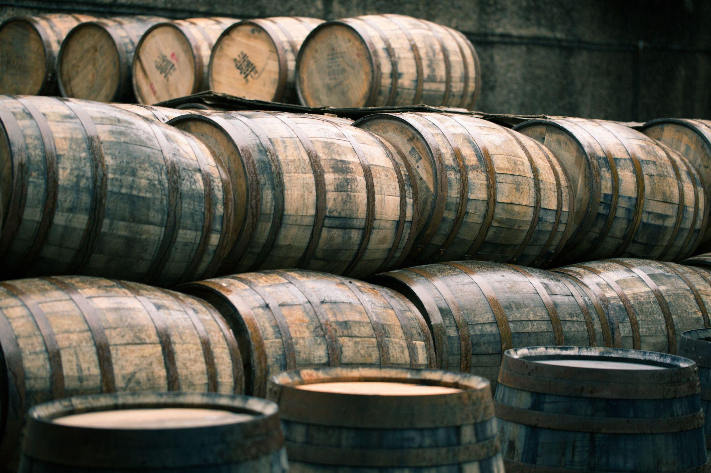

Alternative investments have gained substantial attention as investors seek diversification beyond traditional assets such as stocks and bonds. Among these, whisky has emerged as a notable component within the broader category of collectible and luxury goods investments. This interest is driven by whisky's unique characteristics, including its rich history, cultural significance, and the finite nature of its supply, which together contribute to its potential as a lucrative investment.

Whisky investment involves the purchase and holding of certain types of whisky, typically rare or limited-edition bottles and casks, with the expectation of a future price appreciation. The market for collectible whisky has shown remarkable growth, with some rare bottles fetching record prices at auctions. According to the Knight Frank Luxury Investment Index, whisky was the top-performing luxury asset class in 2020, demonstrating its increasing appeal among investors.



Algorithmic trading, a method of executing trades using automated and pre-programmed trading instructions, offers a modern approach to managing investment portfolios. This quantitative trading strategy leverages mathematical models and market data to make high-speed decisions, thus optimizing investment outcomes. When applied to alternative investments like whisky, algorithmic trading can enhance portfolio diversification and potentially improve returns.

The integration of whisky investment into algorithmic trading strategies presents unique opportunities and challenges. Given the fragmented nature of the whisky market, where pricing data is less structured compared to equities, creating models to predict price movements poses challenges. Nevertheless, the prospect of applying advanced data analytics to the whisky investment landscape is compelling, offering investors a novel way to augment traditional portfolio management techniques.

Understanding the intricacies of whisky investments provides investors with tools to navigate an asset class characterized by both exclusivity and volatility. Engaging in whisky investment through algorithmic trading not only offers a chance to diversify into a tangible asset but also presents an intersection of technology and tradition, inviting a thorough analysis of its potential within investment portfolios. As the world of alternative investments continues to evolve, whisky stands poised as a distinct and appealing option for those looking to broaden their financial horizons.

## Table of Contents

## Understanding Whisky as an Investment

Whisky investment involves acquiring whisky with the expectation that its value will increase over time. It primarily focuses on two categories: bottles and casks. Each has distinct characteristics and appeals to different types of investors.

Investing in whisky bottles typically involves purchasing limited editions or bottles with historical significance, rarity, or from prestigious distilleries. Collectors and investors often seek bottles with unique characteristics, such as age, vintage, or origin, which can significantly impact their value. Returns on bottle investments can be lucrative, especially for rare and limited releases, which often see high demand from collectors. However, the market can be volatile, with prices influenced by trends, distillery reputation, and demand fluctuations.

Cask investment, on the other hand, involves purchasing full barrels of whisky that are still maturing. This type of investment offers a more direct connection to the production process and allows investors to influence the final product's profile through choices like further maturation duration or finishing. Casks can yield high returns, particularly for investors with the patience to wait for maturation and possibly the bottling process. However, risks are inherent, including evaporation losses (known as the angel's share) and market value changes over time.

Historically, whisky has exhibited strong performance as an investment asset. The Knight Frank Luxury Investment Index, for instance, has consistently highlighted whisky as one of the top-performing luxury assets. Data suggests that whisky, particularly the rare and high-quality variants, often outperforms traditional investments like gold and stock indices over certain periods. This growth can be attributed to rising global demand, limited supply, and increasing interest in whisky, fueled by its cultural and lifestyle associations.

Despite these appealing prospects, whisky investments come with notable risks. Market [volatility](/wiki/volatility-trading-strategies) can lead to substantial value changes. Unlike other investment markets, the whisky market lacks standardization, making pricing less predictable and more susceptible to manipulation. Additionally, investing in casks involves substantial costs for storage and insurance, which can impact returns. Investors must also consider risks of fraud and counterfeit products, especially with rare and expensive bottles.

Potential returns from whisky investments can be substantial for those who navigate these risks. The value of a whisky investment generally depends on rarity, age, and provenance. Limited edition releases and those from renowned distilleries can lead to higher appreciation. However, investors should be aware that [liquidity](/wiki/liquidity-risk-premium) can be a problem, as transactions in whisky tend to be less frequent than in more established investment markets.

In conclusion, understanding the nuances of whisky investment—whether in bottles or casks—is crucial for capitalizing on its potential. The appeal of whisky investment lies in its historical performance and unique market dynamics, offering opportunities for significant returns against a backdrop of inherent risks.

## Algorithmic Trading and Alternative Investments

Algorithmic trading, also known as algo trading, refers to the use of computer algorithms to manage investment portfolios and execute trades. These algorithms rely on mathematical models to analyze market data and make trade decisions at high speeds, often without human intervention. This method allows for the efficient management of large amounts of data and the execution of complex trading strategies, minimizing human error and emotional bias. Algo trading is widely used in the financial markets and has grown considerably due to advancements in technology and increased market accessibility.

Alternative investments, such as whisky, are increasingly being considered for portfolio diversification. These investments differ from traditional asset classes like stocks, bonds, and cash. Due to whisky's unique market dynamics, it offers potential benefits when included in an investment portfolio. Whisky, especially rare and sought-after expressions, tends to appreciate in value over time, providing opportunities for substantial returns. Additionally, it has characteristics that may make it a valuable asset for hedging against inflation and market volatility.

Implementing [algorithmic trading](/wiki/algorithmic-trading) strategies in whisky investments involves leveraging price trends and comprehensive market analysis. However, the whisky market presents challenges typical of alternative assets, such as data fragmentation. Unlike traditional securities with central exchanges and standardized data, whisky investments require information from various, often fragmented, sources, including auctions, private sales, and distillery releases.

Sophisticated algorithms can aid in gathering and analyzing this dispersed market data, assessing variables such as historical pricing trends, market demand, and supply constraints. For example, [machine learning](/wiki/machine-learning) models can identify patterns in whisky valuations and project future price movements. The ability to systematically analyze and forecast these trends enables investors to make more informed decisions, optimizing their portfolio allocations to include whiskies that are likely to appreciate.

The integration of algorithmic methods with whisky investing necessitates infrastructure capable of handling and analyzing large datasets. Python libraries such as Pandas for data manipulation, Scikit-learn for machine learning, and API integration with platforms providing whisky market data can be employed in this context. An example Python snippet for analyzing whisky investment returns might involve using regression analysis to assess the relationship between various market factors and historical whisky prices:

```python
import pandas as pd
from sklearn.linear_model import LinearRegression
from sklearn.model_selection import train_test_split

# Load whisky data
data = pd.read_csv('whisky_prices.csv')

# Select features and target variable
features = data[['age', 'region', 'bottle_size']]
target = data['price']

# Split data into training and testing sets
X_train, X_test, y_train, y_test = train_test_split(features, target, test_size=0.2, random_state=42)

# Initialize and fit the regression model
model = LinearRegression()
model.fit(X_train, y_train)

# Evaluate model performance
score = model.score(X_test, y_test)
print(f"Model Accuracy: {score:.2f}")
```

In conclusion, algorithmic trading can significantly impact whisky investments by enabling data-driven decision-making, optimizing portfolio diversification, and potentially enhancing returns. Despite the inherent challenges involved with alternative investments, the application of algorithmic trading strategies presents a promising frontier for harnessing the untapped potential of whisky as an investment.

## Evaluating Whisky Investments through Algo Trading

Whisky investment strategies can be enhanced through the use of algorithmic models by analyzing market data and trends. In traditional asset classes like stocks and bonds, investors rely heavily on structured data with well-established pricing mechanisms and historical records. In contrast, the whisky market presents unique challenges due to its data fragmentation. This fragmentation arises because whisky investments primarily revolve around tangible assets such as bottles and casks, each with unique characteristics, limited editions, and varying provenance, which contribute to complex pricing dynamics.

To deal with this complexity, investors can use various algorithmic trading strategies. These strategies typically rely on historical market data, pattern recognition, and predictive analytics. For example, algorithms can process auction results, retail sales data, and secondary market prices to identify trends or anomalies in whisky valuations. Machine learning models, such as support vector machines or neural networks, can be applied to forecast future price movements based on these patterns.

The data fragmentation in the whisky market poses considerable challenges, primarily due to the disparate sources of pricing data and the lack of a centralized exchange. This makes it more difficult to gather comprehensive and timely data as compared to traditional investments like stocks, where exchanges provide continuous price updates. Whisky investors often need to collect data from auction houses, retailers, collectors, and online marketplaces, each having varied data formats and standards. This inconsistent data can create discrepancies in valuation analyses.

Despite these challenges, there is potential in predicting whisky investment outcomes using algorithmic models. Techniques such as regression analysis can identify key factors influencing whisky prices, such as brand reputation, distillery closures, and rarity. Furthermore, natural language processing (NLP) tools can analyze sentiment from news articles, social media, and expert reviews to gauge market perception and sentiment towards specific whiskies.

In conclusion, while the whisky market's fragmented nature adds complexity to data collection and analysis, algorithmic trading models have the potential to decipher these complexities and predict investment outcomes more accurately. The development of standardized data aggregation processes and sophisticated algorithms could enhance the reliability and profitability of whisky investments.

## Practicalities and Risks of Whisky Investment

Investing in whisky involves purchasing either individual bottles or casks, each avenue offering its own unique set of considerations and advantages. For bottles, the process typically starts with identifying sought-after brands and limited editions that have a historical track record of appreciating in value. Investors often source bottles from auctions, specialist retailers, or even directly from distilleries during limited release events. In contrast, cask investment involves purchasing an entire cask of whisky which is stored in a bonded warehouse until the investor decides to bottle it or sell the cask as a whole. This route requires more capital and a longer time horizon, as whisky matures over several years or even decades.

Several risks accompany whisky investments that investors should be aware of. Market fluctuations can significantly impact the value of whisky, with trends in consumer preferences and economic conditions playing substantial roles. For example, sudden changes in demand for certain whisky brands or categories can affect price appreciations, which may lead to a volatile market environment.

Storage costs represent another risk, particularly for investors in whisky casks. Casks must be stored in bonded warehouses that levy annual fees, which can accumulate over the aging period. Additionally, bottled whisky should be stored under optimal conditions to avoid spoilage or damage, potentially incurring significant costs for climate control and security.

Platform reliability is a crucial [factor](/wiki/factor-investing), especially as the popularity of online whisky trading platforms grows. The credibility and security of these platforms, which facilitate transactions and marketplace activities, directly impact investment safety and require due diligence to prevent losses from fraud or operational failures.

Insurance and regulatory considerations are particularly pertinent in whisky investments. Whisky, like other physical assets, is susceptible to risks such as theft, damage, or spoilage. Insuring investments can mitigate these potential financial losses, though premiums might vary based on the value and storage conditions of the whisky. Regulatory considerations, such as taxes and import/export duties, must also be assessed, as these can vary significantly across jurisdictions and impact the profitability of investments. For instance, changes in whisky-related taxation laws could affect both domestic and international markets, highlighting the need for investors to remain informed about regulatory developments.

In summary, investing in whisky casks or bottles involves understanding various steps and acknowledging inherent risks. From market volatility to storage costs and platform security, investors need to meticulously assess every aspect to make informed decisions. Furthermore, proper management of insurance and regulatory requirements can safeguard investments, ensuring they contribute meaningfully to a diversified portfolio.

## Whisky vs Traditional Investments

Whisky investments have gained attention as an alternative asset class alongside traditional investments such as stocks and gold. While each asset type has distinct characteristics, evaluating their performances can offer insights into their potential roles in a diversified portfolio.

### Performance Comparison

Historically, whisky has shown a robust performance, with certain rare bottles appreciating significantly over time. For instance, the Knight Frank Rare Whisky Index, which tracks the performance of a basket of rare Scotch whiskies, exhibited impressive returns over the past decade. In comparison, the S&P 500, a benchmark for U.S. equities, delivered variable returns, influenced by factors such as economic cycles and market sentiment.

Gold, a traditional safe haven asset, tends to maintain its value over time and often exhibits performance stability during economic turmoil. However, over certain periods, whisky has outperformed gold in terms of returns, particularly rare and collectible whisky bottles. Nonetheless, whisky investments [carry](/wiki/carry-trading) higher entry points and unique market dynamics, necessitating careful consideration and expertise.

### Hedge Against Inflation and Economic Downturns

Whisky's tangible nature and finite supply contribute to its potential as a hedge against inflation. Unlike fiat currencies, whisky's value is less susceptible to erosion from inflationary pressures, much like gold. During economic downturns, when traditional equities often suffer, whisky can serve as a store of value due to the high demand from collectors and connoisseurs, especially for rare and aged products.

The scarcity and intrinsic value of whisky make it less vulnerable to economic fluctuations than stocks. However, its illiquidity and reliance on collector interest imply that whisky might not always provide the immediate liquidity some investors desire during downturns.

### Historical Returns and Economic Conditions

The historical returns on whisky investments can be robust, particularly for those who invest wisely in rare bottles or casks with significant aging potential. For example, certain limited-edition releases from prominent distilleries have seen exponential growth in auction prices. However, whisky markets are not immune to broader economic conditions. Economic downturns can dampen discretionary spending, affecting demand and impacting valuations, particularly for lower-tier or mass-market whiskies.

Moreover, whisky prices can be sensitive to changes in tariff policies, global trade relations, and consumer trends. Unlike stocks, where dividend and earnings reports offer regular performance updates, whisky investments require a deeper understanding of market trends and historical sales data.

In conclusion, while whisky demonstrates unique characteristics as an investment, it should be considered alongside traditional assets, recognizing its potential for high returns coupled with market idiosyncrasies and risk factors. Investing in whisky demands careful curation, patience, and often a passion for the spirit itself.

## Conclusion

In conclusion, the potential of whisky as an investment, particularly within the framework of algorithmic trading, is notable for its unique characteristics and diversification benefits. Whisky has shown a remarkable ability to appreciate in value over time, driven by factors such as limited supply, increasing global demand, and the prestige associated with aged spirits. As an alternative investment, whisky offers distinct advantages, including its low correlation with traditional asset classes like stocks and bonds, making it an effective vehicle for portfolio diversification.

Algorithmic trading strategies can harness the fragmented market data of whisky to identify investment opportunities and manage risks. These strategies enable investors to analyze market trends, historical price movements, and other pertinent data, facilitating informed decision-making. With the advent of technology and data analytics, algorithmic models can assist in forecasting whisky valuations, although challenges remain due to the niche nature of the market and the variability in data quality.

Whisky investments may be particularly appealing to individuals looking for tangible assets that can serve as a hedge against inflation and economic fluctuations. The profile of investors who might benefit most from whisky investments includes those with a long-term outlook, an interest in alternative assets, and a willingness to navigate the specific logistics of whisky storage and insurance. Given whisky's ability to withstand economic downturns better than some traditional assets, it presents an enticing option for those seeking stability in uncertain times.

Investors are encouraged to consider whisky as part of a diversified investment strategy, taking advantage of its potential for high returns and its role in risk mitigation. Integrating whisky into an investment portfolio, especially when guided by algorithmic trading tools, can enhance overall portfolio performance and contribute to achieving long-term financial goals. As with any investment, due diligence, market understanding, and careful strategy formulation are critical to success.

## References & Further Reading

[1]: ["Knight Frank Luxury Investment Index."](https://www.knightfrank.com/research/article/2023-03-01-art-tops-2022-luxury-investment-index-) Knight Frank.

[2]: Maclean, C. (2018). ["Whisky: A Liquid History."](https://www.amazon.com/Scotch-Whisky-History-Charles-MacLean/dp/1844030784) Cassell.

[3]: Holmes, R. (2020). ["Scotch Whisky: A Complete Guide to Scotch Whisky."](https://manofmany.com/lifestyle/drinks/whisky-guide) Apollon Publishing.

[4]: Mason, A. (2019). ["Whisky Investment and the Law."](https://whiskymag.com/articles/whisky-investments-when-history-repeats/) Edinburgh Law School, University of Edinburgh.

[5]: Pretorius, C. (2021). ["Rare Whisky 101 – The World’s First & Only Whisky Investment Fund."](https://whiskyadvocate.com/top20/2021) Rare Whisky 101.

[6]: Lopez de Prado, M. (2018). ["Advances in Financial Machine Learning."](https://www.amazon.com/Advances-Financial-Machine-Learning-Marcos/dp/1119482089) Wiley Finance.

[7]: Chan, E. P. (2009). ["Quantitative Trading: How to Build Your Own Algorithmic Trading Business."](https://github.com/ftvision/quant_trading_echan_book) John Wiley & Sons.

[8]: Jansen, S. (2020). ["Machine Learning for Algorithmic Trading."](https://github.com/stefan-jansen/machine-learning-for-trading) Packt Publishing.