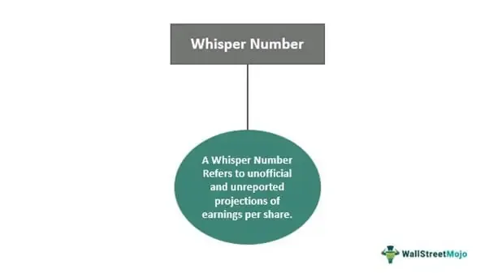

In the world of finance, myths and misconceptions are prevalent, especially when it comes to investing. These misunderstandings can significantly impact both new and seasoned investors, affecting their strategies and decisions. Two areas frequently clouded by misconceptions are automated trading and the concept of 'whisper numbers'. Automated trading, often intertwined with high-frequency algorithmic trades, is sometimes inaccurately perceived as a guaranteed path to profit. Similarly, 'whisper numbers', or the unofficial earnings forecasts circulating among traders, can mislead investors if not approached with caution.

This article examines some of these myths, aiming to provide clarity through real-life investment examples. By evaluating how whisper numbers can shape market expectations, we can understand their influence on investor behavior and decision-making processes. Additionally, we'll discuss the role of automated trading and algorithmic strategies, crucial components of modern financial markets, and how they function beyond the myths.

'Whisper numbers' are particularly intriguing, both in their origins and the misconceptions that surround them. As unofficial gauges of expected earnings, they differ from official analyst predictions but are often thought to better reflect insider expectations. Understanding these factors gives insight into why stock prices sometimes react unexpectedly to earnings reports. This article will explore misconceptions around these numbers and automated trading strategies, examining their true impact on market sentiment and investment decisions.

By the end of this article, you will gain a deeper understanding of these concepts, moving beyond myths toward a more informed perspective on their role in finance. This knowledge will enable you to better navigate market sentiments and make sound investment choices, armed with factual insights rather than misguided beliefs.

## Table of Contents

## Myth: Automated Trading Guarantees Profits

Automated trading, commonly referred to as algorithmic trading, has gained significant attention for its potential to execute trades with speed and precision, largely driven by the capabilities of advanced computing systems. This perception is often bolstered by high-profile examples of firms and individuals who have benefited significantly from implementing algorithmic strategies. However, the myth that automated trading guarantees profits does not hold under scrutiny, particularly when considering the complexities and challenges inherent in financial markets.

Algorithmic trading indeed harnesses technology to process vast amounts of market data and execute trades at speeds not achievable by human traders. This efficiency in trade execution, however, is not synonymous with guaranteed profitability. Market risk remains a pivotal [factor](/wiki/factor-investing) that cannot be eradicated by automation alone. Algorithmic systems operate within the realities of market dynamics, which involve unpredictable price movements, unforeseen economic events, and volatility. Therefore, while these systems optimize execution, they cannot predict market trends with absolute accuracy.

The success of [algorithmic trading](/wiki/algorithmic-trading) strategies depends on a multitude of factors. Primary among them is the design of the algorithm itself. Algorithms are constructed based on historical data and assumptions about future market behavior. If the underlying assumptions are flawed or the data is not representative of future conditions, the algorithm's performance may suffer significantly. This aspect highlights the importance of rigorous testing and validation of trading algorithms under various market conditions before live deployment.

Another crucial element is data accuracy. Algorithmic trading systems rely heavily on real-time data inputs to function effectively. Inaccurate or delayed data can lead to erroneous trade executions, potentially resulting in substantial losses. Hence, maintaining high data integrity and employing robust data management systems are vital to the success of algorithmic trading.

Moreover, algorithmic trading requires continuous monitoring and adjustment. As market conditions evolve, algorithms must be recalibrated to reflect new trends or respond to unexpected events. This involves regular updates and testing, along with effective risk management practices to mitigate potential downsides.

In sum, while automated trading systems bring substantial advantages in terms of speed and efficiency, they do not inherently guarantee profits. Profitability in algorithmic trading is contingent upon sound design, accurate data, and vigilant monitoring, coupled with a robust understanding of market risks. These components collectively underline the necessity for traders and firms to maintain realistic expectations and a disciplined approach in their automated trading endeavors.

## Myth: Whisper Numbers Are Always Reliable

The term 'whisper number' refers to unofficial earnings forecasts exchanged among traders and investors, often perceived as more precise than publicly available analyst reports. This perception can be misleading. Although whisper numbers occasionally capture insider expectations, they are equally susceptible to being fueled by speculation and unverified information. As such, these numbers can sway market sentiment without necessarily reflecting true economic conditions.

Reliability is a critical issue concerning whisper numbers. Their accuracy varies considerably, highlighting that reliance on them without accompanying solid [fundamental analysis](/wiki/fundamental-analysis) poses substantial investment risks. Investors attracted to the allure of whisper numbers often overlook this variability, potentially making misinformed decisions based on unsubstantiated forecasts.

The intersection between market sentiment facilitated by whisper numbers and actual economic indicators deserves careful consideration. For instance, actual economic indicators, such as GDP growth, unemployment rates, and official earnings reports, are grounded in verifiable data and comprehensive analysis. In contrast, whisper numbers, by nature, lack transparency and grounding in thorough analytical processes. This difference can lead to scenarios where market reactions driven by whisper forecasts diverge sharply from responses to concrete economic news.

In conclusion, while whisper numbers can offer insights into market sentiment and expectations, they do so at the cost of reliability and validation. Investors should be cautious and employ comprehensive analytical approaches to assess the implications of such forecasts on their investment strategies.

## Investment Examples: The Impact of Whisper Numbers

Whisper numbers often play a pivotal role in shaping market expectations and subsequent reactions. To illustrate their impact, consider the case of Apple Inc. Imagine a scenario where traders have a whisper number of $6 for Apple's earnings per share (EPS), while official analyst forecasts stand at $5. If Apple reports a $6 EPS, market movements might be minor. This outcome aligns with the whisper numbers, which many investors have already priced into their expectations, thereby reducing the element of surprise.

Conversely, if Apple reports a $7 EPS, the market may experience a significant surge. This figure surpasses both the whisper numbers and the consensus estimates, leading to greater market enthusiasm as investors reassess the company's financial performance and growth prospects. Analysts and traders might interpret this as a signal of underlying strength, prompting a reevaluation of the company's stock valuation and potential upward revisions of future earnings forecasts.

Understanding the influence of whisper numbers is crucial because their presence can lead to counterintuitive stock price responses following earnings announcements. Even when a company's earnings beat the consensus estimates, if they fall short of whisper expectations, the stock may face downward pressure. This highlights the importance of differentiating between market sentiment driven by these unofficial earnings forecasts and actual financial indicators.

By recognizing how whisper numbers can shape investor reactions, market participants can better navigate earnings seasons and anticipate potential market [volatility](/wiki/volatility-trading-strategies). Utilizing a combination of whisper numbers, fundamental analysis, and official earnings reports enables more informed decision-making in the complex landscape of financial markets.

## Algorithmic and High-Frequency Trading: Myths and Realities

Algorithmic trading, often synonymous with high-frequency trading ([HFT](/wiki/high-frequency-trading-strategies)), employs sophisticated mathematical models and computer algorithms to execute trades at speeds and frequencies unattainable by human traders. While this technological advancement has transformed financial markets, it is shrouded in several myths. A prevalent misconception is that these algorithms can accurately predict market movements and guarantee profits. However, the reality is far more nuanced.

Algorithms are designed primarily to enhance the efficiency of trade execution rather than to predict future prices. They operate optimally in highly liquid markets where the vast [volume](/wiki/volume-trading-strategy) of trades allows them to make minute profits on each trade, which can accumulate to significant sums over time. The efficiency comes from reducing transaction costs through practices like market-making, statistical [arbitrage](/wiki/arbitrage), and [trend following](/wiki/trend-following). For instance, an algorithm might be designed to track price differentials across exchanges, executing trades in milliseconds to capitalize on arbitrage opportunities.

However, these systems rely heavily on the underlying assumptions of market behavior and data accuracy. They are not inherently predictive. The common methodologies, such as moving averages, Bollinger Bands, or regression analysis, can help identify potential trends but are subject to the noise and unpredictability of market dynamics. Additionally, algorithms do not inherently possess foresight regarding macroeconomic factors or geopolitical events that could influence market trends.

The reliance on high-frequency algorithms introduces systemic risks. These systems can magnify market volatility, particularly during abnormal market events or 'flash crashes,' where rapid buy and sell orders exacerbate price swings. The 2010 Flash Crash, where the Dow Jones Industrial Average plunged about 1,000 points within minutes, underscores the potential consequences of HFT. During such events, the speed and volume at which algorithms operate can outpace human intervention, leading to destabilized markets.

To navigate these risks, robust risk management strategies are imperative. Investors and firms employing algorithmic trading must ensure constant monitoring and recalibration of algorithms. Risk management techniques could include setting stringent stop-loss orders, monitoring exposure limits, and implementing fail-safes to halt trading during extreme volatility.

In summary, while algorithmic trading can improve efficiency and [liquidity](/wiki/liquidity-risk-premium), it neither guarantees foresight in market movements nor immunity to risk. Investors should approach it with a comprehensive understanding of both its capabilities and limitations, ensuring that their strategies are supported by sound risk management practices. As with all financial tools, a balanced and informed approach is key to leveraging algorithmic trading responsibly.

## Conclusion

Finance myths, whether they pertain to whisper numbers, automated trading, or algorithmic strategies, can often mislead investors. It's crucial to approach these concepts with a balanced perspective. A critical understanding helps investors avoid the pitfalls of relying solely on technology or unofficial predictions without solid evidence. For instance, while automated trading systems can offer advantages in efficiency and speed, they do not remove the inherent risks of market dynamics. Similarly, whisper numbers, though they reflect collective anticipations, can misguide if not backed by fundamental analysis. 

Investors should focus on comprehensive analysis, integrating both qualitative and quantitative data, to assess market trends accurately. Staying informed about how market rumors and technological strategies influence trading behaviors is essential. By maintaining a keen awareness of the broader economic indicators and employing robust risk management strategies, investors can better navigate the uncertainties of financial markets.

Debunking these myths with factual insights and examples enables a more strategic approach to investment. A grounded understanding of the complexities involved allows investors to make informed decisions. By acknowledging the limitations and potentials of modern trading strategies, such as algorithmic systems and the interpretation of whisper numbers, investors can confidently engage with market activities, enhancing their capacity for achieving favorable outcomes in an often unpredictable environment.

## References & Further Reading

[1]: Bergstra, J., Bardenet, R., Bengio, Y., & Kégl, B. (2011). ["Algorithms for Hyper-Parameter Optimization."](https://dl.acm.org/doi/10.5555/2986459.2986743) Advances in Neural Information Processing Systems 24.

[2]: ["Advances in Financial Machine Learning"](https://www.amazon.com/Advances-Financial-Machine-Learning-Marcos/dp/1119482089) by Marcos Lopez de Prado

[3]: ["Evidence-Based Technical Analysis: Applying the Scientific Method and Statistical Inference to Trading Signals"](https://www.amazon.com/Evidence-Based-Technical-Analysis-Scientific-Statistical/dp/0470008741) by David Aronson

[4]: ["Machine Learning for Algorithmic Trading"](https://github.com/stefan-jansen/machine-learning-for-trading) by Stefan Jansen

[5]: ["Quantitative Trading: How to Build Your Own Algorithmic Trading Business"](https://www.amazon.com/Quantitative-Trading-Build-Algorithmic-Business/dp/1119800064) by Ernest P. Chan