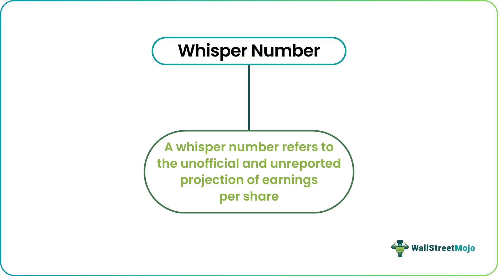

## Table of Contents

## What are whisper numbers?

Whisper numbers are unofficial and unpublished earnings forecasts that circulate among investors and analysts. They often differ from the official estimates provided by financial analysts and can be based on rumors, insider information, or more detailed analysis of a company's performance. These numbers are called "whisper" because they are quietly shared and not officially documented.

People pay attention to whisper numbers because they can give a more accurate prediction of a company's earnings than official estimates. If a company's actual earnings are close to the whisper number, it can affect the stock price. However, whisper numbers can also be risky because they are not always reliable and can be influenced by speculation or misinformation.

## How do whisper numbers differ from official earnings estimates?

Whisper numbers are secret guesses about how much money a company will make. They are shared quietly among investors and analysts, but not written down officially. These guesses can come from rumors, special information, or a closer look at how the company is doing. They are different from official earnings estimates because those are the numbers that financial experts write down and share publicly. Official estimates are usually more conservative and based on careful research.

The big difference is that whisper numbers are not official and can change a lot. They might be more accurate because they use information that official estimates might not have. But, they can also be wrong because they are based on guesses and rumors. Official estimates, on the other hand, are more reliable because they come from experts who follow strict rules. When a company's actual earnings are close to the whisper number, it can make the stock price go up or down a lot.

## Where did the term 'whisper number' originate?

The term 'whisper number' started being used in the late 1990s. It came about because investors and analysts would quietly share their guesses about a company's earnings. These guesses were not official and were passed around like whispers, which is why they got the name 'whisper numbers'.

The term became popular during the dot-com boom. People were very interested in tech companies and wanted to know how much money these companies would make. Whisper numbers helped investors make quick decisions based on the latest rumors and insider information.

## Why are whisper numbers important to investors?

Whisper numbers are important to investors because they can give a sneak peek into how much money a company might make. These numbers are often based on the latest rumors or special information that official estimates might not have. If a company's actual earnings are close to the whisper number, it can make the stock price go up or down a lot. Investors use whisper numbers to make quick decisions and try to get ahead of the market.

However, whisper numbers can also be risky. They are not always right because they come from guesses and rumors. If investors rely too much on whisper numbers, they might make bad choices. It's important for investors to use whisper numbers carefully and also look at official estimates and other information to make the best decisions.

## How can whisper numbers influence stock prices?

Whisper numbers can make stock prices go up or down a lot. When a company's actual earnings are close to the whisper number, it can surprise investors. If the earnings are better than the whisper number, people might think the company is doing great and buy more stock, making the price go up. But if the earnings are worse than the whisper number, people might sell their stock because they think the company is not doing well, and the price can go down.

These numbers can also make the stock market more exciting and unpredictable. Investors pay close attention to whisper numbers because they want to know the latest rumors and insider information. If a lot of people believe in a whisper number, it can create a big reaction in the stock price, even before the company shares its official earnings. But, because whisper numbers are not always right, they can also lead to big surprises and sudden changes in the stock market.

## What are common myths about whisper numbers?

One common myth about whisper numbers is that they are always more accurate than official earnings estimates. People think that because whisper numbers come from rumors and insider information, they must be better. But this is not always true. Whisper numbers can be wrong because they are based on guesses and not everyone has the same information. Official estimates, on the other hand, come from experts who follow strict rules and do careful research.

Another myth is that whisper numbers are easy to find and use. Some people believe that whisper numbers are everywhere and anyone can use them to make money. But in reality, whisper numbers are hard to find because they are not official and not everyone knows about them. Also, using whisper numbers can be risky because they can lead to bad decisions if they are not right. It's important for investors to be careful and not rely only on whisper numbers when making choices about stocks.

## How accurate are whisper numbers compared to official forecasts?

Whisper numbers are not always more accurate than official forecasts. Official forecasts come from financial experts who do a lot of research and follow strict rules. They use all the information they can find to make their guesses about how much money a company will make. Whisper numbers, on the other hand, come from rumors and insider information that might not be right. Sometimes, whisper numbers can be more accurate because they use information that official forecasts might not have. But they can also be very wrong because they are based on guesses and not everyone has the same information.

It's hard to say for sure which one is more accurate because it can change from one company to another and from one time to another. Some studies have shown that whisper numbers can be more accurate in certain situations, like when a lot of people are talking about a company and sharing their guesses. But other studies have found that official forecasts are more reliable because they are based on careful research and not just rumors. So, it's important for investors to look at both whisper numbers and official forecasts and use other information too when making decisions about stocks.

## Can whisper numbers be used as a reliable investment strategy?

Whisper numbers can be part of an investment strategy, but they are not reliable on their own. These numbers come from rumors and insider information, which can be wrong. If investors only use whisper numbers to make decisions, they might make bad choices because the numbers are not always right. It's important to use whisper numbers carefully and not rely on them too much.

A good investment strategy should include looking at official earnings estimates, which come from experts who do careful research. Investors should also look at other information like how the company is doing, what is happening in the market, and what other people think. By using all this information together, investors can make better decisions and not just depend on whisper numbers, which can be risky.

## What are some real-world examples of whisper numbers affecting stock performance?

One famous example of whisper numbers affecting stock performance happened with Apple in 2005. Before Apple announced its earnings, there were whispers that the company would do much better than what analysts were predicting. When Apple's actual earnings came out and were close to the whisper number, the stock price jumped up a lot. People who believed in the whisper number and bought Apple stock before the earnings report made a lot of money.

Another example is with Amazon in 2018. There were whispers that Amazon's earnings would be much higher than what was officially expected. When Amazon's earnings were announced and they were indeed close to the whisper number, the stock price went up quickly. Investors who paid attention to the whisper number and bought Amazon stock before the earnings report saw their investments grow. These examples show how whisper numbers can make a big difference in stock prices when they turn out to be right.

## How do analysts and investors gather whisper numbers?

Analysts and investors gather whisper numbers by talking to each other and sharing what they hear. They might go to meetings, talk on the phone, or use online forums and social media to find out what people are saying about a company's earnings. Sometimes, they get information from people who work inside the company or from other investors who have special information. This way, they can learn about rumors and guesses that are not written down in official reports.

It's not easy to find whisper numbers because they are not official and can change a lot. Analysts and investors have to be good at listening and figuring out what information is important. They also need to be careful because not all whisper numbers are right. They might hear different numbers from different people, so they have to decide which ones to believe. By putting together all the information they gather, they can try to guess what the whisper number might be.

## What ethical considerations should be taken into account when using whisper numbers?

When using whisper numbers, it's important to think about what is right and wrong. Whisper numbers often come from rumors and insider information, which can be unfair. If someone uses insider information to make money, it can hurt other investors who don't have that information. It's also not fair if only a few people know the whisper numbers and use them to make money while others don't. So, it's important to be honest and not use information that is not supposed to be shared.

Another thing to think about is how whisper numbers can affect the stock market. If a lot of people believe in a whisper number and it turns out to be wrong, it can make the stock price go up or down a lot. This can be bad for the market because it can make things unpredictable and cause people to lose money. So, it's important to use whisper numbers carefully and not rely on them too much. Always look at other information too, like official estimates and what is happening in the market, to make the best decisions.

## How has the role of whisper numbers evolved with the advent of social media and online forums?

The role of whisper numbers has changed a lot because of social media and online forums. Before, whisper numbers were shared quietly among a small group of people. Now, with social media, more people can talk about and share these numbers. Websites like Twitter, Reddit, and special investing forums let people post their guesses about a company's earnings. This makes whisper numbers easier to find and more people can use them to make decisions about stocks.

But, this also makes things more complicated. With so many people sharing their ideas online, it can be hard to know which whisper numbers to believe. Sometimes, people might spread false information on purpose to trick others. So, while social media and online forums have made whisper numbers more popular, they have also made them riskier. Investors need to be careful and check other sources of information too, not just what they see online.

## References & Further Reading

[1]: Bergstra, J., Bardenet, R., Bengio, Y., & Kégl, B. (2011). ["Algorithms for Hyper-Parameter Optimization."](https://dl.acm.org/doi/10.5555/2986459.2986743) Advances in Neural Information Processing Systems 24.

[2]: ["Advances in Financial Machine Learning"](https://www.amazon.com/Advances-Financial-Machine-Learning-Marcos/dp/1119482089) by Marcos Lopez de Prado

[3]: ["Evidence-Based Technical Analysis: Applying the Scientific Method and Statistical Inference to Trading Signals"](https://www.amazon.com/Evidence-Based-Technical-Analysis-Scientific-Statistical/dp/0470008741) by David Aronson

[4]: ["Machine Learning for Algorithmic Trading"](https://github.com/stefan-jansen/machine-learning-for-trading) by Stefan Jansen

[5]: ["Quantitative Trading: How to Build Your Own Algorithmic Trading Business"](https://www.amazon.com/Quantitative-Trading-Build-Algorithmic-Business/dp/1119800064) by Ernest P. Chan