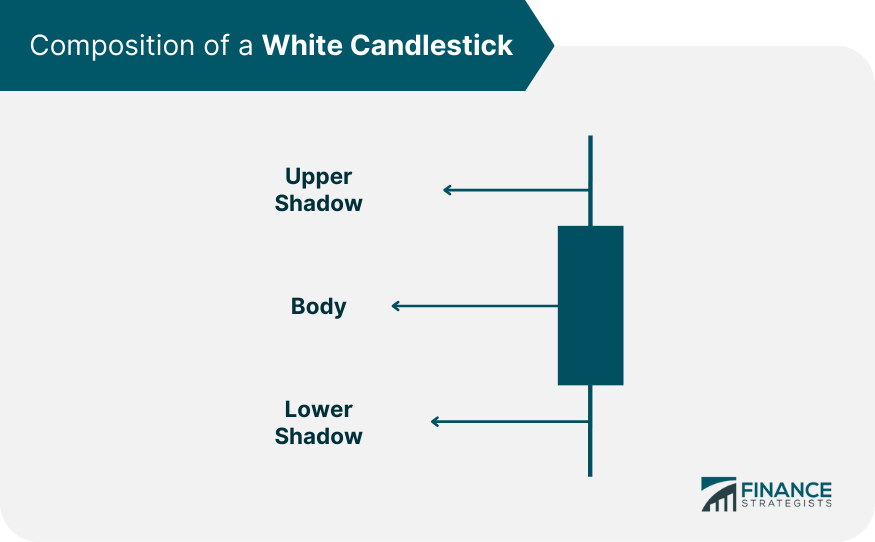

Candlestick patterns are pivotal in financial analysis and algorithmic trading due to their ability to provide nuanced insights into price action. These patterns, originating from Japanese rice markets, have become a staple in trading strategies, enabling traders to interpret market sentiment effectively. Among these, white candlesticks are particularly significant as they often signal bullish trends in financial markets. A white candlestick indicates that the closing price of an asset was higher than its opening price over a given time frame. This pattern suggests a predominance of buying pressure, reflecting investor confidence and potentially indicating upward price movement.

Candlestick charts, which display these configurations, serve as crucial instruments for traders, especially in the context of algorithmic trading. Unlike other chart types, such as bar charts or line charts, candlestick charts convey intricate information about price movements, providing insights into the open, close, high, and low prices for a period. This comprehensive visualization capability aids traders in deciphering market trends and foreseeing future price actions more accurately than other chart forms.



The primary goal of this article is to shed light on how candlestick patterns, particularly white candlesticks, can enhance trading strategies. By understanding these patterns, traders can develop more robust and informed trading algorithms, minimizing risks and optimizing profits. Enhancing knowledge of candlestick formations can bolster decision-making processes and results in more strategic entry and exit points in trades, ultimately contributing to more successful algorithmic trading operations.

## Table of Contents

## Understanding White Candlesticks

A white candlestick in a candlestick chart represents a bullish pattern, indicating that the closing price of a security is higher than its opening price. This pattern is a critical component in technical analysis, offering insights into market sentiment and potential price movements.

### Visual Components:
1. **Open and Close Prices**: The 'body' of the white candlestick is formed between the open and close prices. When the close price is higher than the open, the body is traditionally shaded white, symbolizing a rise in price.
2. **High and Low Prices**: The 'wicks' or 'shadows' are lines extending from the body, denoting the highest and lowest prices reached during the trading period. The upper wick stretches from the body’s top to the period’s high, and the lower wick extends from the body’s bottom to the period’s low.

### Significance of White Candlesticks:
White candlesticks are seen as indicators of bullish sentiment. They demonstrate that buyers are in control, typically leading to upward price movements. The presence of consecutive white candlesticks suggests sustained buying interest and may signal the onset of a bullish trend.

### Predicting Upward Price Movement:
White candlesticks help traders gauge future price movements by signaling potential continuations or reversals. For instance, a single white candlestick at the end of a downtrend could hint at a bullish reversal, while multiple consecutive white candlesticks might indicate a strong bullish trend. Traders often combine white candlestick patterns with other analytical tools to confirm signals and make more informed decisions. A simple Python snippet to identify white candlesticks might involve comparing open and close prices within a loop through historical price data:

```python
import pandas as pd

def find_white_candlesticks(data):
    white_candlesticks = []
    for index, row in data.iterrows():
        if row['Close'] > row['Open']:
            white_candlesticks.append(index)
    return white_candlesticks

# Example usage with fictional price data
data = pd.DataFrame({
    'Open': [100, 102, 101, 104],
    'Close': [102, 101, 105, 107],
    'High': [103, 103, 106, 108],
    'Low': [99, 101, 100, 103]
})

white_cs_indexes = find_white_candlesticks(data)
print("White candlestick days:", white_cs_indexes)
```

This code identifies days when a white candlestick is present, assisting traders in recognizing bullish market conditions. Understanding and interpreting white candlesticks effectively can improve trading strategies by anticipating price movements and enhancing decision-making processes.

## Candlestick Shading and Color Variations

Different charting tools may depict white candlesticks using various colors and styles, reflecting nuances in market sentiment and price direction. Typically, a white candlestick indicates that the closing price of an asset is higher than its opening price, suggesting a bullish sentiment. However, the depiction of these candlesticks can vary across platforms, using shades like green or blue to denote the same upward movement.

Shaded and hollow candlesticks are variants that provide additional layers of information. A solid or shaded candlestick usually indicates that an asset closed lower than it opened, typically colored red or black. Conversely, a white or hollow candlestick, sometimes depicted in white, green, or even blue, indicates a closure higher than the opening price, signaling bullish [momentum](/wiki/momentum). The choice of color in representations aims to improve readability and highlight the prevailing market trend quickly.

The color and shading of candlesticks play a crucial role in indicating market sentiment and price trends. In many platforms, green or white colors signify a rise in prices, while red or black often indicate a fall. These color distinctions assist traders in quickly recognizing market conditions, enhancing decision-making processes. For instance, a series of consecutive white or green candlesticks may indicate a strong upward trend, informing traders of potential entry points.

Incorporating these visual cues into trading strategies allows investors to interpret market trends more efficiently. While the choice of colors may vary, the fundamental principle remains unchanged—providing a visual representation of market behavior, enabling traders to make informed decisions. Understanding these variations is crucial for developing robust trading strategies, particularly when utilizing candlestick patterns for predictive analysis.

## Technical Analysis with Candlestick Indicators

White candlesticks play a crucial role in technical analysis by signaling bullish market trends. These candlesticks, characterized by an open price lower than the close price, suggest that the buying pressure has surpassed selling pressure during the time period represented.

### Common Patterns Involving White Candlesticks

One of the most well-known patterns involving white candlesticks is the "Three White Soldiers" pattern. This pattern consists of three consecutive long-bodied white candlesticks, which close progressively higher than the previous day, without significant lower shadows. Each candlestick opens within or near the previous candle's real body, indicating a strong and continuous buying interest. Here's a brief overview of how this pattern is interpreted:

- **Day 1:** The first candlestick suggests the end of a downtrend or consolidation, establishing a foundation for the bullish reversal.
- **Day 2:** The second candlestick confirms the reversal, with a close above the first day's closing price and a small or non-existent shadow.
- **Day 3:** The third candlestick continues the bullish momentum, reinforcing the signal from the previous candles.

This pattern is especially significant because it indicates sustained buying interest and often heralds the beginning of an extended uptrend.

### Combining White Candlesticks with Other Indicators

For a more robust analysis, traders often combine white candlestick patterns with other technical indicators, such as the Relative Strength Index (RSI). RSI measures the speed and change of price movements on a scale from 0 to 100 and is frequently used to identify overbought or oversold conditions.

Incorporating RSI with white candlestick patterns can enhance trading signals:

- **Bullish Signal**: If the "Three White Soldiers" pattern occurs while the RSI is moving out of the oversold region (below 30), it provides a stronger confirmation of a bullish reversal. This scenario suggests that the asset is beginning to recover from oversold conditions, increasing the likelihood of continued upward movement.

- **Bearish Divergence**: If the "Three White Soldiers" pattern appears but the RSI does not confirm the strength by remaining in a high range or forming a bearish divergence (where the security price makes a new high but the RSI makes a lower high), it could be a warning of a potential trend reversal or weakening momentum.

### Utilizing Python for Trading Signals

For algorithmic traders, coding a strategy to detect these patterns and their intersections with RSI can be highly efficient. Below is a simplified example of how one might program a detector for the "Three White Soldiers" pattern with RSI using Python and the `pandas` library:

```python
import pandas as pd

def three_white_soldiers(df):
    pattern = ((df['Close'] > df['Open']) &
               (df['Close'].shift() < df['Open'].shift()) &
               (df['Close'].shift(2) < df['Open'].shift(2)))
    return pattern

def calculate_RSI(df, period=14):
    delta = df['Close'].diff()
    gain = (delta.where(delta > 0, 0)).rolling(window=period).mean()
    loss = (-delta.where(delta < 0, 0)).rolling(window=period).mean()
    rs = gain / loss
    rsi = 100 - (100 / (1 + rs))
    return rsi

df['RSI'] = calculate_RSI(df)
df['ThreeWhiteSoldiers'] = three_white_soldiers(df)

# Filter for patterns with a strong RSI signal
strong_signal = df[(df['ThreeWhiteSoldiers']) & (df['RSI'] > 30)]

print(strong_signal)
```
This script checks for "Three White Soldiers" patterns and calculates RSI. It then filters for cases where the RSI supports the bullish pattern, offering traders a potent tool to identify potential trading opportunities. Understanding and utilizing these patterns and indicators can significantly enhance trading strategies by providing clearer insights into market conditions.

## White Candlesticks vs. Other Chart Types

Candlestick charts, bar charts, and line charts are fundamental tools used by traders to visualize and interpret market data. Each type of chart offers a unique representation of price action, serving different analytical needs.

Candlestick charts are renowned for their ability to provide detailed insights into the market's price movements within a specified time frame. Each candlestick represents four key data points: open, close, high, and low prices. The body of the candlestick visually differentiates between bullish and bearish movements, with a "white" candlestick traditionally indicating that the close price is higher than the open price—a bullish signal. This dual representation of price direction and magnitude offers traders a nuanced view of market sentiment and trends.

In contrast, bar charts also provide the open, close, high, and low prices but in a less visually intuitive manner. The vertical line represents the range of the stock's price movements (high to low), and horizontal lines on the left and right indicate the opening and closing prices, respectively. While bar charts convey the same four data points as candlesticks, they lack the immediate visual cues related to sentiment, which can make them less accessible for quick interpretations of market conditions.

Line charts, on the other hand, present data using a single continuous line, usually depicting only the closing prices over a period. This simplicity is advantageous for identifying long-term trends but limits the detailed insight into intraday price fluctuations and the dynamics of each trading session.

For [algorithmic trading](/wiki/algorithmic-trading), the extra layer of information provided by candlestick charts is invaluable. Algorithms can be programmed to recognize specific candlestick patterns that signal potential market moves, such as the Three White Soldiers pattern, which consists of three consecutive long bullish candlesticks indicating a strong upward trend. Each pattern can be coded into an algorithm as a conditional logic statement to automate trade decisions based on historical effectiveness.

Here’s a simple Python example of an algorithm identifying a bullish candlestick pattern:

```python
def identify_three_white_soldiers(candle_data):
    for i in range(2, len(candle_data)):
        first = candle_data[i-2]
        second = candle_data[i-1]
        third = candle_data[i]

        # Assume each element is a dictionary with keys: 'open', 'close', 'high', 'low'
        if (first['close'] > first['open'] and
            second['close'] > second['open'] and
            third['close'] > third['open'] and
            second['close'] > first['close'] and
            third['close'] > second['close']):
            print(f"Three White Soldiers pattern found ending at index {i}")

# Example of how candle_data might be structured
candle_data = [
    {'open': 100, 'close': 105, 'high': 107, 'low': 99},
    {'open': 106, 'close': 110, 'high': 112, 'low': 105},
    {'open': 111, 'close': 115, 'high': 116, 'low': 110},
    # More data...
]

identify_three_white_soldiers(candle_data)
```

In conclusion, candlestick charts offer comprehensive insights that are crucial for traders employing algorithmic strategies. The rich data set captured by candlesticks supports more sophisticated analysis and pattern recognition, providing a competitive edge in making informed trading decisions.

## Algorithmic Trading and Candlestick Patterns

Algorithmic trading leverages white candlestick patterns by encoding their recognition and interpretation into trading algorithms. These patterns, indicative of bullish market sentiment, can provide algorithms with signals to initiate buying strategies.

### Coding Patterns and Backtesting

In algorithmic trading, coding candlestick patterns involves programming logic that identifies specific formations on price charts. For example, a white candlestick is typically identified when the closing price is higher than the opening price, reflecting an increase in price. This basic condition can be expanded to recognize more complex formations such as "Three White Soldiers", a bullish reversal pattern consisting of three consecutive white candles with each closing higher than the previous one.

Implementing such logic in Python might involve using a library like Pandas for handling time series data. Here's a basic example of how a single white candlestick might be detected:

```python
import pandas as pd

# Assume df is a DataFrame with columns: 'Open', 'Close'
def is_white_candlestick(df):
    return df['Close'] > df['Open']

df['WhiteCandlestick'] = df.apply(is_white_candlestick, axis=1)
```

Backtesting is a critical component in validating the effectiveness of candlestick patterns. It simulates how a trading strategy would have performed in the past based on historical data, thus giving traders insights into potential future performance. Python’s [backtrader](/wiki/backtrader) library is often used to simulate trading strategies:

```python
import backtrader as bt

class WhiteCandlestickStrategy(bt.Strategy):
    def __init__(self):
        self.dataclose = self.datas[0].close
        self.dataopen = self.datas[0].open

    def next(self):
        if self.dataclose[0] > self.dataopen[0]:
            self.buy()  # Example action on detecting a white candlestick
```

### Real-world Examples

Real-world algorithmic trading systems often incorporate candlestick patterns as part of a broader trading strategy. Quantitative hedge funds, for instance, use these formations in conjunction with other indicators to automate buying and selling decisions. For example, a strategy might involve initiating a buy order when three successive white candlesticks are detected, provided additional conditions such as relative strength index (RSI) thresholds are met, to confirm bullish momentum.

Trading platforms like MetaTrader employ candlestick-based tools, enabling traders to script algorithms that execute trades based on customized candlestick patterns. This enables rapid and efficient decision-making, crucial in volatile markets.

In summary, the integration of white candlestick patterns into algorithmic trading empowers traders to capitalize on bullish trends by automating the decision-making process. Proper coding and thorough [backtesting](/wiki/backtesting) are essential steps in ensuring the robustness and profitability of such strategies.

## Conclusion

Understanding white candlestick patterns is crucial for traders seeking to enhance their decision-making processes in financial markets. These patterns not only offer insights into potential bullish trends but also serve as valuable tools for predicting upward price movements. By recognizing and interpreting these signals correctly, traders can identify optimal entry points, refine their strategies, and improve overall trading performance.

Integrating candlestick analysis into algorithmic trading strategies provides significant benefits. Candlestick patterns, such as white candlesticks, encapsulate vital information about market sentiment and are effective in identifying trend reversals or confirmations when used alongside other technical indicators. This integration helps in designing automated systems that react swiftly to market conditions, thereby improving trade execution and potentially increasing profitability. Algorithmic systems utilize patterns like the "Three White Soldiers" to generate automated buy signals, which can be backtested for reliability and effectiveness.

Traders are encouraged to further their education and practice in interpreting candlestick patterns to enhance their trading outcomes. As financial markets become more sophisticated, the ability to interpret and apply candlestick patterns offers a competitive edge. Continuous learning, coupled with disciplined practice in using these patterns, enables traders to develop a keen sense of market movements and improve their strategic approach to trading. This ongoing education fosters a deeper understanding of market dynamics, leading to more informed and successful trading decisions.

## References & Further Reading

[1]: Nison, S. (1991). ["Japanese Candlestick Charting Techniques: A Contemporary Guide to the Ancient Investment Techniques of the Far East"](https://archive.org/details/japanesecandlest0000niso) by Steve Nison.

[2]: Bulkowski, T. (2008). ["Encyclopedia of Candlestick Charts"](https://content.e-bookshelf.de/media/reading/L-570904-9ece1795ee.pdf) by Thomas N. Bulkowski.

[3]: Murphy, J. (1999). ["Technical Analysis of the Financial Markets: A Comprehensive Guide to Trading Methods and Applications"](https://archive.org/details/technicalanalysi0000murp) by John J. Murphy.

[4]: Pring, M. J. (2002). ["Technical Analysis Explained: The Successful Investor's Guide to Spotting Investment Trends and Turning Points"](https://www.amazon.com/Technical-Analysis-Explained-Fifth-Successful/dp/0071825177) by Martin J. Pring.

[5]: Schwager, J. D. (1989). ["Market Wizards: Interviews with Top Traders"](https://archive.org/details/marketwizardsint00schw) by Jack D. Schwager.