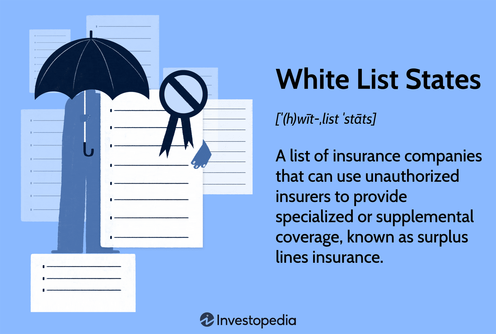

In the rapidly evolving world of algorithmic trading, understanding the regulatory landscape is crucial. This article provides an overview of the functionality of white list states within algorithmic trading. White list states are regions recognized for meeting specific regulatory and compliance standards, ensuring a secure and transparent trading environment. These states provide a framework that governs algorithmic trading, helping to mitigate risks such as money laundering and other illicit activities.  

Algorithmic trading relies heavily on the efficiency and speed of computers to execute trades automatically, a process that inherently carries a variety of risks, including legal and financial. White list states help in managing these risks by establishing a standard for compliance that traders must adhere to, thus enhancing the reliability and integrity of the markets. Understanding the concept of white list states is essential for traders and institutions, as it aids in navigating the complexities involved in algorithmic trading, aligning with both regional and international standards. Institutions engaged in algorithmic trading must pay careful attention to these regulatory frameworks to ensure their strategies are compliant and their operations are secure. This compliance not only includes meeting basic legal requirements but also instills confidence among international investors by adhering to accepted practices.  

As algorithmic trading continues to integrate into global markets, the role of white list states is becoming increasingly significant. They support a robust structure for trading operations, offering benefits like increased foreign investment opportunities and reduced regulatory hurdles. This article will examine various facets of white list states, shedding light on their impact on compliance, risk management, and the operational functioning of trading algorithms.

## Table of Contents

## Defining White List States in Finance

White list states in finance refer to jurisdictions that adhere to specific regulatory and compliance standards as deemed acceptable by international governing bodies. These standards are primarily focused on ensuring a transparent, secure, and fair trading environment while minimizing the risks associated with financial transactions, such as money laundering and tax evasion.

Such regions maintain a list of permissible insurance or trading practices that can be engaged by companies. This approach provides companies with greater flexibility compared to traditional regulatory environments, enabling them to engage in financial activities with reduced bureaucratic constraints. By doing so, white list states offer a more attractive environment for investment and trading activities.

In the specific context of algorithmic trading, white list states provide a regulatory framework that enhances transparency and reduces risk for traders. Algorithmic trading involves the use of automated systems to execute trading orders at high speeds, which can amplify the chances of both profit and risk. The presence of a strong regulatory framework ensures that such trading activities are conducted ethically and transparently, thereby fostering confidence among traders and investors. This framework typically includes measures like anti-money laundering (AML) protocols, tax compliance procedures, and data security standards. White list states thus act as pillars that uphold the integrity of algorithmic trading by aligning their practices with international compliance benchmarks. 

In essence, being on a white list signifies that a state has met stringent compliance standards, which can significantly influence the operational aspects of financial activities and [algorithmic trading](/wiki/algorithmic-trading). By ensuring compliance with these standards, white list states contribute to the creation of a stable and secure trading environment that is essential for the successful operation of complex trading algorithms.

## The Role of White List States in Algorithmic Trading

White list states significantly impact algorithmic trading by fostering a framework for regulatory compliance and reducing trading risks. By adhering to the regulatory norms set by recognized international bodies, these states provide a structured environment that mitigates the exposure to illicit activities, such as money laundering, which can compromise the integrity of trading operations.

Algorithmic trading relies heavily on computational models and automated systems to execute large volumes of transactions within microseconds. The efficacy of these systems is contingent upon the assurance of regulatory compliance, particularly regarding anti-money laundering (AML) practices and transparency in financial transactions. White list states offer this assurance by maintaining high standards of regulation, thus creating a transparent operating environment that is less prone to fraudulent activities.

These states facilitate a stable and secure trading environment by imposing stringent regulatory measures on financial transactions. This is essential for traders who employ sophisticated algorithms to minimize latency and capitalize on brief market inefficiencies. By ensuring that algorithmic strategies align with globally accepted standards, white list states reduce the likelihood of discrepancies that could lead to unlawful practices. This stability provides traders with the confidence needed to engage in cross-border transactions with minimal fear of encountering legal or regulatory hindrances.

Furthermore, white list states often establish advanced regulatory technologies and methodologies to supervise algorithmic trading. These include systems for real-time monitoring, anomaly detection, and reporting, which help safeguard against non-compliance. For instance, algorithmic traders operating within these states can implement compliance checks embedded within their trading systems, using technologies such as [machine learning](/wiki/machine-learning) to identify and adapt to regulatory changes dynamically.

By providing a compliant and risk-averse environment, white list states allow traders to focus on refining their algorithmic models and strategies without undue concern over regulatory pitfalls. This enables the effective exploitation of market opportunities and contributes to the overall health and competitiveness of the global financial markets.

In summary, white list states are pivotal in reinforcing the integrity and efficiency of algorithmic trading by ensuring adherence to stringent compliance standards, reducing the risk of illegal trading activities, and fostering a secure platform for high-frequency, cross-border transactions.

## Key Regulations and Compliance Standards

Key organizations and standards such as the Financial Action Task Force (FATF), Organisation for Economic Co-operation and Development (OECD), and the European Union (EU) play a significant role in maintaining compliance benchmarks crucial for white list states. These entities are instrumental in outlining and enforcing the regulatory requirements needed to ensure transparency and integrity within financial markets, which include the insurance and trading sectors, particularly algorithmic trading. 

The Financial Action Task Force (FATF), established in 1989, is an inter-governmental body aimed at combating money laundering and other related threats to the financial system's integrity. The FATF creates standards and initiates legal, regulatory, and operational measures aimed at combatting money laundering and financing terrorism. For algorithmic trading systems and their developers, adherence to FATF's standards assures that the trading activities do not facilitate the financing of illicit activities.

Similarly, the Organisation for Economic Co-operation and Development (OECD) focuses on promoting policies to improve the economic and social well-being worldwide. Among its key initiatives is the implementation of tax transparency and anti-avoidance measures which are crucial in preventing the misuse of algorithmic trading systems for tax evasion. The OECD's guidelines and peer reviews foster transparency, which is crucial for maintaining investor trust and ensuring the global financial system operates smoothly and fairly.

The European Union (EU), being one of the most comprehensive economic and political unions, implements numerous regulations that affect international trading standards. Notably, the EU's Markets in Financial Instruments Directive (MiFID) and the General Data Protection Regulation (GDPR) provide a regulatory framework that influences algorithmic trading. MiFID regulates firms providing services to clients linked to financial instruments, ensuring fair competition and enhanced investor protection. GDPR, on the other hand, impacts how data-driven algorithmic trading platforms manage personal data within the EU, thus promoting data privacy and security.

Compliance with these standards involves maintaining robust anti-money laundering (AML) and tax transparency practices. Algorithmic trading systems must be designed with compliance mechanisms to identify and mitigate risks associated with financial crimes. Developers and traders must incorporate these principles into their systems to prevent illicit activities such as fraud and data breaches.

Adhering to these regulations not only ensures legal compliance but also fosters an ecosystem of trust. By maintaining high standards of transparency and ethical trading practices, white list states enhance market confidence and participation from international investors. This facilitates smoother transactions, increased cross-border investment opportunities, and a stable trading environment conducive to the deployment and development of advanced algorithmic trading strategies.

## Impact of White List Inclusion on Algorithmic Trading

Being part of a white list state provides several advantages for traders participating in algorithmic trading. The inclusion in a white list signifies compliance with international standards governing financial transactions and practices. This compliance attracts increased foreign investment as it reduces the perceived risk for international investors. By adhering to these standards, white list states offer smoother transaction processes, which are crucial for the fast-paced nature of algorithmic trading. The pre-approved regulatory environment facilitates the execution of trades without the usual bureaucratic delays, enhancing operational efficiency.

For algorithmic trading, being part of a white list state fosters more cross-border opportunities. Traders face fewer regulatory hurdles, such as complex approval processes, when operating in markets recognized for their adherence to international standards. This is vital for firms employing algorithms that execute numerous trades across various markets, as simpler regulatory compliance translates to more fluid transactions and greater market reach.

Conversely, exclusion from these white list states poses significant challenges. Traders operating outside these lists may experience higher transaction costs due to additional compliance measures, such as increased scrutiny or additional verification processes. These measures lengthen transaction times and raise operational costs, which can negatively impact the speed and efficiency critical to algorithmic trading. Moreover, exclusion can lead to restricted market access as international investors may perceive these jurisdictions as higher-risk, limiting the capital flow and opportunities available to traders.

The reputational advantage of being in a white list state is also pivotal. It assures stakeholders of adherence to strict international norms, building trust and enhancing market participation. This trust can lead to cheaper financing rates, as lenders and investors consider entities within these states to be lower-risk.

Thus, the impact of white list inclusion has significant implications for algorithmic trading, offering operational advantages, enhanced reputational standing, and broader market access, whereas exclusion imposes costly and restrictive barriers.

## Challenges and Criticisms

White list states play a significant role in algorithmic trading by facilitating compliance and minimizing risks. However, several challenges and criticisms are associated with this concept, particularly in terms of political influence and the dynamic nature of regulatory standards.

One primary challenge is the influence of political considerations, which can shape the criteria for designation as a white list state. Countries may be excluded or included based on diplomatic relationships or geopolitical strategies, rather than purely on objective compliance metrics. This can result in biases against smaller or developing nations that struggle to meet these standards due to limited financial and human resources. These nations often face difficulties maintaining the necessary infrastructure and expertise to continually align with evolving international standards, thus hindering their ability to benefit from the stable and secure trading environments that white list states ostensibly support.

Furthermore, the regulatory landscape is not static, requiring countries to continuously adapt their policies and practices to remain on the white list. The rapid evolution of financial regulations, often driven by technological advances and new financial products, necessitates constant vigilance and updating of compliance mechanisms. For example, algorithmic trading presents new challenges such as ensuring transparency and mitigating risks associated with high-frequency trading, which existing regulations may not adequately cover. This dynamic environment demands significant effort from both regulators and traders to ensure ongoing compliance.

In addition, the varying interpretations and implementations of international standards can create inconsistencies and confusion. Countries included in the white list may have different compliance thresholds, potentially leading to regulatory [arbitrage](/wiki/arbitrage). This could undermine the overall goal of creating a level playing field and complicate efforts to streamline international trading activities.

In summary, while the concept of white list states aims to enhance global trading by ensuring adherence to high regulatory standards, several challenges impede their effectiveness. Political influence, resource disparities among nations, and the need for constant regulatory updates present significant hurdles that must be addressed to ensure the successful integration of this system into the broader financial landscape.

## Conclusion

Navigating the landscape of white list states in algorithmic trading is essential for ensuring both operational compliance and the advantages of engaging in global markets. Traders and institutions must remain adept in regulatory standards and commit to stringent compliance measures. This knowledge and adherence are not simply bureaucratic necessities; they form the backbone of successful and sustainable algorithmic trading practices.

Algorithmic traders who thoroughly understand white list regulations can exploit these frameworks to their advantage. They can do so by aligning their trading strategies with accepted norms and standards, thereby enhancing their credibility and trustworthiness in the eyes of international counterparts. This alignment is crucial, as it reduces the risk of legal and financial repercussions that can arise from non-compliance, thus safeguarding the integrity and reputation of trading entities.

Moreover, the inclusion in or exclusion from white list states can significantly impact a trader's or institution's access to cross-border opportunities. Being part of a white-listed jurisdiction often translates to smoother transaction processes and fewer regulatory hurdles. In contrast, exclusion can lead to increased transaction costs, restricted access to certain markets, and a heightened compliance burden, all of which can stifle growth and innovation.

The competitive nature of financial markets demands robust algorithmic strategies fortified by a keen understanding of the regulatory environment. By recognizing the significance of white list states, traders and institutions can strategically navigate the complexities of international finance. This awareness enables them to harness the full spectrum of opportunities available in global markets, thereby positioning themselves advantageously in the ongoing evolution of algorithmic trading.

## References & Further Reading

[1]: ["FATF Recommendations"](https://www.fatf-gafi.org/en/topics/fatf-recommendations.html) - Financial Action Task Force: International standards on combating money laundering and the financing of terrorism & proliferation.

[2]: ["Algorithmic Trading and High Frequency Finance"](https://www.cambridge.org/us/universitypress/subjects/mathematics/mathematical-finance/algorithmic-and-high-frequency-trading?format=HB&isbn=9781107091146) by Christian Gomber and Markus Gsell - A comprehensive introduction to algorithmic trading and its impact on financial markets.

[3]: ["MiFID II: A New Market Structure Paradigm"](https://www.cfainstitute.org/sites/default/files/-/media/documents/support/advocacy/mifid_ii_new-paradigm-for-research-report.pdf) - Oxford Handbooks, detailing the regulatory changes introduced by MiFID II affecting algorithmic trading.

[4]: Campbell, S. D., Cevik, E. I., & Deacon, M. (2015). ["High Frequency Trading: Overview of Recent Developments"](https://digital.library.unt.edu/ark:/67531/metadc847719/) - A white paper by the U.S. Securities and Exchange Commission providing insights into high-frequency trading.

[5]: ["Markets in Financial Instruments Directive (MiFID II)"](https://finance.ec.europa.eu/regulation-and-supervision/financial-services-legislation/implementing-and-delegated-acts/markets-financial-instruments-directive-ii_en) - European Commission: Regulatory framework to improve the functioning of financial markets in the EU and strengthen investor protection.

[6]: ["Combating Money Laundering and Terrorist Financing"](https://www.imf.org/en/Topics/Financial-Integrity/amlcft) - OECD guidelines on anti-money laundering measures and relevant practices.