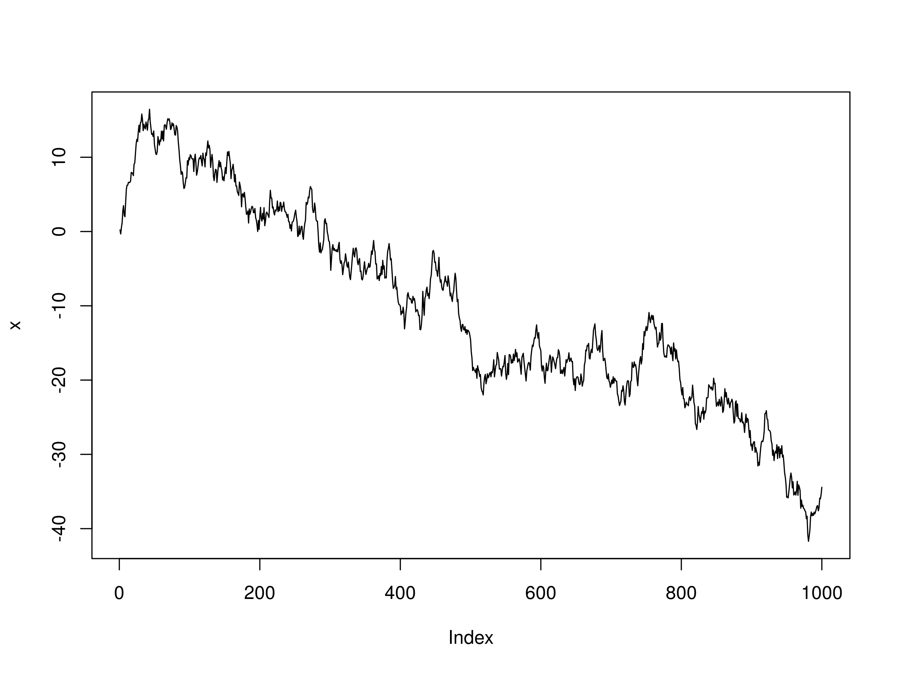

## Table of Contents

## What is white noise in the context of time series analysis?

White noise in time series analysis is a type of random signal where each value is independent of the others. Imagine it like static on a radio or TV; it's just random noise without any pattern. In a time series, white noise means that the values at different times don't affect each other. This is important because if a time series has white noise, it means that past values don't help predict future values.

In practical terms, white noise is often used as a benchmark in time series analysis. If a time series is purely white noise, it suggests that there's no useful information to be gained from analyzing it further. However, many real-world time series have some level of white noise mixed in with other patterns. Analysts try to separate the white noise from these patterns to better understand and predict the series.

## How does white noise differ from other types of noise in time series?

White noise is different from other types of noise in time series because it has no pattern at all. Each value in white noise is completely random and doesn't depend on the values before or after it. Think of it like flipping a coin; the result of one flip doesn't affect the next flip. In a time series, this means that white noise doesn't help us predict future values because there's no connection between them.

Other types of noise, like red noise or pink noise, have some kind of pattern or memory. Red noise, for example, is also called "brown noise" and has a stronger connection between values that are closer together in time. This means that past values can give us some clues about future values. Pink noise is somewhere in between white and red noise, with a bit of memory but not as strong as red noise. So, unlike white noise, these other types of noise can sometimes help in making predictions because they have some level of dependence between values.

## What is a random walk and how is it related to time series analysis?

A random walk is like taking steps without a plan. Imagine you start at a point and then take steps forward or backward based on the flip of a coin. If it's heads, you move forward one step; if it's tails, you move back one step. Each step you take is random and doesn't depend on the steps you took before. In a time series, a random walk means that the next value is the current value plus some random noise. This makes it hard to predict where you'll end up because each step is unpredictable.

In time series analysis, random walks are important because they help us understand how things change over time when there's no clear pattern. For example, stock prices can sometimes behave like a random walk because their future values are hard to predict based on past values. Analysts look at time series to see if they follow a random walk pattern, which can tell them if the series is driven by random changes or if there are other factors at play. If a time series looks like a random walk, it means that past values don't help much in predicting future values, so other methods might be needed to make better predictions.

## Can you explain the mathematical model of a random walk?

A random walk can be thought of as a simple math model where you start at a certain point and then take steps based on random numbers. Let's say you start at zero. Each step you take is the result of adding a random number to your current position. This random number could be positive or negative, and it's usually drawn from a normal distribution with a mean of zero. So, if you're at position 5 and the random number you draw is -2, your new position becomes 3. This keeps going for as many steps as you want to take.

In math terms, if we call your position at time t as Y_t, then a random walk can be written as Y_t = Y_{t-1} + ε_t, where ε_t is the random number you add at time t. This means your position at any time is just your position at the previous time plus some random change. This model is simple but powerful because it captures the idea that future values depend on past values plus some randomness. It's used a lot in finance, physics, and other fields to model things that change unpredictably over time.

## How can white noise be identified in a time series dataset?

To spot white noise in a time series, you can look at a few things. One way is to plot the data and see if it looks like random ups and downs with no clear pattern. If the values seem to jump around a lot without any trend or cycle, that could be a sign of white noise. Another way is to use a statistical test called the Ljung-Box test. This test checks if the values in your series are independent of each other, which is a key feature of white noise. If the test shows that the values are not related, it supports the idea that your series might be white noise.

Another method to identify white noise is by looking at the autocorrelation function (ACF) of the time series. The ACF measures how much the values at different times are related to each other. For white noise, the ACF should be close to zero for all time lags, meaning there's no correlation between values at different times. If you see that the ACF stays near zero, it's a good sign that you're dealing with white noise. By combining these methods—looking at the plot, using the Ljung-Box test, and checking the ACF—you can get a better sense of whether your time series is just random noise or if there's more to it.

## What are the implications of white noise in forecasting models?

White noise in a time series means that the values are completely random and don't follow any pattern. This can make forecasting really hard because if the values are just random noise, then knowing the past values won't help you predict the future ones. In a forecasting model, if you see that the time series is mostly white noise, it's a sign that you might not be able to make good predictions. You might need to look for other data or use different methods to find any patterns that could help with forecasting.

On the other hand, understanding that a time series has white noise can actually help improve your forecasting models. If you can separate the white noise from any real patterns in the data, you can focus on those patterns to make better predictions. For example, if you're trying to forecast stock prices and you find that a lot of the daily changes are just white noise, you might look at longer-term trends or other factors that could help you make more accurate forecasts. So, knowing about white noise can guide you to use the right tools and focus on the parts of the data that matter most.

## How does the presence of a random walk affect time series forecasting?

When a time series follows a random walk, it means that the next value depends on the current value plus some random noise. This makes forecasting tricky because knowing where you are now doesn't give you much information about where you'll be in the future. If you're trying to predict something like stock prices that behave like a random walk, you'll find it hard to make accurate forecasts because the random changes can throw off your predictions. It's like trying to guess where a leaf will land when it's blowing in the wind; you can't really tell because the next move is unpredictable.

However, understanding that a time series is a random walk can help you adjust your forecasting methods. Instead of trying to predict exact values, you might focus on predicting the range within which the values could fall. For example, you might use statistical methods to estimate the likely upper and lower bounds of future values. This way, even if you can't pinpoint the exact number, you can still give a useful forecast that helps people understand the possible outcomes. Recognizing a random walk can also lead you to look for other factors or longer-term trends that might help improve your predictions.

## What statistical tests can be used to detect a random walk in time series data?

One common test to check for a random walk in time series data is the Augmented Dickey-Fuller (ADF) test. This test looks at whether the series has a "unit root," which is a fancy way of saying that the series is a random walk. If the test shows that you can't reject the idea of a unit root, it means your data might be a random walk. The ADF test works by seeing if the changes in your series are random or if they follow some pattern. If it's mostly random, that's a sign of a random walk.

Another test you can use is the KPSS test, which stands for Kwiatkowski-Phillips-Schmidt-Shin. This test does the opposite of the ADF test. Instead of looking for a unit root, it checks for "stationarity," which means the series stays stable over time. If the KPSS test says your series is not stationary, it could mean you have a random walk. Both the ADF and KPSS tests help you figure out if your time series is just moving randomly or if there's something more predictable going on.

## How can one differentiate between a random walk and a trend in time series data?

To tell if a time series is a random walk or has a trend, you can look at the pattern of the data over time. A random walk looks like a path that goes up and down randomly, with no clear direction. Each step in a random walk is just the last step plus some random change, so it doesn't follow a straight line or a smooth curve. If you plot the data and it looks like it's just jumping around without going anywhere in particular, it might be a random walk.

On the other hand, a trend means the data is moving in a certain direction over time, like going up or down steadily. When you plot a time series with a trend, you'll see a clear pattern where the values are getting higher or lower as time goes on. To spot a trend, you can use a simple line that best fits the data, called a trend line. If this line shows a clear upward or downward slope, then your data likely has a trend rather than being a random walk.

## What are the advanced techniques for modeling time series data containing both white noise and random walks?

When a time series has both white noise and a random walk, you can use advanced techniques like ARIMA models to handle it. ARIMA stands for AutoRegressive Integrated Moving Average. It's a fancy way of saying it can deal with both trends (the random walk part) and randomness (the white noise part). The "Integrated" part of ARIMA helps to make the series stationary, which means it stops the random walk from making the data hard to predict. The "AutoRegressive" and "Moving Average" parts help to model any patterns and the white noise in the data. By adjusting the parameters of an ARIMA model, you can fit it to your time series and make better forecasts.

Another advanced technique is using state space models and the Kalman filter. These methods are good at separating the random walk from the white noise. A state space model breaks down the time series into different parts, like the trend and the noise. The Kalman filter then helps to estimate these parts over time, making it easier to predict future values. These models are a bit more complex to set up, but they can be very powerful for dealing with time series that have both random walks and white noise. By using these advanced techniques, you can get a clearer picture of what's going on in your data and make more accurate forecasts.

## How do you address the challenges posed by white noise and random walks in long-term time series predictions?

When you're trying to make long-term predictions with a time series that has white noise and random walks, it can be really tough. White noise means that each value is completely random and doesn't depend on the ones before or after it. This makes it hard to find any patterns or trends that could help you predict the future. Random walks make it even trickier because they mean that the next value is just the current value plus some random change. So, even if you see the series going up or down, you can't be sure it will keep going that way because the random changes can throw things off.

To deal with these challenges, you can use advanced models like ARIMA, which stands for AutoRegressive Integrated Moving Average. ARIMA models are good at handling both the random walk part (the trend) and the white noise part (the randomness). They work by making the series "stationary," which means they stop the random walk from messing up the predictions. Then, they look at the patterns and the noise to make better forecasts. Another approach is to use state space models with a Kalman filter. These models break down the time series into different parts, like the trend and the noise, and then use the Kalman filter to estimate these parts over time. This way, you can separate the random walk from the white noise and make more accurate long-term predictions.

## What are the latest research findings on the impact of white noise and random walks on machine learning models for time series analysis?

Recent research shows that white noise and random walks can make it hard for machine learning models to predict time series data. White noise means each value is random and doesn't depend on past values, so it's like trying to find a pattern in a bunch of random numbers. This can confuse machine learning models because they're designed to find patterns and make predictions based on those patterns. When there's a lot of white noise, the models might see random changes as important patterns and end up making bad predictions. Random walks make things even trickier because they mean the next value is just the current value plus some random change. This can make it hard for models to tell if the series is actually going somewhere or if it's just moving randomly.

To deal with these challenges, researchers are coming up with new ways to help machine learning models handle time series data with white noise and random walks. One approach is to use special models like ARIMA, which can separate the random walk part (the trend) from the white noise part (the randomness). These models help make the data more predictable by removing the random walk and focusing on the real patterns. Another method is using state space models with a Kalman filter, which can break down the time series into different parts and estimate them over time. This helps the models understand the data better and make more accurate long-term predictions. By using these advanced techniques, machine learning models can better handle the randomness and unpredictability of time series data.

## What is the understanding of white noise in time series?

White noise is a fundamental concept in time series analysis and is critical for understanding the intricacies of data variability. At its core, white noise refers to a sequence of random data points that exhibit no discernible pattern and possess a constant mean and variance over time. Ideally, the mean of a white noise process is zero, denoting an equal distribution of data points around this central value with no predictable fluctuations. This randomness is characterized by a lack of autocorrelation, meaning that past values do not provide useful information for predicting future values.

In mathematical terms, a white noise process $( \varepsilon_t )$ is usually defined such that:

$$
\mathbb{E}[\varepsilon_t] = 0
$$

$$
\text{Var}[\varepsilon_t] = \sigma^2
$$

$$
\text{Cov}[\varepsilon_t, \varepsilon_{t-k}] = 0 \text{ for } k \neq 0
$$

Here, $\mathbb{E}[\varepsilon_t]$ represents the expected value, or mean, of the process at time $t$, Var$[\varepsilon_t]$ denotes the variance, and Cov$[\varepsilon_t, \varepsilon_{t-k}]$ signifies the covariance between time points separated by $k$, which is zero for all non-zero $k$.

White noise finds its origins in signal processing, where it describes a signal containing equal intensity across different frequencies, resulting in a constant power spectral density. In the domain of time series analysis, the identification of white noise is essential for evaluating whether a dataset is devoid of seasonality, trend, or autocorrelation. This understanding allows traders and analysts to differentiate between random fluctuations and genuine market signals.

To avoid the pitfall of model overfitting, where a model captures random noise rather than meaningful trends, traders must effectively distinguish white noise from indicative patterns. Overfitting occurs when models are complex enough to adjust to the noise in historical data, thus performing poorly on new, unseen data. By recognizing the presence of white noise, analysts can refine model structures to better capture genuine market movements without reacting to spurious data.

Statistical tests such as the Ljung-Box test are often employed to detect whether a time series deviates from the white noise assumption. In Python, one can use libraries like `statsmodels` to perform such tests:

```python
from statsmodels.stats.diagnostic import acorr_ljungbox
import numpy as np

# Example: Running the Ljung-Box test on a random time series
np.random.seed(0)
random_series = np.random.normal(0, 1, size=100)
lb_test = acorr_ljungbox(random_series, lags=[10], return_df=True)
print(lb_test)
```

Recognizing white noise is integral for constructing robust time series models, as it guides the process of stripping away unnecessary complexity from models and ensures focus on elements that drive market behaviors.

## What is the significance of white noise in algorithmic trading?

Algorithmic trading is fundamentally reliant on the ability to accurately interpret market data to forecast trends and make informed decisions. However, in this sphere, the element of randomness, often termed as white noise, can obscure genuine market signals. White noise refers to a series of random data points that have a mean of zero and are devoid of any recognizable pattern or correlation. Recognizing and appropriately handling white noise is crucial for developing trading strategies that are resilient and not swayed by transient fluctuations.

In the statistical analysis underpinning [algorithmic trading](/wiki/algorithmic-trading), disregarding white noise can result in models that respond to inconsequential shifts in data, leading to suboptimal trading strategies. This misinterpretation can manifest as overfitting, where models react not to genuine market signals but to stochastic variations that do not reflect true market dynamics. Overfitting increases the risk of erroneous predictions and, consequently, undesirable trading outcomes.

The significance of white noise transcends mere data cleaning; it necessitates the accurate identification and subsequent exclusion of noise to uncover authentic market signals. This can be mathematically illustrated by considering a time series $X_t$, which typically includes both deterministic components (trend and seasonality) and a stochastic element (white noise):

$$
X_t = T_t + S_t + W_t
$$

where $T_t$ denotes the trend component, $S_t$ represents the seasonal component, and $W_t$ is the white noise. Effective trading strategies hinge on accurately modeling $T_t$ and $S_t$ while eliminating $W_t$.

To mitigate the detrimental effects of white noise on trading models, noise reduction techniques become imperative. These techniques include statistical methods like filtering and the adoption of sophisticated models that identify and separate noise from meaningful data. Employing these strategies allows traders to focus on signals with a substantive impact on market movements and optimize their algorithms accordingly.

By integrating appropriate noise reduction techniques, traders can enhance the fidelity of their statistical models, thereby improving trading decisions and financial outcomes. The precision in differentiating white noise from market signals is not a mere analytical exercise; it is a pivotal component of designing trading systems that are not only accurate but also adaptive to the intrinsic uncertainties of financial markets.

## What are some techniques for dealing with white noise?

In algorithmic trading, effectively dealing with white noise is essential for developing robust and accurate forecasting models. A variety of methodologies are used to minimize the impact of white noise on time series data. These methods range from classical statistical techniques to modern [machine learning](/wiki/machine-learning) approaches.

### Filtering Methods

Filtering methods are fundamental tools for reducing noise in time series data. Moving averages and exponential smoothing are two widely used techniques:

- **Moving Averages**: A simple moving average smooths out noise by averaging a subset of data points. For example, a 5-period moving average averages the values of the last five data points. This technique helps identify trends by minimizing random fluctuations.

- **Exponential Smoothing**: Unlike moving averages that give equal weight to each data point, exponential smoothing assigns exponentially decreasing weights to past observations. This prioritizes recent data, while also accounting for past information, providing a more responsive smoothing mechanism.

### Advanced Statistical Models

Certain advanced statistical models have been developed to differentiate white noise from significant signals within data:

- **ARIMA Models**: The Autoregressive Integrated Moving Average (ARIMA) model is designed for analyzing and forecasting time series data. ARIMA can help distinguish between white noise and meaningful signals through its autoregressive and moving average components. The ARIMA model is expressed as ARIMA(p, d, q) where:
$$
  X_t = c + \phi_1X_{t-1} + \ldots + \phi_pX_{t-p} + \theta_1\epsilon_{t-1} + \ldots + \theta_q\epsilon_{t-q} + \epsilon_t

$$
  where $X_t$ is the time series data, $\phi$ and $\theta$ are the parameters to be estimated, $c$ is a constant, and $\epsilon_t$ is the white noise error term.

- **GARCH Models**: The Generalized Autoregressive Conditional Heteroskedasticity (GARCH) model is used to predict the volatility of returns. It is particularly useful when the time series shows signs of volatility clustering. GARCH models separate noise by modeling the variance of the error term in time series data, following:
$$
  \sigma_t^2 = \alpha_0 + \alpha_1\epsilon_{t-1}^2 + \beta_1\sigma_{t-1}^2

$$
  where $\sigma_t^2$ is the variance of the time series.

### Machine Learning Techniques

Machine learning techniques are increasingly adopted for noise reduction due to their capability to handle large and complex datasets:

- **Supervised Learning Models**: Algorithms such as Support Vector Machines (SVM) and Random Forests can be trained on pre-labeled data to differentiate between noise and signal in trading datasets. 

- **Unsupervised Learning**: Clustering techniques like k-means and hierarchical clustering can help identify intrinsic patterns within the data, separating noise from essential trends.

- **Deep Learning**: Neural networks, particularly recurrent neural networks (RNNs) like LSTMs (Long Short-Term Memory networks), are effective at capturing temporal dependencies and identifying patterns in sequences, which can aid in distinguishing noise from trends in time series data.

Implementing these techniques in trading strategies involves a keen understanding of both the mathematical concepts underpinning each method and the practicalities of their application. Accurate model selection, parameter tuning, and validation steps are crucial for ensuring that the noise reduction methods enhance rather than hinder the trading algorithm's performance. By employing a combination of these techniques, traders can effectively mitigate the effects of white noise, allowing for more precise forecasting and decision-making in algorithmic trading.

## References & Further Reading

[1]: Box, G.E.P., Jenkins, G.M., & Reinsel, G.C. (2015). ["Time Series Analysis: Forecasting and Control."](https://onlinelibrary.wiley.com/doi/book/10.1002/9781118619193) Wiley.

[2]: Brockwell, P.J., & Davis, R.A. (2016). ["Introduction to Time Series and Forecasting."](https://link.springer.com/book/10.1007/978-3-319-29854-2) Springer.

[3]: Tsay, R.S. (2010). ["Analysis of Financial Time Series."](https://onlinelibrary.wiley.com/doi/book/10.1002/9780470644560) Wiley.

[4]: Engle, R.F. (1982). ["Autoregressive Conditional Heteroscedasticity with Estimates of the Variance of United Kingdom Inflation."](https://www.semanticscholar.org/paper/Autoregressive-conditional-heteroscedasticity-with-Engle/2ee6cb87fc81ecd78d161c4a92c9dfce00c8961c) Econometrica, 50(4), 987–1007.

[5]: Hamilton, J.D. (1994). ["Time Series Analysis."](https://press.princeton.edu/books/hardcover/9780691042893/time-series-analysis) Princeton University Press.