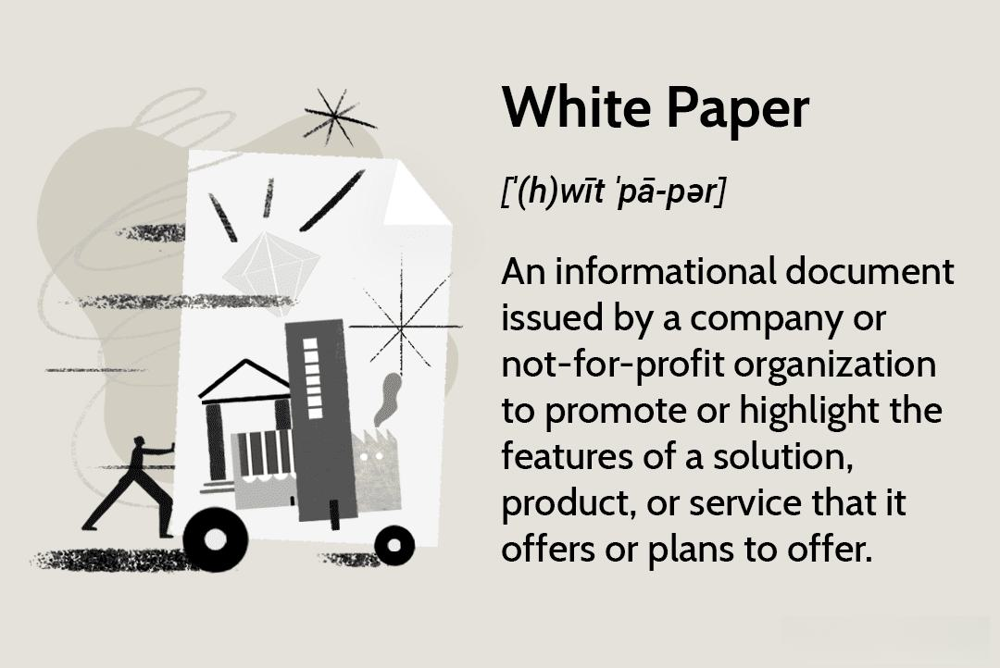

In today's fast-paced digital age, businesses must adopt modern methods to keep up with ever-evolving market demands. A vital tool in this endeavor is the white paper, a comprehensive document that enables companies to communicate complex information clearly and persuasively. White papers help in persuading stakeholders and establishing authority in various industries by addressing specific problems and offering solutions.

Simultaneously, the finance industry is experiencing transformative changes with the adoption of algorithmic trading, commonly known as algo trading. This technique automates trading decisions, allowing for rapid execution of trades based on predefined algorithms. Algo trading offers significant advantages, such as minimizing the impact of human emotions and optimizing transaction timings, thereby leading to improved efficiency and accuracy in financial markets.



This article explores how business writing, specifically through the use of white papers, intersects with the world of algo trading. By understanding how these elements complement each other, businesses can enhance their strategic communications and achieve their goals. White papers not only serve as educational materials for explaining the intricacies of trading algorithms but also play a crucial role in validating the efficacy of these technologies to potential investors and stakeholders. By leveraging high-quality business writing, institutions can utilize white papers to effectively communicate complex ideas, build credibility, and provide data-driven insights.

## Table of Contents

## Understanding White Papers

White papers are authoritative reports designed to inform readers about intricate industry-related challenges while advocating for a particular solution or product as the superior choice. They act as a vital communication tool for business leaders and decision-makers by dissecting complex topics in a structured and persuasive manner. This enables an organization to demonstrate not only a deep understanding of subject matter but also its pioneering capabilities in addressing core industry issues.

There are several types of white papers, each serving distinct purposes depending on the audience and objectives. Technical white papers focus on elucidating technical specifications, methodologies, or new technologies, offering detailed insights that target a more specialized audience. Marketing white papers, on the other hand, aim to persuade potential customers or clients by aligning a problem and its solution with particular products or services provided by the organization. Government white papers are typically more comprehensive policy documents that can lay out future legislative changes or strategic initiatives at the governmental level.

White papers differentiate themselves from other marketing materials through their in-depth and research-backed content. Unlike brochures or advertisements, which primarily emphasize promotional aspects, white papers rely on detailed analysis and empirical data to build a convincing argument. By incorporating academic rigor and utilizing extensive market research, they deliver a compelling case that bolsters the credibility of the proposed solution or approach.

Effectively crafted white papers have the potential to educate the audience by providing significant value and insights into the covered topics. This educational aspect extends beyond mere promotional material, thus assisting in influencing purchasing decisions. By presenting well-rounded information and addressing potential concerns, white papers can guide decision-makers through the purchasing process more confidently.

Moreover, when a white paper is meticulously developed, it can significantly contribute to building brand credibility. By demonstrating clear thought leadership and offering strategic solutions to pertinent issues, organizations can establish themselves as authoritative figures within their respective industries. This, in turn, fosters trust among stakeholders, aligning the company's image with expertise and reliability.

## The Role of Business Writing in Crafting White Papers

Effective business writing is a pivotal element in the creation of persuasive white papers. The ability to express complex ideas clearly and coherently is fundamental for engaging the target audience and driving home key messages. A white paper that is well written not only presents information but also persuades the reader, making it a tool of influence within its industry.

Firstly, language use is key. The language employed in white papers should be clear, concise, and engaging. This does not only mean choosing the right words but also structuring sentences and paragraphs in a way that guides the reader through the argument or narrative effortlessly. The objective is to communicate intricate concepts with simplicity and precision, which can be achieved by avoiding unnecessary jargon, unless it is absolutely required to convey a point.

Understanding the needs of the target audience is crucial for tailoring the content appropriately. Determining what information the audience finds valuable helps in deciding what to include and what to omit, ensuring the white paper remains focused and relevant. A comprehensive understanding of the audience's level of knowledge about the subject can guide how detailed the explanations need to be and what kind of evidence will be most persuasive.

Incorporating visual elements like charts, graphs, and diagrams can greatly enhance the comprehension and retention of complex information. Visuals serve to break down data and provide clear illustrations of concepts that might be harder to communicate through text alone. For instance, comparing [algorithmic trading](/wiki/algorithmic-trading) strategies might involve complex data sets which are better understood through visual representation such as line graphs or bar charts.

Proofreading and editing are indispensable steps in producing a professional and polished white paper. These processes ensure that the document is free of errors and is coherent throughout. Editing should focus not only on grammar and syntax but also on the logical flow and the strength of arguments presented. It can be beneficial to engage someone not involved in the writing process to proofread the document, as they can provide a fresh perspective and identify areas that may need further refinement.

In conclusion, combining effective business writing with thorough understanding of the target audience and leveraging visual elements are fundamental strategies in crafting successful white papers. These elements, complemented by meticulous proofreading and editing, ensure that the final document is a compelling tool that can educate and persuade its readership.

 to Algo Trading

Algorithmic trading, commonly referred to as algo trading, is a sophisticated method employed in financial markets, wherein computer programs are used to execute orders based on pre-defined criteria with speed and precision. This method leverages advanced mathematical models and takes advantage of the processing power of modern computers to manage and execute a large number of trades in a fraction of a second. As a result, algorithmic trading is becoming increasingly popular, given its capability to process vast volumes of data efficiently.

One of the prominent benefits of algorithmic trading is its ability to minimize the influence of human emotions in trading decisions. Human traders can be swayed by emotions such as fear and greed, which can ultimately lead to suboptimal decision-making. By utilizing automated trading systems, these emotional factors are mitigated, allowing for more rational decisions based purely on data and pre-set algorithms.

Moreover, algorithmic trading systems are designed to optimize the timing of transactions, which can lead to achieving better pricing for orders. The ability to execute trades at the most opportune moments, considering factors such as price movements, historical trends, and market conditions, provides a competitive edge in the fast-paced environment of financial markets.

Algo trading systems are also capable of simultaneously analyzing multiple market conditions to identify potentially profitable opportunities. For instance, a system might simultaneously consider the price movements of a security, [interest rate](/wiki/interest-rate-trading-strategies) changes, and currency fluctuations to make a comprehensive assessment that guides its trading actions. This holistic view enables traders to capitalize on opportunities that might be overlooked by human traders.

Despite its advantages, the complexity and high speed of algo trading necessitate thorough documentation. This ensures that trading algorithms are transparent and compliant with regulatory standards. These documentations are essential for explaining the underlying mechanics of the trading algorithms, detailing how data is processed, and ensuring that the algorithms operate within legal frameworks.

To illustrate the efficiency of algorithmic trading, consider a simple Python script that executes a basic moving average crossover strategy, a common algorithm used in trading:

```python
import pandas as pd
import numpy as np

# Sample data: price movements
data = pd.DataFrame({'price': [10, 11, 10.5, 10.8, 11, 11.2, 11, 10.9, 11.1, 11.3, 11.5]})

# Calculate moving averages
data['short_mavg'] = data['price'].rolling(window=3, min_periods=1).mean()
data['long_mavg'] = data['price'].rolling(window=5, min_periods=1).mean()

# Initialize signal - 0 indicates no position, 1 indicates buy
data['signal'] = 0
data.loc[data['short_mavg'] > data['long_mavg'], 'signal'] = 1

# Display the signals
print(data[['price', 'short_mavg', 'long_mavg', 'signal']])
```

The script calculates short and long moving averages of a given security's price and generates signals based on their crossover. When the short moving average crosses above the long moving average, it produces a buy signal (indicated by '1'). This kind of algorithm is key in executing decisions without human intervention, ensuring timely and optimal trading actions.

In summary, algorithmic trading represents a paradigm shift in financial markets, combining speed, precision, and data analysis to enhance trading outcomes. Comprehensive documentation of these systems enhances transparency, builds trust, and ensures adherence to established legal standards, making algo trading an indispensable strategy in modern finance.

## Aligning White Papers with Algo Trading Strategies

White papers are instrumental in elucidating the intricacies of algorithmic trading (algo trading) strategies to a diverse audience, including investors and stakeholders who may lack a comprehensive understanding of such processes. By offering a detailed examination of the benefits and mechanisms involved in algo trading implementations, white papers serve as a crucial educational tool.

A fundamental advantage of leveraging white papers is their ability to showcase real-world case studies and data-driven insights. For instance, a white paper might detail a scenario in which an algorithm reduced trading costs by optimizing transaction timing, thereby validating the efficacy of the algo trading strategy employed. By providing empirical evidence, white papers can effectively demonstrate how certain strategies have yielded successful outcomes, enhancing their persuasive power.

To further bolster credibility, white papers often incorporate expert opinions and review existing literature on the topic. This approach not only reflects a comprehensive understanding of the subject but also aligns the document with best practices and recent advancements in the field. Including well-researched data and authoritative voices lends additional weight to the findings and recommendations presented.

Moreover, the structured and formal nature of white papers makes them ideal for ensuring transparency and compliance with industry regulations. They can systematically address regulatory requirements by documenting the logic and procedures behind trading algorithms, ensuring that the strategies not only comply with legal standards but also inspire confidence among potential clients. 

By merging intricate technical details with clear, accessible writing, white papers can effectively communicate complex algo trading concepts to a broad audience, reinforcing their utility as a strategic communication tool in the finance industry.

## Best Practices for Writing White Papers in the Finance Industry

In the finance industry, creating an effective white paper entails a strategic approach that ensures clarity, accuracy, and relevance. Initiating the process with a well-defined objective is crucial. This objective serves as the foundation, guiding the content to align with the needs and expectations of the target audience, whether they are investors, regulators, or financial analysts.

Conducting thorough research is fundamental to the credibility of a white paper. Utilizing credible sources—such as peer-reviewed journals, industry reports, and verified financial data—is essential. The inclusion of accurate and up-to-date information not only supports the arguments made within the white paper but also enhances the document's trustworthiness. An adept use of quantitative data to support claims can be particularly persuasive in the finance sector. For example, demonstrating the effectiveness of an algo trading strategy might involve statistical analysis of trading outcomes.

The organization of content is another critical aspect. A logical structure—comprising a comprehensive introduction, clear problem statement, detailed solution, and well-rounded conclusion—ensures that the information flows seamlessly. This structure helps readers easily follow the argument and digest complex information. For instance, the introduction should succinctly present the white paper's purpose and main thesis, setting the stage for a deeper exploration of the topic.

Clarity in language is paramount. Utilizing simple language and avoiding unnecessary technical jargon ensures that the document is accessible to a broader audience. While certain technical terms may be necessary, explaining these terms when first introduced can aid understanding. For example, when discussing "quantitative easing," one might describe it as a monetary policy used by central banks to increase the money supply.

Finally, engaging a professional editor can significantly enhance the white paper's overall quality. An editor can provide an unbiased review, checking for consistency, grammar, and readability. This step is crucial in refining the document, ensuring that the white paper conveys its message effectively and maintains a professional tone throughout. By adhering to these best practices, finance professionals can craft white papers that are not only informative and persuasive but also reliable tools for influencing decision-making in the industry.

## Conclusion

White papers remain a pivotal instrument for businesses aspiring to lead in technically complex industries such as finance. These documents, characterized by their detailed and research-oriented nature, allow organizations to articulate sophisticated concepts and provide evidence-based solutions to industry challenges. By synthesizing thorough research with adept business writing, white papers are crafted to be influential, persuasive, and highly informative.

In the context of algo trading, which relies heavily on technical algorithms and data analysis, white papers are especially essential. They serve as an effective medium to convey the intricacies of algorithmic strategies to stakeholders who may not possess a technical background. Through clear and precise documentation, these papers demystify complex algorithms, shedding light on their mechanisms, potential benefits, and strategic applications. Such transparency not only educates stakeholders but also instills confidence in the proposed strategies.

The integration of best practices in writing enhances the utility of white papers, enabling companies to strengthen their market position and foster trust among clients and investors. Best practices involve setting clear objectives, understanding the audience, presenting clear data, and maintaining a logical structure. By focusing on clarity, precision, and credibility, white papers can act as authoritative guides that support regulatory compliance and innovation.

Ultimately, well-crafted white papers contribute to informed decision-making processes, driving successful business outcomes. They empower decision-makers with the necessary insights to understand and leverage technological advancements such as algorithmic trading. Through strategic communication and comprehensive research, white papers not only facilitate understanding but also pave the way for business growth and leadership in the finance sector.

## References & Further Reading

[1]: Bergstra, J., Bardenet, R., Bengio, Y., & Kégl, B. (2011). ["Algorithms for Hyper-Parameter Optimization."](https://papers.nips.cc/paper/4443-algorithms-for-hyper-parameter-optimization) Advances in Neural Information Processing Systems 24.

[2]: ["Advances in Financial Machine Learning"](https://www.amazon.com/Advances-Financial-Machine-Learning-Marcos/dp/1119482089) by Marcos Lopez de Prado

[3]: ["Evidence-Based Technical Analysis: Applying the Scientific Method and Statistical Inference to Trading Signals"](https://www.amazon.com/Evidence-Based-Technical-Analysis-Scientific-Statistical/dp/0470008741) by David Aronson

[4]: ["Machine Learning for Algorithmic Trading"](https://github.com/PacktPublishing/Machine-Learning-for-Algorithmic-Trading-Second-Edition) by Stefan Jansen

[5]: ["Quantitative Trading: How to Build Your Own Algorithmic Trading Business"](https://books.google.com/books/about/Quantitative_Trading.html?id=j70yEAAAQBAJ) by Ernest P. Chan