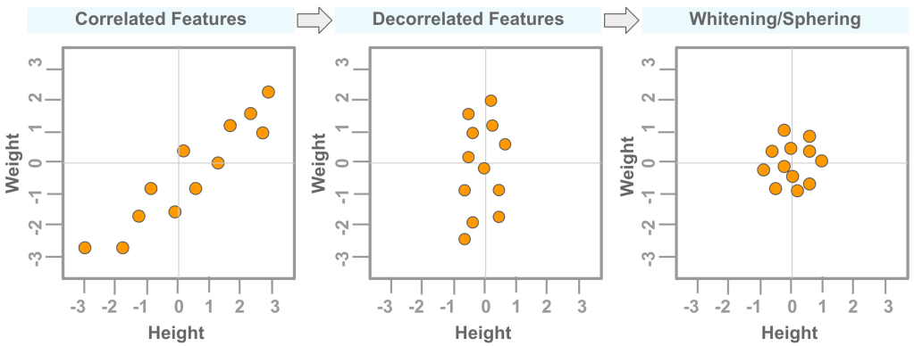

## Table of Contents

## What is whitening in the context of machine learning?

Whitening in machine learning is a preprocessing technique used to transform data so that the features become uncorrelated and have the same variance. Imagine you have a dataset where some features are much larger than others or where features are closely related to each other. Whitening helps to standardize these features, making them easier for machine learning algorithms to process and analyze. This is particularly useful in algorithms like Principal Component Analysis (PCA) and in neural networks, where having uncorrelated features can improve the performance and speed of learning.

The process of whitening involves two main steps: decorrelation and scaling. First, decorrelation removes the linear relationships between different features, which can be done using techniques like PCA. After decorrelation, the covariance matrix of the data becomes a diagonal matrix. The second step, scaling, adjusts the variances of the features to make them equal, typically to 1. This can be represented mathematically as transforming the data $$X$$ into a new dataset $$Z$$ where the covariance matrix of $$Z$$ is the identity matrix $$I$$. Whitening thus simplifies the structure of the data, making it more suitable for many machine learning tasks.

## Why is whitening important for machine learning algorithms?

Whitening is important for machine learning algorithms because it helps make the data easier to work with. When data is whitened, it means that all the features are on the same scale and they don't have strong relationships with each other. This makes it simpler for algorithms to learn from the data. For example, if one feature is much bigger than others, it might dominate the learning process. Whitening prevents this by making all features equally important, which can lead to better and faster learning.

Another reason whitening is useful is that it can improve the performance of certain algorithms, like those used in neural networks. When features are uncorrelated and have the same variance, the algorithms can focus on the patterns in the data rather than being distracted by the scale or relationships between features. This can help the algorithms find the best way to classify or predict outcomes. In summary, whitening helps make the data cleaner and more uniform, which can lead to more accurate and efficient [machine learning](/wiki/machine-learning) models.

## What are the common methods used for whitening data?

One common method for whitening data is Principal Component Analysis (PCA). PCA works by finding the directions in the data where the variance is largest. These directions are called principal components. By transforming the data into these new directions, PCA decorrelates the features. After that, you can scale the transformed data so that all features have the same variance. This can be done by dividing each feature by its standard deviation. The result is a dataset where the covariance matrix is the identity matrix $$I$$.

Another method is ZCA (Zero-phase Component Analysis) whitening. ZCA is similar to PCA but it tries to keep the data looking as similar as possible to the original data. It does this by rotating the data back to be as close as possible to the original orientation after whitening. This can be helpful in image processing because it keeps the images recognizable even after whitening. Both PCA and ZCA are powerful tools, but they can be used in different situations depending on what you want to achieve with your data.

A simpler approach to whitening is to use the Cholesky decomposition of the covariance matrix. If you have a covariance matrix $$C$$ of your data, you can find a matrix $$L$$ such that $$C = LL^T$$. Then, you can whiten the data by multiplying it with $$L^{-1}$$. This method is straightforward and can be easier to implement than PCA or ZCA, but it might not always give the best results. Each method has its own advantages, so choosing the right one depends on what you need for your specific machine learning task.

## How does ZCA whitening differ from PCA whitening?

ZCA whitening and PCA whitening are both methods to make data easier for machine learning algorithms to work with, but they do it in slightly different ways. PCA whitening first finds the directions in the data where the variance is largest, called principal components. It then transforms the data into these new directions, making the features uncorrelated. After that, it scales the data so all features have the same variance. This can be represented as $$Z = XW \Lambda^{-1/2}$$, where $$X$$ is the original data, $$W$$ is the matrix of principal components, and $$\Lambda$$ is the diagonal matrix of eigenvalues.

On the other hand, ZCA whitening also decorrelates and scales the data, but it tries to keep the data looking as similar as possible to the original data. After transforming the data like PCA, ZCA rotates it back to be close to the original orientation. This can be done using the formula $$Z = X(W \Lambda^{-1/2} W^T)$$. This method is useful in applications like image processing because it helps keep the images recognizable even after whitening. So, while both methods aim to make the data easier to work with, ZCA focuses more on preserving the original look of the data.

## Can you explain the mathematical process behind PCA whitening?

PCA whitening is a way to change data so that all features are independent and have the same importance. First, you find the principal components of the data, which are the directions where the data varies the most. You do this by calculating the eigenvectors and eigenvalues of the data's covariance matrix. The eigenvectors show the directions, and the eigenvalues show how much the data varies in those directions. You then use these eigenvectors to transform the data into a new space where the features are not related to each other. This step is called decorrelation. The formula for this transformation is $$Z = XW$$, where $$X$$ is your original data and $$W$$ is the matrix of eigenvectors.

After decorrelating the data, you need to make sure all the features have the same variance. You do this by dividing each feature by the square root of its eigenvalue. This step is called scaling. The formula for scaling is $$Z = Z \Lambda^{-1/2}$$, where $$\Lambda$$ is the diagonal matrix of eigenvalues. When you put these two steps together, the full formula for PCA whitening becomes $$Z = XW \Lambda^{-1/2}$$. This final transformation makes sure that the new data, $$Z$$, has a covariance matrix that is the identity matrix $$I$$. This means all features in $$Z$$ are independent and have the same variance, making the data easier for machine learning algorithms to work with.

## What are the steps involved in applying ZCA whitening to a dataset?

ZCA whitening is a way to change data so that all features are independent and have the same importance, but it also tries to keep the data looking similar to how it started. First, you find the principal components of the data, which are the directions where the data varies the most. You do this by calculating the eigenvectors and eigenvalues of the data's covariance matrix. The eigenvectors show the directions, and the eigenvalues show how much the data varies in those directions. You then use these eigenvectors to transform the data into a new space where the features are not related to each other. This step is called decorrelation. The formula for this transformation is $$Z = XW$$, where $$X$$ is your original data and $$W$$ is the matrix of eigenvectors.

After decorrelating the data, you need to make sure all the features have the same variance. You do this by dividing each feature by the square root of its eigenvalue. This step is called scaling. The formula for scaling is $$Z = Z \Lambda^{-1/2}$$, where $$\Lambda$$ is the diagonal matrix of eigenvalues. After scaling, you rotate the data back to be as close as possible to the original orientation. This is done by multiplying the scaled data by the transpose of the eigenvector matrix. The full formula for ZCA whitening becomes $$Z = X(W \Lambda^{-1/2} W^T)$$. This final transformation ensures that the new data, $$Z$$, has a covariance matrix that is the identity matrix $$I$$ while keeping the data looking similar to the original data.

## How does whitening affect the covariance matrix of the data?

Whitening changes the covariance matrix of the data so that it becomes the identity matrix, which means all features are independent and have the same variance. When you start with your original data, the features might be related to each other and have different amounts of variance. Whitening removes these relationships and makes all features equally important. This is done by transforming the data in a way that decorrelates the features and then scales them to have the same variance. The result is a new dataset where the covariance matrix is $$I$$, which makes the data easier for machine learning algorithms to work with.

The process of whitening involves two main steps: decorrelation and scaling. In decorrelation, you use techniques like Principal Component Analysis (PCA) or ZCA to remove the linear relationships between features. This turns the covariance matrix into a diagonal matrix, where the off-diagonal elements are zero. Then, in the scaling step, you adjust the variances of the features to make them equal, typically to 1. This final transformation ensures that the covariance matrix of the whitened data is the identity matrix, which simplifies the data structure and can improve the performance of many machine learning algorithms.

## What are the potential drawbacks of using whitening in machine learning?

Whitening can make data easier for machine learning algorithms to work with, but it also has some downsides. One problem is that whitening can change the data too much, making it hard to understand what the original data looked like. This is especially true for methods like PCA whitening, which can make the data look very different from how it started. If you need to keep the data recognizable, like in image processing, this can be a big issue. Another problem is that whitening can make the data more sensitive to small changes or noise. This means that if there are tiny errors in the original data, they can become bigger after whitening, which can make the machine learning model less accurate.

Also, whitening can take a lot of time and computer power, especially for big datasets. You need to do things like finding the principal components and changing the data, which can be slow. This might not be a big deal for small projects, but for big ones, it can slow things down a lot. Finally, whitening might not always make the machine learning model better. Sometimes, the relationships between the original features are important, and getting rid of them can make the model worse. So, it's good to think carefully about whether whitening is the right thing to do for your specific project.

## In what types of machine learning problems is whitening particularly useful?

Whitening is particularly useful in machine learning problems where the data has a lot of features that are closely related to each other or where the features have very different sizes. For example, in image recognition, the pixels in an image are often closely related. Whitening can help make these pixels independent, which can make it easier for a [neural network](/wiki/neural-network) to learn from the image. Also, if you have data where some numbers are much bigger than others, whitening can make all the numbers the same size, so no single feature dominates the learning process.

Another area where whitening is helpful is in algorithms like Principal Component Analysis (PCA) and other dimensionality reduction techniques. When you use PCA, you want to find the most important directions in your data. Whitening helps by making sure all the features are treated the same way, so the algorithm can focus on finding the real patterns in the data. This can make the PCA results more accurate and easier to understand. So, if you're working with data that has a lot of features or features that are very different from each other, whitening can be a good tool to use.

## How can whitening help in improving the performance of neural networks?

Whitening can help neural networks learn faster and better because it makes the data easier to work with. When data is whitened, all the features are on the same scale and they don't have strong relationships with each other. This means that no single feature can dominate the learning process, and the neural network can focus on finding the real patterns in the data. For example, if one feature is much bigger than the others, it might make the neural network pay too much attention to it. Whitening fixes this by making all features equally important, which can help the neural network learn more quickly and accurately.

In addition, whitening can help neural networks by making the data more like what the network expects. Neural networks often work better when the data is centered around zero and has the same variance in all directions. Whitening does this by transforming the data so that its covariance matrix becomes the identity matrix $$I$$. This makes the data easier for the neural network to process, which can lead to better performance. So, by using whitening, you can make your neural network more efficient and effective at learning from your data.

## What are the considerations for choosing between ZCA and PCA whitening in practice?

When choosing between ZCA and PCA whitening, you need to think about what you want your data to look like after whitening. PCA whitening changes the data a lot to make the features independent and equal in importance. It does this by finding the main directions of the data and then transforming it into these new directions. This can be good for some machine learning tasks, like when you want to find the most important patterns in your data. The formula for PCA whitening is $$Z = XW \Lambda^{-1/2}$$, where $$X$$ is your original data, $$W$$ is the matrix of principal components, and $$\Lambda$$ is the diagonal matrix of eigenvalues. But PCA can make the data look very different from how it started, which might be a problem if you need to keep the data recognizable, like in image processing.

On the other hand, ZCA whitening tries to keep the data looking as similar as possible to the original data while still making the features independent and equal in importance. It does this by rotating the data back to be close to the original orientation after whitening. The formula for ZCA whitening is $$Z = X(W \Lambda^{-1/2} W^T)$$. This makes ZCA a good choice for tasks where it's important to keep the data recognizable, like when you're working with images. But ZCA can be a bit more complicated to use than PCA because it involves an extra step to rotate the data back. So, you need to decide whether it's more important to keep the data looking like it did at the start or to make the data easier to work with for your machine learning task.

## How can one evaluate the effectiveness of whitening on a given dataset?

To evaluate the effectiveness of whitening on a given dataset, you can look at how the data's covariance matrix changes. Before whitening, the features in your data might be related to each other and have different amounts of variance. After whitening, the goal is to make the features independent and have the same variance. You can check this by calculating the covariance matrix of the whitened data. If it looks like the identity matrix $$I$$, then the whitening worked well. The identity matrix means that all the off-diagonal elements are zero, showing that the features are not related, and the diagonal elements are all 1, showing that the features have the same variance.

Another way to evaluate the effectiveness of whitening is to see how it affects the performance of your machine learning model. Whitening should make the data easier for the model to learn from. You can train your model with both the original and the whitened data and then compare how well the model does. If the model performs better with the whitened data, like having higher accuracy or learning faster, then whitening was effective. Sometimes, you might also want to look at how whitening changes the data visually. For example, if you're working with images, you can see if the whitened images still look like the original ones. If they do, and the model performs better, then ZCA whitening might be a good choice. If the images look too different but the model still does well, PCA whitening could be more suitable.

## References & Further Reading

[1]: Hyvärinen, A., & Oja, E. (2000). ["Independent Component Analysis: Algorithms and Applications"](https://www.sciencedirect.com/science/article/pii/S0893608000000265). Neural Networks, 13(4-5), 411-430.

[2]: Bell, A. J., & Sejnowski, T. J. (1997). ["The 'Independent Components' of Natural Scenes are Edge Filters"](https://www.sciencedirect.com/science/article/pii/S0042698997001211). Vision Research, 37(23), 3327-3338.

[3]: Kessy, A., Lewin, A., & Strimmer, K. (2018). ["Optimal Whitening and Decorrelation"](https://arxiv.org/abs/1512.00809). The R Journal, 10(1), 312-326.

[4]: Shlens, J. (2014). ["A Tutorial on Principal Component Analysis"](https://arxiv.org/abs/1404.1100). arXiv:1404.1100.

[5]: Bishop, C. M. (2006). ["Pattern Recognition and Machine Learning"](https://www.cs.uoi.gr/~arly/courses/ml/tmp/Bishop_book.pdf). Springer.