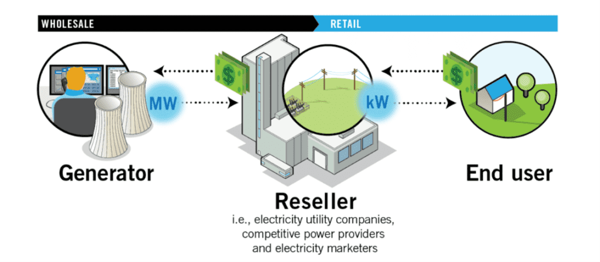

## Table of Contents

## What is wholesale energy?

Wholesale energy refers to the buying and selling of large amounts of energy, like electricity or natural gas, between companies. It's not for individual homes or small businesses. Instead, it's for big companies that need a lot of energy or for utility companies that then sell it to smaller customers. The price of wholesale energy can change a lot because it depends on things like how much energy people are using, the weather, and how much it costs to make the energy.

The wholesale energy market works like a big trading place where energy is bought and sold. Companies that make energy, like power plants, sell it to other companies that need it. These other companies might be utility companies that then sell the energy to homes and businesses. The price can go up and down based on how much energy is available and how much people want to use. This market helps make sure there's enough energy for everyone and that it's priced fairly.

## How does the wholesale energy market function?

The wholesale energy market is like a big trading place where companies buy and sell large amounts of energy, like electricity or natural gas. It's not for individual homes or small businesses. Instead, it's for big companies that need a lot of energy or for utility companies that then sell it to smaller customers. In this market, energy producers, like power plants, sell their energy to other companies. These other companies might be utility companies that then sell the energy to homes and businesses. The price of the energy can change a lot because it depends on things like how much energy people are using, the weather, and how much it costs to make the energy.

The market works by matching the amount of energy that's available with how much people want to use. If there's a lot of energy and not many people want to use it, the price goes down. But if there's not enough energy and a lot of people want to use it, the price goes up. This helps make sure there's enough energy for everyone and that it's priced fairly. The wholesale energy market is important because it helps keep the energy system balanced and working smoothly. It's like a big puzzle where everyone needs to work together to make sure the energy gets to where it's needed.

## Who are the key participants in the wholesale energy market?

The key participants in the wholesale energy market are energy producers, energy suppliers, and grid operators. Energy producers are companies that make electricity or natural gas. They can be power plants that use different sources like coal, natural gas, wind, or solar energy to create electricity. These producers sell their energy on the wholesale market to make money. Energy suppliers, on the other hand, are companies that buy energy from producers. They might be utility companies that then sell the energy to homes and businesses, or they might be big companies that need a lot of energy for their own use.

Grid operators are another important group in the wholesale energy market. They are in charge of the big network of power lines and pipes that move energy from where it's made to where it's used. Grid operators make sure that the energy system stays balanced and that there's enough energy for everyone. They work closely with energy producers and suppliers to make sure the energy gets to where it's needed. All these participants work together to keep the energy market running smoothly and to make sure that energy is available and priced fairly.

## What are the different types of energy traded in the wholesale market?

In the wholesale energy market, the main types of energy that are traded are electricity and natural gas. Electricity is made by power plants using different sources like coal, natural gas, wind, solar, and hydro power. These power plants sell the electricity they make to other companies on the wholesale market. Natural gas is another big type of energy that's traded. It's used to heat homes and businesses, and it can also be used to make electricity. Companies that produce natural gas sell it to other companies that need it.

Besides electricity and natural gas, there are other types of energy that can be traded in the wholesale market, but they are less common. These include renewable energy certificates, which are like special credits that show that the energy came from renewable sources like wind or solar. There are also other fuels like coal and oil that can be traded, but they are not as common as electricity and natural gas. All these different types of energy help make sure that there's enough energy for everyone and that it's priced fairly.

## How is the price of wholesale energy determined?

The price of wholesale energy is determined by how much energy is available and how much people want to use it. If there's a lot of energy and not many people want to use it, the price goes down. But if there's not enough energy and a lot of people want to use it, the price goes up. This is called supply and demand. The price can also change because of things like the weather, how much it costs to make the energy, and what's happening in the economy.

In the wholesale energy market, energy producers and suppliers make deals to buy and sell energy. They might agree on a price for a certain amount of energy for a certain time. These deals can happen in different ways, like through auctions or on special trading platforms. The price they agree on can be affected by what's happening in the market at that time. All these factors work together to set the price of wholesale energy, making sure it's fair and that there's enough energy for everyone.

## What are the main mechanisms for trading wholesale energy?

The main way to trade wholesale energy is through auctions. In an auction, energy producers offer to sell their energy at a certain price, and energy suppliers bid on how much they want to buy and at what price. The auction helps find a price that everyone agrees on. It's like a big game where everyone tries to get the best deal. Auctions can happen every day or even every hour, depending on how the market is set up.

Another way to trade wholesale energy is through trading platforms. These are like special websites where energy producers and suppliers can make deals. They can see what prices other people are offering and decide if they want to buy or sell at those prices. Trading platforms make it easy for everyone to see what's happening in the market and to make deals quickly. Both auctions and trading platforms help make sure that energy is bought and sold fairly and that there's enough energy for everyone.

## How do energy auctions work in the wholesale market?

Energy auctions in the wholesale market are like big games where energy producers and suppliers try to make deals. In an auction, energy producers offer to sell their energy at a certain price. Energy suppliers then bid on how much they want to buy and at what price. The auction helps find a price that everyone agrees on. It's like a big competition where everyone tries to get the best deal. Auctions can happen every day or even every hour, depending on how the market is set up.

These auctions help make sure that energy is bought and sold fairly. If there's a lot of energy and not many people want to use it, the price goes down. But if there's not enough energy and a lot of people want to use it, the price goes up. This is called supply and demand. The auction system helps match the amount of energy that's available with how much people want to use. This way, everyone can get the energy they need at a fair price.

## What role do energy regulators play in the wholesale market?

Energy regulators are like the referees of the wholesale energy market. They make sure that everyone follows the rules and that the market works fairly. They set rules about how energy can be bought and sold, and they watch to make sure no one is cheating or doing anything wrong. This helps keep the market honest and makes sure that energy is priced fairly for everyone.

Regulators also look at how the market is working and can make changes if they see problems. They might change the rules to make the market work better or to help more people get the energy they need. By doing this, they help keep the energy system balanced and make sure there's enough energy for everyone.

## How does the wholesale energy market impact retail energy prices?

The wholesale energy market is like a big trading place where companies buy and sell large amounts of energy. The prices in this market can change a lot because they depend on how much energy is available and how much people want to use it. When the wholesale price goes up, it can make the energy that people buy at home or at their business more expensive. This is because the companies that sell energy to homes and businesses, called retail energy providers, often buy their energy from the wholesale market. So, if they have to pay more for the energy, they might charge more to their customers.

On the other hand, if the wholesale price goes down, it can make retail energy prices cheaper. When there's a lot of energy and not many people want to use it, the price in the wholesale market can drop. Retail energy providers can then buy this energy at a lower price and might pass those savings on to their customers. This way, the wholesale energy market can have a big impact on what people pay for their energy at home or at their business.

## What are the challenges faced by the wholesale energy market?

The wholesale energy market faces many challenges. One big challenge is that the price of energy can change a lot. This can make it hard for companies to plan and can make energy more expensive for people. The price can go up and down because of things like the weather, how much energy people are using, and how much it costs to make the energy. If there's not enough energy and a lot of people want to use it, the price can go up a lot. This can make it hard for companies to know how much they will have to pay for energy.

Another challenge is making sure the energy system stays balanced. This means making sure there's enough energy for everyone and that it's priced fairly. It can be hard to do this because the amount of energy people use can change a lot. For example, if it's really hot or cold, people might use more energy to stay comfortable. This can make it hard for the people who run the energy system to keep everything working smoothly. They have to work hard to make sure there's enough energy and that it's priced fairly for everyone.

## How do renewable energy sources integrate into the wholesale energy market?

Renewable energy sources like wind, solar, and hydro power are becoming more and more important in the wholesale energy market. These sources of energy are different from traditional ones like coal and natural gas because they don't run out and they're better for the environment. In the wholesale market, companies that make renewable energy sell it to other companies that need it. This can help lower the overall price of energy because renewable energy can be cheaper to make. But, because the sun doesn't always shine and the wind doesn't always blow, it can be hard to know exactly how much renewable energy will be available at any given time.

To help with this, the wholesale energy market uses special tools and rules to make sure renewable energy can be used smoothly. For example, there are things called renewable energy certificates that show that the energy came from renewable sources. These certificates can be traded in the market, which helps make sure that more renewable energy is used. Also, the people who run the energy system, called grid operators, have to plan carefully to make sure there's enough energy even when the sun isn't shining or the wind isn't blowing. By doing all these things, the wholesale energy market can use more renewable energy and help make the energy system cleaner and more sustainable.

## What future trends are expected to influence the wholesale energy market?

In the future, the wholesale energy market is expected to see more renewable energy sources like wind, solar, and hydro power. This is because people are trying to use less energy from coal and natural gas, which can be bad for the environment. More renewable energy might make the price of energy go down because it can be cheaper to make. But, it can also make the market more complicated because the sun doesn't always shine and the wind doesn't always blow. So, the people who run the energy system will need to use new tools and rules to make sure there's enough energy for everyone.

Another big trend is that more and more energy will be traded using special computer systems and trading platforms. These systems can make it easier and faster for companies to buy and sell energy. They can also help make the market more fair and open because everyone can see what prices other people are offering. This can help keep the price of energy fair for everyone. Also, as more people use electric cars and other new technology, the demand for energy might change in new ways. The wholesale energy market will need to be ready to handle these changes and make sure there's enough energy for everyone.

## References & Further Reading

[1]: Lopez de Prado, Marcos. ["Advances in Financial Machine Learning"](https://www.amazon.com/Advances-Financial-Machine-Learning-Marcos/dp/1119482089). Wiley, 2018.

[2]: Chan, Ernest P. ["Quantitative Trading: How to Build Your Own Algorithmic Trading Business"](https://github.com/ftvision/quant_trading_echan_book). Wiley, 2008.

[3]: Jansen, Stefan. ["Machine Learning for Algorithmic Trading"](https://github.com/stefan-jansen/machine-learning-for-trading). Packt Publishing, 2020.

[4]: Aronson, David. ["Evidence-Based Technical Analysis: Applying the Scientific Method and Statistical Inference to Trading Signals"](https://www.amazon.com/Evidence-Based-Technical-Analysis-Scientific-Statistical/dp/0470008741). Wiley, 2006.

[5]: Bergstra, J., Bardenet, R., Bengio, Y., & Kégl, B. (2011). ["Algorithms for Hyper-Parameter Optimization."](https://dl.acm.org/doi/10.5555/2986459.2986743) Advances in Neural Information Processing Systems 24.

