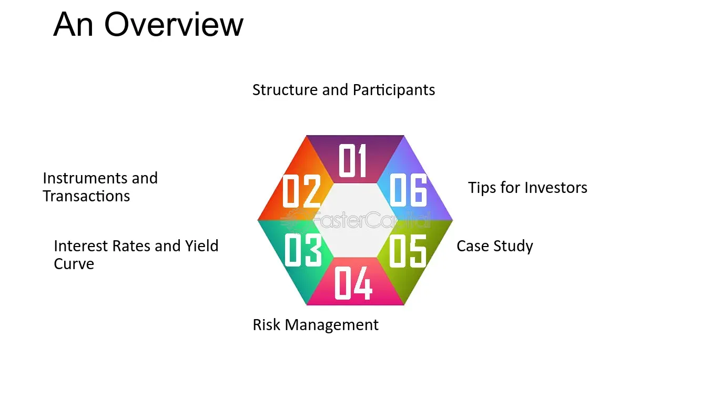

## Table of Contents

## What is wholesale money?

Wholesale money refers to large amounts of money that banks and financial institutions borrow or lend to each other. It is different from the money that regular people use every day. Banks use wholesale money to manage their daily operations, like meeting the demands of customers who want to withdraw money or to make loans to other customers.

This type of money often involves transactions in the millions or even billions of dollars. It is usually handled through financial markets where banks and other big institutions trade with each other. The interest rates for wholesale money can change a lot and are influenced by things like the overall economy and the policies of central banks.

## How does wholesale money differ from retail money?

Wholesale money and retail money are two different ways money is used and moved around. Wholesale money is about big amounts of money that banks and big financial groups use. They borrow and lend this money to each other to keep their business running smoothly. For example, if a bank needs more money because a lot of people are taking money out, it might borrow wholesale money from another bank. This kind of money is traded in large sums, often in the millions or billions, and the interest rates can change a lot based on the economy and what central banks do.

Retail money, on the other hand, is the money that everyday people use. This is the money you have in your bank account, use to buy things, or get as a paycheck. When you go to the bank to take out money or use your debit card, you're dealing with retail money. The amounts are much smaller compared to wholesale money, and the interest rates for things like savings accounts or loans are usually more stable and easier to understand. Retail money is what keeps the economy going at the personal level, while wholesale money is more about keeping the big financial system working.

## Who are the typical participants in the wholesale money market?

The typical participants in the wholesale money market are big banks, financial institutions, and sometimes big companies. These groups borrow and lend large amounts of money to each other. They do this to make sure they have enough money to run their daily business. For example, if a bank needs more money because a lot of people are taking money out, it might borrow from another bank in the wholesale market.

Central banks also play a big role in the wholesale money market. They can lend money to banks to help keep the financial system stable. Sometimes, big companies that need a lot of money for their operations will also join in. These companies might borrow money to pay for big projects or to keep their business running smoothly. Overall, the wholesale money market is where these big players manage their money needs on a large scale.

## What are the common instruments used in wholesale money transactions?

In the wholesale money market, people use different tools to borrow and lend money. One common tool is called a repurchase agreement, or "repo" for short. This is when one bank sells securities, like government bonds, to another bank with a promise to buy them back later at a higher price. The difference in price is like the interest on the loan. Another tool is called a certificate of deposit, or CD. This is when a bank borrows money from another bank or investor by issuing a CD, which is a promise to pay back the money with interest after a certain time.

There are also commercial papers, which are short-term loans that big companies use to borrow money quickly. These are like IOUs that companies sell to investors, promising to pay back the money in a short time, usually less than a year. Another tool is the interbank loan, where banks lend money to each other directly. This helps banks manage their daily cash needs. All these tools help keep the big money flowing smoothly between banks and big companies.

## How does the wholesale money market impact the economy?

The wholesale money market is really important for the economy because it helps banks and big companies manage their money. When banks can borrow and lend money easily, they can make sure they have enough cash to give to people who want to take money out or to give loans to people who need them. If the wholesale money market works well, it keeps the whole financial system stable. This means that businesses can keep running smoothly, and people can trust that their money is safe in the bank.

But if something goes wrong in the wholesale money market, it can cause big problems. For example, if banks can't borrow money easily, they might not have enough cash to give to their customers. This can make people worried and start taking their money out of the bank, which can lead to a financial crisis. The interest rates in the wholesale money market also affect the economy. If these rates go up, it can make borrowing more expensive for everyone, which can slow down the economy. So, keeping the wholesale money market stable is really important for the health of the whole economy.

## What are the risks associated with participating in the wholesale money market?

Participating in the wholesale money market can be risky. One big risk is that the value of the securities used in transactions, like in repurchase agreements, can go down. If a bank has to sell these securities quickly to get cash, it might lose money. Another risk is that the other bank or company you're dealing with might not be able to pay back the money they borrowed. This is called credit risk. If a big player in the market can't pay back what they owe, it can cause a chain reaction and make other banks worried about their own money.

There's also the risk of interest rate changes. If interest rates go up suddenly, the cost of borrowing money can increase a lot. This can make it harder for banks and companies to manage their money. Liquidity risk is another concern. Sometimes, even if a bank needs money, it might not be able to borrow it quickly enough from the market. This can happen if everyone is trying to borrow at the same time, which can lead to a shortage of available money. All these risks mean that participants in the wholesale money market need to be careful and manage their money wisely to avoid big problems.

## How can one start participating in the wholesale money market?

To start participating in the wholesale money market, you need to be a big bank, financial institution, or a large company. Regular people can't just jump in because the market deals with huge amounts of money, often in the millions or billions. If you're a bank or a big company, you'll need to set up relationships with other banks and financial institutions. This means talking to them and agreeing on how you'll borrow and lend money. You'll also need to understand the different tools used in the market, like repurchase agreements, certificates of deposit, and commercial papers.

Once you're ready to participate, you'll need to keep an eye on the market conditions. This includes watching interest rates and knowing how much money is available to borrow. You'll also need to manage the risks, like making sure the other banks or companies you're dealing with can pay back what they borrow. It's a good idea to have a team of experts who know a lot about the wholesale money market to help you make smart decisions. By doing all this, you can start borrowing and lending money in the wholesale market to help manage your business's cash needs.

## What are the regulatory considerations for the wholesale money market?

The wholesale money market has a lot of rules to make sure it works fairly and safely. Governments and central banks set these rules to stop big problems from happening. One big rule is about how much money banks need to keep on hand, called reserve requirements. This makes sure banks have enough money to give to people who want to take money out. There are also rules about how much risk banks can take when they lend money to each other. These rules help keep the market stable and make sure banks don't take too many chances that could hurt the economy.

Another important part of the rules is about watching and reporting. Banks have to tell the government and central banks about their deals in the wholesale money market. This helps everyone see what's going on and catch any problems early. There are also rules to make sure banks are honest and fair. For example, they can't trick other banks or hide important information. All these rules work together to keep the wholesale money market running smoothly and safely, which is good for the whole economy.

## How do interest rates affect the wholesale money market?

Interest rates have a big impact on the wholesale money market. When interest rates go up, it costs more for banks and big companies to borrow money. This can make them borrow less, which means there's less money moving around in the market. On the other hand, if interest rates go down, borrowing becomes cheaper. This can make banks and companies borrow more, which can make the market busier and more active. The central bank often changes interest rates to control how much money is in the economy and to keep things stable.

Changes in interest rates can also affect how much banks are willing to lend. If rates are high, banks might be more careful about lending because they want to make sure they get their money back with a good return. If rates are low, banks might be more willing to lend because it's easier for them to make money on the loans. This can lead to more money flowing through the wholesale money market. Overall, interest rates are a key part of how the wholesale money market works, and they can change how banks and big companies manage their money.

## What role do central banks play in the wholesale money market?

Central banks are really important in the wholesale money market. They help keep everything running smoothly by setting interest rates. When central banks change these rates, it affects how much it costs for banks to borrow and lend money to each other. If the central bank makes rates low, it's cheaper for banks to borrow, and they might lend more money. If rates go up, borrowing becomes more expensive, and banks might lend less. This way, central banks can control how much money is moving around in the market.

Central banks also step in to make sure there's enough money in the market. If banks are having a hard time borrowing money, the central bank can lend them money directly. This helps stop big problems from happening, like when everyone wants to take their money out of the bank at the same time. By doing this, central banks keep the wholesale money market stable, which is good for the whole economy. They watch the market closely and use their tools to make sure everything works well.

## How has technology changed the dynamics of the wholesale money market?

Technology has made big changes to the wholesale money market. It's now easier and faster for banks and big companies to borrow and lend money to each other. They use computers and the internet to do deals quickly, without having to meet in person or wait for paperwork. This means the market can move money around faster, which helps keep everything running smoothly. Also, technology helps keep better track of all the deals, so it's easier to see what's going on in the market and catch any problems early.

Another way technology has changed things is by making it easier to use new tools in the market. For example, banks can use special computer programs to handle repurchase agreements or other kinds of loans. These programs can do the math and manage the risks automatically, which saves time and reduces mistakes. Technology also helps with safety. Banks can use secure online systems to make sure their deals are private and protected from hackers. Overall, technology has made the wholesale money market more efficient, safer, and easier to manage.

## What are some advanced strategies used by experts in the wholesale money market?

Experts in the wholesale money market use different strategies to make the most of their money. One common strategy is called "yield curve trading." This is when they look at how interest rates change over time and try to guess where they will go next. If they think rates will go up, they might borrow money now and lend it out at a higher rate later. If they think rates will go down, they might do the opposite. This can help them make more money, but it's risky because guessing interest rates is hard.

Another strategy is called "liquidity management." This means making sure they always have enough money to meet their needs. Experts use special computer programs to keep track of how much money they have and how much they need. They might borrow money when it's cheap and save it for when they need it. They also try to spread out their borrowing and lending so they don't depend too much on one bank or company. This helps them avoid big problems if something goes wrong in the market.

## References & Further Reading

[1]: Adrian, T., & Shin, H. S. (2009). ["The Shadow Banking System: Implications for Financial Regulation."](https://papers.ssrn.com/sol3/papers.cfm?abstract_id=1441324) Federal Reserve Bank of Kansas City, Symposium Proceedings.

[2]: Gomber, P., Arndt, B., Lutat, M., & Uhle, T. (2011). ["High-Frequency Trading."](https://papers.ssrn.com/sol3/papers.cfm?abstract_id=1858626) SSRN Electronic Journal.

[3]: López de Prado, M. (2018). ["Advances in Financial Machine Learning."](https://www.amazon.com/Advances-Financial-Machine-Learning-Marcos/dp/1119482089) Wiley.

[4]: Hull, J. (2018). ["Options, Futures, and Other Derivatives."](https://books.google.com/books/about/Options_Futures_and_Other_Derivatives.html?id=vpIYvgAACAAJ) Pearson.

[5]: Bank for International Settlements. (2016). ["High-Frequency Trading in the Foreign Exchange Market."](https://www.bis.org/publ/arpdf/ar2016e_ec.pdf) Markets Committee Publications.

[6]: Duffie, D. (2010). ["The Failure Mechanics of Dealer Banks."](https://www.darrellduffie.com/uploads/1/4/8/0/148007615/duffiefailuremechanicsdealerbanks2010__1_.pdf) Journal of Economic Perspectives.

[7]: Lewis, M. (2015). ["Flash Boys: A Wall Street Revolt."](https://en.wikipedia.org/wiki/Flash_Boys) W.W. Norton & Company.

[8]: Shleifer, A., & Vishny, R. W. (1997). ["The Limits of Arbitrage."](https://onlinelibrary.wiley.com/doi/full/10.1111/j.1540-6261.1997.tb03807.x) The Journal of Finance, 52(1), 35-55.