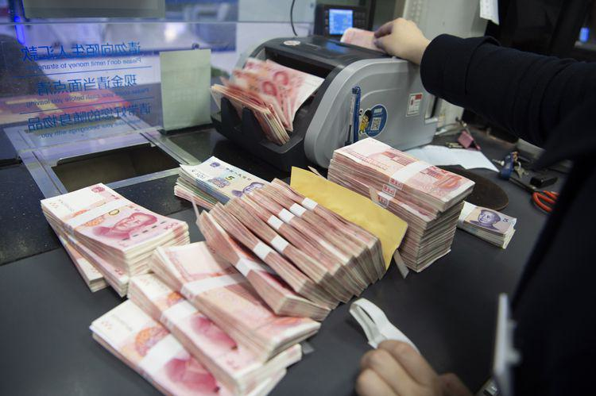

In the complex world of finance, understanding the interplay between financial markets, banking, and wholesale money is crucial for comprehending modern economic systems. Financial markets are indispensable as they facilitate the trading of assets such as stocks, bonds, and foreign currencies. These platforms are vital for ensuring liquidity, enabling market participants to buy or sell assets with minimal impact on their price, and for price discovery, where the prices of assets are established through supply and demand dynamics.

Wholesale money, on the other hand, involves large-scale transactions typically conducted by financial institutions within the money markets. Instruments like Treasury bills, commercial paper, and certificates of deposit are exchanged in this environment, serving as crucial tools for liquidity management and short-term financing. The efficient functioning of wholesale money markets is integral to the stability of the financial system, allowing banks to manage liquidity and fulfill funding requirements.

Banking, particularly wholesale banking, caters to large entities such as corporations and governments, facilitating significant financial transactions and investments. The interconnectedness between banking and financial markets further underscores the complexity of economic systems, where the health of one component invariably impacts the others.

An additional modern facet of financial markets is algorithmic trading, which employs computer algorithms to conduct high-speed trading, exceeding human capabilities. This trading approach has revolutionized markets by improving liquidity and reducing costs associated with trading. However, it also introduces challenges such as increased volatility and systemic risks.

As we explore the relationship between these components, we shed light on how wholesale money, banking, and algorithmic trading work together in the broader financial ecosystem. Understanding these elements not only enhances our grasp of their role in economic stability but also highlights the impact of innovations like algorithmic trading on wholesale money markets. This comprehension is vital for navigating the ever-evolving landscape of global finance.

## Table of Contents

## Understanding Financial Markets and Banking

Financial markets serve as foundational structures within the global economy, facilitating the exchange of assets such as stocks, bonds, and currencies. These platforms play a critical role in ensuring liquidity, which is the ease with which assets can be bought or sold without causing drastic changes in their prices. Liquidity supports efficient price discovery, a process where the prices of assets are determined by the supply and demand dynamics in the market.

The role of financial markets extends beyond mere transactions; they act as barometers for economic health. Through the fluctuation of indices and asset values, these markets provide insights into economic trends and investor sentiment, influencing decisions by policymakers and investors alike.

Banking, particularly wholesale banking, is intricately linked with financial markets. Wholesale banking focuses on the needs of large entities, such as corporations, financial institutions, and governments. This segment of banking offers services like underwriting, mergers and acquisitions, and large-scale loans, facilitating significant transactions that drive economic development. Wholesale banks provide these entities with essential financial infrastructure, which is indispensable for managing large-[volume](/wiki/volume-trading-strategy) financial transactions and investments.

The interaction between financial markets and wholesale banking is complex and integral to the functionality of the global economic landscape. Wholesale banks often operate within financial markets, offering expertise and capital that chart the [course](/wiki/best-algorithmic-trading-courses) of economic growth. As they engage in activities such as underwriting and trading, these banks contribute to market [liquidity](/wiki/liquidity-risk-premium) and stability.

Furthermore, financial markets and wholesale banking cooperate in managing systemic risks. The instruments and services provided by wholesale banks, like derivatives and risk management solutions, help entities navigate through market uncertainties and reduce exposure to volatile market conditions. By providing markets with depth and stability, wholesale banking plays a pivotal role in preserving the equilibrium of financial systems.

Understanding the interdependencies between financial markets and wholesale banking allows stakeholders to better appreciate their joint impact on the economic ecosystem. Their collaboration ensures a continuous flow of capital and fosters an environment conducive to investment and growth, underpinning the broader economic framework. This intricate dance between financial markets and wholesale banking not only facilitates enormous transactions but also fortifies financial stability, highlighting their significance in the evolving global economy.

## What is Wholesale Money?

Wholesale money refers to the substantial sums of money exchanged between financial institutions, predominantly within money markets. These exchanges constitute a fundamental element of the global financial system, pivotal for maintaining liquidity and accommodating short-term financing needs. Financial instruments commonly involved in wholesale money transactions include Treasury bills, commercial paper, and certificates of deposit.

Treasury bills, often abbreviated as T-bills, are short-term government securities maturing in one year or less. They are sold at a discount to face value and do not pay interest prior to maturity. The difference between the purchase price and the face value upon maturity represents the yield to the investor. These instruments are perceived as low-risk due to government backing, making them a preferred choice for institutions seeking a secure investment.

Commercial paper, on the other hand, is an unsecured, short-term debt instrument issued by corporations to meet immediate funding requirements such as payroll, rent, and inventory costs. Typically, these are issued at a discount and mature within 270 days or less. Corporations with high credit ratings can effectively leverage commercial paper to finance their operational needs at lower interest rates compared to bank loans.

Certificates of deposit (CDs) are time deposits offered by banks that pay regular interest. Institutions deposit a specified amount of money for a fixed term, ranging from a few months to several years, in exchange for interest. Upon maturity, the principal amount alongside the accrued interest is returned to the depositor. CDs serve as a reliable short-term investment vehicle in wholesale money markets.

Wholesale money markets play a critical role in the financial ecosystem by providing the necessary liquidity for banking operations and facilitating large-scale financial transactions. They enable institutions to borrow and lend funds efficiently, ensuring that banks can manage daily operations and maintain financial stability. Such markets are indispensable for smoothing out temporary discrepancies in funding and liquidity, thereby supporting economic activities broadly.

## The Role of Wholesale Money in Banking Operations

Wholesale money markets play a crucial role in banking operations by enabling banks to effectively manage liquidity and meet their short-term funding needs. These markets are arenas where banks and financial institutions engage in large-scale transactions, often with instruments like Treasury bills, certificates of deposit, and commercial paper. The efficient functioning of wholesale money markets allows banks to access immediate funding, ensuring they can cover daily operations and unexpected financial demands.

Banks rely on these markets not only for liquidity management but also to engage in various financial transactions that support broader economic activities. By accessing funds quickly, banks can lend to individuals and businesses, facilitating investment and consumption. This capacity to provide loans is vital for economic expansion, making wholesale money markets a linchpin in the overall financial ecosystem.

Understanding wholesale money markets is integral for identifying systemic risks associated with wholesale funding. These risks may stem from sudden changes in market conditions, [interest rate](/wiki/interest-rate-trading-strategies) hikes, or variations in regulatory policies, which can all lead to liquidity crunches. For example, during periods of financial stress, such as the subprime mortgage crisis of 2008, the importance of robust wholesale money management became apparent. Financial institutions with excessive reliance on short-term wholesale funding faced severe liquidity challenges, underscoring the systemic vulnerabilities present within these markets.

Risk management in wholesale money markets involves careful monitoring of liquidity metrics, maintaining an optimal mix of short-term and long-term funding sources, and ensuring adherence to various regulatory requirements. This can include stress testing, scenario analysis, and liquidity coverage ratios, which help institutions withstand market disruptions.

In summary, wholesale money markets are indispensable to banking operations by providing liquidity and facilitating high-level financial transactions. A deep understanding of these markets is essential for bank risk management, emphasizing the need for careful oversight to maintain financial stability.

## Algorithmic Trading in Financial Markets

Algorithmic trading involves the use of computer algorithms to automatically execute trades based on pre-defined criteria, profound market analysis, or real-time data. These algorithms can analyze numerous funds and securities across various markets simultaneously, executing trades at speeds and frequencies beyond human capabilities. This has resulted in a significant transformation of financial markets, primarily by enhancing liquidity, reducing trading costs, and improving the efficiency of trade execution.

Enhanced liquidity is one of the key benefits of [algorithmic trading](/wiki/algorithmic-trading). Liquidity, in economic terms, refers to the ability to quickly buy or sell assets without causing major price changes. By executing a large volume of orders in a fraction of a second, algorithms have increased the number of transactions in the financial markets. This increase in trade volume contributes to greater liquidity, allowing large trades to be processed with minimal market impact and helping to stabilize prices across various securities.

Moreover, algorithmic trading has substantially reduced trading costs. Traditional trading methods often involve significant human labor, which can increase operational costs. By automating the trading process, firms can significantly cut down on expenses associated with manual order placement, such as broker fees and the potential costs of execution errors. This reduction in trading costs can improve a firm's bottom line and provide individual traders with better pricing.

Algorithmic trading also introduces the opportunity to leverage advanced mathematical models and sophisticated data analytics to optimize trading strategies. Algorithms can be programmed to recognize complex trading signals derived from statistical data, market trends, and historical prices, thus optimizing decision-making processes. For example, some algorithms use [arbitrage](/wiki/arbitrage) strategies—simultaneously buying and selling an asset in different markets to exploit price differences. 

However, the shift towards algorithmic trading has not been without risks. The lack of human intervention means that errors in the algorithm's logic can lead to substantial financial losses. One notable example is the "Flash Crash" of May 6, 2010, when the U.S. stock market experienced a rapid, deep, and volatile plunge within minutes, largely exacerbated by algorithmic trading systems interacting in unpredictable ways. This event highlighted the potential systemic risks inherent in algorithmic trading, as well as the cascading effects that technical malfunctions or poor algorithmic designs can have on the broader market.

Additionally, algorithmic trading can increase market [volatility](/wiki/volatility-trading-strategies). High-frequency trading ([HFT](/wiki/high-frequency-trading-strategies)), a type of algorithmic trading aimed at capitalizing on smaller price discrepancies and high turnover rates, can lead to sudden swings in asset prices. This is because these algorithms react to market conditions with considerable speed and frequency, leading to conditions where prices may change rapidly, diverging from fundamental value.

The continued rise of algorithmic trading has spurred regulatory scrutiny. Authorities and financial regulators have instituted measures to ensure market stability and protect against the potential downsides of automated trading systems. This includes implementing circuit breakers, monitoring high-frequency trading firms, and encouraging transparency in order placement processes.

In conclusion, while algorithmic trading has profoundly renovated financial markets, improved efficiencies, and introduced novel approaches to investing, it also presents unique challenges and risks that must be vigilantly managed. Maintaining a balance between innovation and regulation will be crucial in fostering a stable and efficient market environment.

## Impact of Algo Trading on Wholesale Money Markets

Algorithmic trading, often referred to as algo trading, utilizes complex algorithms to make trading decisions and execute transactions at high speeds, significantly impacting the wholesale money markets. This technology-driven approach has introduced both opportunities and challenges, reshaping the financial trading environment.

One of the primary effects of algorithmic trading on wholesale money markets is increased volatility. The speed and volume of trades executed by algorithms can lead to rapid fluctuations in asset prices, especially in less liquid markets. An algorithm can execute thousands of trades within seconds, reacting to market signals such as news feeds or price movements. This hyperactivity can amplify price swings, leading to higher market volatility. A well-documented example is the "Flash Crash" of May 6, 2010, where the Dow Jones Industrial Average dropped nearly 1,000 points within minutes before quickly recovering, largely attributed to high-frequency trading algorithms.

Additionally, algorithmic trading has added complexity to market dynamics. By using strategies such as [statistical arbitrage](/wiki/statistical-arbitrage), [market making](/wiki/market-making), and [trend following](/wiki/trend-following), algo traders can influence market liquidity and price discovery. These sophisticated strategies often rely on [machine learning](/wiki/machine-learning) and [artificial intelligence](/wiki/ai-artificial-intelligence) to analyze vast datasets and identify profitable trading opportunities. However, the intricate nature of these strategies can obscure the underlying market mechanics, making it difficult for regulators and market participants to anticipate or mitigate potential risks.

From a risk perspective, the impact of algo trading on wholesale money markets includes systemic risks. Large financial institutions often engage in wholesale transactions, leveraging algorithms to optimize their portfolios and manage liquidity. As these systems interact, there's a potential for cascading failures, where a malfunction or unexpected market event triggers widespread instability across interconnected markets. The interdependency of these systems can lead to a domino effect, exacerbating financial disruptions.

Economic implications of algorithmic trading in wholesale markets include changes in trading costs and accessibility. Algo trading has reduced trading costs by narrowing bid-ask spreads and increasing market efficiency. This reduction in costs can benefit financial institutions and, by extension, the broader economy by lowering barriers to market entry and improving capital allocation. However, it also creates competitive pressure on traditional trading firms, which may struggle to compete with technologically advanced entities.

In summary, the intersection of algorithmic trading and wholesale money markets encapsulates a transformative shift with heightened volatility, increased complexity, and substantial economic implications. Understanding and managing these dynamics are crucial for safeguarding financial stability and fostering inclusive market growth.

## Case Studies and Real-World Applications

Analyzing key events from the past provides significant insights into the systemic risks and dynamics of wholesale money markets and how banking institutions and algorithmic trading interact within these markets. One such pivotal event is the 2008 financial crisis, which exemplifies the vulnerabilities present in wholesale funding practices and the broader financial system.

During the 2008 financial crisis, the collapse of the investment bank Lehman Brothers highlighted the critical role of wholesale money markets in banking operations. Lehman Brothers' heavy reliance on short-term wholesale funding sources, such as repurchase agreements and commercial papers, created a liquidity crunch when those markets seized up. Banks traditionally use these markets to manage their daily liquidity needs and fund longer-term loans. However, excessive dependence on wholesale funding, without adequate liquidity backstops, translated into significant systemic risk when market confidence disappeared.

Algorithmic trading also had a considerable impact on financial markets during this period. The speed and complexity of algorithmic trades contributed to market volatility, exacerbating the crisis as rapid sell-offs and liquidity mismatches occurred. Algorithms designed to liquidate positions under certain market conditions led to cascading sell orders, intensifying downward pressure on asset prices.

A case study of the Flash Crash of May 6, 2010, further underscores the interaction between algorithmic trading and wholesale money markets. On this day, the U.S. stock market experienced a massive and sudden drop in financial security prices, followed by a swift recovery. The event was partly attributed to high-frequency trading algorithms that amplified market fluctuations. One key takeaway from this incident is the need for robust risk management strategies and market safeguards to mitigate the impact of algorithmic trades on financial stability.

Looking into these events provides a clearer picture of how banking institutions and trading algorithms can profoundly influence wholesale money markets and financial systems. It emphasizes the importance of prudent risk management, regulatory oversight, and systemic reforms to prevent similar crises from occurring in the future. Moreover, these historical analyses underscore the need for continuous monitoring and adaptation of strategies as the financial landscape evolves.

## Future Trends in Wholesale Banking, Money Markets, and Algo Trading

The landscape of wholesale banking, money markets, and algorithmic trading is undergoing significant transformation driven by technological advancements, regulatory shifts, and the increasing importance of sustainable finance. As these sectors evolve, understanding emerging trends is pivotal for market participants and regulators alike.

### Digital Transformation in Wholesale Banking

Digital transformation is reshaping wholesale banking by enhancing operational efficiency and customer experience. Banks are leveraging advanced technologies like artificial intelligence (AI), machine learning, and big data analytics to streamline processes such as risk assessment, transaction processing, and customer relationship management. Additionally, the adoption of robotic process automation (RPA) is helping institutions reduce manual effort and errors in back-office operations.

The integration of digital technologies is not only improving efficiency but also enabling better decision-making capabilities. AI-driven predictive analytics, for instance, allow banks to foresee market trends and customer behavior, thus enhancing their strategic planning.

### Sustainable Finance

Sustainable finance has gained prominence as financial institutions aim to align their operations with environmental, social, and governance ([ESG](/wiki/esg-investing)) criteria. This shift is reflected in the rise of green bonds, sustainability-linked loans, and investments focused on renewable energy and other environmentally friendly projects. Wholesale banks are increasingly tasked with not only providing funding but also advising clients on ESG compliance and sustainable practices.

The development of new financial instruments that cater to sustainability is changing the dynamics of money markets, with an emphasis on transparency and accountability. Market participants are advised to adapt to these expectations as regulatory bodies establish stricter guidelines for ESG reporting and practices.

### Blockchain Technology

Blockchain technology is playing a transformative role in wholesale banking and money markets by enabling more secure, transparent, and efficient transaction processing. Distributed ledger systems offer the potential to reduce counterparty risks and settlement times in money market transactions. Furthermore, blockchain can enhance the verification and traceability of transactions, thereby reducing fraud and improving trust among stakeholders.

The application of blockchain extends beyond transactions to include smart contracts, which can automate complex financial agreements and improve execution certainty. As industry adoption grows, regulatory frameworks are expected to evolve to address challenges and harness the benefits of blockchain technology.

### Future Developments in Algorithmic Trading

Algorithmic trading continues to evolve, with significant future trends anticipated in regulatory challenges and technological advancements. Regulators globally are increasingly focusing on the implications of high-frequency trading (HFT) and its impact on market stability and fairness. Enhanced scrutiny is leading to the development of new guidelines that aim to mitigate inherent risks, such as market manipulation and flash crashes.

On the technology front, advancements in AI and quantum computing present opportunities for more sophisticated trading algorithms. These technologies promise to improve predictive accuracy and trade execution, thereby optimizing trading strategies. However, they also bring challenges related to data privacy and security, necessitating innovations in safeguarding sensitive information.

In summary, the future of wholesale banking, money markets, and algorithmic trading is poised to be shaped by digital innovation, a commitment to sustainability, and the integration of cutting-edge technologies. Stakeholders must remain agile and informed to navigate these changes effectively and capitalize on emerging opportunities.

## Conclusion

In conclusion, the intricate linkages among financial markets, wholesale money, and algorithmic trading underscore the need for a thorough comprehension of each component. Financial markets serve as the backbone of modern economies, offering platforms for trading various assets and ensuring liquidity and price discovery. Wholesale money markets are indispensable for banks, enabling them to manage liquidity and meet short-term funding needs, thus playing a fundamental role in the stability of financial systems.

The rapid evolution and adoption of algorithmic trading have significantly reshaped financial markets. While these computational strategies enhance market efficiency by improving liquidity and reducing transaction costs, they also introduce heightened levels of complexity and volatility. This interplay can affect the dynamics of wholesale money markets, necessitating vigilant risk management practices and adaptable regulatory frameworks.

Navigating the complexities of global finance requires staying informed about these interconnected domains. As technological innovation and regulatory challenges continue to shape the landscape, understanding the nuances of financial markets, wholesale money, and algorithmic trading becomes increasingly critical. Awareness and insight into these elements are vital for stakeholders aiming to effectively engage with, and mitigate risks in, today's sophisticated financial ecosystem.

## References & Further Reading

[1]: Adrian, T., & Shin, H. S. (2009). ["The Shadow Banking System: Implications for Financial Regulation."](https://papers.ssrn.com/sol3/papers.cfm?abstract_id=1441324) Federal Reserve Bank of Kansas City, Symposium Proceedings.

[2]: Gomber, P., Arndt, B., Lutat, M., & Uhle, T. (2011). ["High-Frequency Trading."](https://papers.ssrn.com/sol3/papers.cfm?abstract_id=1858626) SSRN Electronic Journal.

[3]: López de Prado, M. (2018). ["Advances in Financial Machine Learning."](https://www.amazon.com/Advances-Financial-Machine-Learning-Marcos/dp/1119482089) Wiley.

[4]: Hull, J. (2018). ["Options, Futures, and Other Derivatives."](https://books.google.com/books/about/Options_Futures_and_Other_Derivatives.html?id=vpIYvgAACAAJ) Pearson.

[5]: Bank for International Settlements. (2016). ["High-Frequency Trading in the Foreign Exchange Market."](https://www.bis.org/publ/arpdf/ar2016e_ec.pdf) Markets Committee Publications.

[6]: Duffie, D. (2010). ["The Failure Mechanics of Dealer Banks."](https://www.darrellduffie.com/uploads/1/4/8/0/148007615/duffiefailuremechanicsdealerbanks2010__1_.pdf) Journal of Economic Perspectives.

[7]: Lewis, M. (2015). ["Flash Boys: A Wall Street Revolt."](https://en.wikipedia.org/wiki/Flash_Boys) W.W. Norton & Company.

[8]: Shleifer, A., & Vishny, R. W. (1997). ["The Limits of Arbitrage."](https://onlinelibrary.wiley.com/doi/full/10.1111/j.1540-6261.1997.tb03807.x) The Journal of Finance, 52(1), 35-55.