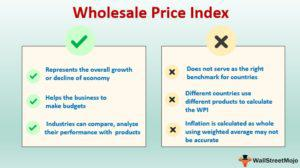

The Wholesale Price Index (WPI) is a significant economic indicator that plays a pivotal role in understanding inflation and the overall economic health of a nation. By measuring the average change in prices at the wholesale level, the WPI provides essential insights into price movements relative to producers, commodities, and intermediate goods. This information is crucial for economists and policymakers who utilize these insights to shape monetary and fiscal policies effectively. Businesses also rely on WPI data to make strategic decisions regarding pricing and forecasting input costs, thus allowing them to anticipate economic trends and respond accordingly.

In parallel, algorithmic trading—an advanced method utilizing computer algorithms to manage trading strategies—has emerged as a critical aspect of financial markets. These algorithms use vast amounts of data to execute trades at speeds and with precision beyond human capability. The interplay between the WPI and algorithmic trading is particularly notable as the WPI's data can be integrated into trading algorithms to predict market trends, optimize trading strategies, and make more informed investment decisions.



This article examines how the WPI is calculated, its vital role in economic analysis, and the potential it holds for enhancing algorithmic trading practices. By understanding these dynamics, one can appreciate how traditional economic indicators continue to find relevance in the ever-evolving technological landscape of global markets.

## Table of Contents

## What is the Wholesale Price Index (WPI)?

The Wholesale Price Index (WPI) is a crucial economic indicator that measures the average change in prices of goods at the wholesale level. Unlike retail prices, which consumers encounter directly, wholesale prices are determined before goods reach the retail market, capturing the cost changes for producers. This makes WPI an essential tool for understanding the economic landscape and inflationary trends at the production stage.

WPI primarily includes the prices of commodities and intermediate goods, which are fundamental in the production process. These goods serve as primary inputs for producing consumer goods and can include raw materials such as metals, chemicals, and agricultural products. By focusing on these, the WPI provides insights into inflationary pressures that might eventually translate into higher consumer prices.

For a comprehensive grasp, it's imperative to differentiate WPI from the Consumer Price Index (CPI). While WPI measures price changes at the wholesale level, CPI tracks the average change in prices from the consumer's perspective. The CPI includes service sector prices, which the WPI traditionally excludes. This distinction means that CPI is often more reflective of the cost-of-living changes experienced by households, whereas WPI offers a window into producer-side cost pressures.

Given this disparity, the selection of goods and the weighting system also varies between the two indices. WPI emphasizes goods heavily traded in the wholesale market, whereas CPI incorporates goods and services that are part of the consumer basket. Consequently, changes reflected in these indices may not always move in tandem and can even indicate different inflationary trends.

Numerically, the WPI can be expressed through a Laspeyres price index formula, which can be represented as:

$$
\text{WPI} = \frac{\sum (p_{t} \times q_{0})}{\sum (p_{0} \times q_{0})} \times 100
$$

where $p_{t}$ and $p_{0}$ denote the price of commodity in the current and base periods, respectively, and $q_{0}$ indicates the quantity of the base period, reflecting the index's reliance on base year quantities.

Understanding WPI provides valuable insights for economists, businesses, and policymakers in assessing the upstream inflationary forces within the economy.

## How is the WPI Calculated?

The Wholesale Price Index (WPI) is calculated by aggregating the price changes of a selected basket of commodities, which represent the economic activities of a country. This calculation involves two main steps: selecting the basket of commodities and assigning appropriate weights to each item based on its economic significance.

**Selection of Commodities**: 
The first step involves identifying and selecting a set of representative goods. These goods typically include raw materials, intermediate goods, and finished goods sold at the wholesale level. The basket is chosen to approximate a country's production and consumption patterns, ensuring that it reflects the economic structure accurately. For instance, in an industrialized nation, the basket might include a higher proportion of manufactured goods, whereas an agricultural country might have a basket heavily weighted towards primary agricultural products.

**Assigning Weights**:
Once the basket is selected, each commodity is assigned a weight. The weights reflect the relative importance of each item in the country's economy. Generally, these weights are derived from the value of the commodities' total output or sales. For example, if a particular commodity accounts for 10% of the total output value within the basket, it would be assigned a corresponding weight in the index calculation.

**Mathematical Formula**:
The calculation of the WPI uses a weighted average formula. The Laspeyres price index formula is commonly employed, which is expressed as:

$$
\text{WPI} = \frac{\sum (P_t \times Q_0 \times W)}{\sum (P_0 \times Q_0 \times W)} \times 100
$$

Where:
- $P_t$ is the price of the commodity in the current period.
- $P_0$ is the price of the commodity in the base period.
- $Q_0$ is the quantity of the commodity in the base period.
- $W$ is the weight assigned to the commodity.

This formula effectively calculates the proportionate change in prices from the base period to the current period, weighted by the economic significance of each commodity.

**Example Calculation**:
Consider a simplified basket of three commodities: A, B, and C, with respective weights of 0.5, 0.3, and 0.2. If the base period prices are $P_0 = [10, 20, 30]$ and the current period prices are $P_t = [12, 22, 28]$, the calculation would proceed as follows:

$$
\text{WPI} = \frac{(12 \times 0.5) + (22 \times 0.3) + (28 \times 0.2)}{(10 \times 0.5) + (20 \times 0.3) + (30 \times 0.2)} \times 100
$$

$$
\text{WPI} = \frac{6 + 6.6 + 5.6}{5 + 6 + 6} \times 100 = \frac{18.2}{17} \times 100 \approx 107.06
$$

Thus, the WPI indicates a 7.06% increase in wholesale prices since the base period.

This calculated index provides vital insights into inflationary trends at the production level, which can guide decisions in areas such as monetary policy and business strategy.

## The Importance of WPI in Economic Analysis

The Wholesale Price Index (WPI) plays a significant role in economic analysis by providing insights into inflationary pressures at the production level. It reflects the average change in prices of goods prior to reaching consumers, offering a measure of price movements affecting producers and wholesalers. Policymakers heavily rely on WPI data to shape monetary and fiscal policies. Changes in the WPI can signal shifts in inflation, prompting central banks to either increase or decrease interest rates to control economic growth. For instance, a rising WPI might lead to higher interest rates to cool inflation, while a declining WPI could encourage a reduction in rates to stimulate spending.

Businesses also find the WPI valuable for strategic planning. By analyzing WPI trends, companies can anticipate changes in input costs and adjust their pricing strategies accordingly. This foresight is crucial for maintaining competitive pricing while safeguarding profit margins amid fluctuating commodity prices. Moreover, industries that are heavily reliant on raw materials closely monitor WPI to assess potential changes in supply chain costs, allowing for better budget forecasting and cost management. Overall, the ability to accurately interpret WPI data aids in crafting robust economic policies and effective business strategies.

## WPI in Global Context

Different countries implement their versions of the Wholesale Price Index (WPI) to monitor price changes pertinent to their economic landscapes. These indices, while serving the same fundamental purpose of tracking wholesale prices, are adapted to address unique national economic structures, trading practices, and policy requirements.

In the United States, the equivalent measure is termed the Producer Price Index (PPI). The PPI focuses primarily on prices received by domestic producers for their output. It covers various sectors, including mining, manufacturing, agriculture, and even some services. The PPI, managed by the Bureau of Labor Statistics, considers the price changes from the perspective of the producer and provides a detailed look at what producers get for their products at different stages of production. This index is crucial for economic analysis because it can signal upcoming changes in consumer prices, thus affecting monetary policy decisions.

India’s Wholesale Price Index (WPI), administered by the Office of the Economic Adviser, captures price changes at the wholesale level, focusing on three main categories: Primary Articles, Fuel and Power, and Manufactured Products. The WPI is an important measure in India because it influences policy decisions related to inflation control. Unlike the PPI of the United States, the Indian WPI includes only goods, not services, reflecting the country's emphasis on the vast array of tangible products in its economy. The index is often used as a leading indicator for consumer price inflation in India.

Japan operates its own version known as the Corporate Goods Price Index (CGPI). Managed by the Bank of Japan, the CGPI measures changes in transaction prices of goods among enterprises and corporations. It includes Domestic Corporate Goods Price Index, Export Price Index, and Import Price Index. This index is pivotal in understanding Japan's balance of payment accounts and monitoring heavily on corporate pricing activities. The CGPI data is used by policymakers to assess inflationary trends and adjust economic strategies.

Historically, the WPI's evolution has mirrored changes in global economic conditions. Originally serving as a basic measure of price movements of goods in the industrial and agricultural sectors, the WPI and its global counterparts have expanded to reflect the complexities of modern trade and economies. For instance, technological advancements have enhanced the accuracy and comprehensiveness of these indices. Moreover, indices like the PPI and CGPI have adapted over time, integrating more services and accounting for import-export prices, thus broadening their analytical scope.

The impact of these indices on global trade is profound. As indicators of inflationary tendencies, they affect international trading partners by influencing exchange rates and interest rates. They provide insights into trade competitiveness and guide strategic decisions for international businesses. By examining differences such as those between the US PPI, India's WPI, and Japan's CGPI, economists can better understand and anticipate global economic dynamics. In essence, these indices not only serve their respective countries but also contribute significantly to an integrated understanding of worldwide economic activity.

## Algorithmic Trading and WPI

Algorithmic trading is a method of executing orders using automated and pre-programmed trading instructions to account for variables such as time, price, and [volume](/wiki/volume-trading-strategy). This approach leverages technological advancements and vast datasets to optimize trading strategies and decision-making processes. One of the critical components in refining these algorithms is the integration of economic indicators like the Wholesale Price Index (WPI).

The WPI serves as a useful economic indicator that can considerably influence market predictions and trading algorithms. As it reflects the changes in the average prices at the wholesale level, the WPI provides a glimpse into inflationary pressures and the overall health of the economy. This data is pivotal for traders who seek to adjust their strategies based on anticipated economic conditions. For example, an increase in WPI could indicate potential inflation, prompting [algorithmic trading](/wiki/algorithmic-trading) systems to adjust their parameters to mitigate potential risks associated with rising prices.

Incorporating WPI data into algorithmic trading systems can enhance an understanding of market conditions and price movements. By integrating this data, algorithms can make more informed predictions about market trends, assessing whether economic conditions are favorable for buying or selling assets. For instance, a systematic trading algorithm can employ Python scripts to fetch WPI data from public databases, like those provided by statistical agencies, to continuously update its trading strategy.

Here is a simple example of how one might implement WPI data usage in a Python-based algorithmic trading system:

```python
import requests
import pandas as pd

# Fetch WPI data from a hypothetical API
response = requests.get("https://api.example.com/wpi")
wpi_data = response.json()

# Convert to DataFrame for processing
wpi_df = pd.DataFrame(wpi_data)
wpi_df['date'] = pd.to_datetime(wpi_df['date'])

# Analyze the trend
recent_trend = wpi_df.set_index('date').resample('M').mean().pct_change()[-1:] 

# Example decision-making logic
def make_trade_decision(trend):
    if trend > 0.02:  # if WPI increase is more than 2%
        return "sell"
    elif trend < -0.02:  # if WPI decrease is more than 2%
        return "buy"
    else:
        return "hold"

decision = make_trade_decision(recent_trend['wpi_change'])
print(f"Trade Decision based on WPI trend: {decision}")
```

In such an algorithm, the WPI data is first fetched and processed, and then its trend is analyzed over a relevant period. The resulting trend informs trading decisions, allowing the system to dynamically adjust its approach based on economic conditions. By continuously integrating WPI data, traders and algorithmic systems can maintain a comprehensive perspective on market dynamics, potentially gaining a competitive edge in unpredictable economic environments. This blend of economic foresight and automation exemplifies the sophisticated nature of modern trading strategies, where even the subtle signals from economic indices like the WPI can significantly impact trading outcomes.

## Technological Advancements in WPI Calculation

Emerging technologies are significantly transforming how the Wholesale Price Index (WPI) is calculated and analyzed. These advancements are primarily driven by big data and the Internet of Things (IoT), which enable more comprehensive data collection and analysis, thereby enhancing the accuracy and relevance of WPI metrics.

Big data facilitates the integration of vast, diverse data sets that were previously unmanageable using traditional methods. These data sets might include real-time transaction records, supply chain details, and even sensor data from IoT devices, providing a broader picture of market conditions and price dynamics. For example, IoT devices can relay instantaneous inventory levels and production rates, offering deeper insights into commodity prices and availability.

Real-time data analytics play a crucial role by providing immediate insights into price movements, thus enabling quicker response times in economic analysis and decision-making. Traditional WPI calculations rely on periodic data updates, which may not accurately capture rapid fluctuations in prices. However, real-time data streams can feed continuously updated models, allowing the WPI to reflect the current market scenario more accurately.

Machine learning techniques are increasingly being applied to enhance predictive models based on WPI. These techniques can identify patterns and correlations in complex data sets that are not apparent through conventional statistical methods. For instance, [machine learning](/wiki/machine-learning) algorithms can forecast future price changes by analyzing historical price patterns and current data inputs. A simple linear regression model, often used in such analyses, could be written in Python as follows:

```python
from sklearn.linear_model import LinearRegression
import numpy as np

# Example data: features such as production rates and previous prices
X = np.array([[1.5, 200], [2.0, 250], [2.5, 300]])  # Sample features
y = np.array([120, 150, 180])  # Sample price outcomes

# Initialize and train the model
model = LinearRegression()
model.fit(X, y)

# Predict future prices
predicted_price = model.predict(np.array([[3.0, 350]]))
print(predicted_price)  # Outputs the predicted price
```

Such models can be expanded with more complex algorithms, like neural networks, to handle larger, more nuanced data sets.

Overall, the integration of these technologies into the WPI calculation offers a more dynamic, comprehensive, and efficient approach to capturing price movements. Continuous innovations in these areas promise to further refine the accuracy and utility of WPI as an economic indicator, aiding policymakers and businesses in their strategic planning and decision-making processes.

## Challenges and Criticisms of WPI

The Wholesale Price Index (WPI) is a crucial tool for gauging inflation at the wholesale level. However, it is not without its criticisms and challenges, one of which is the exclusion of service sector prices. Traditionally, the WPI has focused on tangible goods such as raw materials and manufactured products. This approach omits a significant portion of economic activity since services have grown to represent a substantial share of modern economies. Thus, excluding service sector prices may lead to an incomplete assessment of inflationary pressures.

Another limitation of the WPI is its coverage gaps and the usage of outdated base year adjustments. Coverage gaps occur when certain commodities or sectors are not represented accurately or are completely excluded from the index. This absence can result in skewed data, especially when the economic landscape changes over time. For instance, technological advancements might introduce new products that aren't immediately incorporated into the WPI, delaying the index's responsiveness to market trends.

Outdated base year adjustments can also lead to inaccuracies in the WPI. The base year is fundamental in calculating the index, as it serves as the point of comparison for tracking price changes over time. An obsolete base year fails to reflect recent economic developments, possibly rendering the WPI less relevant. Regular updates to the base year are crucial to maintaining the index’s accuracy and relevance amidst evolving market conditions.

To enhance the comprehensiveness and relevance of the WPI, several proposals have been made. One primary recommendation is the integration of technology into the index's compilation process. Utilizing tools such as big data analytics and the Internet of Things (IoT) can offer more dynamic and real-time data collection, which would facilitate a more accurate reflection of price movements.

Frequent updates and revisions of the basket of goods and the base year are necessary to ensure the continued relevance of the WPI. By periodically reviewing and adjusting these parameters, the WPI can better mirror current economic activities and inflationary trends. This approach would also help in addressing coverage gaps and including emerging sectors within the index, providing a more holistic view of wholesale price changes across the economy.

## Conclusion

The Wholesale Price Index (WPI) continues to serve as a critical instrument for economic analysis and policy formulation. Its ability to indicate inflationary trends at the production level provides crucial insights for both policymakers and businesses. By monitoring changes in the WPI, governments can make informed decisions regarding monetary and fiscal policies, ensuring a stable and sustainable economic environment. Similarly, businesses can adjust their pricing strategies and forecast input costs more accurately, aiding in better financial planning and resource allocation.

The integration of WPI data into algorithmic trading models further elevates its importance. Algorithmic trading, which employs advanced technologies to optimize trading strategies, benefits significantly from the utilization of economic indicators like the WPI. The index provides a robust foundation for predicting market trends, allowing for more precise and dynamic trading decisions. Traders can incorporate WPI data into their algorithms to anticipate price movements and adjust their portfolios accordingly. This fusion of economic indicators and technology fosters a more efficient and responsive trading environment.

As technological advancements continue to evolve, the accuracy and utility of the WPI are poised for significant improvement. Innovations in big data analytics, machine learning, and the Internet of Things (IoT) are transforming how data is collected and processed. These technologies enable real-time data acquisition and analysis, offering more timely insights into price fluctuations. Machine learning models further enhance the predictive capabilities associated with the WPI, allowing for a deeper understanding of economic trends and shifts.

In summary, the WPI remains indispensable for crafting economic strategies and policies. Its synergy with technological advancements and algorithmic trading practices positions it as a powerful tool in understanding and navigating the complexities of modern economies. This ever-evolving landscape promises continued enhancements in the precision and applicability of the WPI, reinforcing its significance in economic discourse.

## References & Further Reading

[1]: ["Wholesale Price Index (WPI): Meaning, Calculation, and Importance"](https://www.investopedia.com/terms/w/wpi.asp) - Economics Discussion.

[2]: Bureau of Labor Statistics. ["Producer Price Indexes"](https://www.bls.gov/pPI/) - U.S. Department of Labor.

[3]: Lopez de Prado, M. (2018). ["Advances in Financial Machine Learning"](https://www.amazon.com/Advances-Financial-Machine-Learning-Marcos/dp/1119482089). Wiley.

[4]: Office of the Economic Adviser, Government of India. ["Wholesale Price Index (WPI)"](https://eaindustry.nic.in/) - Ministry of Commerce and Industry.

[5]: Jansen, S. (2020). ["Machine Learning for Algorithmic Trading"](https://github.com/stefan-jansen/machine-learning-for-trading). Packt Publishing.

[6]: Bank of Japan. ["Price Indexes – CGPI"](https://www.boj.or.jp/en/statistics/pi/cgpi_release/index.htm) - Bank of Japan.

[7]: Chan, E. P. (2008). ["Quantitative Trading: How to Build Your Own Algorithmic Trading Business"](https://github.com/ftvision/quant_trading_echan_book). Wiley.

[8]: Aronson, D. R. (2006). ["Evidence-Based Technical Analysis: Applying the Scientific Method and Statistical Inference to Trading Signals"](https://www.amazon.com/Evidence-Based-Technical-Analysis-Scientific-Statistical/dp/0470008741). Wiley.

[9]: Bardenet, R., et al. (2011). ["Algorithms for Hyper-Parameter Optimization."](https://dl.acm.org/doi/10.5555/2986459.2986743) Advances in Neural Information Processing Systems 24.