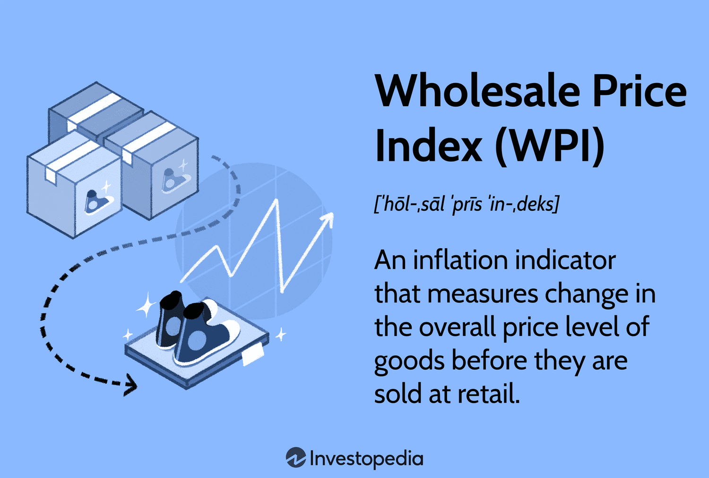

## Table of Contents

## What is the Wholesale Price Index (WPI)?

The Wholesale Price Index (WPI) is a measure that shows how the prices of goods change over time before they reach stores. It looks at the prices that businesses pay for things like raw materials, semi-finished goods, and finished products. Governments and economists use the WPI to understand inflation, which is when prices go up, and to make decisions about the economy.

The WPI is important because it helps us see trends in the economy before these changes affect what consumers pay in stores. For example, if the WPI goes up, it might mean that prices in stores will go up soon too. By keeping an eye on the WPI, governments can try to control inflation and make sure the economy stays stable.

## Why is the WPI important for the economy?

The WPI is important for the economy because it helps us understand how prices are changing before they reach the stores. It looks at the prices that businesses pay for things they need to make products. If the WPI goes up, it means businesses are paying more for these things, and this might lead to higher prices for consumers later. By watching the WPI, governments and economists can see if inflation is coming and plan what to do about it.

Knowing the WPI also helps businesses make better decisions. If they see the WPI going up, they might decide to buy more materials now before prices go up even more. This can help them keep their costs down and their prices stable. Governments can use the WPI to make policies that help keep the economy balanced, like changing interest rates or controlling the money supply. So, the WPI is a key tool for keeping the economy healthy and stable.

## How is the WPI different from the Consumer Price Index (CPI)?

The Wholesale Price Index (WPI) and the Consumer Price Index (CPI) both measure how prices change over time, but they look at different parts of the economy. The WPI focuses on the prices that businesses pay for things like raw materials and goods before they reach the stores. This helps us see how prices are changing at the beginning of the supply chain. On the other hand, the CPI looks at the prices that consumers pay for things they buy, like food, clothes, and services. This gives us a picture of how inflation is affecting everyday people.

Another big difference is what each index tells us about the economy. The WPI can give early warnings about inflation because it shows price changes before they hit the stores. This can help businesses and governments plan ahead. The CPI, however, shows how inflation is already affecting consumers. It's important for understanding how people's cost of living is changing and can influence decisions about things like wages and social security benefits. Both indexes are useful, but they give us different pieces of the economic puzzle.

## What are the main components used to calculate the WPI?

The Wholesale Price Index (WPI) is made up of different things that businesses buy. These include raw materials like cotton or oil, semi-finished goods that are part way through being made, and finished products that are ready to sell. Each of these parts is important because they help show how prices are changing at different steps in making things.

To figure out the WPI, people look at the prices of these different things and see how they change over time. They give more importance to things that businesses buy a lot of, so if the price of oil goes up a lot, it will have a bigger effect on the WPI than if the price of a less used item goes up. This way, the WPI shows a good picture of how prices are changing for businesses.

## How frequently is the WPI calculated and published?

The Wholesale Price Index (WPI) is calculated and published every month. This means that once a month, people gather all the price information and work out how the WPI has changed.

By doing this every month, businesses and governments can keep a close eye on how prices are changing. It helps them see trends quickly and make decisions based on the latest information.

## What is the base year in WPI calculation and why is it important?

The base year in WPI calculation is a specific year that is used as a reference point to compare price changes over time. For example, if the base year is 2011-12, all the prices used to calculate the WPI in future years will be compared to the prices in 2011-12. This helps us see how much prices have gone up or down since that year.

The base year is important because it gives us a starting point to measure inflation. If we change the base year, it can make the WPI numbers look different, even if the actual prices haven't changed. This is why choosing and updating the base year is important, so that the WPI stays a good and accurate measure of how prices are changing for businesses.

## How are the weights assigned to different commodities in the WPI basket?

The weights assigned to different commodities in the WPI basket are based on how much businesses spend on each type of item. For example, if businesses spend a lot of money on oil, then oil will have a bigger weight in the WPI. This means that if the price of oil changes, it will have a bigger effect on the WPI than if the price of something businesses don't spend as much on changes.

To figure out these weights, people look at how much money businesses spend on different things over a certain period of time, usually the base year. They use this information to decide how important each commodity is in the WPI. This way, the WPI can show a good picture of how prices are changing for businesses, focusing more on the things that matter most to them.

## What is the formula used to calculate the WPI?

The formula used to calculate the Wholesale Price Index (WPI) is pretty straightforward. You take the current prices of all the items in the WPI basket, multiply each price by its weight, and then add up all those numbers. This gives you the total value for the current period. Then, you do the same thing for the base year, finding the total value of all the items in the basket during that year. To get the WPI, you divide the current total value by the base year total value and then multiply by 100. The formula looks like this: WPI = (Current Total Value / Base Year Total Value) * 100.

This method helps us see how much prices have changed since the base year. If the WPI is more than 100, it means prices have gone up since the base year. If it's less than 100, prices have gone down. By using weights, the WPI gives more importance to things that businesses spend a lot on, making sure the index shows a good picture of how prices are changing for them.

## How does the WPI influence monetary policy decisions?

The Wholesale Price Index (WPI) helps people who make money decisions for a country, like central bankers. When they see the WPI going up, it means that the prices businesses are paying for things are getting higher. This can be a sign that inflation, which is when prices go up over time, is coming. If inflation is coming, the people in charge might decide to make changes to control it. They might raise interest rates, which is the cost of borrowing money, to slow down spending and keep prices from going up too fast.

By watching the WPI, these decision-makers can act before high prices affect what people pay in stores. They can use the WPI to plan ahead and make the economy more stable. For example, if the WPI shows that prices for important things like oil are going up a lot, the government might take steps to make sure this doesn't cause big problems later. This way, the WPI helps keep the economy running smoothly by giving early warnings about changes in prices.

## What are the limitations and criticisms of using WPI as an inflation measure?

One big problem with using the WPI to measure inflation is that it only looks at the prices that businesses pay, not what people pay in stores. This means it might not show the whole picture of how inflation is affecting everyday life. For example, if the WPI goes up but the prices in stores don't change much, people might not feel like inflation is a problem even though businesses are feeling it. Also, the WPI doesn't include services, like haircuts or doctor visits, which are a big part of what people spend money on. This can make the WPI less useful for understanding how inflation affects everyone.

Another criticism is that the WPI can be affected by changes in taxes and subsidies. If the government changes taxes on things like oil, it can make the WPI go up or down a lot, even if the actual cost of making things hasn't changed. This can make the WPI a bit confusing because it might not always show the real changes in prices. Plus, the weights used in the WPI are based on what businesses spend in the base year, which might not stay the same over time. If businesses start spending more on different things, the WPI might not show the right picture of how prices are changing.

## How has the methodology of calculating WPI evolved over time?

The way we calculate the Wholesale Price Index (WPI) has changed over the years to make it better at showing how prices are changing for businesses. In the past, the WPI used to be based on a smaller number of items and the weights for these items were not always updated regularly. This meant that the WPI might not have shown a very accurate picture of how prices were changing. But over time, the list of items in the WPI basket has grown to include more things that businesses buy, like new kinds of technology or materials. Also, the weights given to different items are now updated more often to make sure they still match what businesses are spending their money on.

Now, the WPI is calculated using a more detailed and updated method. Instead of just looking at the prices of a few big items, the WPI now includes prices for a lot more things, and it tries to cover all the different kinds of things businesses buy. The base year, which is the year we compare all other years to, is also changed more often to keep the WPI up to date. This helps make sure the WPI is a good tool for understanding how prices are changing for businesses. By making these changes, the WPI has become a more reliable way to see how inflation is affecting the economy.

## Can you provide a case study where WPI significantly impacted economic policy?

In 2010, India saw a big jump in the Wholesale Price Index (WPI). This was because the prices of things like food and oil were going up a lot. The government and the central bank, which is called the Reserve Bank of India (RBI), were worried about this because it could mean that inflation was coming. Inflation is when prices go up over time, and if it gets too high, it can cause problems for the economy. So, they decided to do something about it. The RBI raised the interest rates, which is the cost of borrowing money, to try to slow down spending and keep prices from going up too fast. This was a big change in policy that was made because of what the WPI was showing.

The decision to raise interest rates helped to cool down the economy a bit. People and businesses started borrowing less money because it was more expensive, and this meant they were spending less too. Over time, this helped to bring the WPI down and keep inflation under control. The case of India in 2010 shows how the WPI can be a really important tool for making decisions about the economy. By watching the WPI, the government and the RBI were able to act quickly and stop inflation from getting out of hand. This helped keep the economy stable and made life easier for businesses and people.

## What is the Wholesale Price Index (WPI)?

The Wholesale Price Index (WPI) is a crucial economic indicator that measures the average change in prices of goods at the wholesale level. Unlike retail prices, which consumers encounter directly, wholesale prices are determined before goods reach the retail market, capturing the cost changes for producers. This makes WPI an essential tool for understanding the economic landscape and inflationary trends at the production stage.

WPI primarily includes the prices of commodities and intermediate goods, which are fundamental in the production process. These goods serve as primary inputs for producing consumer goods and can include raw materials such as metals, chemicals, and agricultural products. By focusing on these, the WPI provides insights into inflationary pressures that might eventually translate into higher consumer prices.

For a comprehensive grasp, it's imperative to differentiate WPI from the Consumer Price Index (CPI). While WPI measures price changes at the wholesale level, CPI tracks the average change in prices from the consumer's perspective. The CPI includes service sector prices, which the WPI traditionally excludes. This distinction means that CPI is often more reflective of the cost-of-living changes experienced by households, whereas WPI offers a window into producer-side cost pressures.

Given this disparity, the selection of goods and the weighting system also varies between the two indices. WPI emphasizes goods heavily traded in the wholesale market, whereas CPI incorporates goods and services that are part of the consumer basket. Consequently, changes reflected in these indices may not always move in tandem and can even indicate different inflationary trends.

Numerically, the WPI can be expressed through a Laspeyres price index formula, which can be represented as:

$$
\text{WPI} = \frac{\sum (p_{t} \times q_{0})}{\sum (p_{0} \times q_{0})} \times 100
$$

where $p_{t}$ and $p_{0}$ denote the price of commodity in the current and base periods, respectively, and $q_{0}$ indicates the quantity of the base period, reflecting the index's reliance on base year quantities.

Understanding WPI provides valuable insights for economists, businesses, and policymakers in assessing the upstream inflationary forces within the economy.

## How is the WPI Calculated?

The Wholesale Price Index (WPI) is calculated by aggregating the price changes of a selected basket of commodities, which represent the economic activities of a country. This calculation involves two main steps: selecting the basket of commodities and assigning appropriate weights to each item based on its economic significance.

**Selection of Commodities**: 
The first step involves identifying and selecting a set of representative goods. These goods typically include raw materials, intermediate goods, and finished goods sold at the wholesale level. The basket is chosen to approximate a country's production and consumption patterns, ensuring that it reflects the economic structure accurately. For instance, in an industrialized nation, the basket might include a higher proportion of manufactured goods, whereas an agricultural country might have a basket heavily weighted towards primary agricultural products.

**Assigning Weights**:
Once the basket is selected, each commodity is assigned a weight. The weights reflect the relative importance of each item in the country's economy. Generally, these weights are derived from the value of the commodities' total output or sales. For example, if a particular commodity accounts for 10% of the total output value within the basket, it would be assigned a corresponding weight in the index calculation.

**Mathematical Formula**:
The calculation of the WPI uses a weighted average formula. The Laspeyres price index formula is commonly employed, which is expressed as:

$$
\text{WPI} = \frac{\sum (P_t \times Q_0 \times W)}{\sum (P_0 \times Q_0 \times W)} \times 100
$$

Where:
- $P_t$ is the price of the commodity in the current period.
- $P_0$ is the price of the commodity in the base period.
- $Q_0$ is the quantity of the commodity in the base period.
- $W$ is the weight assigned to the commodity.

This formula effectively calculates the proportionate change in prices from the base period to the current period, weighted by the economic significance of each commodity.

**Example Calculation**:
Consider a simplified basket of three commodities: A, B, and C, with respective weights of 0.5, 0.3, and 0.2. If the base period prices are $P_0 = [10, 20, 30]$ and the current period prices are $P_t = [12, 22, 28]$, the calculation would proceed as follows:

$$
\text{WPI} = \frac{(12 \times 0.5) + (22 \times 0.3) + (28 \times 0.2)}{(10 \times 0.5) + (20 \times 0.3) + (30 \times 0.2)} \times 100
$$

$$
\text{WPI} = \frac{6 + 6.6 + 5.6}{5 + 6 + 6} \times 100 = \frac{18.2}{17} \times 100 \approx 107.06
$$

Thus, the WPI indicates a 7.06% increase in wholesale prices since the base period.

This calculated index provides vital insights into inflationary trends at the production level, which can guide decisions in areas such as monetary policy and business strategy.

## References & Further Reading

[1]: ["Wholesale Price Index (WPI): Meaning, Calculation, and Importance"](https://www.investopedia.com/terms/w/wpi.asp) - Economics Discussion.

[2]: Bureau of Labor Statistics. ["Producer Price Indexes"](https://www.bls.gov/pPI/) - U.S. Department of Labor.

[3]: Lopez de Prado, M. (2018). ["Advances in Financial Machine Learning"](https://www.amazon.com/Advances-Financial-Machine-Learning-Marcos/dp/1119482089). Wiley.

[4]: Office of the Economic Adviser, Government of India. ["Wholesale Price Index (WPI)"](https://eaindustry.nic.in/) - Ministry of Commerce and Industry.

[5]: Jansen, S. (2020). ["Machine Learning for Algorithmic Trading"](https://github.com/stefan-jansen/machine-learning-for-trading). Packt Publishing.

[6]: Bank of Japan. ["Price Indexes – CGPI"](https://www.boj.or.jp/en/statistics/pi/cgpi_release/index.htm) - Bank of Japan.

[7]: Chan, E. P. (2008). ["Quantitative Trading: How to Build Your Own Algorithmic Trading Business"](https://github.com/ftvision/quant_trading_echan_book). Wiley.

[8]: Aronson, D. R. (2006). ["Evidence-Based Technical Analysis: Applying the Scientific Method and Statistical Inference to Trading Signals"](https://www.amazon.com/Evidence-Based-Technical-Analysis-Scientific-Statistical/dp/0470008741). Wiley.

[9]: Bardenet, R., et al. (2011). ["Algorithms for Hyper-Parameter Optimization."](https://dl.acm.org/doi/10.5555/2986459.2986743) Advances in Neural Information Processing Systems 24.