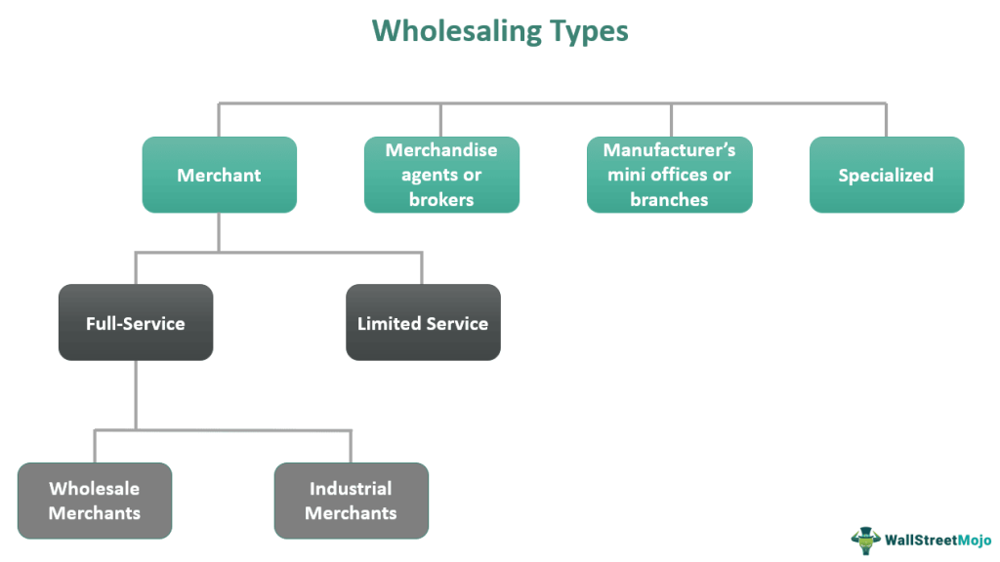

The world of commerce has evolved significantly with the advent of data-driven technologies, particularly in wholesale trade and algorithmic trading. This article explores the utilization of wholesale trade data to optimize commerce and enhance algorithmic trading strategies. Understanding the role of data and analytics in wholesale trade can provide businesses with significant competitive advantages. Insightful data from wholesale trade is instrumental in driving decision-making, improving operational efficiency, and enhancing strategic planning processes.

Wholesale trade data stands as a critical asset that offers a wealth of insights pivotal for informed business decisions. By analyzing this data, companies can refine inventory management, forecast trends, and adjust to market dynamics efficiently. Such strategic utilization not only propels organizational growth but also fortifies its market positioning.



Algorithmic trading, on the other hand, utilizes sophisticated algorithms to execute trades at optimal times, thereby maximizing profits and minimizing losses. This form of trading relies heavily on the accuracy and timeliness of data to make swift and rational trading decisions. The integration of wholesale trade data into algorithmic trading systems allows traders to harness real-time information, thus executing trades with precision and timing that potentially enhances profitability.

This article will guide you through the nuances of wholesale trade data and its application in commerce-driven algorithmic trading. The intersection of data analytics in wholesale trade and algorithmic trading represents a rich area for exploration that can potentially redefine business strategies and trading operations in today's data-driven economy. Understanding these concepts is vital for businesses striving to maintain competitiveness and leverage data for sustained success.

## Table of Contents

## What is Wholesale Trade?

Wholesale trade involves selling goods in large quantities to entities such as retailers, institutions, or other businesses rather than directly to consumers. This sector is a substantial component of the economy, contributing significantly to overall business sales and inventories. It serves as a barometer for economic health, offering valuable insights into consumer trends and market potential.

Wholesale trade acts as a link between manufacturers and the market, facilitating the distribution of goods further along the supply chain. Companies engaged in wholesale trade purchase products directly from manufacturers or other intermediaries and resell them to retailers or other commercial buyers at a markup. This process ensures that products are readily available in markets and stores, ultimately reaching the end consumer.

The data generated from wholesale trade is crucial for businesses as it aids in inventory management, identifying sales trends, and anticipating market shifts. By analyzing wholesale trade data, businesses can optimize their inventory levels to meet consumer demand without overstocking, leading to improved operational efficiency and cost reductions. Moreover, understanding sales trends through this data helps companies in making informed decisions regarding product offerings and market expansion strategies, aligning them more closely with consumer demand and preferences.

In addition, wholesale trade data can reveal potential market shifts by highlighting changes in purchasing patterns or demand for specific products. This information allows businesses to stay ahead of market trends, adjust their strategies proactively, and maintain a competitive edge. By leveraging the insights provided by wholesale trade data, businesses can enhance their strategic planning and ensure a responsive approach to an ever-evolving marketplace.

## Importance of Data in Wholesale Trade

Data is integral to wholesale trade, significantly aiding businesses in refining their operations and making strategic decisions. By harnessing accurate data, businesses can optimize inventory levels, thereby reducing excess stock and minimizing stockouts. This optimization process not only increases efficiency but also ensures that capital is not unnecessarily tied up in inventory.

Moreover, data plays a pivotal role in improving supply chain management. By analyzing transactional data and logistical metrics, businesses can better coordinate with suppliers and distributors, thus mitigating delays and enhancing the overall supply chain process. For example, real-time data analytics can be used to predict disruptions, allowing companies to proactively adjust their operations to maintain flow efficiency.

Understanding consumer demand is another critical application of data. By analyzing sales trends and customer preferences, businesses can adjust their product offerings and marketing strategies to align more closely with market expectations. This responsiveness to consumer behavior fosters customer satisfaction and loyalty.

Accurate data also underpins effective strategic planning and forecasting. By leveraging historical data and employing statistical techniques, businesses can formulate predictive models that anticipate future sales trends and demand fluctuations. These models assist in budget planning and resource allocation, thereby supporting sustainable growth.

In conclusion, data is a powerful enabler for wholesale trade, providing insights that drive operational excellence and market responsiveness. By effectively harnessing data, businesses can not only improve their operational efficiency but also enhance customer satisfaction and gain a competitive edge in the marketplace.

## Utilizing Wholesale Trade Data in Commerce

Wholesale trade data is a fundamental asset for businesses seeking to optimize their commercial practices. This data is acquired through various channels such as surveys, transaction records, and comprehensive market research. An effective utilization of wholesale trade data can significantly impact supply chain efficiency, amplify marketing strategies, and refine pricing policies.

Optimizing supply chain efficiency is one of the primary benefits of leveraging wholesale trade data. By analyzing transaction records and inventory flow, businesses can streamline their supply chains to reduce waste and minimize costs. Knowing what inventory levels are optimal can prevent overstocking and stockouts, thereby improving the overall logistical processes.

Marketing strategies also benefit immensely from the insights derived from wholesale trade data. By examining data trends over time, businesses can identify emerging market opportunities and adjust their marketing efforts accordingly. For example, if data reveals a rising demand for a product in a specific region, targeted marketing campaigns can be deployed to capture market attention and increase sales.

Pricing strategy is another critical area where wholesale trade data proves invaluable. Through data analysis, businesses can determine the price elasticity of demand for their products and adjust prices to maximize revenue. For instance, if the data suggests that a slight decrease in price could lead to a substantial increase in sales [volume](/wiki/volume-trading-strategy), businesses can make informed pricing adjustments to enhance profitability.

Analytical tools like data visualization and predictive analytics play a pivotal role in extracting actionable insights from wholesale trade data. Data visualization helps in quickly identifying patterns and anomalies that might not be immediately evident. Predictive analytics, on the other hand, involves using statistical algorithms and [machine learning](/wiki/machine-learning) techniques to forecast future market trends. This foresight allows businesses to proactively prepare for potential shifts in demand and adjust their strategies accordingly.

Integrating wholesale data into broader business strategies confers a competitive edge and fosters operational excellence. Companies that leverage this data effectively can outmaneuver competitors by being more responsive to market changes and customer needs. The synergy between data-driven decision-making and strategic planning cultivates an environment where businesses thrive on efficiency, innovation, and adaptability.

## Algorithmic Trading and Wholesale Data

Algorithmic trading employs sophisticated algorithms to execute trades based on comprehensive data analyses, thereby optimizing trading outcomes. This method is highly dependent on the availability and accuracy of data. Wholesale trade data serves as a pivotal resource in this context, offering real-time insights that allow for executing transactions at the most advantageous times. The immediacy and precision of wholesale data make it a valuable asset for [algorithmic trading](/wiki/algorithmic-trading), which seeks to capitalize on fleeting market opportunities that might be invisible to traditional trading methods.

The integration of wholesale data into algorithmic trading frameworks facilitates rapid decision-making. By utilizing updated market data, trading algorithms can adjust strategies on-the-fly, responding to market fluctuations effectively and efficiently. This capability is crucial in mitigating risks associated with volatile markets, as real-time data enables the fine-tuning of trading tactics, enhancing the ability to manage and forecast market trends accurately.

Additionally, algorithmic trading systems draw immense benefit from the continuous influx of data inputs. The adaptability of trading strategies hinges on this constant stream of information, allowing systems to iterate and refine their operations dynamically. This persistence in data flow leads to the development of more resilient and responsive trading algorithms, which are essential in maintaining a competitive edge in the fast-paced world of trading.

Python, widely used in developing algorithmic trading systems, facilitates the processing and analysis of large datasets. By employing libraries such as NumPy, pandas, and Scikit-learn, traders can implement machine learning models to predict market trends and make informed trading decisions. Python's data handling and computational capabilities make it an invaluable tool in maximizing the potential of wholesale trade data in algorithmic trading.

```python
import pandas as pd
from sklearn.linear_model import LinearRegression

# Load and prepare wholesale data
data = pd.read_csv('wholesale_data.csv')
X = data[['market_volume', 'price_fluctuation']].values
y = data['predicted_gain'].values

# Fit a model for predictions
model = LinearRegression()
model.fit(X, y)

# Predict potential gains
predicted_gains = model.predict([[1000, 0.05]])
print(f"Predicted gain: {predicted_gains[0]}")
```

This code snippet demonstrates using Python to predict potential trading gains, utilizing wholesale market volume and price fluctuation data. Such integrations of wholesale trade data into algorithmic trading systems underscore the growing importance and applicability of data-driven decision-making in achieving trading efficiency and profitability.

## Challenges in Data Management

Managing data in wholesale trade presents a series of significant challenges, predominantly revolving around data accuracy, privacy, and integration. Addressing these challenges is essential to maintaining the integrity and utility of data, which in turn fosters trust and supports informed decision-making.

Data accuracy forms the cornerstone of reliable data management. Inaccurate data can lead to poor decision-making and misplaced strategies. Ensuring data integrity involves regular validation and cleansing processes to rectify inconsistencies and errors in datasets. Techniques like data reconciliation, which compares two sets of records to ensure they match, are critical. For example, Python offers robust libraries such as `pandas` that provide functions for data cleaning and validation, minimizing errors and enhancing accuracy.

Data privacy remains a pressing concern, with the growing volume of data collected and processed by wholesale trade businesses. It is imperative to secure sensitive information against breaches and unauthorized access. Compliance with regulations such as the General Data Protection Regulation (GDPR) requires businesses to implement stringent security protocols. This entails encryption techniques, access controls, and auditing processes to ensure data confidentiality. Implementing secure data storage solutions and using software tools like `OpenSSL` for encryption are standard practices.

Integration of diverse data sources poses another challenge in wholesale trade data management. Data often originates from various systems, including transaction records, sales logs, and supplier databases, making seamless integration a complex task. To address this, businesses must adopt interoperable data standards and utilize data integration platforms. These platforms, like Apache Kafka or Talend, facilitate the smooth flow and consolidation of information from disparate sources, thus enabling a unified view of data.

Effective data governance frameworks are pivotal for managing these challenges. Establishing clear policies and procedures for data handling, including roles and responsibilities for data stewardship, supports transparency and efficiency. Data governance ensures that data is accessible, yet secure, promoting a culture of responsible data use within organizations. This holistic approach not only enhances data quality and protects privacy but also ensures compliance with legal and ethical standards.

In conclusion, overcoming the challenges associated with data management in wholesale trade requires a multifaceted strategy focusing on accuracy, security, and integration. By investing in robust data governance and employing advanced technological solutions, businesses can significantly enhance their data management capabilities, thereby leveraging data to its fullest potential for strategic advantage.

## Conclusion

Wholesale trade data serves as a vital resource for businesses aiming to optimize their operational efficiencies and strengthen their market positions. Through the effective use of this data, companies can refine commerce strategies, leading to improved supply chain management and enhanced pricing tactics. Concurrently, algorithmic trading, which relies heavily on real-time data inputs, benefits from the actionable insights provided by wholesale trade data, allowing for smarter decision-making that maximizes profits and minimizes losses.

In a rapidly evolving data-driven marketplace, the ability to understand and leverage wholesale trade data will be crucial for business success. The data provides a comprehensive view of market dynamics, allowing businesses to anticipate market shifts and efficiently manage inventories. This level of insight not only aids in immediate decision-making but also supports long-term strategic planning and forecasting.

The ongoing digital transformation highlights the importance of data analytics in extracting valuable insights from wholesale trade data. By employing analytical tools and techniques, businesses can identify patterns, predict consumer behavior, and tailor their strategies to meet emerging market needs. This capability places companies in a strong position to respond to competitive pressures and capitalize on newfound opportunities.

As commerce continues to intersect with technological advancements, the future hinges on the capacity to analyze data and translate it into strategic advantages. Businesses that harness wholesale trade data effectively will find themselves at the forefront of innovation, driving growth and achieving sustained success in a competitive landscape.

## References & Further Reading

[1]: Bergstra, J., Bardenet, R., Bengio, Y., & Kégl, B. (2011). ["Algorithms for Hyper-Parameter Optimization."](https://dl.acm.org/doi/10.5555/2986459.2986743) Advances in Neural Information Processing Systems 24.

[2]: ["Advances in Financial Machine Learning"](https://www.amazon.com/Advances-Financial-Machine-Learning-Marcos/dp/1119482089) by Marcos Lopez de Prado

[3]: ["Evidence-Based Technical Analysis: Applying the Scientific Method and Statistical Inference to Trading Signals"](https://www.amazon.com/Evidence-Based-Technical-Analysis-Scientific-Statistical/dp/0470008741) by David Aronson

[4]: ["Machine Learning for Algorithmic Trading"](https://github.com/stefan-jansen/machine-learning-for-trading) by Stefan Jansen

[5]: ["Quantitative Trading: How to Build Your Own Algorithmic Trading Business"](https://www.amazon.com/Quantitative-Trading-Build-Algorithmic-Business/dp/1119800064) by Ernest P. Chan