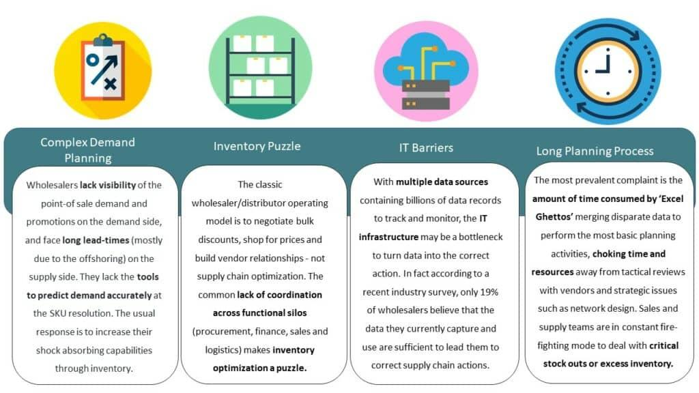

## Table of Contents

## What is wholesale trade?

Wholesale trade is when businesses buy large amounts of goods from manufacturers or producers and then sell those goods to other businesses, like retailers or other wholesalers. It's like a middle step between making the product and selling it to the final customer. Wholesalers often buy in bulk, which means they get a lower price per item, and then they sell those items in smaller amounts to other businesses.

This type of trade helps move goods from where they are made to where they are sold. Wholesalers can store goods, break them down into smaller units, and even transport them. This makes it easier for smaller retailers to get the products they need without having to buy directly from the manufacturer, which might be too expensive or complicated for them.

## How does data utilization benefit wholesale trade?

Data utilization in wholesale trade helps businesses make better decisions. By collecting and analyzing data, wholesalers can understand what products are popular, how much stock they need, and when to order more. This means they can keep just the right amount of goods in their warehouses, reducing waste and saving money. For example, if data shows that umbrellas sell more in the rainy season, a wholesaler can order more umbrellas before the rain starts.

Using data also helps wholesalers serve their customers better. They can track what each customer buys and suggest new products that might interest them. This can make customers happier and more likely to keep buying from the wholesaler. Plus, data can help wholesalers see trends and plan for the future. If they notice that more people are buying eco-friendly products, they can start offering more of those items. This way, they stay ahead of the competition and meet their customers' needs.

## What types of data are commonly used in wholesale trade?

In wholesale trade, businesses often use sales data to see what products are selling well and which ones are not. This helps them decide what to keep in stock and what to order more of. They also look at inventory data, which tells them how much of each product they have in their warehouses. By keeping track of this, they can make sure they have enough goods to meet customer demand without having too much sitting around.

Another important type of data is customer data. This includes information about who is buying what and how often they buy. Wholesalers use this to understand their customers better and offer them products they might like. They also use market trend data to see what is becoming popular or what might be a good product to start selling. This helps them stay ahead of the competition and keep their business growing.

## How can wholesalers collect relevant data?

Wholesalers can collect relevant data by using technology like computers and software. They can use special programs to keep track of what they sell and what they have in their warehouses. Every time they make a sale or get new stock, the information goes into the computer. This way, they can see all their sales and inventory data in one place. They can also use tools like barcode scanners to quickly add information about products as they come in or go out.

Another way to collect data is by talking to customers. Wholesalers can ask customers what they like and what they need. They can do this through surveys or by talking to them directly. This helps them understand what products are popular and what new items they might want to sell. They can also look at data from the internet, like social media or online reviews, to see what people are saying about their products and what trends are happening in the market. By combining all this information, wholesalers can make smart decisions about what to buy and sell.

## What are the basic tools for data analysis in wholesale trade?

Wholesalers use simple tools like spreadsheets to look at their data. Spreadsheets are like big tables where they can put in numbers about sales and inventory. They can use formulas to add up numbers, find averages, and see trends. This helps them understand what products are selling well and how much stock they need to keep.

Another tool they use is special software for business, called ERP systems. ERP stands for Enterprise Resource Planning. These systems help wholesalers keep track of everything from sales to inventory to customer information all in one place. They can see reports and graphs that make it easy to understand the data. This helps them make better decisions about what to buy and sell.

Some wholesalers also use simple data visualization tools. These tools turn numbers into pictures like charts and graphs. This makes it easier to see patterns and trends at a glance. By using these tools, wholesalers can quickly understand their data and make smart choices for their business.

## How can data help in inventory management for wholesalers?

Data helps wholesalers manage their inventory by showing them what products are selling and how fast they are selling. By looking at sales data, wholesalers can see which items are popular and need to be restocked often. They can also see which items are not selling well and might need to be ordered less. This way, they can keep just the right amount of stock in their warehouses, so they don't run out of popular items or have too much of slow-moving ones.

Using data also helps wholesalers plan for the future. They can look at trends over time to predict what products will be in demand in the coming months. For example, if data shows that sales of winter coats go up every November, wholesalers can order more coats in October to be ready. This kind of planning helps them avoid running out of stock during busy times and reduces the risk of having too much stock that doesn't sell.

## What role does data play in pricing strategies in wholesale trade?

Data helps wholesalers set the right prices for their products. By looking at sales data, they can see which items are selling well and which ones are not. If a product is very popular, they might raise the price a little because people are willing to pay more for it. On the other hand, if a product is not selling well, they might lower the price to make it more attractive to customers. This way, they can make sure their prices are fair and competitive.

Data also helps wholesalers understand what their competitors are doing. By looking at market data, they can see what prices other wholesalers are charging for similar products. This helps them decide if they need to adjust their own prices to stay competitive. For example, if another wholesaler is selling a product for less, they might need to lower their price to keep their customers. By using data, wholesalers can make smart pricing decisions that help them sell more and make more money.

## How can data analytics improve customer relationships in wholesale?

Data analytics helps wholesalers understand their customers better. By looking at what customers buy and how often they buy it, wholesalers can see what products are popular with each customer. This helps them suggest new products that the customer might like. For example, if a customer often buys sports equipment, the wholesaler can recommend new sports gear that just came in. This makes the customer feel special and more likely to keep buying from the wholesaler.

Using data also helps wholesalers solve problems quickly. If a customer has an issue with a product, the wholesaler can look at the data to see if other customers had the same problem. This helps them fix the issue faster and keep the customer happy. By using data to understand and meet their customers' needs, wholesalers can build stronger relationships and keep their customers coming back.

## What advanced data technologies are being adopted by wholesalers?

Wholesalers are starting to use advanced data technologies like big data and [machine learning](/wiki/machine-learning) to help them make better decisions. Big data lets them look at huge amounts of information from sales, inventory, and customers all at once. This helps them see patterns and trends that they might miss if they only looked at small pieces of data. Machine learning is a type of computer program that can learn from data and make predictions. For example, it can predict how much of a product will sell next month, so wholesalers can order just the right amount.

Another technology that wholesalers are using is the Internet of Things (IoT). IoT devices, like sensors in warehouses, can collect data about where products are and how they are being stored. This helps wholesalers keep track of their inventory in real-time and make sure everything is in the right place. By using these advanced technologies, wholesalers can work more efficiently, save money, and serve their customers better.

## How does predictive analytics influence decision-making in wholesale trade?

Predictive analytics helps wholesalers make better decisions by using data to guess what will happen in the future. It looks at past sales, inventory levels, and customer behavior to predict what products will be popular and how much stock to keep. For example, if predictive analytics shows that sales of sunscreen go up every summer, a wholesaler can order more sunscreen before the season starts. This way, they can make sure they have enough stock to meet demand without having too much left over.

Using predictive analytics also helps wholesalers plan their pricing and promotions. If the data predicts that a certain product will be in high demand, the wholesaler might raise the price a bit or offer special deals to attract more customers. This helps them make more money and stay ahead of the competition. By using predictive analytics, wholesalers can make smarter choices about what to buy, how much to buy, and how to price their products, which leads to better business results.

## What are the challenges of data utilization in wholesale trade?

One big challenge of using data in wholesale trade is keeping the data safe and private. Wholesalers have a lot of information about their customers and what they buy. If this data gets into the wrong hands, it could be bad for both the wholesaler and the customers. They need to use strong security to protect the data and make sure they follow the rules about how to use it. This can be hard and take a lot of time and money.

Another challenge is making sure the data is correct and useful. Sometimes, the data can have mistakes or be missing important information. If wholesalers use bad data to make decisions, they might make the wrong choices about what to buy and sell. They need to check their data carefully and fix any problems they find. This can be a lot of work, but it's important to make sure the data helps them make good decisions.

## How can wholesalers ensure data privacy and security in their operations?

Wholesalers can keep their data safe by using strong security measures. They should use passwords that are hard to guess and change them often. They can also use special software that watches for any strange activity on their computers and stops hackers from getting in. It's important to train everyone who works at the wholesaler about how to keep data safe. They should know not to share passwords or click on suspicious emails. By doing these things, wholesalers can protect their customers' information and keep their business running smoothly.

Another way to ensure data privacy is by following the rules about how to use and store data. There are laws that say what wholesalers can and can't do with customer information. They need to make sure they understand these laws and follow them carefully. This might mean only keeping the data they really need and getting rid of old data that they don't use anymore. By being careful with data and following the rules, wholesalers can build trust with their customers and avoid getting into trouble.

## References & Further Reading

[1]: Bergstra, J., Bardenet, R., Bengio, Y., & Kégl, B. (2011). ["Algorithms for Hyper-Parameter Optimization."](https://dl.acm.org/doi/10.5555/2986459.2986743) Advances in Neural Information Processing Systems 24.

[2]: ["Advances in Financial Machine Learning"](https://www.amazon.com/Advances-Financial-Machine-Learning-Marcos/dp/1119482089) by Marcos Lopez de Prado

[3]: ["Evidence-Based Technical Analysis: Applying the Scientific Method and Statistical Inference to Trading Signals"](https://www.amazon.com/Evidence-Based-Technical-Analysis-Scientific-Statistical/dp/0470008741) by David Aronson

[4]: ["Machine Learning for Algorithmic Trading"](https://github.com/stefan-jansen/machine-learning-for-trading) by Stefan Jansen

[5]: ["Quantitative Trading: How to Build Your Own Algorithmic Trading Business"](https://www.amazon.com/Quantitative-Trading-Build-Algorithmic-Business/dp/1119800064) by Ernest P. Chan