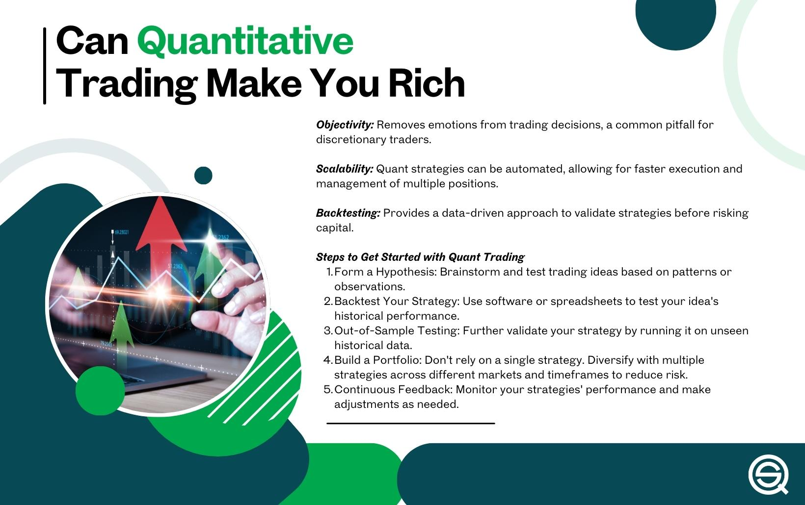

## Table of Contents

## What is quantitative trading?

Quantitative trading is a method of trading where decisions are made using mathematical models and computer programs. Instead of relying on human judgment, traders use numbers and data to decide when to buy or sell stocks, currencies, or other financial products. This approach helps to remove emotions from trading, which can often lead to mistakes.

In quantitative trading, traders collect a lot of data about the market, like prices, volumes, and other financial information. They then use this data to create models that can predict how the market might move in the future. These models are run on powerful computers that can quickly analyze large amounts of information and make trading decisions in a fraction of a second. This can give quantitative traders an advantage over those who trade manually.

## How does quantitative trading differ from traditional trading?

Quantitative trading and traditional trading are different in how they make decisions. In traditional trading, people use their experience and feelings to decide when to buy or sell. They might look at news, talk to other traders, and use their gut feeling. This means that traditional trading can be influenced a lot by emotions, which can sometimes lead to bad choices.

On the other hand, [quantitative trading](/wiki/quantitative-trading) uses math and computers to make decisions. Traders collect a lot of data about the market and use this data to create models that predict future market movements. These models are run on computers that can analyze the data very quickly and make trades without being influenced by emotions. This can help quantitative traders make more consistent and less risky decisions compared to traditional traders.

## What are the basic tools and technologies used in quantitative trading?

In quantitative trading, traders use a lot of different tools and technologies to help them make decisions. One of the main tools is a computer program called an algorithm. This program uses math to look at market data and decide when to buy or sell. Traders also use special software to collect and analyze data. This software can handle a lot of information very quickly, which is important because the market changes all the time.

Another important technology is a trading platform. This is a system that lets traders buy and sell things like stocks or currencies. The platform is connected to the market and can make trades very fast. Traders also use databases to store all the data they collect. These databases need to be fast and reliable because traders need to get the right information at the right time.

Lastly, many quantitative traders use something called high-frequency trading. This means they make a lot of trades very quickly, often in just a few seconds. To do this, they need very fast computers and a good internet connection. All these tools and technologies help quantitative traders make better decisions and trade more effectively.

## What are the advantages of quantitative trading over other trading methods?

Quantitative trading has some big advantages over other ways of trading. One of the main benefits is that it takes emotions out of the equation. When people trade based on feelings, they can make mistakes. But with quantitative trading, decisions are made using math and data, so there's less chance of making bad choices because of fear or excitement. This can lead to more consistent results and less risk.

Another advantage is speed. Quantitative trading uses computers that can look at a lot of information very quickly and make trades in just a few seconds. This is much faster than a person could do it. Being able to act fast can be a big advantage in the market, where prices can change in the blink of an eye. Plus, these computers can keep working all the time, so they can take advantage of opportunities even when people are sleeping or busy with other things.

Lastly, quantitative trading can handle a lot more data than a person could. Traders can collect information from all over the world and use it to make better predictions about the market. This means they can see patterns and trends that might be hard for a person to spot. By using all this data, quantitative traders can make smarter decisions and potentially make more money.

## How has the accessibility of data and technology influenced the rise of quantitative trading?

The rise of quantitative trading has been greatly helped by the fact that data and technology are now much easier to get. In the past, it was hard for traders to get all the information they needed to make good decisions. But now, with the internet, traders can quickly collect data from all over the world. This means they can see what's happening in different markets and use this information to make better predictions. Also, the cost of storing and analyzing data has gone down a lot, so even small traders can use big databases and powerful computers to help them trade.

Technology has also made a big difference. Computers are now much faster and can handle a lot more information than before. This means that traders can use complex math models to look at the data and make decisions in just a few seconds. Plus, there are now many software tools and platforms that make it easier for traders to set up and run their trading strategies. All these changes have made it possible for more people to try quantitative trading, which has helped it grow a lot in recent years.

## What educational background or skills are required to start in quantitative trading?

To start in quantitative trading, you usually need a strong background in math, [statistics](/wiki/bayesian-statistics), and computer science. Many people who work in this field have degrees in these subjects, often at the graduate level. You need to be good at understanding and working with numbers, because you'll be using math to create models that predict how the market will move. You also need to know how to program computers, because you'll be writing code to run these models and make trades.

Besides the technical skills, it's helpful to have some knowledge of finance and economics. This can help you understand how markets work and what affects prices. You don't need to be an expert, but having a basic understanding can make it easier to create good trading strategies. Also, being able to think critically and solve problems is important, because you'll need to figure out how to improve your models and adapt to changes in the market.

## How do regulatory changes impact the growth of quantitative trading?

Regulatory changes can have a big impact on how much quantitative trading grows. Sometimes, new rules can make it harder for traders to use certain strategies or get the data they need. For example, if a government makes new laws about how data can be used, it might be harder for traders to collect the information they need to make good predictions. Also, if there are new rules about how fast trades can be made, it might slow down high-frequency trading, which is a big part of quantitative trading.

On the other hand, some regulatory changes can help quantitative trading grow. If the rules make the market more open and fair, it can be easier for traders to get the data they need and make trades quickly. For example, if a government makes it easier to trade across borders, it can give traders more opportunities to use their skills and make money. So, the impact of regulatory changes can go both ways, depending on what the new rules are and how they affect the market.

## What are some common strategies used in quantitative trading?

One common strategy in quantitative trading is called statistical [arbitrage](/wiki/arbitrage). This means traders look for small differences in the prices of similar things, like stocks or currencies. They use math to figure out when these prices are likely to come back together, and then they buy the cheaper one and sell the more expensive one. The idea is to make a small profit from these price differences, and if they do it a lot of times, the profits can add up.

Another strategy is called [trend following](/wiki/trend-following). This is when traders use math to find patterns in how prices are moving. If they see that a price is going up, they might buy it, hoping it will keep going up. If they see a price going down, they might sell it, hoping it will keep going down. This strategy tries to make money by following the trends in the market.

A third strategy is mean reversion. This is based on the idea that prices will eventually go back to their average level. Traders use math to figure out when a price has moved too far away from its average, and then they bet that it will come back. If a price is too high, they might sell it, expecting it to go down. If a price is too low, they might buy it, expecting it to go up. This strategy tries to make money by betting that prices will return to normal.

## How do quantitative traders manage risk and optimize their trading algorithms?

Quantitative traders manage risk by using math to figure out how much they could lose on each trade. They set rules for how much they are willing to risk, and they use these rules to decide how much to buy or sell. They also use something called stop-loss orders, which automatically sell a stock if its price drops too much. This helps them limit their losses. Another way they manage risk is by spreading their money across different trades, so if one trade goes bad, it doesn't hurt them too much. They also keep an eye on the market all the time, so they can change their strategies if things start to go wrong.

To optimize their trading algorithms, quantitative traders are always testing and improving their math models. They use a lot of data to see how well their models are working, and they make changes to make them better. They also use something called [backtesting](/wiki/backtesting), where they run their models on old data to see how they would have done in the past. This helps them find problems and fix them before they start using the models for real. They also keep learning new things and trying new ideas, so they can keep their algorithms up to date with the latest trends in the market.

## What role do machine learning and artificial intelligence play in modern quantitative trading?

Machine learning and [artificial intelligence](/wiki/ai-artificial-intelligence) are becoming really important in modern quantitative trading. They help traders make better predictions about the market by finding patterns in big sets of data that people might miss. For example, [machine learning](/wiki/machine-learning) can look at a lot of information about stocks, like prices, news, and even social media posts, to figure out what might happen next. This can help traders make smarter decisions about when to buy or sell.

AI also helps traders by making their trading algorithms better. It can learn from past trades and adjust the algorithms to make them more accurate. This means that the algorithms can keep getting better over time, without traders having to do a lot of work. AI can also help with things like managing risk, by figuring out the best way to spread money across different trades. This can make trading safer and more profitable.

## How has the performance of quantitative trading strategies compared to traditional strategies in recent years?

In recent years, quantitative trading strategies have often done better than traditional strategies. This is because they use math and computers to make decisions, which can be more accurate and less influenced by emotions. For example, during times when the market is very up and down, quantitative strategies can quickly adjust to the changes and make trades that take advantage of these movements. Traditional traders might get scared or excited and make bad choices, but quantitative traders stick to their models and can make more consistent profits.

However, it's not always the case that quantitative strategies do better. Sometimes, the market can change in ways that the models don't expect, and this can lead to big losses. Also, because so many people are using quantitative trading now, it can be harder to find good opportunities. Traditional traders, who use their experience and gut feelings, can sometimes spot trends that the models miss. So, while quantitative trading has been very successful in recent years, it's not a sure thing, and it depends a lot on the specific strategies and market conditions.

## What are the future trends and potential challenges in the field of quantitative trading?

In the future, quantitative trading is likely to keep growing because of new technology and more data. Machine learning and artificial intelligence will become even more important. They will help traders make better predictions and find new ways to make money. Also, more people will be able to use quantitative trading because the tools and data are getting cheaper and easier to use. This means that even small traders can use the same strategies as big banks and hedge funds.

But there will also be challenges. One big challenge is that the market is getting more crowded. With so many people using the same strategies, it can be harder to make money. Also, new rules from governments might make it harder to use certain data or make trades quickly. Another challenge is that the market can change in ways that the models don't expect. This can lead to big losses if traders are not careful. So, while the future looks bright for quantitative trading, traders will need to keep learning and adapting to stay ahead.

## References & Further Reading

[1]: ["Quantitative Trading: How to Build Your Own Algorithmic Trading Business"](https://www.amazon.com/Quantitative-Trading-Build-Algorithmic-Business/dp/0470284889) by Ernest P. Chan

[2]: ["Advances in Financial Machine Learning"](https://www.amazon.com/Advances-Financial-Machine-Learning-Marcos/dp/1119482089) by Marcos Lopez de Prado

[3]: ["Evidence-Based Technical Analysis: Applying the Scientific Method and Statistical Inference to Trading Signals"](https://www.wiley.com/en-gb/Evidence+Based+Technical+Analysis:+Applying+the+Scientific+Method+and+Statistical+Inference+to+Trading+Signals-p-9780470008744) by David Aronson

[4]: ["Machine Learning for Algorithmic Trading"](https://www.amazon.com/Machine-Learning-Algorithmic-Trading-intelligence/dp/9918608013) by Stefan Jansen

[5]: ["The Man Who Solved the Market: How Jim Simons Launched the Quant Revolution"](https://www.amazon.com/Man-Who-Solved-Market-Revolution/dp/073521798X) by Gregory Zuckerman