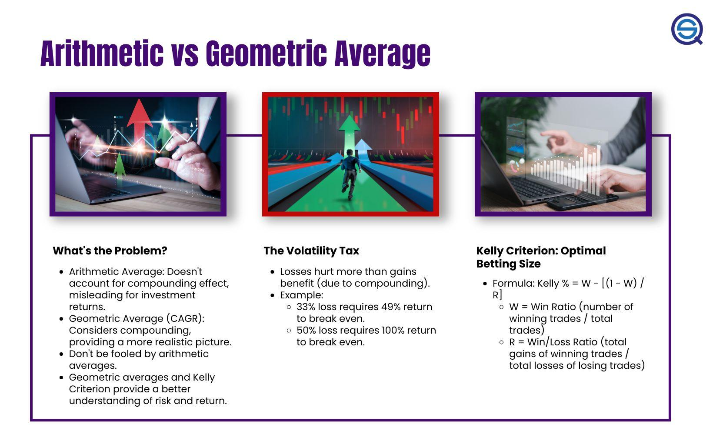

## Table of Contents

## What is an arithmetic average and how is it calculated?

An arithmetic average, often just called an average, is a way to find the middle value of a set of numbers. It's like finding a balance point for all the numbers you have. To calculate it, you add up all the numbers in your set and then divide by how many numbers there are. For example, if you have the numbers 2, 4, and 6, you add them up to get 12, and then divide by 3 (because there are 3 numbers) to get an average of 4.

This method is very useful in everyday life. You might use it to find out your average score on tests, or to figure out the typical amount of rainfall in a month. It gives you a single number that represents the whole group of numbers, making it easier to understand and work with data. Just remember, the more numbers you have, the more accurate your average will be.

## What is a geometric average and how is it calculated?

A geometric average, or geometric mean, is a way to find a middle value of a set of numbers, but it's different from the arithmetic average. Instead of adding up the numbers, you multiply them together. Once you've multiplied all the numbers, you take the nth root of that product, where n is the number of values you started with. For example, if you have the numbers 2, 4, and 8, you multiply them to get 64. Since there are 3 numbers, you take the cube root of 64, which is 4. So, the geometric average of 2, 4, and 8 is 4.

This kind of average is really useful when you're dealing with things that grow or change over time, like population growth or investment returns. It's better than the arithmetic average for these situations because it takes into account the effect of compounding. If you're looking at the growth rate of something over several years, the geometric average will give you a more accurate picture of the typical growth rate. It's a bit trickier to calculate than the arithmetic average, but it's worth it for the right kind of data.

## Why are arithmetic and geometric averages important in trading and investing?

Arithmetic and geometric averages are important in trading and investing because they help us understand how well our investments are doing over time. The arithmetic average is simple to calculate and gives us a quick idea of the average return on our investments. For example, if we made 10% one year, lost 5% the next, and then made 8% the year after, the arithmetic average would be (10% - 5% + 8%) divided by 3, which equals about 4.33%. This tells us the average yearly return, which can be useful for quick comparisons.

However, the geometric average is more accurate for understanding the growth of our investments over time because it takes into account the effect of compounding. Using the same example, the geometric average would be calculated by multiplying (1 + 0.10) * (1 - 0.05) * (1 + 0.08), which equals about 1.127, and then taking the cube root of that number to get about 1.041, or a 4.1% average annual growth rate. This number is lower than the arithmetic average because it reflects the impact of the loss in the second year on the overall growth. The geometric average is crucial for long-term investing because it gives a more realistic picture of how our money will grow over time.

## How do arithmetic and geometric averages differ in their approach to calculating returns?

Arithmetic and geometric averages use different ways to figure out the average return on investments. The arithmetic average adds up all the returns and then divides by how many there are. It's simple and gives you a quick idea of what the average return was each year. But, it doesn't take into account how each year's return affects the next year's growth. So, if you had a really good year followed by a bad year, the arithmetic average might make it look like you did better than you really did.

The geometric average, on the other hand, looks at how your money grows over time by taking into account the effect of compounding. Instead of adding up the returns, it multiplies them together. Then, it takes the nth root of that product, where n is how many years you're looking at. This gives you a more accurate picture of how your investment grows year after year. If you had a big loss one year, the geometric average would show how that loss affects your overall growth more clearly than the arithmetic average.

## Can you provide an example of how arithmetic and geometric averages can lead to different results in investment returns?

Let's say you invest $100 and in the first year, your investment grows by 50%, so you have $150. In the second year, your investment drops by 50%, so you're back to $75. If you use the arithmetic average to figure out your average yearly return, you add the 50% gain and the 50% loss, then divide by 2. That gives you an average return of 0% per year. It might seem like you broke even, but you actually ended up with less money than you started with.

Now, if you use the geometric average, you see a different picture. You take the first year's growth of 50%, which is a multiplier of 1.50, and the second year's drop of 50%, which is a multiplier of 0.50. You multiply these together to get 0.75, then take the square root (since there are two years) to find the geometric average. That gives you a yearly return of about -13.4%. This shows that your investment actually lost value each year on average, which matches what happened to your money better than the arithmetic average.

## In what scenarios would the arithmetic average be more appropriate for evaluating investment performance?

The arithmetic average can be more appropriate for evaluating investment performance when you want a quick and simple way to understand the average return over a short period. For example, if you're comparing the yearly returns of different investments over just one or two years, the arithmetic average gives you a straightforward number that's easy to calculate and understand. It's like getting a snapshot of how well each investment did on average each year.

However, the arithmetic average works best when the returns don't vary a lot from year to year. If the returns are pretty steady, the arithmetic average will give you a good idea of what to expect. But if the returns swing a lot, like having a big gain one year and a big loss the next, the arithmetic average might not show the real effect on your money over time. In those cases, the geometric average would be better because it takes into account how the returns compound over time.

## In what scenarios would the geometric average be more appropriate for evaluating investment performance?

The geometric average is more appropriate for evaluating investment performance when you want to understand how your money grows over a long time. It's great for looking at investments that have ups and downs because it shows how those changes affect your money over the years. If you're saving for retirement or planning to keep your money invested for many years, the geometric average will give you a better idea of what to expect. It takes into account the way your returns compound, which is really important for long-term investing.

For example, if you're looking at the performance of a stock or a mutual fund over several years, the geometric average will show you the true average growth rate of your investment. This is especially useful if the returns vary a lot from year to year. The geometric average will help you see the overall effect of those ups and downs on your money, giving you a more accurate picture of how well your investment is doing over time.

## How does the choice between arithmetic and geometric averages affect long-term investment planning?

When you're planning for the long term, like saving for retirement, the choice between using an arithmetic average and a geometric average can make a big difference. The arithmetic average is easy to figure out because you just add up all your yearly returns and divide by how many years you've been investing. But this way of calculating can make it seem like you're doing better than you really are, especially if your investment goes up and down a lot. If you plan based on the arithmetic average, you might think you'll have more money at the end than you actually will.

On the other hand, the geometric average is better for long-term planning because it shows how your money grows over time, taking into account the ups and downs of the market. It's a bit harder to calculate, but it gives you a more realistic picture of how your investment will perform over many years. If you use the geometric average to plan, you'll have a better idea of how much money you'll really have when you need it, helping you make smarter decisions about saving and investing for the future.

## What are the implications of using the wrong average type when assessing investment strategies?

Using the wrong type of average when looking at your investment strategies can lead to big mistakes. If you use the arithmetic average instead of the geometric average for long-term investments, you might think your money will grow faster than it really will. This could make you save less than you need to, thinking you'll have enough for your goals like retirement. But when you actually check your savings, you might find you don't have as much as you thought, because the arithmetic average doesn't show how losses can hurt your growth over time.

On the flip side, if you use the geometric average when the arithmetic average would be better, like for short-term or steady returns, you might think your investment is doing worse than it is. This could make you change your strategy too quickly or not take advantage of good opportunities. It's important to pick the right average so you can plan your investments correctly and make sure you're on track to meet your financial goals.

## How do compounding effects influence the difference between arithmetic and geometric averages in multi-period investments?

Compounding effects are really important when you're looking at how your investments grow over many years. The geometric average takes these effects into account, while the arithmetic average doesn't. When you use the geometric average, you see how each year's return affects the next year's growth. If you have a good year, that makes the next year's starting point higher, and if you have a bad year, it can make it harder to catch up. The geometric average shows you how these ups and downs play out over time, giving you a more accurate picture of your investment's growth.

The arithmetic average, on the other hand, just adds up all the yearly returns and divides by the number of years. It doesn't show how the returns build on each other. So, if you had a big gain one year and a big loss the next, the arithmetic average might make it seem like you're doing okay, but you might actually be losing money overall because of how compounding works. For long-term investments, using the geometric average is better because it helps you see the real impact of compounding on your money, making sure you have a clearer idea of how your investments will grow over time.

## What advanced statistical methods can be used to better understand the divergence between arithmetic and geometric averages in complex portfolios?

When you're dealing with a complex portfolio, you might want to use more advanced statistical methods to really understand how the arithmetic and geometric averages can be different. One method you can use is called Monte Carlo simulation. This method runs a lot of different scenarios to see how your investments might perform over time. It takes into account the ups and downs of the market and shows you how these changes can affect your money. By using Monte Carlo simulation, you can see how the compounding effects can make a big difference between the arithmetic and geometric averages, helping you plan better for the future.

Another useful method is bootstrapping. This method uses the data you already have from your investments to create new sets of data. It's like taking a lot of samples from your past returns to see how things might go in the future. Bootstrapping can help you understand how likely it is that your portfolio will grow in a certain way, showing you the range of possible outcomes. By using bootstrapping, you can get a better idea of how the arithmetic and geometric averages might differ in real life, and you can make more informed decisions about your investment strategy.

## How do professional investors and financial analysts typically decide between using arithmetic and geometric averages in their analyses?

Professional investors and financial analysts usually choose between arithmetic and geometric averages based on what they're trying to figure out and how long they're looking at. For short-term investments or when they want a quick and simple way to compare yearly returns, they often use the arithmetic average. It's easy to calculate and gives a straightforward idea of the average return each year. But if the returns don't change a lot from year to year, the arithmetic average works pretty well.

For long-term investments, though, financial analysts usually go with the geometric average. This is because it shows how the money grows over time, taking into account the ups and downs of the market. The geometric average is better for understanding how compounding affects your investment over many years. So, if you're saving for something like retirement, analysts will use the geometric average to make sure you have a realistic picture of how much money you'll have when you need it.

## What is the Definition of Arithmetic Mean?

The arithmetic mean is a fundamental concept in mathematics and statistics, representing the simple average of a set of numbers. It is calculated by summing all the values in a dataset and then dividing the total by the number of values. The arithmetic mean is expressed with the formula:

$$
\bar{x} = \frac{1}{n} \sum_{i=1}^{n} x_i
$$

where $\bar{x}$ is the arithmetic mean, $n$ is the number of values in the dataset, and $x_i$ are the individual values.

The simplicity of the arithmetic mean makes it a widely used measure for representing the central tendency of a dataset. It provides a straightforward way to understand the general level or benchmark of the data points by balancing out extreme values.

However, in the context of [algorithmic trading](/wiki/algorithmic-trading) and financial markets, the arithmetic mean has limitations. It does not account for the effects of compounding, which is critical in the assessment of investment performance over time. In trading, returns are typically realized through a sequence of multiplicative processes where each period's return builds upon the previous periods. Consequently, relying solely on the arithmetic mean can lead to an inaccurate representation of true investment performance.

For instance, consider a trading strategy evaluated over multiple periods with variable returns each period. The arithmetic mean will indicate a simple average return, which may suggest consistent growth, but it may not reflect the portfolio's value after accounting for compounding effects across those periods. This limitation of the arithmetic mean underscores the need for alternative measures, such as the geometric mean, which accounts for compounding and provides a more accurate picture of long-term investment results.

## What is the Geometric Mean and How is it Explained?

The geometric mean originates from [statistics](/wiki/bayesian-statistics) and is an essential tool in determining average rates of financial returns. It is calculated by taking the nth root of the product of a set of n values. Mathematically, the geometric mean $G$ for n values $x_1, x_2, \ldots, x_n$ is represented as:

$$

G = \left( \prod_{i=1}^{n} x_i \right)^{1/n} = (x_1 \times x_2 \times \ldots \times x_n)^{1/n} 
$$

In algo trading, the geometric mean is particularly advantageous because it accounts for the compounding of returns over time. Compounding is the process where the value of an investment increases exponentially rather than linearly, as each period's returns become the base for the subsequent periods' returns. Thus, the geometric mean provides a more realistic measure of an investment's average return when compared to the arithmetic mean.

While the arithmetic mean simply averages the returns without considering their sequence and compounding effects, the geometric mean evaluates the compounded growth rate of an investment. For example, if a trader experiences returns of 10%, 15%, and -5% over three periods, the geometric mean considers the effect of each return on the overall growth of the investment. Using Python, one might compute the geometric mean for such returns as follows:

```python
import numpy as np

returns = [1.10, 1.15, 0.95]
geometric_mean = np.prod(returns)**(1/len(returns)) - 1

print(f"Geometric Mean: {geometric_mean:.2%}")
```

This approach ensures that the investor recognizes how downturns or negative returns can significantly affect the overall performance of an asset. In trading contexts characterized by considerable fluctuations in returns, understanding the geometric mean becomes instrumental for traders to set practical expectations and evaluate strategy robustness. 

This method's comprehensive approach to averaging is particularly essential when assessing sequential investments and their cumulative effect, making the geometric mean not just a statistical tool but a strategic ally in financial decision-making.

## What are the differences between Arithmetic and Geometric Mean in a trading context?

In algorithmic trading, the distinction between arithmetic and geometric means significantly affects the perception of a strategy's performance, influencing both evaluations and risk assessments. The arithmetic mean, known for its simplicity, is calculated by summing a set of values and dividing by their number. This approach, however, can provide an overly optimistic view of an algorithmic trading strategy's outcomes. This optimism stems primarily from the arithmetic mean's inability to consider compounding effects, a critical [factor](/wiki/factor-investing) when evaluating returns over multiple periods.

For instance, consider a scenario where a trader records returns over three periods as +10%, -10%, and +10%. The arithmetic mean return is calculated as follows:

$$
\text{Arithmetic Mean} = \frac{10 + (-10) + 10}{3} = \frac{10}{3} \approx 3.33\%
$$

While the arithmetic mean suggests an average return of 3.33% per period, it does not account for the compounding effect of losses and gains over time. Enter the geometric mean, which provides a more realistic perspective by incorporating compounding into the analysis. The geometric mean is computed by multiplying the returns as factors (1 + return) and taking the nth root (for n periods). Using the same returns:

$$
\text{Geometric Mean} = \left((1 + 0.10) \times (1 - 0.10) \times (1 + 0.10)\right)^{\frac{1}{3}} - 1
$$

Calculating each step:

$$
= \left(1.10 \times 0.90 \times 1.10\right)^{\frac{1}{3}} - 1
= (1.089)^{\frac{1}{3}} - 1
\approx 1.0297 - 1 = 0.0297 \text{ or } 2.97\%
$$

The geometric mean of approximately 2.97% depicts a more accurate representation of the strategy's performance, factoring in the compounding of the sequences.

Choosing between these means is paramount for correctly evaluating a trading strategy's potential outcomes and risks. The arithmetic mean's lack of compounding consideration could mislead traders into underestimating risks, especially in volatile markets where large fluctuations can skew simple averages. In contrast, the geometric mean's integration of compounding effects offers a clearer view of long-term growth trends and risk exposures.

Thus, recognizing the implications of each mean helps traders and analysts formulate better strategies and make informed decisions, emphasizing the importance of aligning mathematical analytical methods with strategic trading objectives.

## What are some practical examples in algo trading?

The choice between arithmetic and geometric mean can significantly influence the interpretation of historical trade returns in algorithmic trading. Consider a situation where a series of trades yielded returns of +10%, -5%, +15%, and -10%. Calculating the arithmetic mean of these returns involves summing them up and dividing by the number of observations. This gives an arithmetic mean return of $\frac{10 - 5 + 15 - 10}{4} = \frac{10}{4} = 2.5\%$. Such a calculation might suggest an average positive performance per trade.

However, this result can be misleading because it neglects the cumulative effect of percentage returns. Instead, the geometric mean provides a more accurate assessment by accounting for compounding. To compute it, one multiplies the trade return factors (expressed as 1 plus the percentage return) and takes the nth root, where n is the number of returns. Thus, the geometric mean for the given returns is calculated as follows:

$$
\text{Geometric Mean} = \left( (1 + 0.10) \times (1 - 0.05) \times (1 + 0.15) \times (1 - 0.10) \right)^{\frac{1}{4}} - 1
$$

Substituting the values gives:

$$
\text{Geometric Mean} = (1.10 \times 0.95 \times 1.15 \times 0.90)^{\frac{1}{4}} - 1 \approx 1.0088 - 1 = 0.88\%
$$

This means the compounded average return per trade is approximately 0.88%, which is lower than the arithmetic mean. The geometric mean thus offers a realistic picture, especially over sequences involving high [volatility](/wiki/volatility-trading-strategies).

A practical case study highlights these differences: Consider an algorithmic trading strategy implemented during volatile market conditions, such as the 2008 financial crisis. Strategies evaluated using the arithmetic mean might inaccurately reflect positive performance due to intermittent high gains. On the other hand, when the geometric mean is employed, it accounts for the detrimental effect of negative returns and market volatility, offering insights into the strategy's robustness and highlighting potential long-term sustainability.

In real-world trading, sequences of returns are often non-linear and volatile. The "volatility tax," which is the erosion of returns through volatile swings, is effectively captured by the geometric mean, emphasizing its importance in evaluations. Through these examples, it becomes clear that relying solely on the arithmetic mean for performance assessments can lead to flawed strategic decisions. Instead, employing the geometric mean aligns quantitative evaluations with realistic expectations and strategic trading goals, emphasizing the importance of thoughtful statistical application in algorithmic trading.

## What is the impact of volatility and sequence of returns?

Volatility plays a significant role in differentiating between arithmetic and geometric mean outcomes in trading. The arithmetic mean does not account for the variability in data, offering a simple average that can significantly overestimate returns in volatile markets. This is because the arithmetic mean simply sums up returns and divides by the number of periods, disregarding the order and variability of those returns. In contrast, the geometric mean incorporates both compounding and the sequence of returns, providing a more accurate reflection of an investment's average growth rate.

The concept of 'volatility tax' elucidates the disparity caused by fluctuations. Volatility tax represents the reduction in compounding returns due to fluctuations in returns, highlighting that as volatility increases, the geometric mean will always be less than or equal to the arithmetic mean. This can be expressed mathematically as:

$$
\text{Geometric Mean} \leq \text{Arithmetic Mean} - \text{Volatility Tax}
$$

To further illustrate this, consider an investment with two years of returns: +50% and -50%. The arithmetic mean would indicate a 0% average return, yet this misleadingly suggests no growth or loss over the period. However, the geometric mean accurately accounts for the volatility tax, computing as:

$$
\text{Geometric Mean} = \sqrt{(1+0.5) \times (1-0.5)} - 1 = 0
$$

This results in a -25% return, revealing the investment's actual decline due to volatility.

Sequence of returns, or sequence risk, further explains the preference for geometric means. In algorithmic trading, even if two investments deliver the same average rate of return, the order in which different returns are realized can dramatically impact the final portfolio value. Early losses harm compounded returns more significantly than later ones. The geometric mean inherently factors in this sequence by reflecting the compound effect of returns, offering a more realistic assessment of performance across varying market conditions.

To put it simply, while arithmetic mean offers a straightforward computation approach, the geometric mean provides a deeper insight into actual performance over time, particularly under volatile market conditions. Its ability to reflect real compounded returns, considering both volatility and sequence of returns, makes it an indispensable tool for traders aiming for precision in evaluating their strategies.

## What is the conclusion about choosing the right mean?

In evaluating trading strategies, the geometric mean plays a pivotal role due to its ability to factor in compounding effects. This attribute makes it a superior tool when assessing the actual performance of algorithmic trading strategies. Unlike the arithmetic mean, which might overstate returns by simply averaging them, the geometric mean provides a more nuanced view by accounting for the compounded growth of investments. This distinction is crucial for traders aiming to align their strategies with realistic expectations.

For instance, consider a trading sequence with returns of -10%, 20%, and 15%. The arithmetic mean would suggest an average return of $\frac{-10 + 20 + 15}{3} = 8.33\%$. However, using the geometric mean, we calculate it as follows:

$$
(1 - 0.10) \times (1 + 0.20) \times (1 + 0.15)^{\frac{1}{3}} - 1 \approx 7.46\%
$$

This demonstrates how the geometric mean accounts for the sequence's compounding effects, offering a more accurate performance assessment.

Traders must consider both compounding and volatility impacts when evaluating trading performance. Volatility, or fluctuations in returns, can erode gains more significantly than a simple average might suggest. This erosion effect, sometimes referred to as the "volatility tax," underscores the importance of using the geometric mean, as it incorporates the order of returns and their compounded impact over time.

To align mathematical approaches with strategic trading goals, traders should integrate the geometric mean into their performance assessment frameworks. This integration supports informed decision-making, enabling traders to gauge their strategies' robustness accurately. By embracing the geometric mean, traders can better navigate the complexities of financial markets, potentially enhancing both strategy execution and risk management.

## References & Further Reading

[1]: ["Advances in Financial Machine Learning"](https://www.amazon.com/Advances-Financial-Machine-Learning-Marcos/dp/1119482089) by Marcos Lopez de Prado

[2]: ["Quantitative Trading: How to Build Your Own Algorithmic Trading Business"](https://books.google.com/books/about/Quantitative_Trading.html?id=j70yEAAAQBAJ) by Ernest P. Chan

[3]: ["Evidence-Based Technical Analysis: Applying the Scientific Method and Statistical Inference to Trading Signals"](https://www.amazon.com/Evidence-Based-Technical-Analysis-Scientific-Statistical/dp/0470008741) by David Aronson

[4]: ["The Mathematics of Financial Derivatives: A Student Introduction"](https://books.google.com/books/about/The_Mathematics_of_Financial_Derivatives.html?id=HAQgAwAAQBAJ) by Paul Wilmott, Sam Howison, and Jeff Dewynne

[5]: Biais, B., & Woolley, P. (2011). ["High Frequency Trading."](https://www.tse-fr.eu/publications/high-frequency-trading) The Institute of Global Finance Working Paper Series.