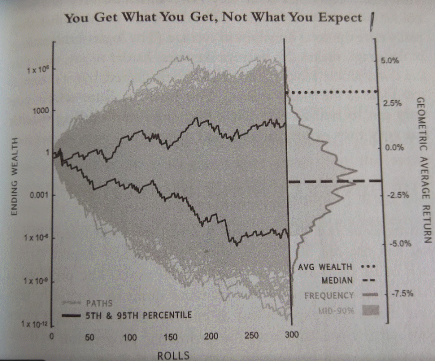

Algorithmic trading, a field where computational algorithms make trading decisions, relies heavily on quantitative metrics for evaluating trading strategies. Among these metrics, the arithmetic and geometric means play a pivotal role. The arithmetic mean, often referred to as the simple average, is computed by summing a set of numbers and dividing by the count of those numbers. While this approach is straightforward, it can sometimes misrepresent an algorithmic trading strategy's potential due to its failure to account for the effects of compounding returns over time.

Conversely, the geometric mean resolves this issue by providing a measure that considers the compounding effect inherent in returns over time. The geometric mean is calculated as the nth root of the product of n numbers and is particularly beneficial in contexts such as trading, where each period's return is built upon the previous one. This distinction between the two means is crucial for traders as they assess the performance and potential risks associated with their strategies.



In essence, understanding the arithmetic and geometric means is fundamental for accurately evaluating trading strategies. By recognizing how these means influence trading outcomes and decision-making, traders can enhance their ability to assess strategy effectiveness and long-term viability. This article provides insights into these concepts, offering a nuanced perspective on their application in algorithmic trading.

## Table of Contents

## Defining Arithmetic Mean

The arithmetic mean is a fundamental concept in mathematics and statistics, representing the simple average of a set of numbers. It is calculated by summing all the values in a dataset and then dividing the total by the number of values. The arithmetic mean is expressed with the formula:

$$
\bar{x} = \frac{1}{n} \sum_{i=1}^{n} x_i
$$

where $\bar{x}$ is the arithmetic mean, $n$ is the number of values in the dataset, and $x_i$ are the individual values.

The simplicity of the arithmetic mean makes it a widely used measure for representing the central tendency of a dataset. It provides a straightforward way to understand the general level or benchmark of the data points by balancing out extreme values.

However, in the context of [algorithmic trading](/wiki/algorithmic-trading) and financial markets, the arithmetic mean has limitations. It does not account for the effects of compounding, which is critical in the assessment of investment performance over time. In trading, returns are typically realized through a sequence of multiplicative processes where each period's return builds upon the previous periods. Consequently, relying solely on the arithmetic mean can lead to an inaccurate representation of true investment performance.

For instance, consider a trading strategy evaluated over multiple periods with variable returns each period. The arithmetic mean will indicate a simple average return, which may suggest consistent growth, but it may not reflect the portfolio's value after accounting for compounding effects across those periods. This limitation of the arithmetic mean underscores the need for alternative measures, such as the geometric mean, which accounts for compounding and provides a more accurate picture of long-term investment results.

## Explaining Geometric Mean

The geometric mean originates from [statistics](/wiki/bayesian-statistics) and is an essential tool in determining average rates of financial returns. It is calculated by taking the nth root of the product of a set of n values. Mathematically, the geometric mean $G$ for n values $x_1, x_2, \ldots, x_n$ is represented as:

$$

G = \left( \prod_{i=1}^{n} x_i \right)^{1/n} = (x_1 \times x_2 \times \ldots \times x_n)^{1/n} 
$$

In algo trading, the geometric mean is particularly advantageous because it accounts for the compounding of returns over time. Compounding is the process where the value of an investment increases exponentially rather than linearly, as each period's returns become the base for the subsequent periods' returns. Thus, the geometric mean provides a more realistic measure of an investment's average return when compared to the arithmetic mean.

While the arithmetic mean simply averages the returns without considering their sequence and compounding effects, the geometric mean evaluates the compounded growth rate of an investment. For example, if a trader experiences returns of 10%, 15%, and -5% over three periods, the geometric mean considers the effect of each return on the overall growth of the investment. Using Python, one might compute the geometric mean for such returns as follows:

```python
import numpy as np

returns = [1.10, 1.15, 0.95]
geometric_mean = np.prod(returns)**(1/len(returns)) - 1

print(f"Geometric Mean: {geometric_mean:.2%}")
```

This approach ensures that the investor recognizes how downturns or negative returns can significantly affect the overall performance of an asset. In trading contexts characterized by considerable fluctuations in returns, understanding the geometric mean becomes instrumental for traders to set practical expectations and evaluate strategy robustness. 

This method's comprehensive approach to averaging is particularly essential when assessing sequential investments and their cumulative effect, making the geometric mean not just a statistical tool but a strategic ally in financial decision-making.

## Arithmetic vs Geometric Mean in Trading Context

In algorithmic trading, the distinction between arithmetic and geometric means significantly affects the perception of a strategy's performance, influencing both evaluations and risk assessments. The arithmetic mean, known for its simplicity, is calculated by summing a set of values and dividing by their number. This approach, however, can provide an overly optimistic view of an algorithmic trading strategy's outcomes. This optimism stems primarily from the arithmetic mean's inability to consider compounding effects, a critical [factor](/wiki/factor-investing) when evaluating returns over multiple periods.

For instance, consider a scenario where a trader records returns over three periods as +10%, -10%, and +10%. The arithmetic mean return is calculated as follows:

$$
\text{Arithmetic Mean} = \frac{10 + (-10) + 10}{3} = \frac{10}{3} \approx 3.33\%
$$

While the arithmetic mean suggests an average return of 3.33% per period, it does not account for the compounding effect of losses and gains over time. Enter the geometric mean, which provides a more realistic perspective by incorporating compounding into the analysis. The geometric mean is computed by multiplying the returns as factors (1 + return) and taking the nth root (for n periods). Using the same returns:

$$
\text{Geometric Mean} = \left((1 + 0.10) \times (1 - 0.10) \times (1 + 0.10)\right)^{\frac{1}{3}} - 1
$$

Calculating each step:

$$
= \left(1.10 \times 0.90 \times 1.10\right)^{\frac{1}{3}} - 1
= (1.089)^{\frac{1}{3}} - 1
\approx 1.0297 - 1 = 0.0297 \text{ or } 2.97\%
$$

The geometric mean of approximately 2.97% depicts a more accurate representation of the strategy's performance, factoring in the compounding of the sequences.

Choosing between these means is paramount for correctly evaluating a trading strategy's potential outcomes and risks. The arithmetic mean's lack of compounding consideration could mislead traders into underestimating risks, especially in volatile markets where large fluctuations can skew simple averages. In contrast, the geometric mean's integration of compounding effects offers a clearer view of long-term growth trends and risk exposures.

Thus, recognizing the implications of each mean helps traders and analysts formulate better strategies and make informed decisions, emphasizing the importance of aligning mathematical analytical methods with strategic trading objectives.

## Practical Examples in Algo Trading

The choice between arithmetic and geometric mean can significantly influence the interpretation of historical trade returns in algorithmic trading. Consider a situation where a series of trades yielded returns of +10%, -5%, +15%, and -10%. Calculating the arithmetic mean of these returns involves summing them up and dividing by the number of observations. This gives an arithmetic mean return of $\frac{10 - 5 + 15 - 10}{4} = \frac{10}{4} = 2.5\%$. Such a calculation might suggest an average positive performance per trade.

However, this result can be misleading because it neglects the cumulative effect of percentage returns. Instead, the geometric mean provides a more accurate assessment by accounting for compounding. To compute it, one multiplies the trade return factors (expressed as 1 plus the percentage return) and takes the nth root, where n is the number of returns. Thus, the geometric mean for the given returns is calculated as follows:

$$
\text{Geometric Mean} = \left( (1 + 0.10) \times (1 - 0.05) \times (1 + 0.15) \times (1 - 0.10) \right)^{\frac{1}{4}} - 1
$$

Substituting the values gives:

$$
\text{Geometric Mean} = (1.10 \times 0.95 \times 1.15 \times 0.90)^{\frac{1}{4}} - 1 \approx 1.0088 - 1 = 0.88\%
$$

This means the compounded average return per trade is approximately 0.88%, which is lower than the arithmetic mean. The geometric mean thus offers a realistic picture, especially over sequences involving high [volatility](/wiki/volatility-trading-strategies).

A practical case study highlights these differences: Consider an algorithmic trading strategy implemented during volatile market conditions, such as the 2008 financial crisis. Strategies evaluated using the arithmetic mean might inaccurately reflect positive performance due to intermittent high gains. On the other hand, when the geometric mean is employed, it accounts for the detrimental effect of negative returns and market volatility, offering insights into the strategy's robustness and highlighting potential long-term sustainability.

In real-world trading, sequences of returns are often non-linear and volatile. The "volatility tax," which is the erosion of returns through volatile swings, is effectively captured by the geometric mean, emphasizing its importance in evaluations. Through these examples, it becomes clear that relying solely on the arithmetic mean for performance assessments can lead to flawed strategic decisions. Instead, employing the geometric mean aligns quantitative evaluations with realistic expectations and strategic trading goals, emphasizing the importance of thoughtful statistical application in algorithmic trading.

## Impact of Volatility and Sequence of Returns

Volatility plays a significant role in differentiating between arithmetic and geometric mean outcomes in trading. The arithmetic mean does not account for the variability in data, offering a simple average that can significantly overestimate returns in volatile markets. This is because the arithmetic mean simply sums up returns and divides by the number of periods, disregarding the order and variability of those returns. In contrast, the geometric mean incorporates both compounding and the sequence of returns, providing a more accurate reflection of an investment's average growth rate.

The concept of 'volatility tax' elucidates the disparity caused by fluctuations. Volatility tax represents the reduction in compounding returns due to fluctuations in returns, highlighting that as volatility increases, the geometric mean will always be less than or equal to the arithmetic mean. This can be expressed mathematically as:

$$
\text{Geometric Mean} \leq \text{Arithmetic Mean} - \text{Volatility Tax}
$$

To further illustrate this, consider an investment with two years of returns: +50% and -50%. The arithmetic mean would indicate a 0% average return, yet this misleadingly suggests no growth or loss over the period. However, the geometric mean accurately accounts for the volatility tax, computing as:

$$
\text{Geometric Mean} = \sqrt{(1+0.5) \times (1-0.5)} - 1 = 0
$$

This results in a -25% return, revealing the investment's actual decline due to volatility.

Sequence of returns, or sequence risk, further explains the preference for geometric means. In algorithmic trading, even if two investments deliver the same average rate of return, the order in which different returns are realized can dramatically impact the final portfolio value. Early losses harm compounded returns more significantly than later ones. The geometric mean inherently factors in this sequence by reflecting the compound effect of returns, offering a more realistic assessment of performance across varying market conditions.

To put it simply, while arithmetic mean offers a straightforward computation approach, the geometric mean provides a deeper insight into actual performance over time, particularly under volatile market conditions. Its ability to reflect real compounded returns, considering both volatility and sequence of returns, makes it an indispensable tool for traders aiming for precision in evaluating their strategies.

## Conclusion: Choosing the Right Mean

In evaluating trading strategies, the geometric mean plays a pivotal role due to its ability to factor in compounding effects. This attribute makes it a superior tool when assessing the actual performance of algorithmic trading strategies. Unlike the arithmetic mean, which might overstate returns by simply averaging them, the geometric mean provides a more nuanced view by accounting for the compounded growth of investments. This distinction is crucial for traders aiming to align their strategies with realistic expectations.

For instance, consider a trading sequence with returns of -10%, 20%, and 15%. The arithmetic mean would suggest an average return of $\frac{-10 + 20 + 15}{3} = 8.33\%$. However, using the geometric mean, we calculate it as follows:

$$
(1 - 0.10) \times (1 + 0.20) \times (1 + 0.15)^{\frac{1}{3}} - 1 \approx 7.46\%
$$

This demonstrates how the geometric mean accounts for the sequence's compounding effects, offering a more accurate performance assessment.

Traders must consider both compounding and volatility impacts when evaluating trading performance. Volatility, or fluctuations in returns, can erode gains more significantly than a simple average might suggest. This erosion effect, sometimes referred to as the "volatility tax," underscores the importance of using the geometric mean, as it incorporates the order of returns and their compounded impact over time.

To align mathematical approaches with strategic trading goals, traders should integrate the geometric mean into their performance assessment frameworks. This integration supports informed decision-making, enabling traders to gauge their strategies' robustness accurately. By embracing the geometric mean, traders can better navigate the complexities of financial markets, potentially enhancing both strategy execution and risk management.

## References & Further Reading

[1]: ["Advances in Financial Machine Learning"](https://www.amazon.com/Advances-Financial-Machine-Learning-Marcos/dp/1119482089) by Marcos Lopez de Prado

[2]: ["Quantitative Trading: How to Build Your Own Algorithmic Trading Business"](https://books.google.com/books/about/Quantitative_Trading.html?id=j70yEAAAQBAJ) by Ernest P. Chan

[3]: ["Evidence-Based Technical Analysis: Applying the Scientific Method and Statistical Inference to Trading Signals"](https://www.amazon.com/Evidence-Based-Technical-Analysis-Scientific-Statistical/dp/0470008741) by David Aronson

[4]: ["The Mathematics of Financial Derivatives: A Student Introduction"](https://books.google.com/books/about/The_Mathematics_of_Financial_Derivatives.html?id=HAQgAwAAQBAJ) by Paul Wilmott, Sam Howison, and Jeff Dewynne

[5]: Biais, B., & Woolley, P. (2011). ["High Frequency Trading."](https://www.tse-fr.eu/publications/high-frequency-trading) The Institute of Global Finance Working Paper Series.