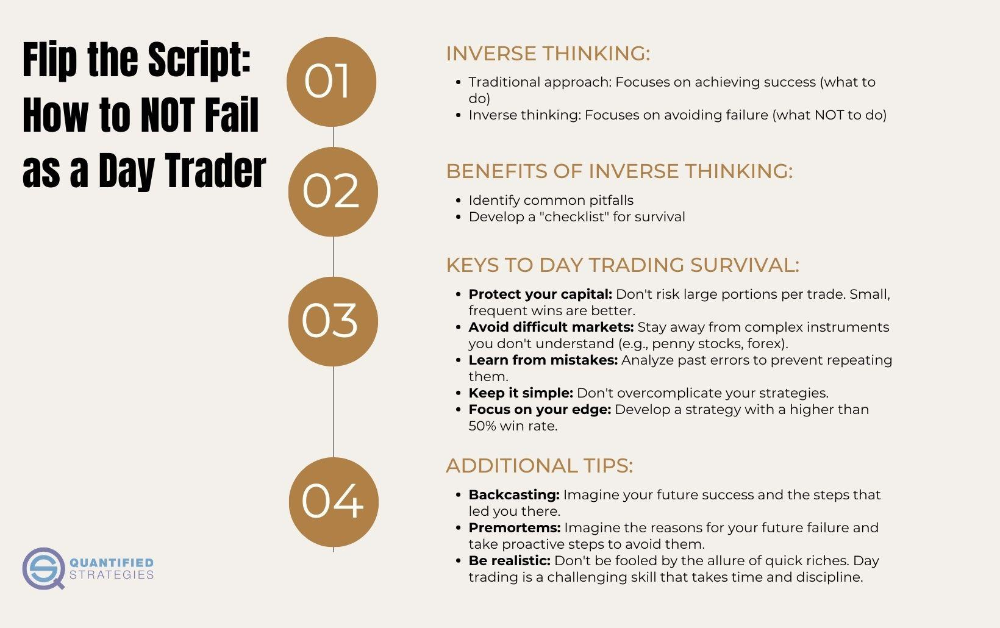

## Table of Contents

## What is day trading and who are day traders?

Day trading is when someone buys and sells stocks or other financial things within the same day. They do not keep them overnight. The goal is to make money from small changes in the price of these stocks during the day. It can be risky because prices can go up and down a lot in a short time.

Day traders are people who do day trading. They spend a lot of time watching the market and making quick decisions. They need to be good at understanding numbers and trends. Many day traders work from home using computers and special software to help them trade. It's not easy, and not everyone who tries it will make money.

## What are the common reasons beginners fail in day trading?

Beginners often fail in day trading because they do not have enough knowledge about the market. They might not understand how stocks work or how to read charts and trends. This lack of knowledge can lead them to make bad decisions, like buying stocks at the wrong time or selling them too early. Without a good understanding of the market, it's hard to make smart trades and make money.

Another reason beginners fail is because they do not have a good plan. Day trading needs a lot of discipline and a clear strategy. Many beginners jump into trading without setting clear goals or rules for themselves. They might trade too much or take big risks without thinking. This can lead to big losses. Having a plan and sticking to it is very important for success in [day trading](/wiki/day-trading-spy).

Emotions also play a big role in why beginners fail. It's easy to get excited or scared when trading, and these feelings can make people do things they shouldn't. For example, a beginner might hold onto a losing stock hoping it will go back up, or they might sell a winning stock too soon out of fear. Learning to control emotions and stick to a trading plan is crucial for anyone wanting to succeed in day trading.

## How does lack of a trading plan contribute to failure in day trading?

Not having a trading plan can make day trading very hard and risky. A trading plan is like a map that helps you know where you are going and how to get there. Without it, beginners might trade too much or not enough, and they might take big risks without thinking. They might buy and sell stocks at the wrong times because they don't have clear rules to follow. This can lead to big losses because they are not making smart, planned decisions.

Also, without a trading plan, it's easy to let emotions take over. When you don't have a set of rules to stick to, you might start making choices based on how you feel at the moment. For example, you might keep a stock that's losing money because you hope it will go back up, or you might sell a stock too soon because you're scared it will go down. This kind of emotional trading often leads to failure because it's not based on a careful, thought-out strategy.

## What role does emotional decision-making play in the failure of day traders?

Emotional decision-making can be a big reason why day traders fail. When traders let their feelings control their choices, they might make bad decisions. For example, they might hold onto a stock that's losing money because they hope it will go back up. Or they might sell a stock too soon because they're scared it will go down. These choices based on fear or hope instead of a plan can lead to big losses.

Emotions like excitement or panic can also make traders trade too much or take big risks without thinking. When the market is moving fast, it's easy to get caught up in the moment and make quick decisions that aren't smart. Over time, these emotional trades can add up and cause the trader to lose money instead of making it. Learning to control emotions and stick to a plan is very important for success in day trading.

## How can inadequate risk management lead to failure in day trading?

Inadequate risk management can cause big problems for day traders. When traders do not manage risk well, they might put too much money into one trade. If that trade goes wrong, they could lose a lot of money very quickly. Not having rules about how much to risk on each trade can lead to big losses that are hard to recover from. A good risk management plan helps traders set limits on how much they can lose, so they can keep trading even if some trades do not go well.

Another way inadequate risk management can lead to failure is by not using stop-loss orders. A stop-loss order is a tool that automatically sells a stock if it drops to a certain price. Without this, a trader might keep a losing stock hoping it will go back up, but it could keep falling and cause even bigger losses. Good risk management means knowing when to cut losses and move on to the next trade. Without these practices, day traders are more likely to fail because they are not protecting themselves from big losses.

## What are the impacts of overtrading on a day trader's success?

Overtrading can hurt a day trader's success a lot. When a trader trades too much, they might make quick decisions without thinking them through. This can lead to more losses because they are not sticking to their plan. Every trade costs money in fees, so trading too much can eat into the trader's profits. Over time, these small costs can add up and make it hard for the trader to make money.

Also, overtrading can make a trader feel stressed and tired. When someone trades all day long, it can be hard to stay focused and make good choices. Being tired can lead to mistakes, like buying or selling at the wrong time. This stress and tiredness can make a trader feel overwhelmed and might even make them want to quit. So, it's important for day traders to find a good balance and not trade too much.

## How does the lack of discipline affect day trading outcomes?

Not having discipline can really hurt a day trader's success. When traders do not stick to their plan, they might start making choices based on how they feel at the moment. They might trade too much or take big risks without thinking. This can lead to big losses because they are not making smart, planned decisions. Without discipline, it's easy to get caught up in the excitement of the market and make quick choices that do not work out well.

Lack of discipline can also make it hard for traders to stick to their rules about risk management. They might not use stop-loss orders or they might put too much money into one trade. This can lead to big losses that are hard to recover from. Over time, not being disciplined can wear a trader down and make them feel stressed and tired. This can lead to more mistakes and even bigger losses, making it tough for them to succeed in day trading.

## What are the consequences of not having enough capital for day trading?

Not having enough money can make day trading very hard. When traders do not have enough capital, they might not be able to take advantage of good trading chances. They might have to use a lot of their money on just one trade, which is risky. If that trade goes wrong, they could lose most or all of their money. This makes it hard to keep trading and trying again.

Also, not having enough money can make traders feel stressed and worried. They might start taking big risks to try to make more money quickly, but this often leads to more losses. Without enough money, it's hard to handle the ups and downs of the market. Over time, this can make day trading feel too hard and might make traders want to give up.

## How does the failure to adapt to market changes contribute to day trading losses?

When day traders do not adapt to changes in the market, they can lose a lot of money. The market is always changing, with new trends and news that can affect stock prices. If traders keep using the same old strategies without updating them, they might miss out on good chances to make money. They might also keep losing money because they are not ready for the new ways the market is moving.

Not adapting can also make traders feel stuck and unsure. When they see the market changing but do not change their plans, they might start to doubt themselves. This can lead to bad decisions, like holding onto losing stocks too long or selling winning stocks too soon. Over time, this failure to adapt can wear traders down and make day trading feel too hard, leading to more losses and less success.

## What advanced strategies do successful day traders use to avoid common pitfalls?

Successful day traders use a few smart strategies to avoid common problems. One key strategy is having a strong trading plan and sticking to it. They set clear rules for when to buy and sell, and they use stop-loss orders to limit their losses. This helps them make decisions based on their plan, not on their feelings. They also manage their money carefully, making sure not to risk too much on any one trade. By following these rules, they can avoid big losses and keep trading even when the market is tough.

Another important strategy is staying flexible and adapting to changes in the market. Successful traders always keep learning and updating their strategies. They pay attention to news and trends that might affect stock prices, and they adjust their plans to take advantage of new opportunities. This helps them stay ahead of the market and avoid getting stuck with old strategies that do not work anymore. By being ready to change, they can keep making smart trades and avoid the pitfalls that come with a changing market.

## How can continuous learning and education prevent failure in day trading?

Continuous learning and education help day traders stay successful by keeping them up-to-date with the market. The stock market changes all the time, and new trends and news can affect stock prices. By learning all the time, traders can understand these changes better and make smarter choices. They can learn new strategies and tools that help them trade better. This way, they are less likely to make the same mistakes over and over again, which can lead to big losses.

Education also helps traders understand the risks better and manage them well. When traders know more about the market, they can set better rules for themselves, like when to buy and sell and how much money to risk. This helps them avoid getting too excited or scared, which can lead to bad decisions. By always learning, traders can keep improving their skills and be ready for whatever the market throws at them, making them more likely to succeed in day trading.

## What psychological factors are critical for expert day traders to manage to sustain success?

Expert day traders need to manage their emotions well to keep succeeding. Feelings like fear and excitement can make traders do things they shouldn't. For example, if a trader is scared, they might sell a stock too soon, even if it's doing well. If they're excited, they might take big risks without thinking. By staying calm and following their plan, traders can make smart choices and avoid big losses. This helps them keep trading and making money over time.

Another important psychological factor is having discipline. Day trading can be hard and stressful, but successful traders stick to their rules no matter what. They do not let the ups and downs of the market make them change their plan. They know that trading too much or not managing risks well can lead to failure. By being disciplined, they can keep their focus and make the best decisions, which helps them stay successful in the long run.

## What are the consequences of failing to employ quantified strategies?

A significant [factor](/wiki/factor-investing) contributing to the failure of day traders is the lack of a tangible trading edge. Quantified strategies, underpinned by historical testing and statistical analysis, are pivotal for identifying financially viable trading opportunities. The absence of such rigorously developed methodologies often leaves traders susceptible to the unpredictable and often volatile nature of the markets.

Quantified strategies leverage past market data to develop models that anticipate future price movements. This demands a structured approach comprising [backtesting](/wiki/backtesting), optimization, and validation stages. Backtesting involves applying a prospective strategy to historical data to gauge its effectiveness. For example, traders may use a moving average crossover strategy, testing its performance on a previous dataset to ascertain its potential profitability.

The journey from concept to a robust trading system necessitates thorough statistical analysis. This aids in determining the reliability of a strategy, examining parameters such as the Sharpe ratio or the Sortino ratio, which assess risk-adjusted returns. The Sharpe ratio, for instance, is calculated using the formula:

$$
\text{Sharpe Ratio} = \frac{E[R_p - R_f]}{\sigma_p}
$$

where $E[R_p - R_f]$ represents the expected return of the portfolio in excess of the risk-free rate, and $\sigma_p$ is the standard deviation of the portfolio's excess return. Traders devoid of this level of scrutiny may end up relying erroneously on intuition or untested market theories propagated through hearsay.

An effective strategy should not be merely theoretically sound but should also withstand real-world conditions. This calls for simulations that account for slippage, transaction costs, and varying [liquidity](/wiki/liquidity-risk-premium), factors that often disrupt theoretical profitability in live markets. Many traders, however, dive into trading without such a coherent framework, hoping to capitalize on hunches rather than pre-validated strategies.

Implementing a strategy also requires ongoing evaluation and recalibration to ensure its continued relevance amid shifting market conditions. This entails periodic assessment of the strategy's performance through metrics such as the win-loss ratio or maximum drawdown. Without this systematic approach, traders are often blindsided by market randomness, leading to inconsistent performance and potential financial ruin.

In conclusion, the absence of quantified strategies represents a critical gap in the approach of many day traders. By developing and methodically testing their trading systems, traders can gain a competitive edge, reducing the influence of market [volatility](/wiki/volatility-trading-strategies) and randomness on their trading outcomes. With the right blend of empirical research and adaptability, traders can enhance their likelihood of achieving sustained success.

## References & Further Reading

[1]: Bergstra, J., Bardenet, R., Bengio, Y., & Kégl, B. (2011). ["Algorithms for Hyper-Parameter Optimization."](https://papers.nips.cc/paper/4443-algorithms-for-hyper-parameter-optimization) Advances in Neural Information Processing Systems 24.

[2]: Marcos Lopez de Prado (2018). ["Advances in Financial Machine Learning."](https://www.amazon.com/Advances-Financial-Machine-Learning-Marcos/dp/1119482089)

[3]: Aronson, D. R. (2007). ["Evidence-Based Technical Analysis: Applying the Scientific Method and Statistical Inference to Trading Signals."](https://onlinelibrary.wiley.com/doi/book/10.1002/9781118268315) Wiley.

[4]: Jansen, S. (2018). ["Machine Learning for Algorithmic Trading."](https://github.com/stefan-jansen/machine-learning-for-trading) Packt Publishing.

[5]: Chan, E. P. (2009). ["Quantitative Trading: How to Build Your Own Algorithmic Trading Business."](https://github.com/ftvision/quant_trading_echan_book) Wiley.