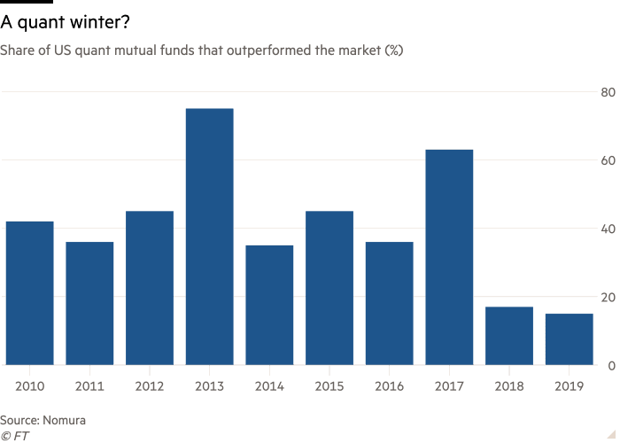

## Table of Contents

## What is a quantitative fund?

A quantitative fund, often called a quant fund, is a type of investment fund that uses mathematical models and computer algorithms to make decisions about buying and selling assets. Instead of relying on human judgment, these funds use data and numbers to guide their investment choices. This approach can help remove emotions from investing, which some people believe leads to better decisions.

These funds often look at a lot of data, like stock prices, company financials, and even news articles, to find patterns that can predict how investments will perform. By using computers to analyze this data quickly and accurately, quant funds can make many trades in a short amount of time. This method can be very different from traditional investing, where people might spend a lot of time researching and thinking about each investment before making a decision.

## What are the characteristics of large quantitative funds?

Large quantitative funds have a lot of money to invest. They use big computers and complex math to make their investment choices. These funds often have teams of smart people, like mathematicians and computer experts, who work together to create and improve their trading models. Because they handle so much money, they can affect the prices of the stocks and other things they buy and sell.

These funds also use something called high-frequency trading, which means they buy and sell things very quickly, sometimes in just a few seconds. This helps them make small profits on many trades. Large quant funds also have to follow strict rules to make sure they are not taking too much risk. They use special ways to measure and control risk, so they can keep their investors' money safe while trying to make more money.

## Why is the USA considered a hub for financial innovation?

The USA is considered a hub for financial innovation because it has a lot of big cities with many banks, investment firms, and tech companies. These places, like New York and San Francisco, bring together smart people who work on new ideas in finance. The country also has strong universities that teach finance and technology, which helps create new talent for the industry. Plus, the USA has rules that support new businesses and ideas, making it easier for people to start and grow financial companies.

Another reason is that the USA has a lot of money to invest. This means there is always a demand for new financial products and services. Big investors, like pension funds and insurance companies, are always looking for new ways to make money, which pushes the industry to keep innovating. The country's stock markets, like the New York Stock Exchange, are also very advanced and open to new types of trading and investments. All these things together make the USA a great place for financial innovation.

## What role does the US educational system play in developing quantitative finance talent?

The US educational system plays a big role in developing talent for quantitative finance. Many top universities in the US, like MIT, Stanford, and the University of Chicago, have strong programs in math, computer science, and finance. These schools teach students the skills they need to work in quantitative finance, like how to use complex math to solve problems and how to write computer programs to analyze data. Students also get to learn from professors who are experts in the field and often work with real financial data, which helps them get ready for jobs in the industry.

Another way the US educational system helps is by offering special programs and courses focused on quantitative finance. For example, some schools have master's programs that combine finance, math, and computer science. These programs are designed to train students specifically for careers in quant funds and other financial firms. By giving students hands-on experience and connecting them with industry professionals, these programs help create a pipeline of skilled workers ready to innovate and contribute to the field of quantitative finance.

## How does the regulatory environment in the USA support the growth of quantitative funds?

The regulatory environment in the USA helps quantitative funds grow by setting clear rules that everyone must follow. The Securities and Exchange Commission (SEC) and other agencies make sure that quant funds are playing fair and not taking too many risks. This makes investors feel safe, knowing that their money is being watched over. Because the rules are clear, quant funds can plan their strategies without worrying about sudden changes, which helps them grow and innovate.

Also, the USA has rules that encourage new ideas and businesses. For example, there are special programs that help startups get off the ground, and tax breaks for investing in new technology. This environment makes it easier for quant funds to try out new ideas and grow bigger. By supporting innovation, the USA's regulatory system helps keep the country at the forefront of financial technology and quantitative investing.

## What historical factors have contributed to the USA's dominance in quantitative funds?

The USA's dominance in quantitative funds started a long time ago, when the country began to build strong universities and financial markets. In the 20th century, places like MIT and the University of Chicago started teaching advanced math and finance. This helped create a lot of smart people who could work in finance. At the same time, the USA's stock markets, like the New York Stock Exchange, grew very big and became important places for trading. This made it easier for new ideas in finance to be tried out and grow.

Another big reason is that the USA has always been good at bringing together different kinds of smart people. In the 1980s and 1990s, computer technology got better and cheaper. This let people in finance use computers to do more complex math and make better trading decisions. The USA had a lot of tech companies and finance firms working together in places like New York and Silicon Valley. This mix of technology and finance helped create the first big quant funds, like Renaissance Technologies. Over time, these funds got bigger and better, making the USA a leader in quantitative finance.

## How do US-based quantitative funds benefit from access to capital markets?

US-based quantitative funds benefit a lot from being close to big capital markets like the New York Stock Exchange. These markets have a lot of money moving around every day, which means there are many chances for quant funds to buy and sell things quickly. Because these markets are so big and busy, quant funds can use their computer models to find small changes in prices and make trades that can add up to big profits over time. Being near these markets also means that quant funds can get information faster, which is important for making quick trading decisions.

Another way these funds benefit is that the US capital markets are very open to new ideas. This means that quant funds can try out new trading strategies and products without too much trouble. The markets also have a lot of different things to invest in, like stocks, bonds, and even more complex financial products. This variety gives quant funds more options to use their math models and find the best ways to make money for their investors.

## What technological advantages do US quantitative funds have over their global counterparts?

US quantitative funds have big advantages because they are close to places like Silicon Valley, where a lot of new technology is made. This means they can use the latest computers and software to make their trading models better and faster. They also work with tech companies to get new tools and ideas that help them stay ahead of others. This closeness to technology helps them use high-frequency trading, where they buy and sell things very quickly to make small profits on many trades.

Another advantage is that the US has a lot of smart people who are good at math, computer science, and finance. Many of these people go to top universities in the US and then work for quant funds. This means US quant funds can hire the best talent to keep improving their strategies. They also have access to a lot of data, which they can use to find patterns and make better trading decisions. All these things together make US quant funds very strong compared to others around the world.

## How do US quantitative funds leverage data availability and quality?

US quantitative funds use a lot of data to make their trading decisions. They have access to huge amounts of information from the stock markets, like prices and trading volumes, as well as other sources like news articles and company reports. This data is often very good quality because the US has strict rules about how companies report their information. By using this data, quant funds can find patterns and make predictions about how investments will perform. This helps them make better trading choices and earn more money for their investors.

Another way US quant funds use data is by working with big tech companies. These companies help them get even more data and make it easier to use. For example, they might use special software to quickly analyze lots of information and find the best times to buy or sell. Because the US has so many tech companies and so much data available, quant funds can keep improving their models and stay ahead of others. This makes them very good at what they do and helps them grow bigger and stronger.

## What is the impact of the US financial industry's scale on quantitative fund development?

The big size of the US financial industry helps quantitative funds grow and get better. Because there is so much money in the US markets, quant funds can trade a lot and make small profits on many trades. This is important for their strategy because they use computers and math to find tiny changes in prices. The big size of the markets also means there are many different things to invest in, like stocks, bonds, and other financial products. This gives quant funds more choices to use their models and find the best ways to make money.

Also, the large scale of the US financial industry means there are a lot of smart people working in it. Many of these people are experts in math, computer science, and finance, and they help make the quant funds' models better. The industry's size also means there is a lot of money to invest in new technology and ideas. This helps quant funds keep improving and stay ahead of others around the world. So, the big size of the US financial industry is a big reason why quant funds there are so successful.

## How do US quantitative funds manage risk compared to funds in other countries?

US quantitative funds manage risk in a special way because they have a lot of money and technology to help them. They use big computers to look at a lot of data and find out how risky their investments are. They also have rules they follow to make sure they don't take too many risks. For example, they might use something called "risk models" to see how different investments could affect their overall money. This helps them keep their investors' money safe while still trying to make more money.

Compared to funds in other countries, US quant funds often have more tools and data to manage risk. In some other countries, funds might not have as much money or technology, so they might not be able to use the same kind of risk models. Also, the rules in the US are very clear about how much risk funds can take, which helps US quant funds plan better. This makes it easier for them to manage risk and keep their investors happy, even when the markets are going up and down.

## What future trends might affect the global distribution of large quantitative funds?

In the future, more countries might start to have big quantitative funds because technology is getting better and cheaper everywhere. Right now, the USA has a lot of these funds because it has been a leader in technology and finance for a long time. But as other countries catch up, they might start to use the same kind of computer models and data to make their own quant funds. This could mean that the number of big quant funds in places like Asia and Europe might grow a lot.

Another trend that could change where big quant funds are located is the rules that governments make. If other countries start to make rules that help quant funds grow, more of these funds might move there. For example, if a country makes it easier to start a new business or gives tax breaks for using new technology, more quant funds might want to set up there. This could spread out the big quant funds around the world and make the USA less of a leader in this area.

## References & Further Reading

[1]: Markowitz, H. (1952). ["Portfolio Selection."](https://www.jstor.org/stable/2975974) The Journal of Finance, 7(1), 77-91.

[2]: Sharpe, W. F. (1964). ["Capital Asset Prices: A Theory of Market Equilibrium under Conditions of Risk."](https://www.jstor.org/stable/2977928) The Journal of Finance, 19(3), 425-442.

[3]: Thorp, E. O. (1966). ["Beat the Market: A Scientific Stock Market System."](https://www.amazon.com/Beat-Market-Scientific-Stock-System/dp/0394424395) Random House.

[4]: Zuckerman, G. (2019). ["The Man Who Solved the Market: How Jim Simons Launched the Quant Revolution."](https://www.amazon.com/Man-Who-Solved-Market-Revolution/dp/073521798X) Penguin Random House.

[5]: Black, F., & Scholes, M. (1973). ["The Pricing of Options and Corporate Liabilities."](https://www.jstor.org/stable/1831029) Journal of Political Economy, 81(3), 637-654.

[6]: Fama, E. F. (1970). ["Efficient Capital Markets: A Review of Theory and Empirical Work."](https://www.jstor.org/stable/2325486) The Journal of Finance, 25(2), 383-417.

[7]: Patterson, S. (2011). ["The Quants: How a New Breed of Math Whizzes Conquered Wall Street and Nearly Destroyed It."](https://www.crownpublishing.com/archives/blog/the-quants) Crown Publishing Group.