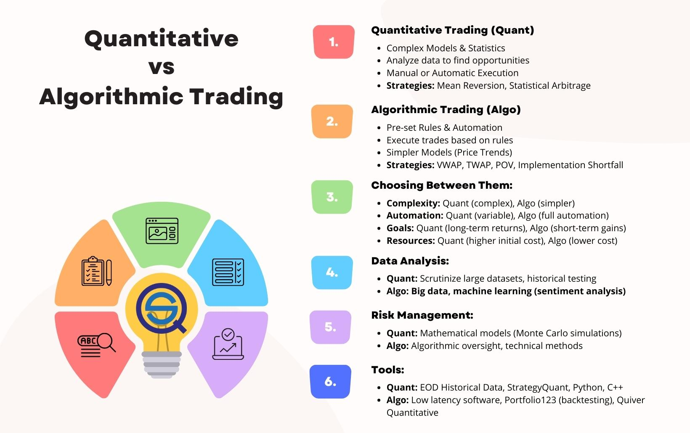

## Table of Contents

## What is AI-driven quantitative analysis?

AI-driven quantitative analysis is when computers use artificial intelligence to look at numbers and data to find patterns and make predictions. Instead of people doing all the math and analysis by hand, AI can do it much faster and often more accurately. This kind of analysis is used in many fields, like finance, where it helps to predict stock prices, or in healthcare, where it can help find out if a patient might get sick based on their health data.

The way AI does this is by using special programs called algorithms. These algorithms can learn from the data they see, getting better over time at spotting trends and making guesses about what might happen next. For example, in the stock market, an AI might look at past prices and other information to decide if a stock is likely to go up or down. This can help people make smarter choices about buying or selling stocks.

## How does AI-driven quantitative analysis differ from traditional quantitative analysis?

AI-driven quantitative analysis and traditional quantitative analysis both look at numbers and data to find patterns and make predictions. But they do it in different ways. Traditional quantitative analysis usually involves people doing the math and analysis by hand or using simple computer programs. They might use formulas and models that they've learned from books or past experiences. This can take a lot of time and might not be as accurate because it depends a lot on the person doing the analysis.

On the other hand, AI-driven quantitative analysis uses artificial intelligence to do the work. AI can look at huge amounts of data very quickly and find patterns that people might miss. It uses special programs called algorithms that can learn from the data they see. This means the AI can get better over time at making predictions. Because AI can handle more data and learn from it, AI-driven analysis can often be more accurate and faster than traditional methods.

In summary, while traditional quantitative analysis relies on human effort and simpler tools, AI-driven quantitative analysis uses advanced technology to do the job more efficiently and effectively. This difference can be really important in fields like finance or healthcare, where making quick and accurate predictions can make a big difference.

## What are the basic components of an AI-driven quantitative trading system?

An AI-driven quantitative trading system has a few main parts that work together to make trading decisions. The first part is data collection, where the system gathers lots of information from different places like stock prices, news, and economic reports. This data is important because it helps the AI understand what's happening in the market. The second part is data processing, where the system cleans and organizes the data so it can be used easily. This step is crucial because messy data can lead to bad decisions.

The third part is the AI model itself, which uses algorithms to learn from the data and make predictions about what might happen next in the market. These algorithms can be things like neural networks or decision trees, and they get better over time as they see more data. The last part is the trading execution, where the system actually buys or sells stocks based on the predictions from the AI model. This part needs to be fast and reliable to make sure the trades happen at the right time.

Overall, these parts work together to create a system that can make smart trading decisions without much human help. The AI-driven system can handle more data and make quicker decisions than a person could, which can lead to better results in trading.

## Why are institutional traders increasingly adopting AI-driven quantitative analysis?

Institutional traders are increasingly using AI-driven quantitative analysis because it helps them make better and faster decisions. AI can look at huge amounts of data from the stock market, news, and other sources much quicker than a person could. This means the AI can spot patterns and trends that might be hard for people to see. By using AI, traders can make more accurate predictions about what might happen next in the market, which can help them make smarter choices about buying or selling stocks.

Another reason institutional traders like AI-driven analysis is that it can work all the time without getting tired. People need breaks, but AI can keep analyzing data 24/7. This is really helpful in the fast-paced world of trading, where things can change quickly. Also, AI can learn from its mistakes and get better over time, which means the trading strategies can improve without needing a lot of extra work from the traders. This makes AI a powerful tool for institutional traders looking to stay ahead in the market.

## What specific advantages does AI-driven quantitative analysis offer over human analysis?

AI-driven quantitative analysis can look at a lot more data than a person can. It can go through huge amounts of information from the stock market, news, and other places really fast. This means AI can find patterns and trends that might be hard for people to see. Because AI can handle so much data, it can make more accurate predictions about what might happen next in the market. This helps traders make smarter choices about buying or selling stocks.

Another big advantage of AI is that it can work all the time without getting tired. People need breaks, but AI can keep analyzing data 24/7. This is really helpful in trading, where things can change quickly. Also, AI can learn from its mistakes and get better over time. This means the trading strategies can improve without needing a lot of extra work from the traders. So, AI-driven analysis can be a powerful tool for making better and faster decisions in trading.

## How does AI improve the speed and efficiency of data processing in trading?

AI makes data processing in trading much faster and more efficient. It can look at huge amounts of information from the stock market, news, and other sources really quickly. This is because AI uses special programs called algorithms that can handle a lot of data at once. Instead of people having to go through all the data by hand, which can take a long time, AI can do it in seconds. This means traders can get the information they need much faster, which is really important in the fast-paced world of trading.

Another way AI improves efficiency is by working all the time without getting tired. People need breaks, but AI can keep analyzing data 24/7. This means it can catch changes in the market as soon as they happen, even when the trading office is closed. Because AI can work non-stop, it can process data and make decisions much more quickly than a person could. This helps traders make better choices about buying or selling stocks because they have the latest information right away.

## What role does machine learning play in enhancing predictive models for trading?

Machine learning helps make predictive models for trading better by learning from past data. It looks at things like stock prices, news, and economic reports to find patterns. As it sees more data, the machine learning model gets better at spotting these patterns and can make more accurate guesses about what might happen next in the market. This means traders can use these predictions to decide when to buy or sell stocks, making their trading strategies smarter.

Another way machine learning helps is by adapting to new information quickly. The stock market changes all the time, and what worked yesterday might not work today. Machine learning models can update themselves with new data, so they keep getting better over time. This makes them more reliable for traders who need to make quick decisions based on the latest information. By using machine learning, traders can have a tool that keeps learning and improving, helping them stay ahead in the fast-paced world of trading.

## Can AI-driven quantitative analysis help in risk management, and if so, how?

AI-driven quantitative analysis can help with risk management by looking at a lot of data to find patterns that might show when something risky is about to happen. For example, in trading, AI can look at past stock prices and other information to predict if a stock might go down a lot. This helps traders know when to be careful and maybe not buy that stock, or to sell it before it loses value. By using AI, traders can make better choices about managing risk because they have more information and can see things that might be hard for people to notice.

Another way AI helps with risk management is by working all the time and learning from new data. The stock market changes every day, and what was safe yesterday might be risky today. AI can keep an eye on the market 24/7 and update its predictions as new information comes in. This means it can quickly tell traders if something has changed and they need to adjust their plans to avoid risk. By using AI, traders can stay on top of risks and make smarter decisions to protect their money.

## What are some real-world examples of successful AI-driven quantitative trading strategies?

One real-world example of successful AI-driven quantitative trading is the use of AI by hedge funds like Renaissance Technologies. They use AI to look at huge amounts of data from the stock market and other places to find patterns that help them decide when to buy or sell stocks. Their AI system, called Medallion, has been very successful, making a lot of money for the fund. This shows how AI can help traders make better decisions by finding things in the data that people might miss.

Another example is how big banks like JPMorgan Chase use AI to trade stocks. They have AI systems that can look at news, social media, and other information to predict what might happen next in the market. This helps them make quick decisions about trading, which can be really important in the fast-paced world of finance. By using AI, these banks can manage their risks better and make more money from trading.

A third example is how companies like Two Sigma use AI to create trading strategies. They use machine learning to learn from past data and make predictions about the future. This helps them find good opportunities to buy or sell stocks. Their success shows how AI can keep learning and getting better over time, which is a big advantage in trading where things are always changing.

## How do regulatory environments affect the adoption of AI-driven quantitative analysis?

Regulatory environments can have a big impact on how much companies use AI-driven quantitative analysis. In some places, the rules might be strict about using AI in trading. This can make companies worried about getting in trouble if they use AI the wrong way. For example, if the rules say that AI systems need to be checked a lot to make sure they are fair and safe, companies might be slower to use AI because it takes more time and money to follow these rules. On the other hand, if the rules are clear and easy to follow, companies might feel more comfortable using AI because they know what they need to do to stay within the law.

Another way regulations affect AI adoption is by setting standards for how AI can be used. If the rules are good and help make sure AI is used in a fair and safe way, more companies might want to use AI because they know it will be okay. But if the rules are confusing or change a lot, companies might be scared to use AI because they don't want to break the law by accident. So, having clear and stable rules can help more companies feel okay about using AI-driven quantitative analysis in their trading.

## What are the potential limitations or challenges faced by institutional traders using AI-driven quantitative analysis?

Institutional traders using AI-driven quantitative analysis might face some challenges. One big problem is that AI systems can be really complicated and hard to understand. This means it can be tough for traders to know exactly why the AI is making certain decisions. If something goes wrong, it can be hard to fix because the AI's thinking is like a black box. Another challenge is that AI needs a lot of good data to work well. If the data is messy or not complete, the AI might make bad predictions, which can lead to losing money.

Another issue is that the rules and laws about using AI in trading can be strict and change a lot. This can make it hard for traders to use AI because they have to make sure they are following all the rules. It can take a lot of time and money to keep up with these regulations. Also, even though AI can learn and get better over time, it can still make mistakes. The stock market is always changing, and what worked yesterday might not work today. So, traders need to keep an eye on their AI systems and be ready to step in if something goes wrong.

## What future developments can we expect in AI-driven quantitative analysis for institutional trading?

In the future, we can expect AI-driven quantitative analysis to get even better at helping institutional traders. One big change might be that AI systems will be able to understand and use more types of data, like pictures and videos from social media. This could help them make even more accurate predictions about what might happen in the market. Also, AI might get better at explaining its decisions in a way that people can understand. This would make it easier for traders to trust the AI and know why it's making certain choices.

Another thing that could happen is that AI systems might work together better. Right now, different AI systems might not talk to each other much, but in the future, they could share information and learn from each other. This could make their predictions even more accurate. Also, as the rules about using AI in trading get clearer, more traders might start using AI because they know what they need to do to follow the law. This could lead to more people using AI and making the whole trading world smarter and faster.

## References & Further Reading

[1]: Bergstra, J., Bardenet, R., Bengio, Y., & Kégl, B. (2011). ["Algorithms for Hyper-Parameter Optimization."](https://papers.nips.cc/paper_files/paper/2011/hash/86e8f7ab32cfd12577bc2619bc635690-Abstract.html) Advances in Neural Information Processing Systems 24.

[2]: ["Advances in Financial Machine Learning"](https://www.amazon.com/Advances-Financial-Machine-Learning-Marcos/dp/1119482089) by Marcos Lopez de Prado

[3]: ["Evidence-Based Technical Analysis: Applying the Scientific Method and Statistical Inference to Trading Signals"](https://www.wiley.com/en-gb/Evidence+Based+Technical+Analysis:+Applying+the+Scientific+Method+and+Statistical+Inference+to+Trading+Signals-p-9780470008744) by David Aronson

[4]: ["Machine Learning for Algorithmic Trading"](https://www.amazon.com/Machine-Learning-Algorithmic-Trading-intelligence/dp/9918608013) by Stefan Jansen

[5]: ["Quantitative Trading: How to Build Your Own Algorithmic Trading Business"](https://www.amazon.com/Quantitative-Trading-Build-Algorithmic-Business/dp/0470284889) by Ernest P. Chan