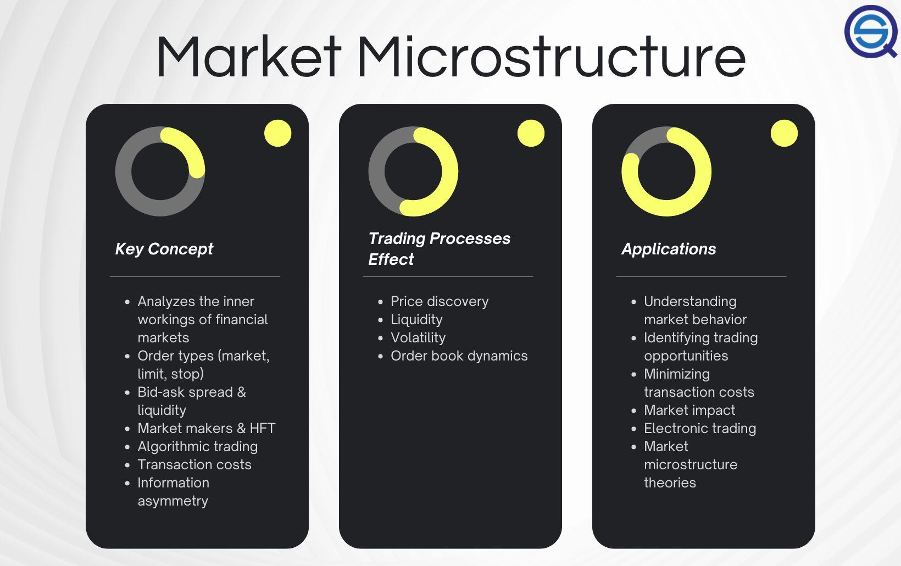

## Table of Contents

## What is market microstructure?

Market microstructure is the study of how markets work at a very detailed level. It looks at things like how orders are placed, how they are matched, and how prices are set. It's like looking at the tiny parts of a watch to understand how the whole thing ticks. This field helps us understand the behavior of traders and how their actions affect the market.

One important part of market microstructure is understanding the role of different types of traders. There are people who buy and sell quickly, trying to make small profits from tiny price changes. Others might hold onto their investments for a longer time. Market microstructure helps us see how these different strategies affect the market's overall behavior and how prices move.

Another key aspect is the design of the market itself. This includes things like the rules for trading, the technology used, and how information is shared. By studying these elements, market microstructure can help improve how markets function, making them more efficient and fair for everyone involved.

## What is High-Frequency Trading (HFT)?

High-Frequency Trading (HFT) is a type of trading where computers use special programs to buy and sell stocks very quickly. These programs can make thousands of trades in just a few seconds. People who do HFT use powerful computers and fast internet connections to look for small changes in stock prices. They try to make tiny profits from each trade, but because they do so many trades, these small profits can add up to a lot of money.

HFT is different from regular trading because it happens so fast. Regular traders might look at news or company reports to decide when to buy or sell. But HFT traders use math and computer programs to find patterns in the market. This means they can react to changes in the market much faster than a person could. Some people worry that HFT can make the market less fair, because only those with the fastest technology can take advantage of it. But others think it helps make the market more efficient by adding more trading and keeping prices more up-to-date.

## How does market microstructure affect trading?

Market microstructure is all about the tiny details of how trading happens. It looks at things like how orders are placed and how prices are set. This can affect trading a lot because it changes how easy or hard it is to buy and sell things. For example, if the rules make it quick and easy to trade, more people might want to do it. But if the rules are complicated or slow, people might trade less.

One big way market microstructure affects trading is through something called liquidity. Liquidity is about how easy it is to buy or sell something without changing its price too much. If the market is designed well, with lots of buyers and sellers, it can be very liquid. This makes trading smoother because people can get in and out of their trades easily. But if the market isn't set up right, it might be hard to find someone to trade with, and prices can jump around a lot, making trading riskier and less predictable.

## Why is understanding market microstructure crucial for HFT strategies?

Understanding market microstructure is really important for people who do High-Frequency Trading (HFT). HFT is all about making lots of trades very quickly, and to do that well, you need to know how the market works in detail. Market microstructure tells you about things like how orders are placed and how prices are set. If you understand these things, you can make better decisions about when to buy and sell. For example, knowing how quickly orders get filled can help you time your trades to make the most profit.

Also, market microstructure helps HFT traders understand liquidity, which is how easy it is to buy or sell something without changing its price too much. HFT traders need to know where the market is most liquid because that's where they can trade the fastest and with the least risk. If they can find these spots, they can make more trades and more money. So, knowing the ins and outs of market microstructure can give HFT traders a big advantage over others who don't understand it as well.

## What are the key components of market microstructure that HFT traders focus on?

HFT traders pay close attention to order types and how they work. They need to know about market orders, limit orders, and other special types of orders. This helps them figure out the best way to get their trades done quickly and at the best price. They also look at the order book, which shows all the buy and sell orders that are waiting to be filled. By understanding the order book, HFT traders can see where the market is heading and make smart decisions about when to trade.

Another important thing for HFT traders is understanding how fast trades happen. They need to know the latency, which is the time it takes for an order to go from their computer to the market and back. The faster they can trade, the more money they can make. They also look at market data feeds, which give them information about prices and trades. By using this data, they can spot patterns and make trades before others even know what's happening. So, knowing these parts of market microstructure helps HFT traders stay ahead in the fast world of trading.

## How do order types and order book dynamics influence HFT?

Order types and the way the order book works are really important for High-Frequency Trading (HFT). HFT traders use different kinds of orders, like market orders and limit orders, to make their trades. Market orders are used when they want to buy or sell something right away at the current price. Limit orders let them set a specific price they're willing to buy or sell at. By using these orders smartly, HFT traders can get the best prices and make more money. They also watch the order book closely, which shows all the buy and sell orders waiting to be filled. By looking at the order book, they can see where the market is going and make quick trades to take advantage of small price changes.

The dynamics of the order book are also key for HFT. The order book is always changing as new orders come in and old ones get filled. HFT traders use special computer programs to watch these changes and find patterns. For example, if they see a lot of buy orders coming in, they might guess that the price will go up soon. Then, they can buy quickly and sell a little later for a profit. Understanding how the order book moves helps HFT traders make trades faster than others, which is a big part of how they make money.

## What role does liquidity play in HFT and how is it related to market microstructure?

Liquidity is super important for High-Frequency Trading (HFT). It's all about how easy it is to buy or sell something without changing its price too much. HFT traders need lots of liquidity because they make lots of trades very quickly. If the market is liquid, they can get in and out of their trades fast and at good prices. This helps them make more money because they can take advantage of tiny price changes. If the market isn't liquid, it's harder for them to trade, and they might lose money if prices jump around a lot.

Liquidity is closely tied to market microstructure, which is all about the tiny details of how trading happens. Market microstructure looks at things like how orders are placed and how prices are set. If the market is designed well, with lots of buyers and sellers, it can be very liquid. This makes it easier for HFT traders to do their job. But if the market isn't set up right, it might be hard to find someone to trade with, and prices can be less stable. So, understanding market microstructure helps HFT traders find the most liquid parts of the market where they can trade the best.

## How can market microstructure data be used to predict short-term price movements in HFT?

Market microstructure data can help High-Frequency Trading (HFT) traders predict short-term price movements by giving them a detailed look at what's happening in the market right now. This data includes things like the order book, which shows all the buy and sell orders waiting to be filled. By watching the order book closely, HFT traders can see patterns and changes that might mean the price is about to go up or down. For example, if they see a lot of buy orders coming in, they might guess that the price will go up soon. They can then make quick trades to take advantage of these small price changes before others even notice.

Another way market microstructure data helps is by showing how fast trades are happening and how easy it is to buy or sell, which is called liquidity. HFT traders use this information to find the best times and places to trade. If the market is very liquid, it's easier for them to get in and out of trades quickly and at good prices. By understanding these details, HFT traders can make better guesses about where the price is heading in the next few seconds or minutes. This helps them make more money by trading faster and smarter than others.

## What are the common market microstructure models used in HFT research?

In High-Frequency Trading (HFT) research, one common market microstructure model is the Limit Order Book (LOB) model. This model looks at all the buy and sell orders that are waiting to be filled. It helps HFT traders understand how prices might change by showing them where the market is heading. By watching the LOB, traders can see patterns and make quick trades to take advantage of small price changes. This model is really useful because it gives a detailed picture of what's happening in the market right now.

Another model used in HFT research is the Market Microstructure Noise model. This model looks at the tiny, random changes in prices that happen all the time. These changes can make it hard to predict where the price is going, but HFT traders use this model to understand and maybe even use these random movements to their advantage. By understanding the noise, they can make better guesses about short-term price movements and make more money from their trades.

## How do regulatory changes in market microstructure impact HFT operations?

Regulatory changes in market microstructure can have a big impact on High-Frequency Trading (HFT) operations. When rules change, it can affect how fast HFT traders can make their trades and how much money they can make. For example, if new rules make it harder to use certain types of orders or slow down the trading process, HFT traders might find it tougher to do their job. They might need to change their computer programs and strategies to follow the new rules, which can be costly and time-consuming.

Also, regulatory changes can affect the liquidity of the market, which is how easy it is to buy or sell something without changing its price too much. If new rules make the market less liquid, it can be harder for HFT traders to get in and out of their trades quickly. This can make their trading less profitable because they rely on being able to trade fast and at good prices. So, HFT traders need to keep a close eye on any regulatory changes and be ready to adjust their strategies to keep making money.

## What advanced techniques do HFT firms use to exploit market microstructure inefficiencies?

HFT firms use special computer programs to find and take advantage of tiny mistakes in how the market works. These mistakes, called market microstructure inefficiencies, can happen when there are small gaps in the order book or when prices move in ways that are hard to predict. HFT traders use these programs to watch the market very closely and make trades faster than anyone else. For example, if they see a price that's a little bit off because of a mistake in the order book, they can quickly buy or sell to make a small profit before anyone else notices.

Another way HFT firms exploit these inefficiencies is by using something called latency arbitrage. This means they use super fast internet connections and computers to trade before others can. If they can get information about a price change just a tiny bit faster than everyone else, they can make trades that take advantage of that information before the rest of the market catches up. By doing this, they can make money from the small differences in prices that happen because of these inefficiencies.

## How does the integration of machine learning with market microstructure analysis enhance HFT performance?

Machine learning helps High-Frequency Trading (HFT) by making it easier to find patterns in the market. HFT traders use special computer programs to watch the market very closely. These programs can look at a lot of data, like the order book and how prices are moving, to find small mistakes or inefficiencies. By using machine learning, these programs can learn from past trades and get better at spotting these patterns. This means HFT traders can make smarter decisions about when to buy and sell, which can help them make more money.

Also, machine learning can help HFT traders react faster to changes in the market. The programs can quickly analyze new data and adjust their trading strategies on the fly. This is really important for HFT because they need to trade very quickly to take advantage of small price changes. By using machine learning, HFT traders can stay ahead of the competition and make trades that are more likely to be profitable. So, combining machine learning with market microstructure analysis can really boost the performance of HFT.

## References & Further Reading

[1]: O'Hara, M. (1995). ["Market Microstructure Theory."](https://www.amazon.fr/Market-Microstructure-Theory-Maureen-%E2%80%B2Hara/dp/1557864438) Wiley.

[2]: Easley, D., López de Prado, M. M., & O'Hara, M. (2011). ["The Microstructure of the ‘Flash Crash’: Flow Toxicity, Liquidity Crashes and the Probability of Informed Trading."](https://papers.ssrn.com/sol3/papers.cfm?abstract_id=1695041) The Review of Financial Studies, 25(5), 1457–1493.

[3]: Hasbrouck, J. (2007). ["Empirical Market Microstructure."](https://www.amazon.com/Empirical-Market-Microstructure-Joel-Hasbrouck/dp/0195301641) Oxford University Press.

[4]: Aldridge, I. (2013). ["High-Frequency Trading: A Practical Guide to Algorithmic Strategies and Trading Systems."](https://www.amazon.com/High-Frequency-Trading-Practical-Algorithmic-Strategies/dp/1118343506) Wiley.

[5]: Chlistalla, M. (2011). ["High-frequency trading."](https://c.mql5.com/forextsd/forum/168/high-frequency_trading_-_better_than_its_reputation.pdf) Deutsche Bank Research.