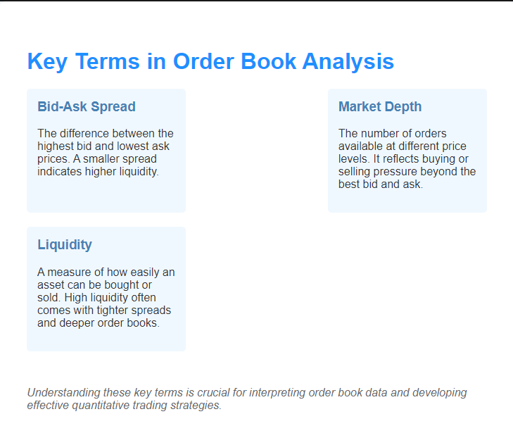

## Table of Contents

## What is an order book in the context of financial markets?

An order book is like a list that keeps track of all the buy and sell orders for a specific financial asset, like a stock or a cryptocurrency, in a market. It shows how many people want to buy the asset at different prices and how many people want to sell it at different prices. This list helps traders see the current demand and supply for the asset, which can help them decide when and at what price to buy or sell.

The order book is updated in real-time as new orders come in and old orders are filled or canceled. If you want to buy, you can see the lowest price someone is willing to sell at, which is called the "ask" price. If you want to sell, you can see the highest price someone is willing to buy at, which is called the "bid" price. The difference between the highest bid and the lowest ask is known as the "bid-ask spread," and it's an important piece of information for traders because it can tell them how easy or hard it might be to trade the asset at that moment.

## What is High-Frequency Trading (HFT)?

High-Frequency Trading (HFT) is a type of trading where computers use special programs to buy and sell things like stocks or currencies very quickly, often in just a few seconds or even less. These programs look at lots of information and try to find small chances to make money by trading a lot, but each trade might only make a tiny bit of money. People who do HFT use powerful computers and special connections to the markets to be faster than other traders.

HFT can be good because it can make markets work better by adding more trading and making it easier to buy or sell things quickly. But it can also be tricky because the fast trading can sometimes cause big price changes that can be hard for other traders to understand or deal with. Some people worry that HFT might not be fair because only those with the fastest technology can take advantage of it.

## How does order book data contribute to HFT strategies?

Order book data is really important for high-frequency trading (HFT) because it helps traders see what's happening in the market right now. HFT traders use computers to look at the order book and find small chances to make money. They look at the buy and sell orders to guess where the price might go next. If they see a lot of people wanting to buy at a certain price, they might buy quickly before the price goes up. If they see a lot of people wanting to sell at a certain price, they might sell quickly before the price goes down.

This fast trading is all about being quicker than everyone else. HFT traders use special programs to see changes in the order book as soon as they happen. They can then make trades in just a few seconds or less. By using order book data, they can spot patterns and make lots of small trades to make a little bit of money each time. It's like trying to catch many small fish instead of waiting for one big one.

## What specific information can traders extract from an order book?

Traders can learn a lot from an order book. They can see how many people want to buy or sell a certain asset at different prices. This helps them understand the current demand and supply. For example, if there are a lot of buy orders at a certain price, it might mean that the price could go up soon because many people want to buy. On the other hand, if there are a lot of sell orders at a certain price, it might mean that the price could go down because many people want to sell.

Traders also look at the "bid" and "ask" prices in the order book. The bid price is the highest price someone is willing to pay to buy the asset, and the ask price is the lowest price someone is willing to sell it for. The difference between these two prices is called the "bid-ask spread." A small spread might mean it's easy to trade the asset because there's a lot of activity, while a big spread might mean it's harder to trade because there's less activity. By watching these details, traders can make better decisions about when and at what price to buy or sell.

## How does order book analysis help in predicting short-term price movements?

Order book analysis helps traders predict short-term price movements by showing them the current demand and supply for an asset. When traders see a lot of buy orders at a certain price, it suggests that many people want to buy, which could push the price up. On the other hand, if there are a lot of sell orders at a certain price, it suggests that many people want to sell, which could push the price down. By looking at these orders, traders can guess where the price might go next in the short term.

Traders also pay attention to the bid and ask prices in the order book. The bid price is the highest price someone is willing to pay to buy the asset, and the ask price is the lowest price someone is willing to sell it for. The difference between these two prices, called the bid-ask spread, can tell traders how easy or hard it might be to trade the asset. A small spread might mean it's easy to trade because there's a lot of activity, while a big spread might mean it's harder to trade because there's less activity. By watching these details, traders can make quick decisions to buy or sell based on their predictions of short-term price movements.

## What are the key metrics derived from order book analysis used in HFT?

Order book analysis in high-frequency trading (HFT) uses several key metrics to help traders make quick decisions. One important metric is the bid-ask spread, which is the difference between the highest price someone is willing to pay (bid) and the lowest price someone is willing to sell (ask). A small spread can mean it's easy to trade because there's a lot of activity, while a big spread can mean it's harder to trade because there's less activity. Traders also look at the order book's depth, which shows how many buy and sell orders there are at different prices. A deep order book with lots of orders can mean the market is stable, while a shallow order book with fewer orders can mean the market might be more volatile.

Another key metric is the order flow, which shows how buy and sell orders are coming into the market. By watching the order flow, traders can see if more people are buying or selling, which can help them predict short-term price movements. For example, if there are a lot of new buy orders, it might mean the price will go up soon. Traders also use metrics like the volume at the best bid and ask, which shows how many shares or units are available at the current best prices. This can help them understand how much they can trade without moving the price too much. By using these metrics, HFT traders can make quick trades to take advantage of small price changes.

## How can order book imbalances be used to inform trading decisions?

Order book imbalances happen when there are more buy orders than sell orders, or more sell orders than buy orders, at certain prices. Traders can use this information to make smart trading decisions. If there are a lot more buy orders than sell orders, it might mean that the price of the asset could go up soon because many people want to buy it. On the other hand, if there are a lot more sell orders than buy orders, it might mean that the price could go down because many people want to sell it. By looking at these imbalances, traders can guess where the price might go next and decide whether to buy or sell.

For example, if a trader sees a big imbalance with more buy orders, they might decide to buy the asset quickly before the price goes up. They can use this information to make a quick profit by selling the asset at a higher price later. On the flip side, if they see a big imbalance with more sell orders, they might decide to sell the asset before the price goes down. This way, they can avoid losing money or even make a profit by buying the asset back at a lower price later. Order book imbalances give traders a snapshot of what's happening in the market right now, helping them make fast and informed trading decisions.

## What are the challenges of real-time order book analysis in HFT?

Real-time order book analysis in high-frequency trading (HFT) can be really tricky because everything happens so fast. Traders need to look at a lot of information and make decisions in just a few seconds or even less. This means they need very fast computers and special connections to the markets to see the order book data as soon as it changes. If their technology is even a little bit slower than their competitors', they might miss out on making money. Also, the order book is always changing, so traders have to keep up with all the new buy and sell orders coming in and the old ones being filled or canceled.

Another challenge is that the market can be unpredictable. Sometimes, a big order can come in and change the whole order book in an instant, making it hard for traders to guess what will happen next. This can lead to sudden price changes that can be hard to deal with. Plus, there's a lot of competition in HFT, and everyone is trying to use the same information to make money. This means traders have to be really smart and quick to find small chances to make a profit before someone else does. It's like trying to win a race where everyone is running as fast as they can.

## How do HFT firms use order book data to gain a competitive edge?

HFT firms use order book data to gain a competitive edge by analyzing it in real-time to spot small chances to make money. They use powerful computers and special connections to the markets to see the order book as soon as it changes. This lets them make quick trades before other traders can react. For example, if they see a lot of buy orders coming in, they might buy the asset quickly before the price goes up. If they see a lot of sell orders, they might sell the asset before the price goes down. By being faster and smarter than other traders, HFT firms can make lots of small trades and earn a little bit of money each time.

Another way HFT firms use order book data is by looking at imbalances between buy and sell orders. If there are more buy orders than sell orders, it might mean the price will go up soon. If there are more sell orders than buy orders, it might mean the price will go down. HFT firms use this information to decide when to buy or sell. They can make quick profits by buying before the price goes up and selling before it goes down. This helps them stay ahead of other traders who might not be able to see these imbalances as quickly or act on them as fast.

## What advanced techniques are used in order book analysis for HFT?

HFT firms use advanced techniques like machine learning and artificial intelligence to analyze order book data. These techniques help them find patterns and make predictions about where the price might go next. For example, they might use algorithms to look at past order book data and see what happened when certain patterns appeared. This can help them guess what will happen in the future and make quick trades to take advantage of small price changes. By using these smart programs, HFT firms can make better decisions and stay ahead of other traders.

Another advanced technique is called "latency arbitrage." This is when HFT firms use super fast connections to see changes in the order book before other traders do. They can then make trades based on this information before the price changes. For example, if they see a big buy order coming in, they might buy the asset quickly and then sell it at a higher price a few seconds later. This technique relies on being faster than everyone else, so HFT firms invest a lot in technology to make sure they have the quickest possible connection to the markets. By using these advanced techniques, HFT firms can find small chances to make money and stay competitive in the fast-paced world of high-frequency trading.

## How does the integration of machine learning enhance order book analysis in HFT?

Machine learning helps high-frequency trading (HFT) firms get better at analyzing order book data by finding patterns that are hard for people to see. These smart programs can look at a lot of past data to learn what happens when certain things appear in the order book. For example, they can learn that when there are a lot more buy orders than sell orders, the price often goes up. By using this knowledge, HFT firms can predict what might happen next and make quick trades to take advantage of small price changes. This makes their trading decisions smarter and faster, helping them make more money.

Another way machine learning helps is by making the trading process more automatic. Instead of people having to watch the order book all the time, the computer can do it for them. The machine learning program can keep learning and getting better at spotting patterns and making predictions. This means HFT firms can make trades based on the latest information without having to wait for someone to decide. By using machine learning, HFT firms can stay ahead of other traders and make the most of every small chance to make money in the fast-paced world of high-frequency trading.

## What are the regulatory considerations and ethical implications of using order book analysis in HFT?

Using order book analysis in high-frequency trading (HFT) comes with some regulatory considerations. Governments and financial watchdogs want to make sure that markets are fair and that no one is cheating. They might set rules about how fast traders can make trades or how much information they can use. For example, some places have rules about how close trading computers can be to the market's data center to stop some traders from getting information too quickly. These rules are there to make sure everyone has a fair chance to trade and that the market stays stable.

There are also ethical questions about using order book analysis in HFT. Some people worry that HFT firms might have an unfair advantage because they can see and react to order book data faster than others. This could make the market less fair for regular traders who don't have the same technology. There's also a concern that HFT can cause big price changes that can be hard for other traders to deal with. It's important for HFT firms to think about these issues and try to trade in a way that doesn't hurt the market or other people.

## References & Further Reading

[1]: Bergstra, J., Bardenet, R., Bengio, Y., & Kégl, B. (2011). ["Algorithms for Hyper-Parameter Optimization."](https://papers.nips.cc/paper_files/paper/2011/hash/86e8f7ab32cfd12577bc2619bc635690-Abstract.html) Advances in Neural Information Processing Systems 24.

[2]: ["Advances in Financial Machine Learning"](https://www.amazon.com/Advances-Financial-Machine-Learning-Marcos/dp/1119482089) by Marcos Lopez de Prado

[3]: ["Evidence-Based Technical Analysis: Applying the Scientific Method and Statistical Inference to Trading Signals"](https://www.wiley.com/en-gb/Evidence+Based+Technical+Analysis:+Applying+the+Scientific+Method+and+Statistical+Inference+to+Trading+Signals-p-9780470008744) by David Aronson

[4]: ["Machine Learning for Algorithmic Trading"](https://www.amazon.com/Machine-Learning-Algorithmic-Trading-intelligence/dp/9918608013) by Stefan Jansen

[5]: ["Quantitative Trading: How to Build Your Own Algorithmic Trading Business"](https://www.amazon.com/Quantitative-Trading-Build-Algorithmic-Business/dp/0470284889) by Ernest P. Chan