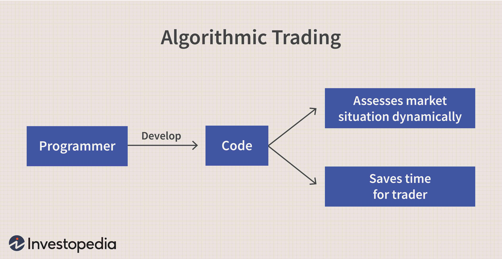

## Table of Contents

## What is order flow analysis?

Order flow analysis is a way to understand how people are buying and selling a stock or other financial product. It looks at the orders coming in to see if there are more buyers or sellers, and how big those orders are. This helps traders guess where the price might go next. By watching the order flow, traders can see if there's a lot of interest in buying or selling, which can tell them if the price might go up or down soon.

For example, if a trader sees a lot of big buy orders coming in, they might think the price will go up because there's a lot of demand. On the other hand, if there are a lot of big sell orders, the price might go down because people want to get rid of the stock. Order flow analysis can be tricky because it's always changing, but it gives traders a way to make better guesses about what might happen next in the market.

## How does order flow analysis differ from traditional technical analysis?

Order flow analysis and traditional technical analysis are two different ways to look at the stock market, but they focus on different things. Order flow analysis looks at the actual buying and selling orders that come into the market. It tries to understand how much people want to buy or sell a stock right now, and how big those orders are. This can help traders guess where the price might go next based on the current demand and supply. For example, if there are a lot of big buy orders, it might mean the price will go up soon because there's a lot of interest in buying.

On the other hand, traditional technical analysis looks at past price movements and patterns on charts. It uses things like moving averages, support and resistance levels, and other indicators to predict future price movements. Technical analysts believe that history repeats itself, so they look for patterns that have happened before to guess what might happen next. While order flow analysis is more about what's happening right now in the market, technical analysis is more about what has happened in the past and what patterns might repeat.

Both methods can be useful, but they give traders different kinds of information. Order flow analysis can give a more real-time view of market sentiment, while technical analysis provides a broader historical context. Some traders use both methods together to get a more complete picture of the market and make better trading decisions.

## What are the basic components of order flow data?

Order flow data includes several basic components that help traders understand what's happening in the market. The first component is the bid and ask prices. The bid price is what buyers are willing to pay for a stock, and the ask price is what sellers are asking for it. The difference between these two prices is called the bid-ask spread. By looking at these prices, traders can see how much people are willing to pay or sell for a stock right now.

Another important part of order flow data is the [volume](/wiki/volume-trading-strategy) of trades. This shows how many shares of a stock are being bought and sold. High volume can mean there's a lot of interest in the stock, while low volume might mean less interest. Traders also look at the size of the orders. Big orders can move the price more than small ones. By watching the size and volume of orders, traders can get a sense of whether the market is leaning towards buying or selling.

The last basic component is the order types. There are different kinds of orders, like market orders, which are filled right away at the current price, and limit orders, which are set to buy or sell at a specific price. Knowing what types of orders are coming in can help traders predict how the price might move. For example, a lot of limit orders at a certain price might act as a support or resistance level. By putting all these pieces together, traders can use order flow data to make better guesses about where the market might go next.

## Why is order flow important in understanding market dynamics?

Order flow is important because it shows what people are doing in the market right now. It tells us if there are more buyers or sellers and how big their orders are. This helps traders see if the market is moving up or down. For example, if there are a lot of big buy orders, it means many people want to buy the stock, which can push the price up. On the other hand, if there are a lot of big sell orders, it means many people want to sell, which can push the price down. By looking at the order flow, traders can get a better idea of what might happen to the price next.

Understanding order flow also helps traders see the balance between supply and demand. If there are more buyers than sellers, it means there's more demand, which can make the price go up. If there are more sellers than buyers, it means there's more supply, which can make the price go down. Order flow gives traders a real-time view of this balance, which is more immediate than looking at charts or past data. This can help them make quicker and better decisions about when to buy or sell.

## How can order flow analysis improve the performance of trading algorithms?

Order flow analysis can help trading algorithms work better by giving them real-time information about what's happening in the market. When a trading algorithm knows if there are more buyers or sellers and how big their orders are, it can make smarter decisions about when to buy or sell. For example, if the algorithm sees a lot of big buy orders coming in, it might decide to buy the stock too because the price is likely to go up soon. This can help the algorithm make more money by getting in and out of trades at the right times.

Using order flow data also lets trading algorithms see the balance between supply and demand more clearly. If there are more buyers than sellers, the algorithm can predict that the price will go up and act quickly to take advantage of this. On the other hand, if there are more sellers, it can predict a price drop and adjust its strategy accordingly. By reacting to the current market conditions instead of just looking at past data, trading algorithms can improve their performance and make better trades.

## What are the key metrics used in order flow analysis for algorithmic trading?

In order flow analysis for [algorithmic trading](/wiki/algorithmic-trading), one of the key metrics is the bid-ask spread. This is the difference between the highest price someone is willing to pay for a stock (the bid) and the lowest price someone is willing to sell it for (the ask). A smaller spread often means there's a lot of interest in the stock and it's easier to buy and sell quickly. A larger spread can mean less interest or more risk, so algorithms use this metric to decide if it's a good time to trade.

Another important metric is the volume of trades. This tells algorithms how many shares of a stock are being bought and sold. High volume can mean a lot of people are interested in the stock, which might make the price move more. Low volume can mean less interest, so the price might not move as much. Algorithms look at volume to see if there's enough activity to make a trade worthwhile.

The size of orders is also a key metric. Big orders can move the price more than small ones, so algorithms pay attention to this. If there are a lot of big buy orders, it might mean the price will go up soon, so the algorithm might decide to buy too. If there are a lot of big sell orders, it might mean the price will go down, so the algorithm might decide to sell or wait. By looking at these metrics, algorithms can make smarter trading decisions based on what's happening in the market right now.

## How does order flow analysis help in predicting short-term price movements?

Order flow analysis helps in predicting short-term price movements by looking at the real-time buying and selling orders in the market. It shows if there are more people wanting to buy or sell a stock right now, and how big their orders are. If there are a lot of big buy orders coming in, it means many people want to buy the stock, which can push the price up quickly. On the other hand, if there are a lot of big sell orders, it means many people want to sell, which can push the price down fast. By watching these orders, traders can get a good idea of where the price might go next in the short term.

Using order flow analysis also helps traders see the balance between supply and demand in the market. If there are more buyers than sellers, it means there's more demand, which can make the price go up in the short term. If there are more sellers than buyers, it means there's more supply, which can make the price go down. Because order flow analysis gives traders a real-time view of this balance, they can make quick decisions about when to buy or sell to take advantage of these short-term price movements.

## What are the common tools and platforms used for order flow analysis in algorithmic trading?

For order flow analysis in algorithmic trading, traders often use special software and platforms. One popular tool is the Level II quote system, which shows real-time data about the bid and ask prices and the size of orders. This helps traders see what's happening in the market right now. Another tool is the time and sales window, which lists every trade that happens, showing the price, the size of the trade, and whether it was a buy or a sell. This can help traders see the flow of orders and how they're affecting the price.

Some traders also use platforms like NinjaTrader, which has tools for analyzing order flow and creating trading algorithms. These platforms can show the [order book](/wiki/order-book-trading-strategies), which is a list of all the buy and sell orders waiting to be filled. This helps traders see the balance between supply and demand. Other popular platforms include TradeStation and MetaTrader, which offer similar tools for order flow analysis and can be used to build and test trading algorithms based on this data. By using these tools, traders can get a better understanding of the market and make smarter trading decisions.

## How can traders integrate order flow analysis into their existing algorithmic trading strategies?

Traders can integrate order flow analysis into their existing algorithmic trading strategies by adding real-time data about buy and sell orders to their algorithms. This means the algorithms can see if there are more buyers or sellers and how big their orders are. For example, if the algorithm notices a lot of big buy orders coming in, it can decide to buy the stock too because the price might go up soon. This helps the algorithm make smarter decisions about when to buy or sell based on what's happening in the market right now.

To do this, traders need to use tools like Level II quote systems or time and sales windows, which show real-time order data. They can also use platforms like NinjaTrader, TradeStation, or MetaTrader, which have built-in tools for order flow analysis. By adding this data to their algorithms, traders can make their strategies more responsive to short-term market movements. This can help them make better trades and possibly earn more money.

## What are the challenges and limitations of using order flow analysis in algorithmic trading?

Using order flow analysis in algorithmic trading can be tricky because it's all about what's happening in the market right now, and that can change really fast. Sometimes, the data can be hard to read because there might be a lot of small orders that don't really matter, or big orders that can move the price a lot. Also, not all trading platforms show the same order flow data, so what you see might be different from what someone else sees. This can make it hard to trust the data and make good trading decisions based on it.

Another challenge is that order flow analysis doesn't tell you everything about the market. It's just one piece of the puzzle. For example, it doesn't look at things like news events or big economic changes that can also affect stock prices. Plus, if a lot of traders are using the same order flow data, they might all try to do the same thing at the same time, which can make the market move in unexpected ways. So, while order flow analysis can help, it's important to use it along with other kinds of analysis to get a fuller picture of the market.

## How does order flow analysis contribute to high-frequency trading strategies?

Order flow analysis is really important for high-frequency trading because it helps traders see what's happening in the market right now. High-frequency trading is all about making a lot of trades very quickly, and order flow data tells them if there are more buyers or sellers and how big their orders are. If there are a lot of big buy orders coming in, a high-frequency trader might decide to buy the stock too because the price is likely to go up soon. This helps them make quick trades to take advantage of small price changes that happen all the time.

But, using order flow analysis in high-frequency trading also has its challenges. The market can change very fast, so the data has to be really up-to-date. Sometimes, there can be a lot of small orders that don't matter much, or big orders that can move the price a lot. Also, if many traders are using the same order flow data, they might all try to do the same thing at the same time, which can make the market move in ways that are hard to predict. So, while order flow analysis is helpful, high-frequency traders need to use it carefully and with other kinds of analysis to make the best trading decisions.

## What advanced techniques can be applied to order flow data to enhance algorithmic trading decisions?

One advanced technique to enhance algorithmic trading decisions is using [machine learning](/wiki/machine-learning) to look at order flow data. Machine learning can help find patterns in the data that might be hard for people to see. For example, it can figure out if certain kinds of orders are more likely to lead to big price changes. By using this information, an algorithm can make better guesses about when to buy or sell, and it can learn from its past trades to get even better over time.

Another technique is called volume-weighted average price (VWAP) analysis. This looks at the average price of a stock, but it gives more weight to the prices when there's a lot of trading happening. By comparing the current price to the VWAP, an algorithm can see if the stock is a good deal right now. If the current price is lower than the VWAP, it might be a good time to buy. If it's higher, it might be a good time to sell. This can help the algorithm make smarter trades based on how much people are buying and selling.

Lastly, traders can use something called order book imbalance to improve their algorithms. This looks at the difference between the number of buy orders and sell orders in the order book. If there are a lot more buy orders than sell orders, it means there's more demand, which can push the price up. If there are more sell orders, it means there's more supply, which can push the price down. By watching this imbalance, an algorithm can predict short-term price movements and make trades at the right times to take advantage of them.

## What are the benefits of using order flow analysis in trading algorithms?

Order flow analysis can significantly enhance trading accuracy and efficiency by providing a deeper understanding of market activity. By examining the types and quantities of orders—such as market orders, limit orders, and stop orders—traders gain the ability to assess the underlying supply and demand dynamics that drive price movements. This granular level of insight helps in pinpointing precise entry and [exit](/wiki/exit-strategy) points for trades, thereby optimizing trading strategies.

One of the primary advantages of integrating order flow analysis into trading algorithms is its ability to identify emerging market trends and potential reversals before traditional technical analysis methods. By monitoring shifts in buying and selling pressure, traders can detect subtle signals that might indicate a forthcoming change in trend. For instance, a sudden increase in buy orders might signal a bullish reversal, while a surge in sell orders could foreshadow a bearish turn.

To put this into practice, consider using Python libraries such as pandas and numpy to handle and analyze large datasets related to order flow. For example, traders could apply algorithms that calculate the cumulative volume delta (CVD), which is the difference between the volume of buy and sell orders. This can be defined as:

$$
CVD = \sum (Buy\ Volume - Sell\ Volume)
$$

Analyzing the CVD over time can reveal whether buying [momentum](/wiki/momentum) is increasing or decreasing, providing actionable insights for strategy development.

Moreover, order flow analysis supports the mitigation of trading risk by improving the timing of trades. Algorithms equipped with real-time order flow information can react to market conditions faster than those relying solely on price-based indicators. As a result, traders can reduce slippage and minimize the impact of adverse price movements.

In conclusion, by enhancing the precision of trading algorithms and allowing for more informed decision-making, order flow analysis offers traders a substantial competitive edge. The ability to anticipate market movements and adjust strategies proactively is indispensable in today's fast-paced markets.

## References & Further Reading

[1]: Bouchaud, J.P., Farmer, J.D., & Lillo, F. (2008). ["How Markets Slowly Digest Changes in Supply and Demand."](https://arxiv.org/abs/0809.0822) Handbook of Financial Markets: Dynamics and Evolution. DOI: 10.1016/B978-012374258-2.50005-1.

[2]: Lopez de Prado, M. (2018). ["Advances in Financial Machine Learning"](https://www.wiley.com/en-us/Advances+in+Financial+Machine+Learning-p-9781119482086). John Wiley & Sons.

[3]: Chan, E.P. (2009). ["Quantitative Trading: How to Build Your Own Algorithmic Trading Business"](https://www.amazon.com/Quantitative-Trading-Build-Algorithmic-Business/dp/0470284889). John Wiley & Sons.

[4]: Harris, L. (2003). ["Trading and Exchanges: Market Microstructure for Practitioners"](https://www.amazon.com/Trading-Exchanges-Microstructure-Practitioners-Financial/dp/0195144708). Oxford University Press.

[5]: Johnson, B. (2010). ["Algorithmic Trading & DMA: An Introduction to Direct Access Trading Strategies"](https://www.amazon.com/Algorithmic-Trading-DMA-Introduction-Strategies/dp/0956399207). 4Myeloma Press.

[6]: Aldridge, I. (2013). ["High-Frequency Trading: A Practical Guide to Algorithmic Strategies and Trading Systems"](https://www.amazon.com/High-Frequency-Trading-Practical-Algorithmic-Strategies/dp/1118343506) (2nd ed.). Wiley Finance.

[7]: Gould, M.D., Porter, M.A., Williams, S., McDonald, M., Fenn, D.J., & Howison, S.D. (2013). ["Limit Order Books"](https://arxiv.org/abs/1012.0349). Quantitative Finance, 13(11), 1709-1742. DOI: 10.1080/14697688.2013.803148.