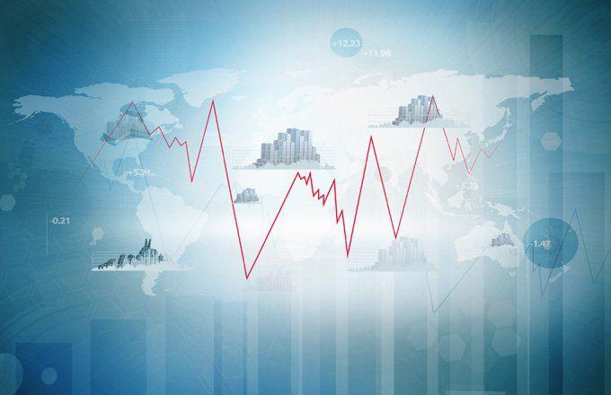

## Table of Contents

## What is a stock split?

A stock split is when a company decides to divide its existing shares into more shares. This means if you own one share, after the split, you might own two or more shares, but the total value of your investment stays the same. Companies do this to make their stock price lower, which can attract more investors. For example, if a stock is trading at $100 per share and the company does a 2-for-1 split, the price per share will drop to $50, but you'll have twice as many shares.

The main reason companies do stock splits is to make their shares seem more affordable to small investors. When the price per share is lower, more people might be willing to buy the stock. However, it's important to remember that a stock split doesn't change the overall value of the company or your investment. It's just like cutting a pizza into more slices; the pizza is still the same size, but now there are more pieces to go around.

## How does a stock split affect the stock price?

When a company does a stock split, it makes the price of each share go down. This happens because the company is dividing its existing shares into more shares. For example, if you have one share worth $100 and the company does a 2-for-1 split, you'll get two shares, but each will now be worth $50. So, the total value of your investment stays the same, but the price per share is lower.

The main reason companies do this is to make their stock seem cheaper and more attractive to new investors. When the price per share is lower, more people might want to buy it. But remember, even though the price per share goes down, the overall value of the company doesn't change. It's like cutting a pizza into more slices; the pizza is still the same size, but now there are more pieces to share.

## Can a stock split change the value of my investment?

A stock split does not change the overall value of your investment. If you own one share worth $100 and the company does a 2-for-1 split, you will have two shares, but each will be worth $50. So, the total value of your investment stays the same, at $100. The split just makes the price per share lower, but it doesn't affect the total worth of what you own.

The reason companies do stock splits is to make their stock look cheaper and attract more investors. When the price per share goes down, more people might think it's a good time to buy. But remember, even though the price per share changes, the value of the whole company stays the same. It's like cutting a pizza into more slices; the pizza doesn't get bigger or smaller, it's just divided differently.

## Why might a company decide to do a stock split?

A company might decide to do a stock split to make their stock look cheaper and attract more investors. When the price of a share is high, some people might think it's too expensive to buy. By doing a stock split, the company can lower the price per share, making it seem more affordable. This can encourage more people to buy the stock, which can increase the number of shareholders and make the stock more popular.

Another reason for a stock split is to keep the stock within a certain price range that's considered attractive to investors. For example, if a company's stock price gets too high, it might be removed from certain stock indexes that have price limits. By splitting the stock, the company can keep its stock price within these limits and stay in those indexes. This can help the company's stock stay visible and appealing to a wider range of investors.

## What are the potential downsides of a stock split for investors?

A stock split doesn't have many downsides for investors because it doesn't change the total value of their investment. If you own one share worth $100 and the company does a 2-for-1 split, you'll have two shares worth $50 each, so your investment is still worth $100. But one thing to watch out for is that a stock split might make the stock price seem cheaper, which can attract more investors. If too many people buy the stock because it looks like a bargain, the stock price might go up a lot, and then it could be hard to sell the stock at a good price if everyone wants to sell at the same time.

Another possible downside is that after a stock split, the stock might get a lot of attention from new investors. This can lead to more ups and downs in the stock price, which can be risky. If you're not ready for the stock price to move around a lot, you might feel nervous about your investment. But remember, these are not big problems, and for most people, a stock split is just a way for the company to share its stock with more people without changing the value of what they own.

## How can a stock split impact the perception of a company?

A stock split can make a company look more attractive to investors. When a company splits its stock, the price per share goes down. This can make the stock seem cheaper and more affordable to new investors. More people might want to buy the stock because they think it's a good deal. This can make the company look popular and successful, which can be good for its image.

On the other hand, a stock split can also make some investors think the company is trying to trick them. If the stock price goes down a lot after a split, some people might think the company is not doing well. They might worry that the company is trying to hide problems by making the stock price look lower. But usually, a stock split is just a way for a company to share its stock with more people without changing its overall value.

## Does a stock split always lead to increased liquidity?

A stock split often makes a stock more liquid. Liquidity means how easy it is to buy or sell a stock. When a company splits its stock, the price per share goes down. This can make more people want to buy the stock because it seems cheaper. More buyers and sellers make it easier to trade the stock, which is what we mean by increased liquidity.

But a stock split doesn't always lead to more liquidity. If not many people are interested in the stock, even after the split, it won't become more liquid. Also, if the stock price was already low before the split, the split might not make a big difference. So, while a stock split can help, it's not a guarantee that the stock will be easier to buy and sell.

## What are the tax implications of a stock split?

A stock split usually doesn't change your taxes right away. When a company does a stock split, it's just dividing the shares you already own into more shares. The total value of your investment stays the same, so you don't have to pay taxes just because of the split. You only have to think about taxes when you sell your shares, and the tax depends on how much money you make from selling them.

But there's something to keep in mind if you get a stock split and then sell some of your shares. If you sell some shares after a split, you need to figure out the cost of each share for tax purposes. After a split, the cost of each share goes down because you have more shares. This can change how much tax you owe when you sell. It's a good idea to talk to a tax expert to make sure you're doing everything right.

## How might a stock split affect options and other derivatives?

When a company does a stock split, it can change the terms of options and other derivatives that are based on the stock. Options give you the right to buy or sell a stock at a certain price. If the company does a 2-for-1 split, the number of shares you can buy or sell with each option will double, but the price you can buy or sell at will be cut in half. This keeps the total value of the option the same, but it means you'll need to adjust your plans if you were thinking about using the option.

Other derivatives, like futures contracts, work in a similar way. If a company does a stock split, the terms of the futures contract will change to match the new number of shares and the new price per share. This makes sure that the value of the contract stays the same, but it can make things more complicated if you're not used to dealing with stock splits. It's important to check the details of any options or derivatives you own if a company you're invested in does a stock split.

## Can frequent stock splits signal underlying issues within a company?

Frequent stock splits might make some people think there are problems with the company. If a company keeps splitting its stock, it could mean they want to keep the price low to make it look like a good deal. This might make people worry that the company is trying to trick them into buying the stock because the business isn't doing well. But it's not always a bad sign. Some companies do frequent stock splits just to keep their stock price in a range that's easy for people to buy.

It's important to look at other things about the company, not just the stock splits. If the company is making money and growing, then the stock splits might not be a problem. But if the company is losing money or not doing well in other ways, then the frequent stock splits could be a sign that they're trying to hide those problems. Always look at the whole picture before deciding what the stock splits mean for the company.

## What historical examples show negative outcomes from stock splits?

One historical example of a stock split leading to negative outcomes is the case of Enron in the late 1990s. Enron did a 2-for-1 stock split in 1999 when its stock price was high. At first, it seemed like a good move to attract more investors. But soon after, it turned out that Enron was hiding big financial problems. The stock split made the stock look cheaper, but it couldn't hide the fact that the company was in trouble. When the truth came out, Enron's stock price crashed, and the company went bankrupt.

Another example is WorldCom, which did a 2-for-1 stock split in 1999. Like Enron, WorldCom's stock split made the stock price look more affordable, but it didn't change the fact that the company was lying about its financial health. After the split, WorldCom's stock kept going up for a while, but when people found out about the fraud, the stock price fell a lot. WorldCom ended up going bankrupt too. These examples show that while a stock split can make a stock look better in the short term, it can't fix bigger problems in a company.

## How should an investor analyze the impact of a stock split on their portfolio?

When a company does a stock split, an investor needs to look at how it changes their portfolio. A stock split doesn't change the total value of what you own right away. If you have one share worth $100 and the company does a 2-for-1 split, you'll have two shares worth $50 each. So, your investment is still worth $100. But you should think about how the split might affect the stock price in the future. More people might want to buy the stock because it looks cheaper, which could make the price go up. But if too many people buy and then want to sell at the same time, the price could go down a lot.

It's also important to look at why the company is doing the stock split. If the company is doing well and wants to make its stock easier for more people to buy, that's usually a good sign. But if the company is doing a lot of stock splits and it seems like they're trying to keep the price low because they're having problems, that could be a warning. Always look at the whole picture, not just the stock split. Check the company's earnings, how it's growing, and what other investors think. This will help you decide if the stock split is good or bad for your investment.

## What is the impact on algorithmic trading systems?

Stock splits can significantly disrupt the calibration of algorithmic trading systems. At their core, these algorithms depend on metrics such as price and volume, which are intrinsically altered when a stock split occurs. For example, in a 2-for-1 stock split, the price of the stock is halved while the number of outstanding shares is doubled. This mechanical alteration immediately impacts the price data fed into the algorithms. Consequently, adjustments and recalibrations in trading systems are imperative to maintain accuracy and precision.

To maintain effective operation, algorithmic models must adjust their parameters swiftly to reflect new price levels. Failure to rapidly update these inputs can cause discrepancies in trading positions, leading to suboptimal trading decisions. Consider an algorithm designed to execute trades based on a moving average crossover strategy. After a stock split, the historical data used to calculate moving averages must be adjusted proportionally to avoid distorted signals.

### Calculation Adjustments
A simple example can illustrate the necessary adjustments:

Before the split:
- Price = $100
- Volume = 1,000 shares

After a 2-for-1 stock split:
- Adjusted price = $50
- Adjusted volume = 2,000 shares

$$
\text{Adjusted Moving Average} = \frac{\text{Sum of adjusted prices over period}}{\text{Period length}}
$$

In code, recalibrating a simple moving average (SMA) post-split can be depicted as follows:

```python
def adjust_prices_for_split(prices, split_ratio):
    return [price / split_ratio for price in prices]

def calculate_sma(adjusted_prices, period):
    return sum(adjusted_prices[-period:]) / period

# Example usage
prices = [100, 102, 104, 106, 108]
split_ratio = 2  # 2-for-1 split
adjusted_prices = adjust_prices_for_split(prices, split_ratio)
sma = calculate_sma(adjusted_prices, 3)
```

The need for recalibration can lead to potential downtime as algorithms may need to pause for system recalibrations after a stock split event is confirmed. Performance degradation during this period is a real risk if systems are not equipped to swiftly handle the recalibration process. Moreover, the complexity increases with more sophisticated strategies that may rely on derivatives of price and [volume](/wiki/volume-trading-strategy) data.

To mitigate these challenges, [algorithmic trading](/wiki/algorithmic-trading) systems should incorporate preemptive checks that allow for on-the-fly adjustments when a stock split is announced. Automation of recalibration processes ensures minimal disruption to trading activities, enabling algorithms to swiftly resume operation with realigned data inputs. This adaptability is crucial for maintaining trading efficiency and profitability in the dynamic landscape of stock trading, where splits can be both an opportunity and a challenge.

## What are the challenges related to execution and slippage?

A stock split can significantly influence the [liquidity](/wiki/liquidity-risk-premium) profiles of affected stocks, which poses challenges in executing algorithmic trades effectively. When a stock undergoes a split, its price decreases proportionally while the number of shares increases, typically leading to augmented trading volumes. This change in trading volume can disrupt the intended order execution, as algorithms designed with specific liquidity conditions in mind may no longer function optimally.

**Altered Liquidity Profiles**

During a stock split, increased liquidity might seem advantageous due to reduced bid-ask spreads. However, this can also trigger increased [volatility](/wiki/volatility-trading-strategies), complicating the trading landscape. High liquidity can attract a surge of retail and institutional investors, resulting in more competition for favorable prices and impacting the timing and success of trade executions. For algorithms, programmed to execute trades under particular liquidity conditions, this shift can lead to discrepancies between expected and actual performance due to increased competition and fluctuating order sizes.

**Increased Slippage Risks**

Slippage, the difference between the expected price of a trade and the actual price, tends to increase in the wake of stock splits. Algorithms that rely on precise entry and [exit](/wiki/exit-strategy) points encounter greater difficulties because of the dynamic change in stock price behavior post-split. For instance, consider the formula for slippage as:

$$
\text{Slippage} = \frac{(P_{\text{expected}} - P_{\text{actual}}) \times \text{shares}}{\text{total shares executed}}
$$

Increased order flows and market participants can drive the actual price $(P_{\text{actual}})$ away from the expected $(P_{\text{expected}})$, hence elevating slippage.

**Impact on Order Book Dynamics**

The dynamics of the [order book](/wiki/order-book-trading-strategies) are critical to understanding how splits affect execution. A stock split causes a recalibration of the order book, affecting its depth and liquidity. As more shares become available at a lower price, the concentrations of buy and sell orders shift, which might lead to longer execution times and potential mismatches in trade sizes. Algorithms tasked with high-frequency trading or those dependent on specific market depths must reevaluate their parameters to cope with these altered conditions.

In practical terms, implementing adaptive strategies within the algorithmic models is crucial. These strategies should prioritize flexibility to accommodate sudden changes in order book patterns, such as dynamically adjusting limit order placements based on current volatility and liquidity levels. For instance, Python code employing an adaptive limit order approach might look like this:

```python
def adaptive_limit_order(current_price, volatility_factor, base_order_size):
    # Adjust order size based on market volatility
    adjusted_order_size = base_order_size * (1 + volatility_factor)

    # Calculate limit price adjustment
    limit_price = current_price * (1 - (volatility_factor * 0.01))

    return limit_price, adjusted_order_size

volatility_factor = 0.05  # Example volatility factor
base_order_size = 100  # Number of shares

current_price = 50.00  # Example stock price

limit_price, adjusted_order_size = adaptive_limit_order(current_price, volatility_factor, base_order_size)
```

This adaptive approach can help mitigate the execution challenges posed by stock splits, by ensuring that algorithmic trades are executed efficiently despite fluctuating conditions.

## What is the relationship between market sentiment and volatility concerns?

Stock splits, while not altering a company's intrinsic value, can trigger market sentiment shifts and short-term volatility. Such fluctuations present significant challenges for algorithmic trading strategies, which often rely on price stability and predictability to maintain precision in execution.

Algorithmic traders must proactively account for volatility spikes that frequently accompany stock splits. These spikes can be attributed to a variety of market reactions, including increased attention from retail investors and adjustments by institutional investors. Consequently, algorithms may encounter inconsistent price movements, complicating buy and sell decisions that were previously based on stable price trends. For instance, a company's stock that typically trades within a narrow range may experience widened spreads and erratic pricing behavior post-split, forcing algorithms to adapt in real-time to avoid erroneous trades.

Strategies designed around price stability can be particularly vulnerable to these disruptions. Models that assume constant volatility may need significant recalibrations to handle sudden changes observed after a split. For example, volatility-based metrics such as the standard deviation of returns $\sigma$ may increase considerably, affecting risk management protocols:

$$
\sigma = \sqrt{\frac{\sum (R_i - \bar{R})^2}{N}}
$$

where $R_i$ denotes individual stock returns, $\bar{R}$ is the average return, and $N$ is the number of observations. Increased $\sigma$ can lead to higher calculated risk and trigger changes in algorithmic decision-making processes concerning position sizing and stop-loss levels.

Navigating the increased volatility requires algorithms that encompass robust adaptability features. For instance, employing [machine learning](/wiki/machine-learning) models that can dynamically adjust to new volatility patterns or implementing volatility forecasting techniques could help in anticipating market behavior and refining trade execution strategies. Ensuring these adaptive mechanisms are in place helps sustain the precision needed for algorithmic trading amidst the uncertainties introduced by stock splits.

Overall, while stock splits may provide a positive signal to traditional investors, algorithmic traders must thoroughly assess the volatility risks to uphold their strategic edge in a dynamically shifting market landscape.

## References & Further Reading

[1]: Wadhwa, S., & Bansal, A. (2016). ["Impact of Stock Split Announcements on Stock Prices and Liquidity in Indian Equity Market."](https://papers.ssrn.com/sol3/papers.cfm?abstract_id=3896945) Zenith International Journal of Multidisciplinary Research.

[2]: Arnold, T., & Holmes, R. (2017). ["Stock Splits and Liquidity: Evidence from Trading Venue Data."](https://onlinelibrary.wiley.com/doi/10.1111/eufm.12460) Journal of Financial Markets.

[3]: ["Algorithmic Trading: Winning Strategies and Their Rationale"](https://www.wiley.com/en-us/Algorithmic+Trading%3A+Winning+Strategies+and+Their+Rationale-p-9781118460146) by Ernest P. Chan

[4]: Michaely, R., Thaler, R. H., & Womack, K. L. (1995). ["Price Reactions to Dividend Initiations and Omissions: Overreaction or Drift?"](https://www.nber.org/papers/w4778) The Review of Financial Studies.

[5]: ["Machine Learning for Algorithmic Trading, Second Edition: Predictive models to extract signals from market and alternative data for systematic trading strategies with Python"](https://www.oreilly.com/library/view/machine-learning-for/9781839217715/Text/Front_Matter.xhtml) by Stefan Jansen