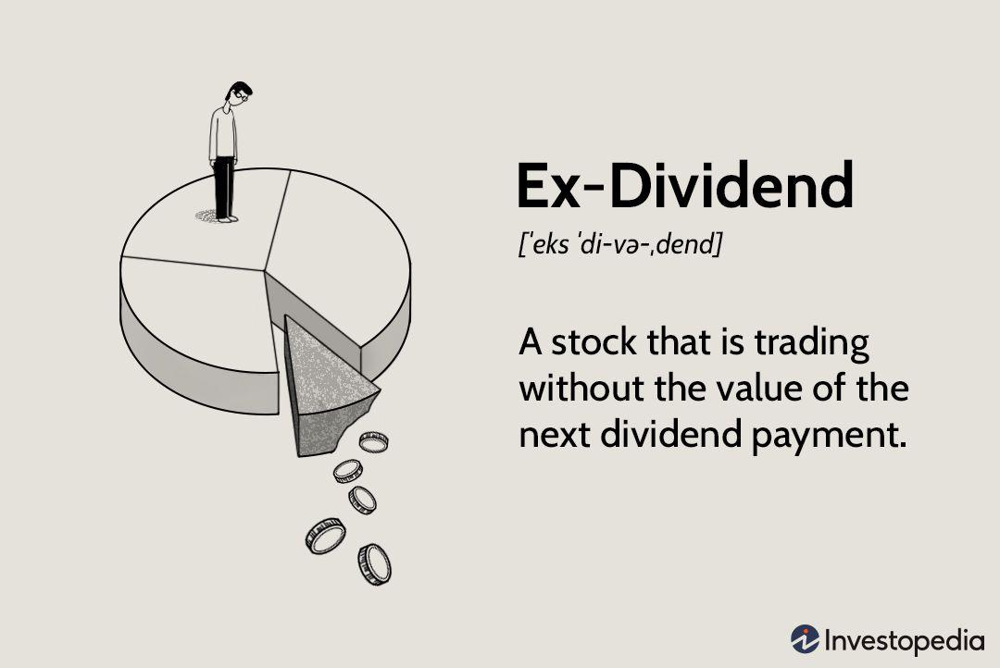

Understanding stock price movements is crucial for investors and traders, particularly in algorithmic trading, where rapid decisions based on data analysis are essential. A notable event that can significantly impact stock prices is the ex-dividend date. On this date, a purchase of stock no longer carries the right to receive the most recently declared dividend. Generally, stock prices tend to drop by an amount roughly equal to the dividend on the ex-dividend date, reflecting the outflow of cash from the company. This predictable pricing behavior offers opportunities for traders, especially those employing algorithms designed to exploit such patterns.

Algorithmic trading systems are adept at processing large volumes of data at high speeds, allowing them to identify and act upon the subtle market movements associated with the ex-dividend event. By understanding the mechanics of ex-dividend dates and their influence on stock prices, traders can employ various strategies to navigate this event, seeking to optimize returns while managing associated risks. This article will explore these strategies and the impact of ex-dividend dates on stock prices, particularly focusing on how algorithmic trading can be leveraged to deal with the price adjustments they precipitate.

## Table of Contents

## What is the Ex-Dividend Date?

An ex-dividend date represents the specific cutoff date set by a company, which determines whether a purchase of the company’s stock includes the right to receive the next dividend payment. Essentially, this date helps to establish which shareholders are eligible to receive the declared dividend. If an investor purchases a stock on or after its ex-dividend date, they will not be entitled to the next dividend distribution. Instead, the previous owner of the stock retains this right if they sold just before the ex-dividend date.

This timing is crucial for traders and investors, as it directly influences potential price movements. For instance, it is typically expected that the stock price will drop by approximately the amount of the dividend on the ex-dividend date. This adjustment reflects the forthcoming outflow of cash from the company’s reserves to its shareholders as dividends.

Understanding the ex-dividend date is essential for designing effective trading strategies. In the context of algorithmic trading, it allows systems to incorporate and react to these expected price shifts. Algorithmic systems need to be finely tuned to account for this date to evaluate investment opportunities accurately and manage positions accordingly. Being aware of these timelines ensures traders and algorithms can make informed decisions, aligning their strategies to potentially capitalize on or mitigate the price changes correlating with the ex-dividend date.

## How Does the Ex-Dividend Date Affect Stock Prices?

On the ex-dividend date, the price of a stock typically experiences a decline approximately equal to the amount of the declared dividend. This price adjustment is a direct consequence of the outflow of cash from the company's assets to compensate shareholders with the dividend. For instance, if a company declares a dividend of $1.00 per share, the stock price is expected to decrease by about $1.00 on the ex-dividend date. This price drop can be represented mathematically as:

$$
P_{\text{ex}} = P_{\text{cum}} - D
$$

where $P_{\text{ex}}$ is the stock price on the ex-dividend date, $P_{\text{cum}}$ is the stock price before the ex-dividend date, and $D$ is the dividend per share.

This phenomenon is rooted in the efficient market hypothesis, which posits that all known information about a stock, including future dividend payments, is already reflected in its price. Therefore, when the stock goes ex-dividend, the future cash flow expected from the dividend is no longer part of the stock's value, leading to a decrease in its price.

This predictable price movement on the ex-dividend date is a fundamental consideration for traders and algorithmic systems aiming to profit from short-term price fluctuations. By accurately forecasting the magnitude of the price drop, traders can design strategies that capitalize on these adjustments to enhance their returns. This aspect of trading is particularly critical for those engaging in high-frequency or [algorithmic trading](/wiki/algorithmic-trading), where rapid execution and precise predictions are essential for success. Understanding the mechanics of price adjustments due to dividends is vital for those aiming to anticipate and respond to short-lived market opportunities.

## Algorithmic Trading Strategies for Ex-Dividend Dates

Algorithmic trading systems utilize advanced technology and computational power to implement strategies specifically designed to capitalize on the nuances of the ex-dividend date. Two prominent strategies employed are the Dividend Capture Strategy and Arbitrage Opportunities.

**Dividend Capture Strategy** involves purchasing shares just before the ex-dividend date to secure the dividend and selling the shares shortly after the date to benefit from the expected price adjustments. This strategy requires precision in timing, as the stock price typically decreases by approximately the amount of the dividend on the ex-dividend date. To maximize returns, traders must efficiently execute both the buy and sell orders around the ex-dividend period. This approach is well-suited for algorithmic trading because algorithms can rapidly analyze historical data, predict optimal entry and exit points, and execute trades at high speeds. The formula for calculating the expected profit from this strategy can be expressed as:

$$
\text{Expected Profit} = (\text{Dividend Received}) - (\text{Transaction Costs}) - (\text{Price Drop on Ex-Dividend Date})
$$

**Arbitrage Opportunities** exist due to small pricing inefficiencies and discrepancies that occur around the ex-dividend date. Algorithms can exploit these opportunities by executing trades based on the differences in pricing between various markets or financial instruments. For instance, if a stock's price does not drop by the full amount of the dividend, algorithms can identify and capitalize on such discrepancies. High-frequency trading systems are particularly effective for this strategy as they can process large volumes of data, identify patterns, and execute trades in fractions of a second. Additionally, algorithms can integrate machine learning models to improve the accuracy and profitability of arbitrage strategies.

Both strategies crucially depend on high-speed trading platforms that allow algorithms to respond swiftly to market changes. These platforms enable traders to maintain a competitive edge by minimizing latency and maximizing the speed of execution, which is critical in capturing the fleeting opportunities associated with the ex-dividend date.

## Risk Management and Regulatory Considerations

Computational models and algorithms play a critical role in managing risk during the volatile periods surrounding ex-dividend dates. These tools are designed to forecast potential price fluctuations and adjust trading strategies accordingly, which is crucial for mitigating potential losses. Typically, risk management protocols include setting stop-loss orders, utilizing hedging techniques, and analyzing historical price data to model prospective price movements. 

Particularly for algorithmic trading, these protocols are automated to respond swiftly to market shifts. For example, an algorithm could be programmed to sell a stock if its price drops a certain percentage below a calculated threshold, minimizing potential losses. This automated response system ensures that traders are potentially safeguarded against adverse price movements during the ex-dividend period.

Regulatory considerations are equally important when dealing with ex-dividend trading strategies. Traders must ensure compliance with relevant tax laws and reporting standards, which can vary significantly between jurisdictions. For instance, dividends are often taxable, impacting the overall profitability of dividend capture strategies. Traders and algorithms must account for the tax implications when calculating potential returns.

Furthermore, the Securities and Exchange Commission (SEC) and other regulatory agencies require traders to maintain detailed records of their transactions. In algorithmic trading, this requires integration of compliance checks into the trading system to ensure all trades are documented and reported accurately. Failure to comply with these regulations could result in financial penalties or legal ramifications.

In conclusion, robust risk management frameworks, combined with adherence to regulatory requirements, can significantly enhance the effectiveness and security of trading strategies executed around ex-dividend dates. By employing these strategies, traders are better positioned to navigate the complexities of market activities while ensuring legal and fiscal compliance.

## Conclusion

Ex-dividend dates can create both opportunities and challenges for traders, particularly in algorithmic trading. Understanding the mechanisms and impacts of these dates is crucial for crafting strategies that optimize returns while effectively managing risks. On the ex-dividend date, the predictable drop in a stock's price—often by the amount of the dividend—presents a clear, temporary market inefficiency that savvy traders can exploit.

Algorithmic trading systems, equipped with the capability to process vast amounts of data swiftly, are well-suited to capitalize on these price changes. Strategies like dividend capture involve purchasing shares before the ex-dividend date to collect dividends and then selling them after, profiting from the anticipated price rebound. Such strategies demand precise timing and quick execution, which are hallmarks of algorithmic trading platforms.

Risk management is a critical component when navigating the ex-dividend dates. Volatility around these dates can lead to significant price swings, necessitating robust risk controls to protect against potential losses. Additionally, traders must remain cognizant of regulatory requirements, such as tax implications and reporting standards, which can complicate trading strategies around these events.

Leveraging expertise and the right technological tools can significantly enhance a trader's ability to profit from ex-dividend date phenomena in the financial markets. Harnessing algorithmic strategies that [factor](/wiki/factor-investing) in both the anticipated price movements and risk parameters can lead to successful trading outcomes. Overall, while ex-dividend dates introduce complexities into trading, they also offer lucrative opportunities for those equipped with the necessary knowledge and resources.

## References & Further Reading

[1]: Graham, B., & Dodd, D. (2008). ["Security Analysis: Sixth Edition, Foreword by Warren Buffett."](https://www.amazon.com/Security-Analysis-Foreword-Buffett-Editions/dp/0071592539) McGraw Hill.

[2]: Bodie, Z., Kane, A., & Marcus, A.J. (2014). ["Investments"](https://www.mheducation.com/highered/product/investments-bodie-kane/M9781264412662.html) (10th Edition). McGraw-Hill Education.

[3]: McMillan, L.G. (2011). ["Options as a Strategic Investment"](https://www.amazon.com/Options-Strategic-Investment-Lawrence-McMillan/dp/0735201978) (5th Edition). Prentice Hall Press.

[4]: Hull, J.C. (2021). ["Options, Futures, and Other Derivatives"](https://www-2.rotman.utoronto.ca/~hull/ofod/index.html) (10th Edition). Pearson.

[5]: Fabozzi, F.J. (2013). ["Handbook of Fixed-Income Securities"](https://www.amazon.com/Handbook-Fixed-Income-Securities-Ninth/dp/1260473899) (8th Edition). McGraw-Hill Education.

[6]: ["The Science of Algorithmic Trading and Portfolio Management"](https://www.sciencedirect.com/book/9780124016897/the-science-of-algorithmic-trading-and-portfolio-management) by Robert Kissell

[7]: ["Algorithmic Trading & DMA: An introduction to direct access trading strategies"](https://www.semanticscholar.org/paper/Algorithmic-trading-%26-DMA-%3A-an-introduction-to-Johnson/aa5de1ab883d5e23b6651faa7c1807586d688e4b) by Barry Johnson