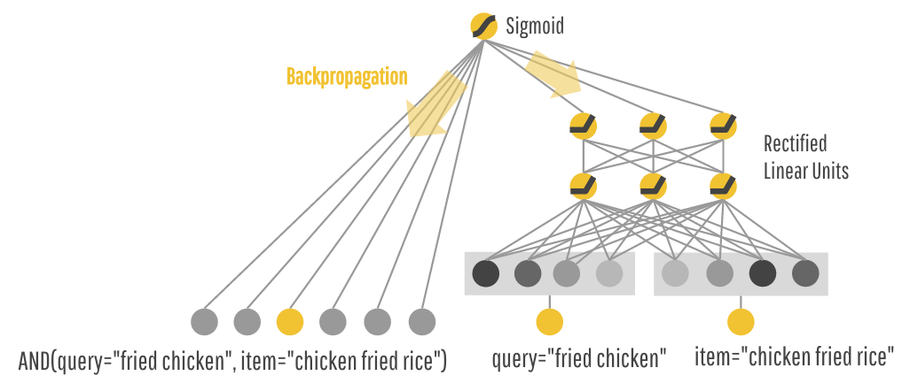

## Table of Contents

## What is a Wide Model in machine learning?

A Wide Model in machine learning is a type of model that uses a wide range of features to make predictions. It is often used in recommendation systems and other applications where the relationship between the input features and the output is complex and non-linear. The "wide" part of the name comes from the fact that these models can handle a large number of input features, which allows them to capture a wide range of interactions between different features.

Wide Models are typically implemented using linear models with feature crosses. Feature crosses are interactions between different features that can help the model learn more complex relationships. For example, if you are trying to predict whether someone will click on an ad, you might use feature crosses to capture the interaction between the user's age and the time of day. This can help the model learn that younger users are more likely to click on ads in the evening, while older users are more likely to click on ads in the morning. Wide Models can be combined with deep models to create Wide & Deep models, which can learn both Memorization and Generalization.

## How does a Wide Model differ from a Deep Model?

A Wide Model and a Deep Model are two different approaches in machine learning, each with its own strengths. A Wide Model uses a lot of different pieces of information, called features, to make predictions. It's like using a wide net to catch as much information as possible. These models are good at learning specific patterns in the data, which is called memorization. For example, a Wide Model might learn that people who buy bread also often buy butter. This is useful for things like recommending products or predicting clicks on ads.

On the other hand, a Deep Model, often called a [neural network](/wiki/neural-network), is good at finding more general patterns in the data. It's like digging deep into the data to understand it better. Deep Models use layers of connected nodes to process information and can learn complex relationships between features. They are good at generalization, which means they can apply what they've learned to new situations. For instance, a Deep Model might learn that certain combinations of ingredients make a dish taste good, and then use that knowledge to suggest new recipes.

Combining Wide and Deep Models can give you the best of both worlds. This is called a Wide & Deep Model. It uses the Wide part to capture specific patterns and the Deep part to understand more general relationships. This combination helps the model both remember specific details and apply what it has learned to new situations, making it very powerful for tasks like recommendation systems or predicting user behavior.

## What are the main components of a Wide Model?

A Wide Model in [machine learning](/wiki/machine-learning) is made up of a few main parts. The first part is a linear model, which is like a simple math formula that adds up different pieces of information, called features, to make a prediction. The linear model can use something called feature crosses, which are combinations of features that help the model learn more complex patterns. For example, if you are trying to predict if someone will buy a product, you might use feature crosses to see how age and time of day affect the decision.

The second part of a Wide Model is the input layer, where all the features are put into the model. This can include a lot of different types of information, like numbers, categories, or even text. The more features you have, the wider the model is, which is why it's called a Wide Model. The input layer feeds all these features into the linear model, which then uses them to make a prediction. By using a lot of features and feature crosses, a Wide Model can learn specific patterns in the data, which is useful for things like recommending products or predicting clicks on ads.

## In what scenarios is a Wide Model most effective?

A Wide Model is most effective in situations where you need to learn specific patterns in your data. Imagine you run a store and want to suggest products to your customers. A Wide Model can look at what people have bought before and suggest items that are often bought together. For example, if someone buys bread, the model might suggest butter because many people buy these two things together. This is because Wide Models are good at memorizing these specific patterns, which is very useful for making recommendations or predicting what someone might do next.

Wide Models also work well when you have a lot of different pieces of information, called features, that you want to use to make a prediction. For instance, if you are trying to guess if someone will click on an ad, you might use information like their age, the time of day, and what they have clicked on before. A Wide Model can use all these features, even combining them in special ways called feature crosses, to make better predictions. This makes Wide Models a great choice for tasks where you need to consider many different factors at once.

## How do you implement a Wide Model using popular machine learning frameworks?

To implement a Wide Model using popular machine learning frameworks like TensorFlow, you start by defining your features and creating feature crosses. In TensorFlow, you can use the `tf.feature_column` module to define your input features and create feature crosses. For example, if you are trying to predict if someone will click on an ad, you might define features like age, time of day, and previous clicks. You can then create feature crosses like age and time of day to capture more complex patterns. Once your features and feature crosses are defined, you can feed them into a linear model to make predictions. The linear model in TensorFlow can be implemented using the `tf.estimator.LinearClassifier` or `tf.estimator.LinearRegressor`, depending on whether you are doing classification or regression.

Here is a simple example of how you might implement a Wide Model in TensorFlow:

```python
import tensorflow as tf

# Define the feature columns
age = tf.feature_column.numeric_column("age")
time_of_day = tf.feature_column.categorical_column_with_vocabulary_list("time_of_day", ["morning", "afternoon", "evening"])
previous_clicks = tf.feature_column.numeric_column("previous_clicks")

# Create feature crosses
age_time_cross = tf.feature_column.crossed_column([age, time_of_day], hash_bucket_size=1000)

# Define the feature columns for the model
feature_columns = [age, time_of_day, previous_clicks, age_time_cross]

# Create the linear estimator
model = tf.estimator.LinearClassifier(feature_columns=feature_columns, model_dir="/tmp/wide_model")

# Train the model
model.train(input_fn=lambda: input_fn(train_data), steps=2000)

# Evaluate the model
results = model.evaluate(input_fn=lambda: input_fn(eval_data))
print(results)
```

In this example, we define numeric and categorical features, create a feature cross between age and time of day, and then use these features to train a `LinearClassifier`. This approach can be adapted to other frameworks like PyTorch by using similar concepts, but the exact implementation would differ. In PyTorch, you would typically define your features and feature crosses manually and then use a linear layer to make predictions. The key idea is to use a wide range of features and their interactions to capture specific patterns in your data, which is the essence of a Wide Model.

## What are the advantages of using a Wide Model over other types of models?

Wide Models are really good at learning specific patterns in your data. Imagine you run a store and want to suggest products to your customers. A Wide Model can look at what people have bought before and suggest items that are often bought together, like bread and butter. This is because Wide Models use a lot of different pieces of information, called features, and even combine them in special ways called feature crosses. This helps the model remember these specific patterns, which is very useful for making recommendations or predicting what someone might do next.

Another advantage of Wide Models is that they can handle a lot of different features at once. If you are trying to guess if someone will click on an ad, you might use information like their age, the time of day, and what they have clicked on before. A Wide Model can use all these features to make better predictions. This makes Wide Models a great choice for tasks where you need to consider many different factors at once. While they might not be as good at understanding general patterns like Deep Models, Wide Models are excellent at using a wide net to capture as much specific information as possible.

## What are the limitations or challenges of using Wide Models?

One challenge with Wide Models is that they can be hard to understand and explain. Because they use a lot of different pieces of information, called features, and even combine them in special ways called feature crosses, it can be tough to figure out why the model made a certain prediction. This can be a problem if you need to explain your model's decisions to others, like in a business setting where you need to justify why you recommended a certain product to a customer.

Another limitation is that Wide Models are not as good at understanding general patterns as Deep Models. While Wide Models are great at remembering specific patterns in your data, like which products are often bought together, they might struggle to apply what they've learned to new situations. For example, if you start selling a new product, a Wide Model might not be able to figure out how it fits with the other products as well as a Deep Model could. This means that if you need your model to be good at both remembering specific details and understanding general relationships, you might need to use a combination of Wide and Deep Models.

## How does feature engineering play a role in Wide Models?

Feature engineering is super important for Wide Models. It's all about taking the raw data you have and turning it into something the model can use better. In Wide Models, you use a lot of different pieces of information, called features, to make predictions. Feature engineering helps you create these features and even combine them in special ways called feature crosses. For example, if you are trying to predict if someone will click on an ad, you might combine their age and the time of day to see if younger people click more in the evening. This helps the model learn more complex patterns and make better predictions.

One way to do feature engineering for Wide Models is to create feature crosses. These are combinations of features that can help the model understand more about your data. For instance, if you are trying to recommend products, you might create a feature cross between the type of product and the time of year. This can help the model learn that people buy more swimsuits in the summer. By using feature engineering to create these feature crosses, you can make your Wide Model better at remembering specific patterns in your data.

## Can you explain the concept of memorization in the context of Wide Models?

Memorization in the context of Wide Models refers to the ability of these models to learn and remember specific patterns in the data. Imagine you run a store and want to suggest products to your customers. A Wide Model can look at what people have bought before and suggest items that are often bought together, like bread and butter. This is because Wide Models use a lot of different pieces of information, called features, and even combine them in special ways called feature crosses. By using these feature crosses, the model can remember that if someone buys bread, they are likely to also buy butter. This ability to remember specific patterns is what we mean by memorization in Wide Models.

However, while Wide Models are great at memorizing these specific patterns, they might not be as good at understanding general patterns. For example, if you start selling a new product, a Wide Model might not be able to figure out how it fits with the other products as well as a Deep Model could. This means that if you need your model to be good at both remembering specific details and understanding general relationships, you might need to use a combination of Wide and Deep Models. But for tasks where you need to remember specific patterns, like recommending products or predicting clicks on ads, Wide Models and their ability to memorize are very useful.

## How do Wide Models handle categorical variables and interactions?

Wide Models are good at handling categorical variables and their interactions. Categorical variables are things like colors or types of products, not numbers. In Wide Models, these variables can be used directly or combined with other variables to create new features called feature crosses. For example, if you are trying to recommend products, you might use the type of product (like "shoes" or "hats") and the time of year (like "summer" or "winter") to create a feature cross. This helps the model learn that people buy more swimsuits in the summer. By using feature crosses, Wide Models can remember specific patterns in your data, like which products are often bought together.

To implement this in a Wide Model, you can use special tools in machine learning frameworks like TensorFlow. For example, in TensorFlow, you can define categorical variables using the `tf.feature_column.categorical_column_with_vocabulary_list` function. Then, you can create feature crosses using the `tf.feature_column.crossed_column` function. Here is a simple example of how you might do this:

```python
import tensorflow as tf

# Define the categorical columns
product_type = tf.feature_column.categorical_column_with_vocabulary_list("product_type", ["shoes", "hats", "swimsuits"])
time_of_year = tf.feature_column.categorical_column_with_vocabulary_list("time_of_year", ["summer", "winter"])

# Create a feature cross
product_time_cross = tf.feature_column.crossed_column([product_type, time_of_year], hash_bucket_size=1000)

# Define the feature columns for the model
feature_columns = [product_type, time_of_year, product_time_cross]

# Create the linear estimator
model = tf.estimator.LinearClassifier(feature_columns=feature_columns, model_dir="/tmp/wide_model")

# Train the model
model.train(input_fn=lambda: input_fn(train_data), steps=2000)

# Evaluate the model
results = model.evaluate(input_fn=lambda: input_fn(eval_data))
print(results)
```

In this example, we define two categorical variables, `product_type` and `time_of_year`, and create a feature cross between them. This feature cross helps the model learn more about the interactions between these variables, making it better at remembering specific patterns in the data.

## What are some real-world applications where Wide Models have been successfully implemented?

Wide Models have been successfully used in recommendation systems, like those on websites or apps that suggest products or movies to users. For example, if you go to an online store and it suggests items you might like, a Wide Model might be helping. It looks at what you've bought before and suggests things that other people who bought similar items also bought. This is because Wide Models are good at remembering specific patterns, like which products are often bought together. So, if you buy bread, the model might suggest butter because many people buy these two things together.

Another real-world application is in predicting clicks on ads. If you see an ad on a website and it seems to be perfect for you, a Wide Model might have helped choose that ad. It uses a lot of information about you, like your age, the time of day, and what you've clicked on before, to guess if you'll click on the ad. By combining this information in special ways called feature crosses, the model can learn that younger people might click on ads more in the evening, while older people might click more in the morning. This makes the ads more relevant to you and helps the website make more money from advertisers.

## How can Wide Models be combined with Deep Models to enhance performance (Wide & Deep Learning)?

Wide & Deep Learning is a way to make machine learning models even better by combining the strengths of Wide Models and Deep Models. Wide Models are good at remembering specific patterns in your data, like which products people often buy together. Deep Models, on the other hand, are good at understanding general patterns, like how different ingredients make a dish taste good. By putting these two types of models together, you can create a model that can both remember specific details and understand general relationships. This is really useful for things like recommending products or predicting clicks on ads, because you need to consider both specific patterns and general trends.

In Wide & Deep Learning, the Wide part of the model uses a lot of different pieces of information, called features, and even combines them in special ways called feature crosses. The Deep part of the model uses layers of connected nodes to process information and learn complex relationships. When you combine these two parts, the model can make better predictions by using both the specific patterns from the Wide part and the general patterns from the Deep part. For example, if you are trying to recommend movies, the Wide part might remember that people who watched a certain movie also liked another movie, while the Deep part might understand that people who like action movies also tend to like thrillers. By using both parts together, the model can give better recommendations that consider both specific and general patterns.