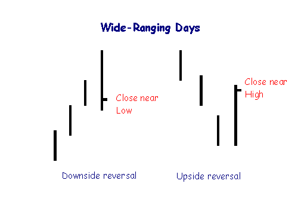

## Table of Contents

## What are Wide-Ranging Days?

Wide-Ranging Days are days when the stock market shows a lot of movement. This means the price of stocks goes up and down a lot during the day. Traders and investors pay attention to these days because they can show that something important is happening in the market. It could be news, economic reports, or other events that make people buy and sell more than usual.

When a day is wide-ranging, it often means there is more risk and more chance to make money. If the price moves a lot, traders can use this to their advantage by buying low and selling high. However, it can also be risky because the big movements can be hard to predict. So, people need to be careful and watch the market closely on these days.

## How do Wide-Ranging Days differ from typical trading days?

Wide-Ranging Days are different from typical trading days because they have much bigger price movements. On a normal day, the price of stocks might go up and down a little bit, but it stays pretty steady. On a Wide-Ranging Day, the price can swing a lot, going from high to low and back again within the same day. This big movement is what makes these days stand out.

Because of these big price swings, Wide-Ranging Days can be both exciting and scary for traders. On a typical day, traders might not see many big chances to make money, but on a Wide-Ranging Day, there are more opportunities to buy low and sell high. However, with more chance to make money comes more risk. The market can be unpredictable on these days, so traders need to be extra careful and ready for anything.

## What causes Wide-Ranging Days in the market?

Wide-Ranging Days in the market are often caused by big news or events that make people want to buy or sell a lot of stocks. This could be things like important economic reports, like the jobs numbers or inflation rates, which tell people how the economy is doing. When these reports are different from what people expected, it can make the market move a lot. Also, big news like a company doing really well or really badly, or even big world events like elections or natural disasters, can make the market go up and down a lot.

Sometimes, Wide-Ranging Days happen because of something called market sentiment. This means how people feel about the market. If everyone starts to feel really hopeful or really worried all of a sudden, it can make the market move a lot. For example, if a lot of people start to think the economy is going to do great, they might all start buying stocks at the same time, which can make prices go up a lot. On the other hand, if people get scared about the economy, they might all start selling, which can make prices drop a lot. So, how people feel can really shake things up on Wide-Ranging Days.

## How can Wide-Ranging Days be identified on a chart?

You can spot Wide-Ranging Days on a chart by looking at how much the price changes in one day. On a Wide-Ranging Day, the price will go up and down a lot more than on a normal day. The chart will show a big difference between the highest price and the lowest price of the day. This big difference is called the "range" of the day, and on Wide-Ranging Days, this range is much larger than usual.

To make it easier, you can compare the range of the day you're looking at with the average range of other days. If the range is a lot bigger than the average, then you might be looking at a Wide-Ranging Day. Charts often use lines or bars to show the highest and lowest prices, so if you see a really long bar or line for one day, that's a good sign it's a Wide-Ranging Day.

## What are the typical characteristics of a Wide-Ranging Day?

Wide-Ranging Days are days when the stock market moves a lot more than usual. The price of stocks goes up and down a lot during the day, making the difference between the highest and lowest price much bigger than on normal days. This big difference is called the "range," and on Wide-Ranging Days, this range is much larger than the average range of other days. You can see this on a chart where the bar or line for that day is much longer than the bars or lines for other days.

These days often happen because of big news or events that make people want to buy or sell a lot of stocks. This could be things like important economic reports, news about a company doing really well or badly, or even big world events like elections or natural disasters. When these things happen, they can make the market move a lot because they change how people feel about the market. If people start feeling really hopeful or really worried all of a sudden, it can make the market go up and down a lot.

## How do Wide-Ranging Days impact short-term trading strategies?

Wide-Ranging Days can be really exciting for short-term traders because they offer more chances to make money. On these days, the price of stocks moves up and down a lot, which means traders can buy stocks when they are cheap and sell them when they go up. This is called buying low and selling high. Traders who like to take risks might do really well on these days because the big price movements give them more chances to make quick profits. However, they need to be careful and watch the market closely because the big swings can also be hard to predict.

On the other hand, Wide-Ranging Days can be risky for short-term traders. Because the market moves so much, it can be hard to know when to buy and sell. If traders are not careful, they could lose money if the price suddenly drops after they buy. Some traders might decide to wait until the market calms down before making any moves. Others might use special tools or strategies to help them make decisions during these wild days. No matter what, traders need to be ready for anything on Wide-Ranging Days because the market can be unpredictable.

## What are the potential risks associated with trading on Wide-Ranging Days?

Trading on Wide-Ranging Days can be risky because the market moves a lot. When prices go up and down so much, it's hard to know when to buy and sell. If you buy a stock and the price suddenly drops, you could lose money. This big movement can make it hard to predict what will happen next, so traders need to be careful. They might make quick decisions that they regret later because they didn't have time to think things through.

Another risk is that the market can be very emotional on these days. People might start buying or selling because they're excited or scared, not because they've thought about it carefully. This can make the market even more unpredictable. If everyone starts selling at the same time because they're worried, the price can drop a lot, and if you're not ready for it, you could lose money. So, it's important to stay calm and not let your feelings make you do something you might regret.

## How can traders use Wide-Ranging Days to predict future market movements?

Traders can use Wide-Ranging Days to predict future market movements by looking at what happens after these days. If a Wide-Ranging Day ends with the price going up a lot, it might mean that the market is getting ready for more good news or that people are feeling hopeful about the future. On the other hand, if a Wide-Ranging Day ends with the price going down a lot, it could mean that people are worried and the market might keep going down. By watching how the market acts after these big days, traders can get a better idea of what might happen next.

Another way traders can use Wide-Ranging Days is by looking at how much the price moved and comparing it to other days. If the price moves a lot more than usual, it might be a sign that something big is happening or that people's feelings about the market are changing. Traders can use this information to guess if the market will keep moving a lot or if it will calm down. By paying attention to these big days and what happens after them, traders can make smarter decisions about when to buy and sell.

## What historical examples illustrate the impact of Wide-Ranging Days on the market?

One famous example of a Wide-Ranging Day was "Black Monday" on October 19, 1987. On that day, the stock market crashed, and the Dow Jones Industrial Average dropped by more than 22% in one day. This was a huge shock to everyone because the market had been doing well before that. People were scared and started selling their stocks quickly, which made the prices go down even more. This Wide-Ranging Day showed how fast the market can change and how important it is to be ready for big moves.

Another example happened in 2008 during the financial crisis. On September 29, 2008, the U.S. House of Representatives voted against a big plan to help the economy. This made people very worried, and the stock market had a Wide-Ranging Day. The Dow Jones fell by about 7% in one day. It was a scary time because the market was already going down, and this big drop made it even worse. This day showed how news and big events can make the market move a lot and how important it is to watch what's happening in the world.

## How do Wide-Ranging Days affect different asset classes?

Wide-Ranging Days can shake up different types of investments like stocks, bonds, and commodities. For stocks, these days can mean big price swings. If a company's stock goes up or down a lot, it might be because of news about that company or the whole market. People might buy or sell a lot of stocks, making the prices move even more. Bonds, which are like loans to companies or governments, can also see big changes. If people think the economy is going to get worse, they might want to buy more bonds, making their prices go up. But if they think the economy will get better, they might sell bonds, making their prices go down.

Commodities, like gold or oil, can also be affected by Wide-Ranging Days. If something big happens, like a war or a big change in how much oil countries are making, the prices of these commodities can go up and down a lot. For example, if there's a problem with oil supplies, the price of oil might go up a lot in one day. Gold, which people often buy when they're worried about the economy, might go up if people think bad times are coming. So, Wide-Ranging Days can make all these different types of investments move a lot, and it's important for people to watch what's happening with each one.

## What advanced technical indicators can enhance the analysis of Wide-Ranging Days?

To better understand Wide-Ranging Days, traders can use advanced technical indicators like the Average True Range (ATR). The ATR measures how much a stock's price moves on average over a certain number of days. If the ATR is much higher on a particular day than it usually is, it might mean that day is a Wide-Ranging Day. This can help traders see if the big price moves are normal for that stock or if something special is happening.

Another useful indicator is the Bollinger Bands. These are lines drawn on a chart that show how much a stock's price usually moves. If the price goes outside these lines, it might be a Wide-Ranging Day. Traders can use this to see if the market is getting ready for a big move or if it's just a normal day with a bit more action. By watching these indicators, traders can make better guesses about what might happen next and plan their trades more carefully.

## How can algorithmic trading strategies be optimized for Wide-Ranging Days?

Algorithmic trading strategies can be optimized for Wide-Ranging Days by using indicators like the Average True Range (ATR) to spot when the market is moving a lot. If the ATR shows a big jump, the algorithm can be set to buy or sell more quickly to take advantage of the big price swings. This means the algorithm can look for chances to buy low and sell high faster than on normal days. It can also use other indicators like Bollinger Bands to see when the price is moving outside of what's normal, helping the algorithm decide when to make a move.

Another way to optimize algorithmic trading strategies is by setting up rules that change how the algorithm acts on Wide-Ranging Days. For example, the algorithm can be told to use tighter stop-losses to protect against big drops in price. It can also be set to trade less or more depending on how big the price swings are. By making these changes, the algorithm can better handle the wild movements of the market on these days and make smarter decisions about when to buy and sell.

## What is the meaning of Wide-Ranging Days?

Wide-ranging days are characterized by substantial price movement within a single trading day, significantly exceeding the average range. This phenomenon is indicative of heightened market volatility and is critically observed by traders who rely on technical analysis to predict market behavior. Understanding wide-ranging days involves identifying large price ranges and recognizing their implications on market trends and potential reversals.

Technical indicators are instrumental in pinpointing these expansive price movements. The Volatility Ratio and the Average True Range (ATR) are commonly employed metrics in this regard. The Volatility Ratio measures the price range of the current period against the average range over a preceding number of periods, providing a quantifiable gauge of volatility. On the other hand, the ATR, introduced by J. Welles Wilder in his 1978 book "New Concepts in Technical Trading Systems," is a widely used indicator that calculates the average of true ranges over a specified time, typically 14 days. The true range considers the greatest of the following: the current high minus the current low, the absolute value of the current high minus the previous close, and the absolute value of the current low minus the previous close. This computation helps smooth out day-to-day fluctuations, offering a clearer picture of volatility.

Mathematically, the ATR can be expressed as follows:

$$
\text{ATR} = \frac{1}{n} \sum_{i=1}^{n} TR_i
$$

where $TR_i$ is the true range for the $i^{th}$ day, and $n$ is the number of days over which the ATR is calculated.

Wide-ranging days can serve as harbingers of impending market movements. A significant deviation in price within a single day can indicate the market's reaction to unexpected news or economic data, thereby signaling a possible reversal if the market has been trending, or the continuation of a trend fueled by strong [momentum](/wiki/momentum). Traders interpret such days as critical junctures where significant buying or selling pressure might manifest, leading to potential shifts in the prevailing market trend.

Incorporating the identification of wide-ranging days into trading strategies requires a nuanced approach. Employing the ATR or Volatility Ratio enables traders to set benchmarks for price ranges, thereby enabling quicker and more informed decision-making in response to market conditions. By understanding the distinct characteristics of wide-ranging days, traders can leverage these patterns to gain insights into market [volatility](/wiki/volatility-trading-strategies) and make informed trading decisions.

## What is the relationship between Algorithmic Trading and Wide-Ranging Days?

Algorithmic trading utilizes computer programs to execute trades based on pre-defined strategies and market data, making it highly dependent on precise and timely inputs from technical indicators. Wide-ranging days, characterized by their large price movements within a single trading session, provide valuable insights into market volatility. Incorporating these days into [algorithmic trading](/wiki/algorithmic-trading) strategies can significantly enhance predictive accuracy and trading performance.

To detect wide-ranging days, algorithms often rely on technical indicators such as the Average True Range (ATR) and Volatility Ratio. The ATR, for instance, measures market volatility by calculating the average of true ranges over a specified period. This can be represented mathematically as follows:

$$
\text{ATR} = \frac{1}{n} \sum_{t=1}^{n} \text{TR}_t
$$

where $\text{TR}_t$ (True Range) is calculated from the maximum of: 

- Current high minus current low,
- Absolute value of current high minus previous close,
- Absolute value of current low minus previous close.

By programming algorithms to monitor ATR values, traders can automatically identify days when volatility spikes, signifying a wide-ranging day.

The inclusion of wide-ranging day detection allows algorithms to react swiftly to potential market movements. These algorithms adjust trading parameters or initiate trades based on established criteria whenever such days are detected. For example, an algorithm could be programmed to execute a breakout strategy upon identifying a wide-ranging day, capitalizing on the likelihood of continued volatility in a particular direction.

In practical terms, implementing wide-ranging day recognition within a trading algorithm might involve the following Python snippet utilizing a library such as pandas:

```python
import pandas as pd

def calculate_true_range(data):
    data['previous_close'] = data['Close'].shift(1)
    data['high_low'] = data['High'] - data['Low']
    data['high_close'] = abs(data['High'] - data['previous_close'])
    data['low_close'] = abs(data['Low'] - data['previous_close'])
    data['true_range'] = data[['high_low', 'high_close', 'low_close']].max(axis=1)
    return data

def calculate_atr(data, window=14):
    data = calculate_true_range(data)
    data['ATR'] = data['true_range'].rolling(window=window).mean()
    return data

# Example usage:
data = pd.DataFrame({
    'High': [10.2, 10.5, 10.8],
    'Low': [9.8, 10.1, 10.4],
    'Close': [10.0, 10.3, 10.7]
})

atr_data = calculate_atr(data)
print(atr_data)
```

Incorporating wide-ranging days into algorithmic trading systems not only aids in forecasting potential breakouts or trend reversals but also optimizes trading performance by aligning strategies with real-time market conditions. By adapting swiftly to these market signals, traders employing algorithmic systems improved their decision-making capabilities and potentially increased profitability in volatile markets.

## How can we identify wide-ranging days using indicators?

Technical indicators are crucial in the identification of wide-ranging days, particularly through the use of the Average True Range (ATR) and the Volatility Ratio. These tools not only streamline the identification process but also provide actionable insights for traders to adapt their strategies to prevailing market conditions.

The Average True Range, developed by J. Welles Wilder Jr., is a widely-recognized indicator for gauging market volatility by considering the full range of price movements over a specified period. It is defined as:

$$

ATR_n = \frac{1}{n} \sum_{t=1}^{n} TR_t 
$$

where $TR_t$ is the true range for day $t$, calculated using the formula:

$$

TR_t = \max[(High_t - Low_t), |High_t - Close_{t-1}|, |Low_t - Close_{t-1}|] 
$$

The ATR provides a quantifiable measure of volatility, helping traders determine if the price range of a day is significantly larger than usual, thereby qualifying as a wide-ranging day. By setting a threshold, such as a multiple of the ATR, traders can automate the identification of wide-ranging days.

The Volatility Ratio is another effective tool for identifying these days. It measures the ratio of current volatility against a longer-term average. The formula for the Volatility Ratio is:

$$

Volatility\ Ratio = \frac{Volatility_{current\ period}}{Volatility_{average}} 
$$

A Volatility Ratio significantly greater than one suggests a wide-ranging day, indicating that current price movements are substantially larger than the norm.

Automating the detection of wide-ranging days through these indicators involves configuring trading software to screen for days where the ATR exceeds a certain threshold or where the Volatility Ratio indicates above-average volatility. For instance, a simple Python script could utilize libraries like pandas and NumPy to calculate these indicators and flag days of interest:

```python
import pandas as pd
import numpy as np

def calculate_atr(data, period=14):
    data['H-L'] = data['High'] - data['Low']
    data['H-C'] = abs(data['High'] - data['Close'].shift(1))
    data['L-C'] = abs(data['Low'] - data['Close'].shift(1))

    true_range = data[['H-L', 'H-C', 'L-C']].max(axis=1)
    atr = true_range.rolling(window=period).mean()
    return atr

def calculate_volatility_ratio(current_vol, avg_vol):
    return current_vol / avg_vol

# Assumed that 'data' is a DataFrame containing 'High', 'Low', 'Close' columns
atr = calculate_atr(data)
volatility_ratio = calculate_volatility_ratio(current_volatility, average_volatility)

wide_ranging_days = data[(atr > atr_threshold) | (volatility_ratio > ratio_threshold)]
```

Understanding the configuration of ATR and Volatility Ratio indicators is essential in maximizing their utility. Traders need to choose appropriate periods and thresholds for these measures based on their specific trading frameworks and the characteristics of the financial instruments they are analyzing. By calibrating these settings, traders can efficiently harness the power of technical indicators to classify wide-ranging days, thus optimizing their trading strategies to better handle market volatility.

## References & Further Reading

[1]: Wilder, J. W. (1978). "New Concepts in Technical Trading Systems." Trend Research.

[2]: Aronson, D. R. (2006). ["Evidence-Based Technical Analysis: Applying the Scientific Method and Statistical Inference to Trading Signals."](https://www.amazon.com/Evidence-Based-Technical-Analysis-Scientific-Statistical/dp/0470008741) John Wiley & Sons.

[3]: Jansen, S. (2020). ["Machine Learning for Algorithmic Trading."](https://github.com/stefan-jansen/machine-learning-for-trading) Packt Publishing.

[4]: Chan, E. P. (2008). ["Quantitative Trading: How to Build Your Own Algorithmic Trading Business."](https://github.com/egorpe/EPChan-QuantitativeTrading/blob/master/example7_6.m) John Wiley & Sons.

[5]: Lopez de Prado, M. (2018). ["Advances in Financial Machine Learning."](https://www.amazon.com/Advances-Financial-Machine-Learning-Marcos/dp/1119482089) John Wiley & Sons.

[6]: Covel, M. (2004). ["Trend Following: How to Make a Fortune in Bull, Bear, and Black Swan Markets."](https://searchworks.stanford.edu/view/13213255) Financial Times Press.

[7]: Harris, L. (2003). ["Trading and Exchanges: Market Microstructure for Practitioners."](https://academic.oup.com/book/52292) Oxford University Press.