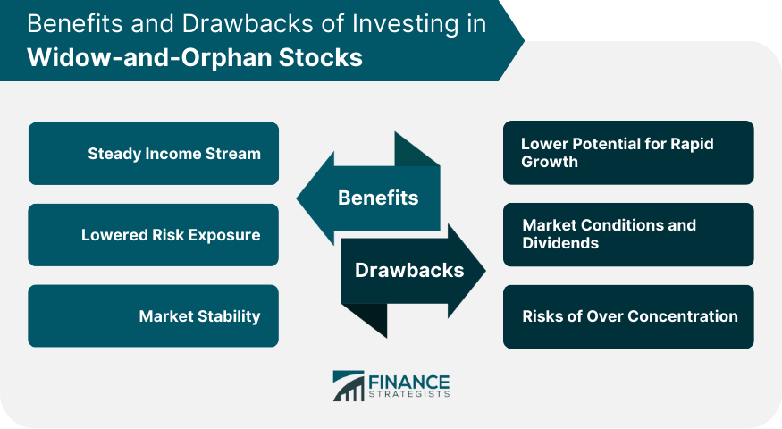

In investing, strategies that emphasize stability and consistent returns are highly regarded. Widow-and-orphan stocks exemplify such strategies and are popular for their reliable nature. These stocks have a reputation for providing investors with a secure investment option characterized by low risk and steady dividend payouts. Investors often seek them out as a refuge from volatility, carving a niche in diversified portfolios that aim to minimize exposure to the unpredictability of the market.

This article explores the concept of widow-and-orphan stocks, their advantages, and their integration into modern investment strategies, including the increasingly prevalent technique of algorithmic trading. Historically, widow-and-orphan stocks have held an important place in the investment landscape, catering to individuals and groups with a primary interest in preserving capital and securing a dependable income stream. With attributes such as low volatility and resilience through economic cycles, these stocks stand apart from other equity investments primarily by emphasizing safety over high short-term gains.



By comparing widow-and-orphan stocks to other types of equity, we can understand their unique position within investment portfolios. These stocks are characterized by their presence in non-cyclical sectors, such as utilities and consumer staples, which display demand stability even during economic downturns. This characteristic makes them well-suited for conservative investors, including retirees or those with restricted financial means, seeking consistent returns without significant exposure to market fluctuations.

In recent years, algorithmic trading has introduced an innovative dimension to investing in widow-and-orphan stocks. Through advanced data analytics and historical performance analysis, algorithms can automate the identification of stocks with promising returns and optimize trading strategies. This integration allows for precise monitoring of market conditions, facilitating timely and informed buy or sell decisions. The use of technology in investment decisions enhances the ability to manage risks and improve returns, making widow-and-orphan stocks a prudent choice for both seasoned investors and those new to the market.

Overall, the alignment of traditional low-risk assets like widow-and-orphan stocks with modern technological advancements forms a robust strategy for achieving financial goals. As we further examine this investment approach, the potential for harmonizing stability with innovation becomes evident.

## Table of Contents

## Understanding Widow-and-Orphan Stocks

Widow-and-orphan stocks are known for their ability to deliver high dividends while maintaining a low-risk profile for investors. These stocks typically belong to non-cyclical sectors such as utilities, consumer staples, and telecommunications. These sectors, by nature, provide essential services or products that maintain consistent demand irrespective of economic conditions, thereby ensuring a degree of stability. For instance, utility companies offer electricity and water, which are always in demand regardless of economic fluctuations. As a result, these companies can sustain their revenue streams, contributing to the perceived stability of their stocks.

Historically, widow-and-orphan stocks were recommended for investors who prioritized security over aggressive growth, often economically vulnerable groups such as widows and orphans. These stocks offered peace of mind because they were less susceptible to the volatile swings that affect high-growth equities. The focus on financially stable industries led to consistent dividend payments, forming a reliable income stream for investors who required financial security.

The appeal of these stocks is largely due to their consistent dividend yields, which can be calculated based on the formula:

$$
\text{Dividend Yield} = \left( \frac{\text{Annual Dividends Per Share}}{\text{Price Per Share}} \right) \times 100
$$

This formula helps investors assess the cash flow they can expect relative to the stock price, offering a clear picture of the income potential. For investors seeking steady returns with lower risk, widow-and-orphan stocks serve as a viable investment choice, leveraging their inherent stability to reduce exposure to risk whilst providing reliable dividends.

## Benefits of Investing in Widow-and-Orphan Stocks

Widow-and-orphan stocks offer numerous benefits that make them attractive to investors seeking low-risk and steady income. These stocks are primarily appreciated for their low [volatility](/wiki/volatility-trading-strategies), meaning they are less susceptible to rapid price fluctuations compared to other stocks. This stability is especially beneficial during periods of economic instability, where more volatile stocks may experience significant declines in value. 

A defining feature of widow-and-orphan stocks is their high dividend yield. Unlike [growth stocks](/wiki/growth-stocks), which reinvest earnings to expand operations, these stocks are found in established sectors like utilities and consumer staples, where companies often pay a significant portion of their earnings as dividends. This consistent dividend payment provides investors with a reliable income stream, which can be particularly appealing to retirees or those relying on investment income for living expenses.

Moreover, widow-and-orphan stocks serve as safe havens in volatile markets. Their ability to maintain value when the broader market declines makes them an ideal choice for risk-averse investors. These investors prioritize the preservation of capital and are willing to forego potentially higher, but riskier, returns. By holding these stocks, investors can enjoy consistent returns without significant capital exposure, safeguarding their investments from the more unpredictable elements of the stock market. This makes widow-and-orphan stocks a strategic component in creating a balanced and diversified investment portfolio capable of withstanding economic fluctuations.

## Incorporating Widow-and-Orphan Stocks in Investment Strategies

Incorporating widow-and-orphan stocks into investment strategies plays a crucial role in achieving diversification and stability within a portfolio. These stocks excel as defensive investments, particularly in volatile market environments. Their nature is typically characterized by low volatility and a steady dividend yield, which can protect portfolios against significant downturns.

One primary method investors utilize to capitalize on widow-and-orphan stocks is through dividend reinvestment plans (DRIPs). DRIPs allow investors to reinvest dividends received from these stocks into additional shares, facilitating compound growth over time. This strategy can amplify returns through the power of compounding, which Albert Einstein famously referred to as the eighth wonder of the world. By consistently reinvesting dividends, investors effectively increase their ownership in a company without needing to inject additional capital.

Mathematically, the compound growth can be expressed with the formula:

$$
A = P \left(1 + \frac{r}{n}\right)^{nt}
$$

where:
- $A$ is the future value of the investment,
- $P$ is the initial principal balance (initial investment),
- $r$ is the annual dividend yield as a decimal,
- $n$ is the number of times dividends are reinvested per year,
- $t$ is the number of years the investment is held.

The automation and simplicity of DRIPs make them particularly appealing for investors seeking growth without the complexity of frequent trading. Furthermore, these plans often come at no additional cost or at a reduced commission, thus maximizing the investor's input capital efficiently.

A strategic allocation towards widow-and-orphan stocks in a diversified portfolio can also serve as a buffer against economic fluctuations. Because of their stability and defensive nature, including them helps offset the risks associated with more volatile and high-growth equity investments. This balance allows investors to maintain consistent returns and preserve capital during times of market stress, enabling a more resilient investment portfolio in both bullish and bearish markets.

Overall, the inclusion of widow-and-orphan stocks, particularly when complemented with DRIP strategies, provides an opportunity for both risk mitigation and incremental value appreciation through automated dividend reinvestment, strengthening the overall investment strategy.

## Algorithmic Trading and Widow-and-Orphan Stocks

Algorithmic trading has revolutionized the investment landscape by leveraging technology to streamline the identification and management of potentially lucrative widow-and-orphan stocks. These stocks, known for their stability and high dividend yields, have traditionally been manually identified based on qualitative assessments and historical performance. However, [algorithmic trading](/wiki/algorithmic-trading) provides a quantitative framework that enhances this identification process through automation and data analytics.

Using sophisticated algorithms, investors can analyze extensive datasets, including historical price data, dividend yields, and other financial metrics, to identify patterns indicative of promising widow-and-orphan stocks. For instance, an algorithm might be designed to prioritize stocks in non-cyclical sectors like utilities that exhibit not only a consistent dividend payout ratio but also low volatility. These patterns help create a shortlist of potential stocks that fit the widow-and-orphan criteria, enabling investors to make informed decisions.

Algorithms offer unique advantages in monitoring market conditions in real-time. For instance, Python libraries such as `pandas` and `numpy` allow for the processing and analysis of large datasets, while `scikit-learn` can be used for implementing predictive models. A basic Python script for monitoring stock performance could look like this:

```python
import pandas as pd
from sklearn.linear_model import LinearRegression

# Load historical stock data
data = pd.read_csv('stock_data.csv')

# Define features (e.g., historical returns) and target (e.g., future returns)
features = data[['historical_return']]
target = data['future_return']

# Train the algorithm
model = LinearRegression()
model.fit(features, target)

# Predict future returns
predicted_returns = model.predict(features)
```

This kind of model enhances decision-making by providing data-driven insights into potential future performance, which are crucial for executing timely buy and sell orders. Algorithms can automatically trigger these transactions when the stock's performance aligns with predefined criteria, ensuring maximum profitability and reducing the reaction time to market changes.

Furthermore, predictive analytics play a substantial role in mitigating risks associated with long-term investments in these stocks. By employing techniques like time series analysis and [machine learning](/wiki/machine-learning) models, algorithms can forecast trends and adjust investment strategies accordingly. This allows investors to anticipate market shifts and rebalance their portfolios proactively.

In summary, algorithmic trading provides a powerful toolset for managing widow-and-orphan stocks. Through the integration of data analytics, predictive modeling, and automated transaction capabilities, it optimizes the investment process, enhances returns, and reinforces the inherent stability of these stocks within an investment portfolio.

## Challenges and Considerations

Widow-and-orphan stocks, while renowned for their stability and reliable returns, are not immune to certain challenges and risks. A primary concern for these types of stocks involves sector-specific risks, particularly within industries that are prone to regulatory changes. Utilities, a common sector for widow-and-orphan stocks, often face regulatory scrutiny that can impact their financial performance. For example, changes in environmental regulations or shifts in government policy regarding energy production can lead to increased operational costs or reduced demand for services, thereby affecting the profitability and dividend yields of these companies.

Moreover, these stocks are susceptible to risks associated with technological advancements or shifts in consumer behavior. For instance, the growing emphasis on renewable energy sources can pose a threat to traditional utility companies that have yet to adapt to these changes. Companies that fail to innovate or react to such sectoral shifts may see a decline in their stock value, challenging their status as safe investments.

Investors must also be cautious of corporate malpractices, which can occur even in perceived low-risk environments. Instances of financial misreporting, unethical business practices, or executive mismanagement can have detrimental effects on stock performance and investor trust. Such events, though possibly less frequent in sectors associated with widow-and-orphan stocks, still demand investor vigilance.

To mitigate these risks, investors should conduct thorough due diligence by analyzing financial statements, assessing management practices, and keeping an eye on regulatory developments that might affect their investments. Additionally, diversification across different sectors can help cushion the portfolio against sector-specific or regulatory risks.

In addressing these challenges, investors can employ analytical tools and technology to maintain an informed view of their investments. While widow-and-orphan stocks are designed to offer stability, maintaining a proactive approach to potential risks ensures that these investments continue to serve their intended purpose in a portfolio.

## Conclusion

Including widow-and-orphan stocks in an investment portfolio offers investors a balanced strategy, particularly those seeking to mitigate the risks typically associated with more volatile assets. These stocks are characterized by their historical stability and consistent dividend payouts, qualities that become particularly valuable during economic fluctuations when traditional, high-risk investments may suffer significant value loss. By incorporating such stable equities, investors can create a diversified portfolio that buffers against market volatility while ensuring a reliable income stream.

Algorithmic trading significantly enhances the management of widow-and-orphan stocks, infusing efficiency and precision into the investment process. Algorithms can process vast amounts of market data in real time, identifying optimal buying and selling points much faster than human capability. For both seasoned and novice investors, the integration of algorithmic strategies can reduce human error and emotional decision-making, which are common pitfalls in investment practices. By employing predictive analytics and historical data, algorithms facilitate informed decision-making that reflects current market conditions and future projections.

As financial markets continue to evolve, future investment strategies should integrate advancements in technology with traditional, low-risk assets like widow-and-orphan stocks. Such integration ensures that investors can achieve their financial goals through a harmonious approach that balances technological innovations with the foundational benefits of stable equities. By doing so, investors are better positioned to navigate the complexities of modern markets while securing a dependable return on their investments.

## References & Further Reading

[1]: Graham, Benjamin. ["The Intelligent Investor: The Definitive Book on Value Investing."](https://www.amazon.com/Intelligent-Investor-Definitive-Investing-Essentials/dp/0060555661) Harper Business.

[2]: Steward, David J. ["Dividend Growth Investing: A Beginner's Guide to Dividend Stocks to Get Rich and Retire Early."](https://www.marketbeat.com/dividends/dividend-investing-guide/) 

[3]: Damodaran, Aswath. ["Investment Valuation: Tools and Techniques for Determining the Value of Any Asset."](https://www.amazon.com/Investment-Valuation-Tools-Techniques-Determining/dp/111801152X) Wiley Finance.

[4]: Chan, Ernest P. ["Algorithmic Trading: Winning Strategies and Their Rationale."](https://github.com/ftvision/quant_trading_echan_book) Wiley.

[5]: O'Shaughnessy, James P. ["What Works on Wall Street: A Guide to the Best-Performing Investment Strategies of All Time."](https://www.amazon.com/What-Works-Wall-Street-Best-Performing/dp/0071452257) McGraw-Hill Education.