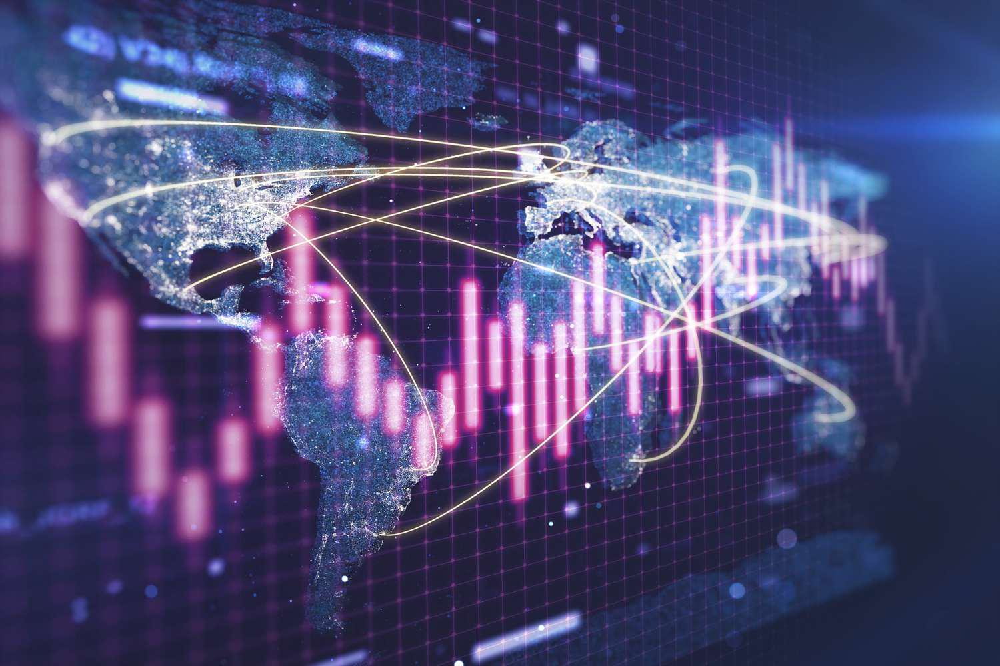

Widow maker is a term in the financial markets that signifies trades with high risk and potential for significant financial loss. The term typically describes trades that appear rational but ultimately defy market expectations, often leading to substantial financial consequences for the trader. Such trades may initially seem aligned with market trends or historical data but can surprise traders with outcomes contrary to forecasts, resulting in significant unpredictability and potential loss. 

The concept of widow maker is crucial for traders to understand, particularly in algorithmic trading. In this trading approach, automated systems execute trades based on predefined strategies and criteria. Widow maker trades can heavily impact these automated strategies due to their inherent volatility and unpredictability. For algorithmic systems to succeed, they must be programmed to recognize and adapt to these high-risk scenarios, ensuring that algorithms are prepared for sudden market shifts that could otherwise lead to catastrophic financial results. Understanding this concept not only aids traders in manual trading but also informs the development of robust algorithmic trading strategies capable of navigating the complexities and potential pitfalls of widow maker trades.

## Table of Contents

## Understanding the Widow Maker in Financial Markets

The widow maker trade is commonly associated with investments that confound market consensus and defy historical patterns. Such trades carry a notorious reputation due to their unpredictability, often resulting in significant financial losses for traders. Two prominent examples include shorting Japanese government bonds (JGBs) and investing in natural gas futures.

Shorting Japanese government bonds has been a prevalent widow maker trade for decades. Traders often anticipate rising interest rates in Japan as a rational response to various economic stimuli or policy changes. However, despite these expectations, the Bank of Japan's persistent policies of low-interest rates and quantitative easing have frequently thwarted these trades. The misconception here lies in underestimating the central bank's commitment to keeping yields low, contrary to expected market behaviors, leading to substantial losses.

Similarly, natural gas futures are infamous for their volatility and unpredictability. The complex interplay of supply dynamics, unexpected weather patterns, and geopolitical tensions makes natural gas futures a challenging domain for traders. Historically, these elements have contributed to sharp price fluctuations, defying expected trends and resulting in significant financial repercussions.

Widow maker trades are thus characterized by their high risk and the potential for catastrophic losses. Their unpredictability forms a trap for traders who, relying on apparent rational strategies, find themselves at odds with the market's actual trajectory. This characteristic unpredictability has earned these trades their ominous nickname, as they have metaphorically 'made widows' of numerous investors over time. Understanding these dynamics is essential for risk assessment and navigating such perilous market situations effectively.

## Algorithmic Trading and Widow Maker Mechanisms

Algorithmic trading utilizes computer programs to execute trades rapidly and efficiently, based on a set of predefined criteria. These criteria can include timing, price, quantity, and computational models that predict price movements. The automated nature of [algorithmic trading](/wiki/algorithmic-trading) allows for quick responses to market conditions, which can be essential when dealing with volatile and unpredictable widow maker trades.

In the context of widow maker trades, such as shorting Japanese government bonds or trading in natural gas futures, algorithmic systems can be programmed to recognize and avoid or mitigate risky positions. These trades often defy conventional market expectations, leading to high risk and potential for significant financial loss. By incorporating algorithms that adjust strategies based on market conditions, traders can better manage the inherent risks associated with widow maker trades.

Algorithms can incorporate [machine learning](/wiki/machine-learning) techniques to identify patterns and discrepancies in historical data that human traders might overlook. For example, an algorithm might monitor indicators known to precede drastic market shifts, adjusting its strategy accordingly to minimize exposure. This adaptability is key when dealing with widow maker trades, which characteristically disrupt typical market trends.

Algorithmic systems can also be equipped with risk management protocols to handle volatile market conditions. For example, incorporating stop-loss orders within an algorithm can automate the process of exiting a trade once it reaches a certain loss threshold. This mechanism prevents excessive losses in situations where the market moves sharply against a trader's position.

Additionally, sophisticated algorithms can utilize hedging techniques to offset potential losses. By taking positions in negatively correlated assets, an algorithm can smooth the impact of adverse movements in one asset on the overall portfolio. This form of risk management is crucial for traders engaged in widow maker trades, where market conditions can be exceptionally unpredictable.

Developers and traders must ensure that their algorithms are designed to adapt to unexpected market shifts inherent in widow maker trades. This entails continuously updating models with fresh market data and trends, which can involve a combination of historical analysis and real-time monitoring. Using machine learning, algorithms can dynamically learn and evolve from new data, improving their predictive accuracy and risk management capabilities.

In summary, implementing algorithmic trading strategies in widow maker markets requires an intricate understanding of both market dynamics and advanced algorithmic techniques. By employing adaptable algorithms with integrated risk management protocols, traders can navigate the challenges posed by widow maker trades, striking a balance between potential rewards and the mitigation of significant financial losses.

## Notable Examples of Widow Maker Trades

### Japanese Government Bonds

Shorting Japanese Government Bonds (JGBs) has long been considered a notable widow maker trade. Traders anticipated that Japan's massive debt burden and persistent deflationary pressures would lead to higher interest rates, thus making the short position on JGBs profitable. However, the Bank of Japan's commitment to maintaining low interest rates and implementing policies such as yield curve control has consistently thwarted these expectations, leading to significant losses for many investors. This particular trade has been perplexing for traders; they have continuously underestimated the Japanese central bank's willingness to sustain aggressive monetary easing. Consequently, shorting JGBs remains a high-risk strategy, often resulting in financial adversity for those who misjudged Japan's economic stance.

### Natural Gas Futures

Natural Gas Futures present another classic example of the widow maker trade, characterized by their notorious [volatility](/wiki/volatility-trading-strategies). The futures market for natural gas is influenced by a myriad of factors, including seasonal demand variations, geopolitical influences, and unanticipated fluctuations in supply due to natural disasters or production changes. These complexities make natural gas futures an unpredictable venture that often defies market predictions. Hedge funds and large trading entities have historically engaged in aggressive positions on natural gas futures, expecting sizeable returns due to price movements. However, the capricious nature of the market frequently led to substantial financial losses. The unexpected price drops or spikes have forced many well-capitalized traders to [exit](/wiki/exit-strategy) their positions at a loss, acknowledging the perilous terrain of this commodity.

### The Amaranth Advisors Case

The collapse of Amaranth Advisors serves as a cautionary tale of the potential downfall associated with widow maker trades. In 2006, Amaranth, a multi-strategy [hedge fund](/wiki/hedge-fund-trading-strategies), suffered inexorable losses amounting to $6 billion due to ill-fated bets on natural gas futures. The fund's aggressive strategy was based on a belief in a specific directional bet—anticipating a widening spread in calendar-month futures contracts. Amaranth's highly leveraged positions left them vulnerable to sudden market volatility and adverse movements, which occurred when the natural gas market moved against their bets. This catastrophic event underscored the immense risks linked with high-stakes trading strategies that lack adequate risk management and highlighted the critical importance of diversification and strategic planning in mitigating the inherent risks of widow maker trades.

## Risk Management in Widow Maker Trades

To mitigate the risks associated with widow maker trades, traders often employ strategies such as diversification, hedging, and stop-loss orders. Diversification involves spreading investments across various financial instruments or markets to reduce exposure to any single asset's volatility. This approach ensures that losses in one area may be offset by gains or stable performance elsewhere, reducing overall portfolio risk.

Hedging, another common risk management strategy, involves taking offsetting positions in related securities to protect against adverse price movements. For example, a trader holding a large position in natural gas futures may hedge by purchasing options that gain value when natural gas prices fall. This tactic helps stabilize returns and limit potential losses by effectively creating a financial safety net.

Stop-loss orders are automated instructions set to sell a security once it reaches a predetermined price level. These orders act as a form of automated risk control, ensuring that losses on a particular trade are capped. By predefining acceptable loss thresholds, traders can prevent emotional decision-making and preserve capital during volatile market conditions.

Algorithmic systems play a crucial role in handling widow maker trades. Equipped with sophisticated risk management protocols, these systems can automatically adjust positions and execute trades based on real-time market data. For instance, algorithms can be programmed to rebalance portfolios, enhance diversification, and execute stop-loss orders efficiently, thereby maintaining risk at acceptable levels.

Advanced risk management software further supports these efforts by providing continuous monitoring and analysis of market conditions. These tools alert traders to potential exposures through sophisticated analytics and visualization techniques, enabling proactive adjustments to trading strategies. Software solutions often incorporate machine learning algorithms to predict market shifts and identify patterns that human traders might miss, offering an additional layer of protection against catastrophic losses.

Overall, the integration of diversification, hedging strategies, and proactive algorithmic systems forms a comprehensive approach to managing the high risks associated with widow maker trades. This risk-conscious framework is essential for navigating the unpredictable nature of these financial instruments.

## Conclusion

Trading in widow maker markets necessitates an in-depth understanding of the inherent risks. This type of trading involves significant potential for loss, often defying market expectations, thus presenting a formidable challenge even for experienced traders. For those utilizing algorithmic trading strategies, the integration of robust risk management protocols becomes essential. These systems can be designed to anticipate and adapt to sudden market shifts, thereby minimizing exposure and potential losses. Given the volatile nature of widow maker trades, strategies must be continuously refined through quantitative analysis and [backtesting](/wiki/backtesting) to ensure they effectively manage risks.

Widow maker trades, despite their high risks, offer the allure of substantial financial rewards. However, they require a cautious approach founded on a comprehensive understanding of market dynamics. Traders should remain vigilant, employing diversified strategies and implementing protective measures such as stop-loss orders to mitigate adverse outcomes. By maintaining a balance between potential gains and prescribed risk tolerance levels, traders can optimize their trading performance in these unpredictable markets.

Ultimately, engaging in widow maker markets demands an astute awareness of market conditions, a strategic approach to risk management, and the flexibility to adapt to unforeseen market behavior. These trades present both potential opportunities and challenges, necessitating a disciplined and informed trading strategy.

## References & Further Reading

[1]: ["Widowmaker JGB Trade Lives on as One of History's Worst Bets"](https://www.investopedia.com/terms/w/widow-maker.asp). Bloomberg. 

[2]: ["Amaranth Advisors Scandal"](https://en.wikipedia.org/wiki/Amaranth_Advisors) by Investopedia Editors.

[3]: Brown, S. J., & Goetzmann, W. N. (2003). ["Hedge Funds With Style"](https://www.nber.org/papers/w8173). Review of Financial Studies.

[4]: Lopez de Prado, M. (2018). ["Advances in Financial Machine Learning"](https://www.amazon.com/Advances-Financial-Machine-Learning-Marcos/dp/1119482089).

[5]: Chan, E. P. (2009). ["Quantitative Trading: How to Build Your Own Algorithmic Trading Business"](https://github.com/ftvision/quant_trading_echan_book).

[6]: Fabozzi, F. J., Focardi, S. M., & Jonas, C. E. (2010). ["Quantitative Equity Investing: Techniques and Strategies"](https://www.semanticscholar.org/paper/Quantitative-Equity-Investing%3A-Techniques-and-Fabozzi-Focardi/1c49a2a53919f7e65cb96f16691b8ff726fd3cd7).