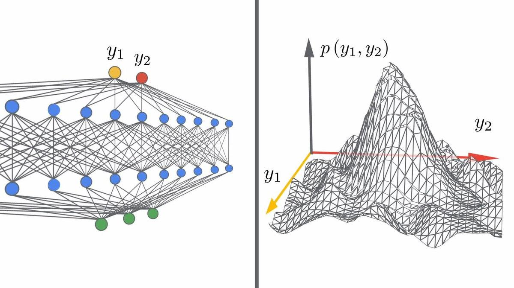

## Table of Contents

## What is width in the context of machine learning?

In machine learning, width often refers to the number of neurons or units in a layer of a neural network. Think of a neural network like a series of connected layers, where each layer processes information and passes it on to the next. The width of a layer determines how much information that layer can handle at once. A wider layer, with more neurons, can capture more complex patterns in the data, but it also makes the network larger and potentially more difficult to train.

For example, in a convolutional neural network used for image recognition, the width of a layer might refer to the number of filters in a convolutional layer. More filters allow the network to detect a greater variety of features in an image, which can improve its performance. However, increasing the width of a network also increases the number of parameters that need to be learned, which can lead to longer training times and a higher risk of overfitting if not managed properly.

## How does the width of a neural network affect its performance?

The width of a neural network, which is the number of neurons in a layer, can really change how well the network works. A wider network can learn more complicated patterns in the data because it has more space to process information. This means it can be better at recognizing things like pictures or understanding language. But, making the network wider also means it has more parts to learn from the data, which can make training take longer. If the network gets too wide without enough data to learn from, it might start to memorize the training data instead of learning general rules, a problem called overfitting.

On the other hand, if a network is too narrow, it might not have enough power to understand the data well. It could miss important patterns because it doesn't have enough neurons to process all the information. This can lead to poor performance because the network can't capture the full complexity of the task it's trying to do. So, finding the right width is a balancing act. You want the network to be wide enough to learn well, but not so wide that it becomes hard to train or overfits the data.

## What is the relationship between the width of a neural network and its depth?

The width of a neural network refers to the number of neurons in a single layer, while the depth is about how many layers the network has. Think of width as how wide each floor of a building is, and depth as how many floors the building has. A wider network can handle more information at once in each layer, which can help it learn more complex patterns. On the other hand, a deeper network can process information through more steps, which can also help it learn complex patterns but in a different way. Both width and depth are important for how well a neural network can learn and perform.

Choosing the right balance between width and depth is key. A network that is too wide might take longer to train and could overfit the data, meaning it memorizes the training examples instead of learning general rules. A network that is too deep might face the vanishing gradient problem, where the signals get weaker as they go through many layers, making it hard for the network to learn. Sometimes, increasing the width can help if the depth is causing problems, and vice versa. The best setup depends on the specific task and the amount of data available, so it often takes some experimenting to find the right mix of width and depth for a neural network.

## How can adjusting the width of a neural network impact training time?

When you make a neural network wider by adding more neurons to its layers, it can take longer to train. This is because each neuron needs to learn from the data, and more neurons mean more things to learn. Imagine you're trying to teach a class of students; the more students you have, the longer it might take to teach them all. In the same way, a wider network has more parameters (weights and biases) that need to be adjusted during training, which can slow down the process.

However, a wider network can sometimes learn faster in terms of the number of epochs needed to reach good performance. This is because a wider network can capture more complex patterns in the data right from the start. So while each training step might take longer, you might need fewer steps overall to get good results. Finding the right balance between width and training time is important, and it often involves some trial and error to see what works best for your specific task.

## What are the computational trade-offs of increasing the width of a neural network?

Increasing the width of a neural network means adding more neurons to its layers. This can make the network better at learning complex patterns because it has more space to process information. But, it also means the network has more parts to learn from the data, which can make training take longer. Each neuron needs to learn its own set of weights and biases, and more neurons mean more calculations during each training step. This can lead to longer training times and higher computational costs, especially if you're working with limited computing resources.

On the other hand, a wider network might need fewer training steps to reach good performance. This is because it can capture more complex patterns right from the start, which can speed up the learning process. So while each training step might take longer, you might need fewer steps overall to get good results. Finding the right balance between width and training time is important, and it often involves some trial and error to see what works best for your specific task.

## Can you explain the concept of 'overparameterization' in relation to network width?

Overparameterization in neural networks means making the network bigger than it needs to be to learn the data. When we talk about width, overparameterization can happen if we add too many neurons to the layers. A network that's too wide might have so many parameters (weights and biases) that it can easily memorize the training data instead of learning general rules. This can lead to overfitting, where the network does well on the training data but not on new, unseen data.

While overparameterization can be a problem, it's not always bad. Sometimes, having a wider network can actually help the network learn better. Research has shown that overparameterized networks can still generalize well if trained properly, often with techniques like early stopping or regularization. These methods help prevent the network from overfitting by stopping the training early or adding constraints to the learning process. So, while a wider network might have more parameters, it can still perform well if managed correctly.

## How does the width of a neural network influence its ability to generalize to new data?

The width of a neural network, which is the number of neurons in each layer, can affect how well it can generalize to new data. A wider network has more neurons, so it can learn more complex patterns from the training data. This can be good because it might help the network understand the data better and make better predictions on new data. But, if the network is too wide, it might start to memorize the training data instead of learning general rules. This is called overfitting, and it can make the network perform poorly on new data because it's too focused on the specific examples it was trained on.

To avoid overfitting, you can use techniques like regularization or early stopping. Regularization adds a penalty to the network's complexity, which can help it focus on learning general patterns instead of memorizing the training data. Early stopping means you stop training the network before it has a chance to overfit. By finding the right width for your network and using these techniques, you can help it generalize better to new data. This means the network will be able to make good predictions even on data it hasn't seen before, which is the goal of machine learning.

## What techniques can be used to optimize the width of a neural network?

One way to optimize the width of a neural network is by using a technique called cross-validation. This means you split your data into different parts, train your network on some of the parts, and test it on the others. By trying different widths and seeing which one does the best on the test parts, you can find the right width for your network. Another technique is grid search, where you try a bunch of different widths and other settings, and pick the one that works the best. This can take a long time, but it helps you find the best setup for your network.

Another approach is to use regularization techniques, like L1 or L2 regularization, to help control the width of your network. Regularization adds a penalty to the network's complexity, which can help it focus on learning general patterns instead of memorizing the training data. For example, L2 regularization adds a term to the loss function that is proportional to the square of the weights, which encourages the network to use smaller weights and can help prevent overfitting. By adjusting the strength of the regularization, you can find a good balance between network width and performance.

Lastly, you can use pruning techniques to start with a wider network and then remove neurons that don't contribute much to the network's performance. This can help you find the right width without having to start from scratch every time. Pruning can be done after training the network, by looking at which neurons have the smallest impact on the output and removing them. This way, you can end up with a network that is just the right width for your task, without wasting time training many different networks.

## How do different activation functions interact with the width of a neural network?

The choice of activation function can influence how the width of a neural network affects its performance. Activation functions decide what information gets passed from one layer to the next. Some activation functions, like the ReLU (Rectified Linear Unit), work well with wider networks because they help avoid the vanishing gradient problem, where the gradients get smaller as they go through the network. This means a wider network with ReLU can learn faster and handle more complex patterns. On the other hand, if you use an activation function like the sigmoid, which can lead to vanishing gradients, a wider network might struggle more because the gradients can get too small to be useful for learning.

Different activation functions also affect how much a wider network can help with generalization. For example, using ReLU can help a wider network learn more without overfitting because it's less likely to saturate, meaning it can keep learning even when the input gets very large. But if you use an activation function like tanh, which can saturate, a wider network might start to overfit more easily because the neurons can get stuck and stop learning new things. So, choosing the right activation function is important for making sure a wider network can learn well and generalize to new data.

## What are the current research trends regarding the optimal width of neural networks?

Current research in neural network architecture is focusing a lot on finding the best width for different tasks. One big trend is using techniques like neural architecture search (NAS) to automatically find the right width. These methods use algorithms to try out lots of different network widths and other settings, then pick the one that works best. Researchers are also looking at how the width affects things like training time and how well the network can work on new data. They're trying to figure out if wider networks always help or if there's a point where adding more neurons doesn't make a difference.

Another trend is studying how the width of a network interacts with other parts of the network, like the depth and the activation functions. Some studies show that wider networks can learn faster and handle more complex patterns, but only if you use the right activation functions. For example, using ReLU can help wider networks learn better because it avoids the vanishing gradient problem. Researchers are also looking at how to use regularization and pruning to control the width of networks. These techniques can help find the right width without overfitting, making the network perform better on new data.

## How does the width of a neural network affect its robustness to adversarial attacks?

The width of a neural network, or the number of neurons in each layer, can affect how well it can handle adversarial attacks. Adversarial attacks are small changes to the input data that can trick the network into making wrong predictions. A wider network can sometimes be more robust to these attacks because it has more neurons to learn from the data. This means it can capture more complex patterns and might be better at recognizing when the input has been changed in a sneaky way. But, if the network is too wide, it might start to overfit the training data, which can make it less robust because it becomes too focused on the specific examples it was trained on.

Researchers are still trying to figure out the best way to use the width of a neural network to make it more robust to adversarial attacks. Some studies suggest that using techniques like regularization can help control the width of the network and make it more resistant to these attacks. Regularization adds a penalty to the network's complexity, which can help it focus on learning general patterns instead of memorizing the training data. This can make the network better at recognizing adversarial inputs because it's not just relying on the specific examples it was trained on. Finding the right balance between width and robustness is an ongoing challenge in the field of machine learning.

## Can you discuss any case studies where adjusting the width of a neural network significantly impacted model performance?

In a study published in the journal "Neural Networks" in 2019, researchers explored how adjusting the width of a neural network affected its performance on image classification tasks. They started with a baseline network and then created several versions with different widths. They found that increasing the width from 64 to 128 neurons per layer significantly improved the network's accuracy on the CIFAR-10 dataset, going from about 85% to 90%. However, when they increased the width further to 256 neurons per layer, the accuracy only improved slightly to 91%, but the training time increased a lot. This showed that there's a sweet spot for width where the network performs well without taking too long to train.

Another case study from a 2021 paper in the "Journal of Machine Learning Research" looked at how the width of a neural network impacted its performance on natural language processing tasks. The researchers used a network to predict sentiment in movie reviews and experimented with different widths. They found that a network with a width of 512 neurons per layer performed much better than one with 256 neurons, achieving an accuracy of 88% compared to 82%. But when they tried a width of 1024 neurons, the accuracy only went up to 89%, and the training time doubled. This study also showed that while wider networks can improve performance, there's a point where the benefits start to diminish, and the increased computational cost might not be worth it.