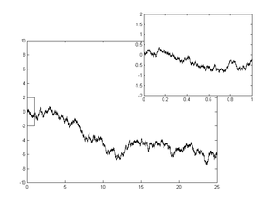

## Table of Contents

## What is a Wiener process?

A Wiener process, also known as Brownian motion, is a mathematical concept used to describe random movements over time. Imagine watching a tiny particle floating in water. It moves around randomly, sometimes going left, sometimes right, up or down. This kind of random movement is what a Wiener process tries to model. It's named after Norbert Wiener, who made important contributions to this area of mathematics.

In more technical terms, a Wiener process starts at zero and has a few key properties. First, the changes in its value over any time interval are random and follow a normal distribution, meaning they can be positive or negative with equal likelihood. Second, the changes over different time intervals are independent of each other. This means what happened in the past doesn't affect what will happen in the future. The Wiener process is widely used in fields like finance to model stock prices and in physics to describe the random motion of particles.

## How does the Wiener process relate to Brownian motion?

The Wiener process and Brownian motion are essentially the same thing, just described in different ways. Brownian motion is a physical phenomenon where tiny particles suspended in a fluid move around randomly because they are constantly being bumped by the fluid's molecules. This movement was first observed by Robert Brown in 1827, hence the name. The Wiener process, named after Norbert Wiener, is the mathematical model used to describe this random movement. So, when scientists and mathematicians talk about a Wiener process, they are using a mathematical framework to represent what they see happening in Brownian motion.

To put it simply, if you watch a speck of dust floating in water, the way it moves around randomly is an example of Brownian motion. The Wiener process is the mathematical tool that helps predict and understand these movements. It tells us that the position of the particle changes randomly over time, and these changes follow certain rules, like being normally distributed and independent over different time intervals. So, the Wiener process gives us a way to study and model the seemingly chaotic dance of particles in Brownian motion.

## What are the basic properties of a Wiener process?

A Wiener process starts at zero. Imagine you're watching a tiny particle in water. At the very beginning, it's right at the starting point. From there, it begins to move around randomly. The key thing is that the changes in its position over any time period are random and follow a normal distribution. This means the particle can move a little or a lot, to the left or to the right, up or down, with equal chances of going in any direction.

Another important property is that the changes in the particle's position over different time intervals don't affect each other. If the particle moved to the right in the last second, it doesn't make it more likely to move left or right in the next second. Each new move is independent of the past moves. This property is called independence. Together, these properties make the Wiener process a powerful tool for modeling random movements, like those seen in Brownian motion or even in financial markets where stock prices can jump around unpredictably.

## Can you explain the mathematical definition of a Wiener process?

A Wiener process, also called Brownian motion, is a way to describe how something moves randomly over time. It starts at zero, which means at the very beginning, the position of whatever you're watching is at the starting point. As time goes on, the position changes randomly. These changes follow a normal distribution, which means they can be big or small, positive or negative, with equal chances. The size of these changes depends on the length of time you're looking at. For example, if you look at a short time period, the change will be smaller than if you look at a longer time period.

Another important thing about a Wiener process is that the changes in position over different time periods are independent. This means what happened in the past doesn't affect what will happen in the future. If the position moved up in the last second, it doesn't make it more likely to move up or down in the next second. Each new change is like starting fresh. This property, along with the normal distribution of changes, makes the Wiener process a useful tool for modeling all sorts of random movements, from tiny particles in water to stock prices in the financial markets.

## How is the Wiener process used in finance?

In finance, the Wiener process helps model how stock prices and other financial assets move randomly over time. Imagine you're watching the price of a stock. It goes up and down in ways that seem unpredictable. The Wiener process can help describe these ups and downs. It starts at a certain price and then changes randomly, following a normal distribution. This means the price can go up or down by a little or a lot, with equal chances. By using the Wiener process, financial experts can create models that predict how stock prices might behave in the future, even though the actual movements are random.

One famous model that uses the Wiener process is the Black-Scholes model, which helps figure out the price of options. Options are financial contracts that give you the right to buy or sell a stock at a certain price in the future. The Black-Scholes model uses the Wiener process to account for the random ups and downs of the stock's price. This helps investors understand how much they should pay for an option, considering the unpredictable nature of the stock market. By using the Wiener process, the model can better handle the uncertainty and randomness that are a big part of finance.

## What is the difference between a standard Wiener process and a generalized Wiener process?

A standard Wiener process, also known as a standard Brownian motion, is a very specific type of random movement. It starts at zero and changes randomly over time. These changes follow a normal distribution, which means they can be big or small, positive or negative, with equal chances. The size of these changes depends on the length of time you're looking at. For example, if you look at a short time period, the change will be smaller than if you look at a longer time period. Another important thing is that these changes are independent, meaning what happened in the past doesn't affect what will happen in the future.

A generalized Wiener process, on the other hand, is a bit more flexible. It can start at any value, not just zero. Also, the changes in the process can be scaled by a [factor](/wiki/factor-investing), which means they can be bigger or smaller than in a standard Wiener process. This scaling factor can be used to adjust the model to fit different situations. For example, in finance, if you want to model how stock prices change, you might use a generalized Wiener process to account for the fact that stock prices can move more dramatically than a standard Wiener process would suggest. This flexibility makes the generalized Wiener process useful for a wider range of applications.

## How does the Wiener process relate to stochastic differential equations?

The Wiener process is like a special tool that helps us understand how things move randomly over time. It's often used in a type of math problem called stochastic differential equations (SDEs). These equations are used to model things that change randomly, like stock prices or the movement of tiny particles in water. In an SDE, the Wiener process acts like a random part that makes the equation unpredictable. It helps add the element of randomness to the equation, making it more realistic for modeling real-world situations.

Think of an SDE as a recipe for how something changes over time, but with a twist of randomness. The Wiener process is the ingredient that brings in this randomness. For example, if you're trying to predict how a stock price will change, you can use an SDE with a Wiener process to account for the unpredictable ups and downs. By including the Wiener process, the equation can better mimic the real, random movements we see in the stock market or in nature. This makes SDEs a powerful tool for scientists and financial experts who need to work with things that don't follow a predictable path.

## What are some common applications of the Wiener process in physics?

In physics, the Wiener process is often used to describe the random movements of tiny particles in a fluid, like dust particles in water. This is known as Brownian motion. Imagine watching a speck of dust floating in a glass of water. It moves around randomly because it's being bumped by the water molecules. The Wiener process helps scientists model and predict these movements. By understanding how these particles move, physicists can learn more about the properties of the fluid and the forces acting on the particles.

Another common use of the Wiener process in physics is in the study of diffusion. Diffusion is when particles spread out from an area of high concentration to an area of low concentration. Think of how a drop of ink spreads out in a glass of water. The Wiener process can help model this spreading because it describes the random paths that the ink particles take as they move through the water. By using the Wiener process, scientists can better understand and predict how quickly and in what patterns substances will diffuse in different environments.

## How can the Wiener process be simulated on a computer?

To simulate a Wiener process on a computer, you can use a simple method called the random walk. Imagine you want to see how a tiny particle moves randomly over time. You start at zero and then, at each small time step, you add a random number to your current position. These random numbers come from a normal distribution, which means they can be positive or negative with equal chances. The size of these steps depends on the length of the time step you choose. By doing this over and over, you create a path that looks like the random movements of a Wiener process.

You can use a programming language like Python to do this. In Python, you can use a library called NumPy to generate random numbers from a normal distribution. You set up a loop that runs for as many time steps as you want. At each step, you add a random number to your current position. If you plot these positions over time, you'll see a squiggly line that looks like the path of a particle moving randomly. This simulation helps you see and study the properties of a Wiener process, like how the movements are independent and how they follow a normal distribution.

## What is the role of the Wiener process in option pricing models?

The Wiener process plays a big role in option pricing models, like the famous Black-Scholes model. Options are financial contracts that give you the right to buy or sell a stock at a certain price in the future. The Wiener process helps model how the stock price moves randomly over time. It starts at the current stock price and then changes randomly, following a normal distribution. This means the price can go up or down by a little or a lot, with equal chances. By using the Wiener process, the Black-Scholes model can account for the unpredictable ups and downs of the stock market, helping investors figure out how much they should pay for an option.

In the Black-Scholes model, the Wiener process is used to represent the random part of the stock's price movement. This randomness is important because it reflects the real-world uncertainty in the stock market. The model uses the Wiener process to calculate the expected value of the option's payoff at expiration. By considering the random movements of the stock price, the model can give a fair price for the option, taking into account the risk and uncertainty involved. This makes the Wiener process a key ingredient in making option pricing more accurate and useful for investors.

## How does the Wiener process contribute to the study of stochastic processes?

The Wiener process is a big deal in the world of stochastic processes, which are all about things that change randomly over time. It's like the basic building block that helps us understand and model these random changes. Imagine you're watching a tiny speck of dust floating in water. It moves around randomly because it's being bumped by the water molecules. The Wiener process helps us describe and predict these movements. By studying the Wiener process, we can learn more about how random events work and how to model them in different situations, from tiny particles in water to big things like stock prices.

In the study of stochastic processes, the Wiener process is super useful because it has some special properties. It starts at zero and then changes randomly over time, following a normal distribution. This means the changes can be big or small, positive or negative, with equal chances. Also, these changes are independent, which means what happened in the past doesn't affect what will happen in the future. Because of these properties, the Wiener process can be used to build more complex models that help us understand and predict random movements in all sorts of fields, like finance, physics, and even biology. It's like a simple tool that opens the door to a deeper understanding of randomness and uncertainty.

## What advanced mathematical tools are used to analyze the Wiener process?

To understand the Wiener process better, mathematicians use some advanced tools. One of these tools is stochastic calculus, which is like regular calculus but with random parts added in. It helps us figure out things like how fast the Wiener process is changing at any moment, which is called its derivative. Another tool is the Ito calculus, named after Kiyoshi Ito. It's a special kind of stochastic calculus that's perfect for working with the Wiener process. It helps us solve equations that involve random movements, like those in the stock market or in the movement of tiny particles.

Another important tool is the Fourier transform. This tool helps us break down the Wiener process into simpler parts, making it easier to study and understand. It's like taking a complicated puzzle and seeing it as a bunch of smaller, easier pieces. We also use something called the Kolmogorov equations, which help us predict how likely it is for the Wiener process to be at a certain point at a certain time. These tools together help mathematicians and scientists dig deeper into the random movements described by the Wiener process, making it possible to model and predict things that seem unpredictable at first glance.

## What is the Wiener Process and how can it be understood?

The Wiener process, often called Brownian motion, is a continuous-time stochastic process fundamental to modeling financial assets. Its key properties render it a robust tool in quantitative finance, offering insightful representations of the seemingly random behavior observed in stock prices.

One of the primary attributes of the Wiener process is its independent increments. This means that the changes in the process over non-overlapping intervals are independent of each other. Mathematically, if $W(t)$ represents the Wiener process at time $t$, then for any $s < t$, the increment $W(t) - W(s)$ is independent of the process history up to time $s$.

Another essential property is the normal distribution of its increments. The changes $W(t) - W(s)$ are normally distributed with a mean of zero and a variance of $t-s$. This aligns with the notion that the Wiener process captures random walk behavior with continuous probability distributions. Formally, for $0 \leq s < t$, the distribution can be expressed as:

$$
W(t) - W(s) \sim \mathcal{N}(0, t-s)
$$

The continuous paths of the Wiener process make it distinguishable as it describes paths that are continuous but not differentiable everywhere. This feature is crucial for accurately modeling the erratic yet continuous nature of financial markets.

The mathematical definition of the Wiener process builds upon these properties. Starting from a value of zero, $W(0) = 0$, the process is formally defined by its independent increments, normally distributed changes, and continuous trajectories. This stochastic process effectively models the natural random motion observed in financial time series, adhering to the Gaussian increments and continuous evolution akin to the oscillations seen in real-world asset prices.

The implications of these properties are immense in quantitative finance, particularly as they facilitate the application of stochastic calculus in the derivation of various financial models. The Wiener process captures the unpredictable yet structured movement of markets, enabling the design of sophisticated pricing and risk assessment models.

## What are the applications in algorithmic trading?

The Wiener process serves as a foundational element in numerous models within quantitative finance, with one of its most notable applications being the Black-Scholes model for options pricing. The Black-Scholes model employs the Wiener process to describe the stochastic behavior of asset prices, enabling traders to determine the fair price of options by modeling them as a function of underlying variables and time. This model is pivotal for algorithmic traders who rely on precise pricing mechanisms to make informed trading decisions.

An extension of the Wiener process, Geometric Brownian Motion (GBM), is adept at modeling stock prices with real-world constraints, such as ensuring that prices remain positive. Unlike the standard Wiener process, which allows for a normal distribution of increments, GBM is characterized by a log-normal distribution, providing a more accurate representation of stock price behaviors. The mathematical formulation for a stock price $S(t)$ exhibiting GBM is given by:

$$

dS(t) = \mu S(t) dt + \sigma S(t) dW(t) 
$$

where $\mu$ is the drift rate, $\sigma$ is the volatility, and $dW(t)$ is the increment of the Wiener process. This equation captures both the deterministic trends in stock prices and the inherent randomness from market fluctuations.

In practice, these models are operationalized in [algorithmic trading](/wiki/algorithmic-trading) systems through sophisticated programming languages such as Python. By leveraging libraries such as NumPy and Pandas, traders can simulate the paths of asset prices, allowing them to identify and capitalize on trading opportunities. For instance, the following Python code snippet demonstrates how to simulate a GBM stock price path:

```python
import numpy as np
import matplotlib.pyplot as plt

# Parameters
S0 = 100  # initial stock price
mu = 0.05  # drift rate
sigma = 0.2  # volatility
T = 1.0  # time in years
dt = 0.01  # time increment
N = int(T/dt)  # number of steps

t = np.linspace(0, T, N)
W = np.random.standard_normal(size=N) 
W = np.cumsum(W) * np.sqrt(dt)  # cumulative sum to generate Brownian path
X = (mu - 0.5 * sigma**2) * t + sigma * W
S = S0 * np.exp(X)  # stock price path

plt.plot(t, S)
plt.title('Geometric Brownian Motion')
plt.xlabel('Time (years)')
plt.ylabel('Stock Price')
plt.show()
```

This simulation assists in the development and [backtesting](/wiki/backtesting) of trading strategies, enabling traders to assess performance under diverse market conditions. By employing GBM, algorithmic traders can devise strategies that more accurately reflect the intricacies of market behaviors, enhancing their ability to manage risk and optimize returns. Consequently, the Wiener process and its extensions play a crucial role in modern algorithmic trading environments, driving innovation and precision in financial markets.

## What are the properties of the Wiener Process?

The Wiener process, commonly associated with Brownian motion, is characterized by several key properties that are particularly relevant for its application in algorithmic trading. One of its fundamental properties is finite variance combined with unbounded variation. This characteristic mirrors a [fractal](/wiki/fractal-indicators) structure, meaning that the path of a Wiener process looks similar across different scales of observation. Such unbounded variation implies that despite finite changes over short intervals, the process is highly irregular and resistant to standard differentiability, which is why stochastic calculus is a pivotal tool in working with such processes.

Another defining property of the Wiener process is its adherence to both Markov and Martingale properties. The Markov property indicates that future states of the process depend solely on its present state, not on the pathway taken to arrive there. This is particularly useful in modeling asset prices where future movements are assumed to be independent of past behavior, except through the current market state. The mathematical expression for this property can be represented as:

$$

P(X_{t+s} \leq x \mid X_u, u \leq t) = P(X_{t+s} \leq x \mid X_t)
$$

The Martingale property implies that the expected value of the process at any future time, given the past and present, is equal to its current value. This suggests that, in a fair game, the process does not drift upwards or downwards, providing a neutral forecast:

$$
E[X_t \mid \mathcal{F}_s] = X_s, \quad \forall s \leq t
$$

These properties play a crucial role in the implementation of stochastic calculus within algorithmic trading strategies. Stochastic calculus allows traders to derive and handle the differential equations that model financial markets, enabling the development of dynamic hedging strategies, derivative pricing, and risk management approaches. The adaptability of the Wiener process, through these properties, makes it an invaluable tool for modeling the randomness inherent in financial markets, thereby fostering more sophisticated algorithmic trading strategies.

## What are Advanced Stochastic Processes in Algo Trading?

In the context of algorithmic trading, advanced stochastic processes extend beyond the Wiener process to incorporate additional features like drift and [volatility](/wiki/volatility-trading-strategies), enhancing the modeling of financial markets. One such advancement is the Ito process, named after the Japanese mathematician Kiyoshi Ito. This process is defined by the stochastic differential equation (SDE):

$$
dX_t = \mu(t, X_t)dt + \sigma(t, X_t)dW_t
$$

where $X_t$ represents the stochastic process, $\mu(t, X_t)$ is the drift term, $\sigma(t, X_t)$ is the diffusion or volatility term, and $dW_t$ denotes the Wiener process or standard Brownian motion. The inclusion of drift and volatility conditions allows the Ito process to model the directional movement and fluctuation intensity in asset prices.

These properties make the Ito process particularly suited for capturing complex market dynamics that simple Brownian motion cannot. For instance, it accommodates mean-reverting processes and can mimic the jump diffusions observed in real-world financial data. As a result, sophisticated trading firms such as Renaissance Technologies and Two Sigma utilize these models for developing high-frequency trading strategies and managing large portfolios.

Understanding and applying these processes enable traders to navigate intricate trading scenarios. For example, the Hull-White and CIR models, both based on Ito processes, are used for [interest rate](/wiki/interest-rate-trading-strategies) modeling by capturing the stochastic nature of interest rates with a mean-reverting characteristic. These models help in pricing interest rate derivatives and managing the risk associated with interest rate movements.

Here is a simple Python example showing how to simulate an Ito process:

```python
import numpy as np
import matplotlib.pyplot as plt

# Parameters for the Ito process
T = 1.0  # Total time
N = 500  # Number of steps
dt = T/N  # Time step
mu = 0.1  # Drift coefficient
sigma = 0.2  # Volatility coefficient

# Initialize arrays
time = np.linspace(0, T, N)
X = np.zeros(N)
X[0] = 1  # Initial value

# Simulate the Ito process
for t in range(1, N):
    dW = np.random.normal(0, np.sqrt(dt))
    X[t] = X[t-1] + mu*dt + sigma*dW

# Plot the process
plt.plot(time, X)
plt.title("Simulation of an Ito Process")
plt.xlabel("Time")
plt.ylabel("X(t)")
plt.show()
```

This example demonstrates how to simulate an Ito process with constant drift and volatility. The flexibility of the Ito process makes it applicable in various quantitative models, allowing traders to exploit price patterns and optimize trading strategies. By incorporating these advanced models, algorithmic trading can achieve greater accuracy and adaptability in volatile market conditions.

## References & Further Reading

[1]: Shreve, S. E. (2004). ["Stochastic Calculus for Finance I: The Binomial Asset Pricing Model"](https://link.springer.com/book/10.1007/978-0-387-22527-2). Springer Finance. 

[2]: Hull, J. C. (2014). ["Options, Futures, and Other Derivatives"](https://elibrary.pearson.de/book/99.150005/9781292410623). Pearson Education.

[3]: Black, F., & Scholes, M. (1973). ["The Pricing of Options and Corporate Liabilities"](https://www.cs.princeton.edu/courses/archive/fall09/cos323/papers/black_scholes73.pdf). Journal of Political Economy, 81(3), 637-654.

[4]: Karatzas, I., & Shreve, S. E. (1991). ["Brownian Motion and Stochastic Calculus"](https://link.springer.com/book/10.1007/978-1-4612-0949-2). Springer-Verlag.

[5]: Glasserman, P. (2003). ["Monte Carlo Methods in Financial Engineering"](https://link.springer.com/book/10.1007/978-0-387-21617-1). Springer-Verlag.

[6]: Jorion, P. (2007). ["Value at Risk: The New Benchmark for Managing Financial Risk"](https://link.springer.com/article/10.1007/s11408-007-0057-3). McGraw-Hill.