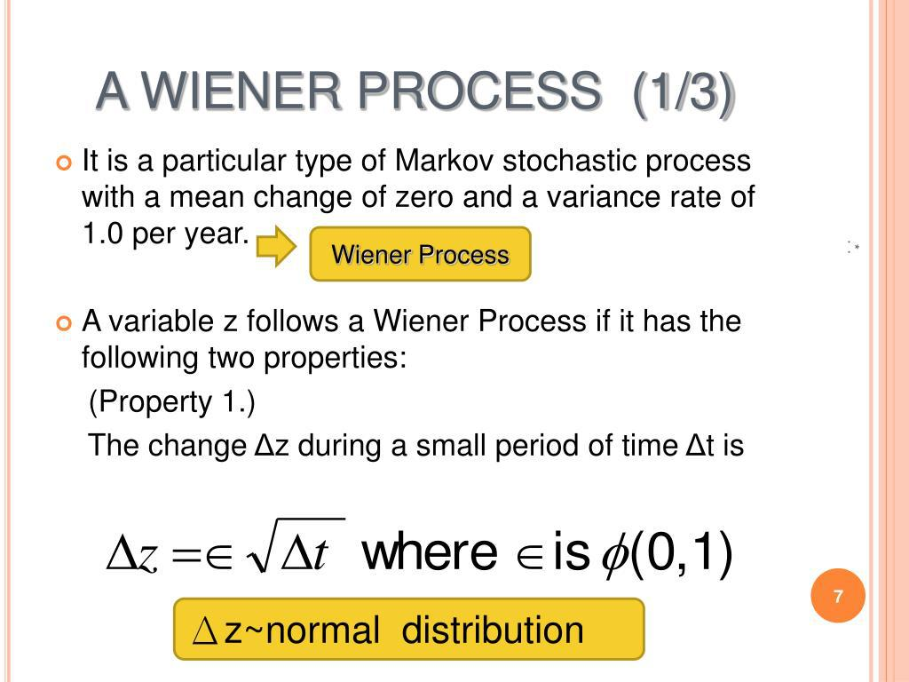

The Wiener process, also known as Brownian motion, is a pivotal concept in algorithmic trading. It plays a crucial role in modeling the stochastic nature of asset price movements over time, offering a mathematical framework to represent randomness in financial markets. The process is characterized by its continuous path and normally distributed increments independent of each other, making it a robust tool for modeling financial assets' behavior.

In algorithmic trading, the Wiener process is essential in constructing mathematical models that inform trading decisions. It is particularly integral to models involved in the pricing of derivatives and risk management strategies. For instance, the Wiener process underlies the Black-Scholes model, a foundational model for options pricing that combines this stochastic process with the concept of geometric Brownian motion to simulate stock prices' future trajectory.



This article delves into the various facets of the Wiener process within financial markets, emphasizing its properties, applications, and relevance in algorithmic trading. By understanding how the Wiener process functions and its utility in quantitative finance, traders and quantitative analysts gain a critical tool for modeling market behavior and executing strategies that hinge on accurately assessing risk and predicting future movements. As trading strategies evolve alongside advancements in computational power, the application of the Wiener process in algorithmic trading is expected to become even more advanced, promising continued importance in the financial sector.

## Table of Contents

## Understanding the Wiener Process

The Wiener process, often called Brownian motion, is a continuous-time stochastic process fundamental to modeling financial assets. Its key properties render it a robust tool in quantitative finance, offering insightful representations of the seemingly random behavior observed in stock prices.

One of the primary attributes of the Wiener process is its independent increments. This means that the changes in the process over non-overlapping intervals are independent of each other. Mathematically, if $W(t)$ represents the Wiener process at time $t$, then for any $s < t$, the increment $W(t) - W(s)$ is independent of the process history up to time $s$.

Another essential property is the normal distribution of its increments. The changes $W(t) - W(s)$ are normally distributed with a mean of zero and a variance of $t-s$. This aligns with the notion that the Wiener process captures random walk behavior with continuous probability distributions. Formally, for $0 \leq s < t$, the distribution can be expressed as:

$$
W(t) - W(s) \sim \mathcal{N}(0, t-s)
$$

The continuous paths of the Wiener process make it distinguishable as it describes paths that are continuous but not differentiable everywhere. This feature is crucial for accurately modeling the erratic yet continuous nature of financial markets.

The mathematical definition of the Wiener process builds upon these properties. Starting from a value of zero, $W(0) = 0$, the process is formally defined by its independent increments, normally distributed changes, and continuous trajectories. This stochastic process effectively models the natural random motion observed in financial time series, adhering to the Gaussian increments and continuous evolution akin to the oscillations seen in real-world asset prices.

The implications of these properties are immense in quantitative finance, particularly as they facilitate the application of stochastic calculus in the derivation of various financial models. The Wiener process captures the unpredictable yet structured movement of markets, enabling the design of sophisticated pricing and risk assessment models.

## Applications in Algorithmic Trading

The Wiener process serves as a foundational element in numerous models within quantitative finance, with one of its most notable applications being the Black-Scholes model for options pricing. The Black-Scholes model employs the Wiener process to describe the stochastic behavior of asset prices, enabling traders to determine the fair price of options by modeling them as a function of underlying variables and time. This model is pivotal for algorithmic traders who rely on precise pricing mechanisms to make informed trading decisions.

An extension of the Wiener process, Geometric Brownian Motion (GBM), is adept at modeling stock prices with real-world constraints, such as ensuring that prices remain positive. Unlike the standard Wiener process, which allows for a normal distribution of increments, GBM is characterized by a log-normal distribution, providing a more accurate representation of stock price behaviors. The mathematical formulation for a stock price $S(t)$ exhibiting GBM is given by:

$$

dS(t) = \mu S(t) dt + \sigma S(t) dW(t) 
$$

where $\mu$ is the drift rate, $\sigma$ is the volatility, and $dW(t)$ is the increment of the Wiener process. This equation captures both the deterministic trends in stock prices and the inherent randomness from market fluctuations.

In practice, these models are operationalized in [algorithmic trading](/wiki/algorithmic-trading) systems through sophisticated programming languages such as Python. By leveraging libraries such as NumPy and Pandas, traders can simulate the paths of asset prices, allowing them to identify and capitalize on trading opportunities. For instance, the following Python code snippet demonstrates how to simulate a GBM stock price path:

```python
import numpy as np
import matplotlib.pyplot as plt

# Parameters
S0 = 100  # initial stock price
mu = 0.05  # drift rate
sigma = 0.2  # volatility
T = 1.0  # time in years
dt = 0.01  # time increment
N = int(T/dt)  # number of steps

t = np.linspace(0, T, N)
W = np.random.standard_normal(size=N) 
W = np.cumsum(W) * np.sqrt(dt)  # cumulative sum to generate Brownian path
X = (mu - 0.5 * sigma**2) * t + sigma * W
S = S0 * np.exp(X)  # stock price path

plt.plot(t, S)
plt.title('Geometric Brownian Motion')
plt.xlabel('Time (years)')
plt.ylabel('Stock Price')
plt.show()
```

This simulation assists in the development and [backtesting](/wiki/backtesting) of trading strategies, enabling traders to assess performance under diverse market conditions. By employing GBM, algorithmic traders can devise strategies that more accurately reflect the intricacies of market behaviors, enhancing their ability to manage risk and optimize returns. Consequently, the Wiener process and its extensions play a crucial role in modern algorithmic trading environments, driving innovation and precision in financial markets.

## Properties of the Wiener Process

The Wiener process, commonly associated with Brownian motion, is characterized by several key properties that are particularly relevant for its application in algorithmic trading. One of its fundamental properties is finite variance combined with unbounded variation. This characteristic mirrors a [fractal](/wiki/fractal-indicators) structure, meaning that the path of a Wiener process looks similar across different scales of observation. Such unbounded variation implies that despite finite changes over short intervals, the process is highly irregular and resistant to standard differentiability, which is why stochastic calculus is a pivotal tool in working with such processes.

Another defining property of the Wiener process is its adherence to both Markov and Martingale properties. The Markov property indicates that future states of the process depend solely on its present state, not on the pathway taken to arrive there. This is particularly useful in modeling asset prices where future movements are assumed to be independent of past behavior, except through the current market state. The mathematical expression for this property can be represented as:

$$

P(X_{t+s} \leq x \mid X_u, u \leq t) = P(X_{t+s} \leq x \mid X_t)
$$

The Martingale property implies that the expected value of the process at any future time, given the past and present, is equal to its current value. This suggests that, in a fair game, the process does not drift upwards or downwards, providing a neutral forecast:

$$
E[X_t \mid \mathcal{F}_s] = X_s, \quad \forall s \leq t
$$

These properties play a crucial role in the implementation of stochastic calculus within algorithmic trading strategies. Stochastic calculus allows traders to derive and handle the differential equations that model financial markets, enabling the development of dynamic hedging strategies, derivative pricing, and risk management approaches. The adaptability of the Wiener process, through these properties, makes it an invaluable tool for modeling the randomness inherent in financial markets, thereby fostering more sophisticated algorithmic trading strategies.

## Simulation and Modeling

Simulating Wiener processes is a crucial step in developing and backtesting trading strategies, enabling traders to evaluate their approaches under various hypothetical market conditions. A Wiener process, or Brownian motion, is characterized by independent, normally distributed increments and continuous paths, making it an ideal tool for modeling stock prices.

To simulate a Wiener process in Python, one commonly employs the NumPy library, which provides efficient numerical operations. Here's a basic implementation:

```python
import numpy as np
import matplotlib.pyplot as plt

def simulate_wiener_process(T, N):
    dt = T/N
    time_steps = np.linspace(0, T, N+1)
    dW = np.sqrt(dt) * np.random.randn(N)
    W = np.insert(np.cumsum(dW), 0, 0)
    return time_steps, W

# Parameters
T = 1.0  # Total time in years
N = 1000  # Number of increments

time, wiener_process = simulate_wiener_process(T, N)
plt.plot(time, wiener_process)
plt.title("Simulated Wiener Process")
plt.xlabel("Time")
plt.ylabel("W(t)")
plt.show()
```

In this code, `T` represents the total time horizon and `N` denotes the number of time increments. The function `simulate_wiener_process` generates a path that mimics the behavior of a Wiener process by creating random normal increments scaled by the square root of the time step `dt`. This process ensures that increments are independent and identically distributed, maintaining the necessary characteristics of Brownian motion.

Simulating these paths allows traders to analyze potential strategy performance across varying market scenarios without incurring monetary risk. By generating a range of possible price paths, one can determine how different strategies might perform under hypothetical conditions, thus evaluating their robustness.

Furthermore, analyzing simulation data provides insights into the strengths and weaknesses of trading strategies. For instance, supposing a strategy is overly sensitive to price [volatility](/wiki/volatility-trading-strategies), simulations can reveal this vulnerability, allowing traders to adjust parameters or switch strategies before implementing them in live markets.

In live trading scenarios, these simulations help enhance prediction accuracy by refining model parameters based on historical data and simulated outcomes. They can also support risk management efforts by identifying potential drawdowns or periods of high volatility, enabling traders to mitigate risks proactively.

Simulation and modeling of Wiener processes form the backbone of robust algorithmic strategies, allowing traders to transform theoretical models into practical applications. These methods aid in aligning mathematical models with real market behavior, thereby enhancing the overall effectiveness of trading strategies.

## Advanced Stochastic Processes in Algo Trading

In the context of algorithmic trading, advanced stochastic processes extend beyond the Wiener process to incorporate additional features like drift and volatility, enhancing the modeling of financial markets. One such advancement is the Ito process, named after the Japanese mathematician Kiyoshi Ito. This process is defined by the stochastic differential equation (SDE):

$$
dX_t = \mu(t, X_t)dt + \sigma(t, X_t)dW_t
$$

where $X_t$ represents the stochastic process, $\mu(t, X_t)$ is the drift term, $\sigma(t, X_t)$ is the diffusion or volatility term, and $dW_t$ denotes the Wiener process or standard Brownian motion. The inclusion of drift and volatility conditions allows the Ito process to model the directional movement and fluctuation intensity in asset prices.

These properties make the Ito process particularly suited for capturing complex market dynamics that simple Brownian motion cannot. For instance, it accommodates mean-reverting processes and can mimic the jump diffusions observed in real-world financial data. As a result, sophisticated trading firms such as Renaissance Technologies and Two Sigma utilize these models for developing high-frequency trading strategies and managing large portfolios.

Understanding and applying these processes enable traders to navigate intricate trading scenarios. For example, the Hull-White and CIR models, both based on Ito processes, are used for [interest rate](/wiki/interest-rate-trading-strategies) modeling by capturing the stochastic nature of interest rates with a mean-reverting characteristic. These models help in pricing interest rate derivatives and managing the risk associated with interest rate movements.

Here is a simple Python example showing how to simulate an Ito process:

```python
import numpy as np
import matplotlib.pyplot as plt

# Parameters for the Ito process
T = 1.0  # Total time
N = 500  # Number of steps
dt = T/N  # Time step
mu = 0.1  # Drift coefficient
sigma = 0.2  # Volatility coefficient

# Initialize arrays
time = np.linspace(0, T, N)
X = np.zeros(N)
X[0] = 1  # Initial value

# Simulate the Ito process
for t in range(1, N):
    dW = np.random.normal(0, np.sqrt(dt))
    X[t] = X[t-1] + mu*dt + sigma*dW

# Plot the process
plt.plot(time, X)
plt.title("Simulation of an Ito Process")
plt.xlabel("Time")
plt.ylabel("X(t)")
plt.show()
```

This example demonstrates how to simulate an Ito process with constant drift and volatility. The flexibility of the Ito process makes it applicable in various quantitative models, allowing traders to exploit price patterns and optimize trading strategies. By incorporating these advanced models, algorithmic trading can achieve greater accuracy and adaptability in volatile market conditions.

## Conclusion

The Wiener process stands as a central component in modern algorithmic trading, underpinning a vast array of financial models and trading strategies. Its stochastic nature makes it an invaluable tool for traders and quantitative analysts, who utilize it to model and predict market trends. By capturing the seemingly random motion of asset prices, the Wiener process allows these professionals to manage risk effectively and price derivatives with precision.

The continuous and independent increments of the Wiener process provide a realistic approximation of asset price behaviors, facilitating the development of reliable simulation models. These qualities make it a preferred choice for modeling in quantitative finance applications, such as options pricing through the Black-Scholes model or any strategy that requires an understanding of market volatilities.

As computational power advances, the implementation of the Wiener process and its related derivatives in algorithmic trading is expected to increase. Enhanced computational capabilities allow for more complex and resource-intensive simulations, which can improve prediction accuracy and strategy performance. This progression ensures that the Wiener process will remain a pivotal element in the toolkit of financial analysts and traders, further solidifying its role in the evolving landscape of financial markets.

## References & Further Reading

[1]: Shreve, S. E. (2004). ["Stochastic Calculus for Finance I: The Binomial Asset Pricing Model"](https://link.springer.com/book/10.1007/978-0-387-22527-2). Springer Finance. 

[2]: Hull, J. C. (2014). ["Options, Futures, and Other Derivatives"](https://elibrary.pearson.de/book/99.150005/9781292410623). Pearson Education.

[3]: Black, F., & Scholes, M. (1973). ["The Pricing of Options and Corporate Liabilities"](https://www.cs.princeton.edu/courses/archive/fall09/cos323/papers/black_scholes73.pdf). Journal of Political Economy, 81(3), 637-654.

[4]: Karatzas, I., & Shreve, S. E. (1991). ["Brownian Motion and Stochastic Calculus"](https://link.springer.com/book/10.1007/978-1-4612-0949-2). Springer-Verlag.

[5]: Glasserman, P. (2003). ["Monte Carlo Methods in Financial Engineering"](https://link.springer.com/book/10.1007/978-0-387-21617-1). Springer-Verlag.

[6]: Jorion, P. (2007). ["Value at Risk: The New Benchmark for Managing Financial Risk"](https://link.springer.com/article/10.1007/s11408-007-0057-3). McGraw-Hill.