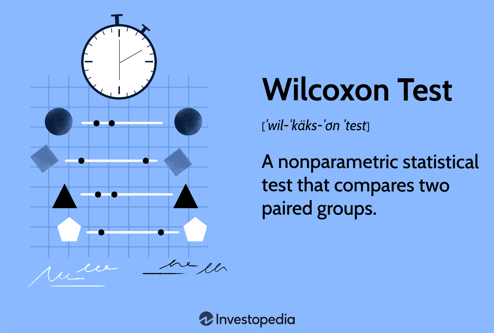

In today's data-driven world, statistical methods play a critical role in multiple domains, notably in finance and trading where they underpin decision-making processes and risk management strategies. Among these statistical tools, the Wilcoxon test stands out as a non-parametric method, renowned for its robustness and adaptability when dealing with non-normally distributed data. Its significance lies in its ability to provide reliable results without the stringent assumptions associated with parametric tests, such as the normality of data distribution.

The utility of the Wilcoxon test extends particularly into algorithmic trading—an area where financial instruments are traded using automated algorithms. In this context, the Wilcoxon test enables traders to objectively compare different strategies, assess performance metrics, and identify significant differences in trading conditions or outcomes, all while handling the unpredictable nature of financial data that often deviates from normal distribution. By employing this test, traders can gain a deeper understanding of their strategies' effectiveness, allowing for adjustments and improvements based on statistical evidence rather than intuition alone.



This article will explore the fundamental nature of non-parametric tests and their advantages, alongside a focused examination of the Wilcoxon test's practical applications in trading scenarios, thus highlighting its potency as a tool for modern financial analysis.

## Table of Contents

## Understanding Non-Parametric Tests

Non-parametric tests are statistical methods designed to analyze data without making assumptions about the underlying statistical distribution. Unlike parametric tests that often require data normality and homogeneity of variance, non-parametric tests are valuable tools when data violates these assumptions. This attribute makes them particularly useful for working with non-normally distributed or ordinal data, where standard parametric tests like the t-test may not be suitable.

The primary distinction between parametric and non-parametric tests lies in the dependency on distribution assumptions. Parametric tests assume that the data follows a specific distribution, often the normal distribution. This assumption allows for the estimation of population parameters like the mean and variance. Examples of parametric tests include the t-test and ANOVA, which require the assumption of normality and equal variances between groups.

In contrast, non-parametric tests do not rely on such distributional assumptions, thus providing more flexibility. They are often based on ranks or medians rather than means, making them robust to outliers and skewed distributions. Examples of non-parametric tests include the Wilcoxon Signed Rank Test, Mann-Whitney U Test, and Kruskal-Wallis Test. These tests operate by ranking the data points and comparing these ranks across groups, thus eliminating the need for the data to conform to any specific distribution.

Non-parametric tests are ideal in scenarios where the data is ordinal, comprises ranks or categories, or when the sample size is small, leading to non-normal data distributions. They are also valuable when the data is subject to significant measurement errors or when the presence of outliers could unduly influence results.

Implementing a non-parametric test often begins with transforming the original data into ranks and then performing the chosen statistical test based on these ranks. For example, the Python code for conducting a Wilcoxon Signed Rank Test using the SciPy library might look like this:

```python
from scipy.stats import wilcoxon

# Example data
sample1 = [1.2, 2.5, 3.1, 4.8, 5.2]
sample2 = [1.0, 2.6, 3.3, 4.7, 5.4]

# Perform Wilcoxon Signed Rank Test
statistic, p_value = wilcoxon(sample1, sample2)

print("Statistic:", statistic)
print("p-value:", p_value)
```

This code snippet demonstrates how non-parametric tests can be efficiently conducted using statistical software, allowing analysts to draw valid conclusions without the prerequisite of normal distribution assumptions. Non-parametric methods, due to their flexibility and robustness, are instrumental in data analysis when conventional assumptions cannot be met, offering researchers and professionals a powerful alternative for statistical inference.

## Overview of the Wilcoxon Test

The Wilcoxon test, devised by Frank Wilcoxon in 1945, stands as a cornerstone among non-parametric statistical methods. This family of tests offers a robust alternative to traditional parametric approaches, particularly when assumptions regarding normality are violated or when dealing with ordinal data. The Wilcoxon test is divided into two main types: the Wilcoxon Signed Rank Test and the Wilcoxon Rank Sum Test, each serving distinct analytic purposes.

### Wilcoxon Signed Rank Test

The Wilcoxon Signed Rank Test is designed for paired data, where each subject serves as its own control. This test evaluates the difference between two matched groups, identifying whether their population mean ranks differ. The signed rank test operates under the assumption of symmetry, meaning that the population of differences between paired observations is symmetric around a median value.

Mathematically, the test involves ranking the absolute differences between paired observations, assigning signs according to the difference, and then summing the ranks. The test statistic $W$ is calculated as the smaller of the sum of positive or negative signed ranks. If under the null hypothesis of no difference, $W$ falls below a critical value (derived from tabulated distributions), the null hypothesis is rejected.

### Wilcoxon Rank Sum Test

Also known as the Mann-Whitney U Test, the Wilcoxon Rank Sum Test is suitable for assessing differences between two independent samples. This test evaluates whether one of two groups of independent samples tends to have larger values than the other group, complementing the t-test when normality cannot be assumed.

The test involves ranking all observations from both samples together and then calculating the sum of the ranks for each sample. The rank sum $U$ serves as the test statistic. The distribution of $U$, under the null hypothesis, helps determine statistical significance when comparing two independent groups. If the observed $U$ is sufficiently low, the null hypothesis of equal distributions can be rejected.

### Statistical Concepts and Applicability

Both forms of the Wilcoxon test do not require the data to follow a normal distribution, granting them versatility in a wide range of applications:

- **Assumptions:** The Wilcoxon Signed Rank Test assumes that the differences are symmetrically distributed around the median. For the Rank Sum Test, the assumptions are less stringent, primarily requiring samples to be independent and observations ordinal.

- **Applicability:** These tests apply in scenarios lacking parametric test conditions—i.e., non-continuous, ordinal, or otherwise non-normally distributed data. Additionally, they efficiently handle small sample sizes or skewed data, where parametric tests like the t-test may lack validity.

In summary, the Wilcoxon family of tests offers powerful alternatives to parametric methods, facilitating hypothesis testing in situations where traditional approaches are untenable. They are indispensable tools for statisticians dealing with diverse data types and conditions in various fields.

## The Wilcoxon Test in Algorithmic Trading

Algorithmic trading is an advanced method of executing orders using pre-programmed trading instructions. These instructions account for various variables like price, timing, and [volume](/wiki/volume-trading-strategy). The core of [algorithmic trading](/wiki/algorithmic-trading) lies in statistical models, which make it indispensable to assess trading strategies' performance. One powerful tool in this assessment process is the Wilcoxon test, a non-parametric statistical test suited for evaluating two related samples. It offers the advantage of not requiring data to follow a normal distribution, making it particularly useful in financial markets where data often exhibit non-normal characteristics due to outliers or heavy tails.

The Wilcoxon test can be employed to compare the performance of two different trading strategies. For instance, consider a situation where a trader wants to evaluate the effectiveness of a newly developed trading algorithm against an existing one. The performance of these algorithms can be assessed by comparing their returns over a given period. The Wilcoxon Signed Rank Test can be applied to determine if there is a statistically significant difference between the paired returns of the two strategies.

To illustrate its application, let's consider a hypothetical scenario where an investor tests two trading strategies, A and B, over ten trading days. The daily profits for both strategies are recorded, and the goal is to determine whether strategy A yields significantly different results compared to strategy B. By employing the Wilcoxon Signed Rank Test, you first calculate the differences between the paired profits. Then, rank these differences in absolute terms while keeping track of their signs. Finally, sum the ranks of the positive and negative differences separately. If the sum of the ranks shows a statistically significant difference, one may conclude that one strategy significantly outperforms the other.

Here's a basic Python example for implementing the Wilcoxon Signed Rank Test using the `scipy` library:

```python
from scipy.stats import wilcoxon

# Sample profits for strategies A and B over 10 trading days
profits_a = [100, 150, 90, 200, 130, 170, 125, 180, 150, 160]
profits_b = [110, 140, 85, 210, 120, 160, 130, 175, 145, 155]

# Perform the Wilcoxon Signed-Rank Test
stat, p_value = wilcoxon(profits_a, profits_b)

print(f"Wilcoxon test statistic: {stat}")
print(f"P-value: {p_value}")

# Conclusion based on p-value
if p_value < 0.05:
    print("There is a significant difference between the two strategies.")
else:
    print("No significant difference was found between the two strategies.")
```

Additionally, the Wilcoxon Rank Sum Test, suitable for independent samples, can assess trading strategies' performance across different market conditions or investor groups. By identifying significant differences in trading outcomes, traders can optimize their strategies, potentially improving their profitability.

The Wilcoxon test's robustness to deviations from normality makes it a reliable choice for algorithmic trading, where data anomalies are frequent. It equips traders with insights necessary to refine their strategies, ensuring they are well-aligned with market dynamics. With this non-parametric approach, algorithmic traders can make informed decisions that are statistically sound, thereby enhancing trading performance and achieving better financial outcomes.

## Comparison with Other Statistical Methods

In statistical analysis, the choice of test significantly impacts the validity and reliability of conclusions, especially when dealing with different types of data distributions. The Wilcoxon test is commonly used as a robust alternative to the t-test, particularly in cases of non-normal distributions or ordinal data. 

The t-test is a parametric test that assumes normally distributed data, which makes it powerful for datasets meeting this assumption due to its consideration of the data's mean and variance. However, when the normality assumption is violated, results from a t-test may not be reliable. In such situations, the Wilcoxon test becomes advantageous, as it does not rely on data normality and instead focuses on the data's ordinal structure.

Compared to the t-test, the Wilcoxon test evaluates the differences in ranks, rather than raw data values. This approach allows it to remain effective with skewed data or outliers that can adversely affect parametric tests. While the t-test calculates the mean difference between two groups, the Wilcoxon Signed Rank Test, for instance, assesses paired data by ranking the differences between pairs and considering the magnitude and direction of differences.

When considering other non-parametric alternatives like the Mann-Whitney U test, the Wilcoxon Rank Sum Test is closely related. Both tests serve to analyze independent samples and are used interchangeably in practice, though they have slight conceptual differences. The Mann-Whitney U test primarily evaluates whether one of two samples of independent observations tends to have larger values than the other. Meanwhile, the Wilcoxon Rank Sum Test compares rank sums instead. While both are apt for ordinal data or non-normal continuous data, the selection may depend on sample size and exact test assumptions.

One limitation of the Wilcoxon test is its assumption of symmetrical distributions of differences about a median. This consideration can affect its performance if this assumption is violated, albeit less critically than the normality assumption for t-tests. Additionally, while both the Wilcoxon and Mann-Whitney tests are powerful for non-normal data, neither handles categorical data. For categorical data, other tests such as chi-square are more appropriate.

In conclusion, the choice between the Wilcoxon test and other statistical methods depends on data characteristics and the specific hypothesis being tested. Its rank-based approach allows regression from typical parametric distributions, offering a reliable alternative in diverse data situations. Using statistical software, both the Wilcoxon Signed Rank and Rank Sum tests can be efficiently implemented, providing critical insights when traditional parametric methods fall short.

## Practical Implementation

Implementing the Wilcoxon test is a systematic process that can be efficiently carried out using statistical software like R, Python, or specialized statistical packages. Both the Wilcoxon Signed Rank Test and the Wilcoxon Rank Sum Test are widely implemented in such software, facilitating their application to real-world data. Here's a detailed guide to conducting these tests, interpreting the results, and assessing statistical significance.

### Steps for Implementing the Wilcoxon Signed Rank Test

The Wilcoxon Signed Rank Test is used for paired data, where you are testing the differences between two related groups. Here's how to perform the test using Python:

1. **Data Collection and Preparation**: 
   - Gather or simulate your paired data. Ensure that the data is paired correctly, meaning each group should have the same number of observations, as each observation in one group corresponds to an observation in the other group.

2. **Install Required Libraries**:
   ```python
   pip install scipy
   ```

3. **Perform the Wilcoxon Signed Rank Test**:
   ```python
   import numpy as np
   from scipy.stats import wilcoxon

   # Example paired data
   group1 = np.array([20, 21, 22, 19, 18, 16])
   group2 = np.array([22, 23, 21, 19, 17, 15])

   # Conduct the test
   stat, p_value = wilcoxon(group1, group2)

   print(f'Wilcoxon Signed Rank Test statistic: {stat}')
   print(f'p-value: {p_value}')
   ```

4. **Interpreting Results**: 
   - **Statistical Significance**: The p-value indicates whether the differences observed are statistically significant. A common alpha level is 0.05. If the p-value is less than 0.05, you reject the null hypothesis, suggesting a significant difference between the paired groups.
   - **Assumptions**: Ensure data are paired and the differences are approximately symmetric about a median.

### Steps for Implementing the Wilcoxon Rank Sum Test

The Wilcoxon Rank Sum Test, also known as the Mann-Whitney U Test, is used for comparing two independent samples. The procedure is as follows:

1. **Data Collection and Preparation**:
   - For independent samples, ensure that the data are independent and collected from prospective samples.

2. **Install Required Libraries**:
   ```python
   pip install scipy
   ```

3. **Perform the Wilcoxon Rank Sum Test**:
   ```python
   from scipy.stats import mannwhitneyu

   # Example data for two independent samples
   sample1 = np.array([7, 8, 9, 6, 5])
   sample2 = np.array([3, 2, 4, 1, 0])

   # Conduct the test
   stat, p_value = mannwhitneyu(sample1, sample2, alternative='two-sided')

   print(f'Mann-Whitney U Test statistic: {stat}')
   print(f'p-value: {p_value}')
   ```

4. **Interpreting Results**:
   - **Statistical Significance**: Similar to the Signed Rank Test, a p-value less than 0.05 indicates a rejection of the null hypothesis, suggesting a significant difference between the independent groups.
   - **Assumptions**: Data should be ordinal or continuous, and samples are independent.

### Ensuring Statistical Significance

While interpreting results, it is crucial to ensure that the assumptions behind the Wilcoxon tests are met. For both tests, the data should be at least ordinal, and outliers should be carefully considered, as they may impact the results. Performing exploratory data analysis and visualizations, like box plots, can provide insights into data distribution and outliers.

In summary, when properly implemented with considerations of assumptions and significance of results, the Wilcoxon tests offer robust mechanisms for analyzing non-normally distributed data, particularly useful in contexts like algorithmic trading where data conditions may often deviate from normality.

## Conclusion

The Wilcoxon test stands as an adaptable statistical tool, particularly advantageous when dealing with datasets that do not adhere to normal distribution. Its non-parametric nature offers robustness, making it suitable in contexts where the assumptions of parametric tests, such as normality and homoscedasticity, do not hold. This flexibility is critically significant in fields like algorithmic trading, where data characteristics often deviate from ideal conditions.

Algorithmic trading, which heavily relies on precise data analysis and statistical models, benefits greatly from the application of the Wilcoxon test. By employing this test, traders can gain deeper insights into performance discrepancies between trading strategies or market conditions. The test provides a reliable method for evaluating hypotheses about trading performance without the constraints of distributional assumptions.

The capacity of the Wilcoxon test to handle non-normally distributed data effectively ensures enhanced reliability in trading strategies derived from its application. This reliability is not merely due to statistical rigor; it stems from the test's unique ability to assess differences between medians, rather than means, which can be heavily influenced by outliers and skewed data. 

In conclusion, the Wilcoxon test's adaptability and minimal assumption requirements make it an essential tool in statistical analysis beyond algorithmic trading. Its practical applicability extends to various fields where traditional parametric methods may falter, offering researchers and analysts a robust alternative for rigorous data assessment.

## References & Further Reading

[1]: Wilcoxon, F. (1945). ["Individual Comparisons by Ranking Methods."](https://sci2s.ugr.es/keel/pdf/algorithm/articulo/wilcoxon1945.pdf) Biometrics Bulletin, 1(6), 80-83.

[2]: Aronson, D. R. (2007). ["Evidence-Based Technical Analysis: Applying the Scientific Method and Statistical Inference to Trading Signals."](https://www.amazon.com/Evidence-Based-Technical-Analysis-Scientific-Statistical/dp/0470008741) Wiley.

[3]: Mann, H. B., & Whitney, D. R. (1947). ["On a Test of Whether One of Two Random Variables is Stochastically Larger than the Other."](https://projecteuclid.org/journals/annals-of-mathematical-statistics/volume-18/issue-1/On-a-Test-of-Whether-one-of-Two-Random-Variables/10.1214/aoms/1177730491.full) The Annals of Mathematical Statistics, 18(1), 50-60.

[4]: Conover, W. J. (1999). ["Practical Nonparametric Statistics."](https://www.scribd.com/document/440028505/W-J-Conover-Practical-Nonparametric-Statistics-3rd-Wiley-1999-compressed-pdf) Wiley.

[5]: Lopez de Prado, M. (2018). ["Advances in Financial Machine Learning."](https://www.amazon.com/Advances-Financial-Machine-Learning-Marcos/dp/1119482089) Wiley.

[6]: Jansen, S. (2020). ["Machine Learning for Algorithmic Trading."](https://github.com/stefan-jansen/machine-learning-for-trading) O'Reilly Media.

[7]: Chan, E. P. (2008). ["Quantitative Trading: How to Build Your Own Algorithmic Trading Business."](https://github.com/ftvision/quant_trading_echan_book) Wiley.