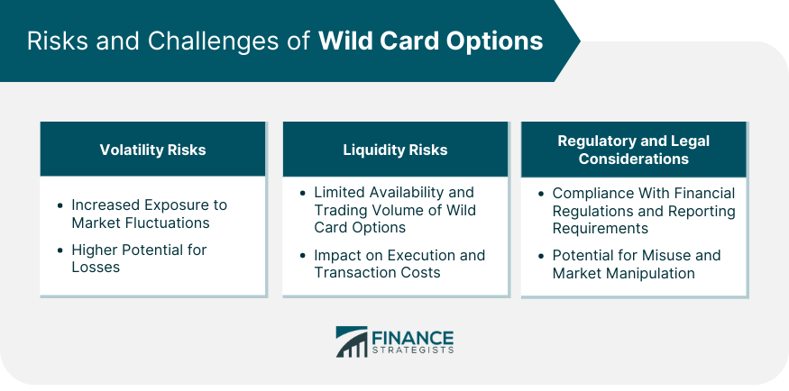

## Table of Contents

## What is a wild card option?

A wild card option is a special kind of choice that you can use in different situations. It's like a card in a game that can be any card you want it to be. In real life, a wild card option might let you pick from different things or change the rules a bit. For example, in a contest, a wild card entry might let someone join even if they didn't meet all the usual rules.

People use wild card options in many places, like in sports, games, and even at work. In sports, a wild card team is one that gets to play in a tournament even if they didn't win their group. At work, a wild card option might let you choose a different project or take a different path in your job. It's a flexible tool that can make things more interesting and fair.

## How does a wild card option work?

A wild card option works by giving you a special choice that you can use in different situations. It's like a card in a game that can be any card you want it to be. In real life, this means you might get to pick from different things or change the rules a bit. For example, in a contest, a wild card entry might let someone join even if they didn't meet all the usual rules. This makes things more exciting and fair because it gives people more chances to participate.

In sports, a wild card team is one that gets to play in a tournament even if they didn't win their group. This is important because it keeps the competition open and gives more teams a chance to win. At work, a wild card option might let you choose a different project or take a different path in your job. This flexibility can help you find new opportunities and make your work more interesting. Overall, a wild card option is a useful tool that can make many situations more fun and fair.

## What are the key features of a wild card option?

A wild card option is special because it can be used in many different ways. It gives you the power to choose from different things or change the rules a bit. For example, in a game, a wild card can be any card you want it to be. This makes the game more fun and exciting because you can use the wild card to help you win.

In real life, a wild card option can be used in sports, contests, and even at work. In sports, a wild card team gets to play in a tournament even if they didn't win their group. This keeps the competition open and gives more teams a chance to win. At work, a wild card option might let you pick a different project or take a new path in your job. This flexibility can help you find new opportunities and make your work more interesting.

## Can you explain the mechanism behind wild card options?

A wild card option works by giving you a special choice that you can use in different situations. It's like a card in a game that can be any card you want it to be. In real life, this means you might get to pick from different things or change the rules a bit. For example, in a contest, a wild card entry might let someone join even if they didn't meet all the usual rules. This makes things more exciting and fair because it gives people more chances to participate.

In sports, a wild card team is one that gets to play in a tournament even if they didn't win their group. This is important because it keeps the competition open and gives more teams a chance to win. At work, a wild card option might let you choose a different project or take a different path in your job. This flexibility can help you find new opportunities and make your work more interesting. Overall, a wild card option is a useful tool that can make many situations more fun and fair.

## What are the benefits of using wild card options?

Using wild card options can make things more exciting and fair. In games, a wild card can be any card you want it to be, which makes the game more fun. You can use it to help you win or to change the way you play. In contests, a wild card entry lets more people join, even if they didn't meet all the usual rules. This gives everyone a better chance to participate and enjoy the competition.

In sports, wild card options keep the competition open. Teams that didn't win their group can still play in the tournament, which gives more teams a chance to win. This makes the sport more interesting for everyone watching. At work, a wild card option can let you choose a different project or take a new path in your job. This flexibility can help you find new opportunities and make your work more interesting. Overall, wild card options are a great way to make many situations more fun and fair.

## What are the risks associated with wild card options?

Using wild card options can sometimes cause problems. One risk is that it might not be fair to everyone. If some people get to use a wild card and others don't, it can make the game or contest seem unfair. This can make people feel upset or angry because they think the rules are not the same for everyone.

Another risk is that wild card options can make things more confusing. When you change the rules or let people choose different paths, it can be hard to keep track of what's happening. This can lead to mistakes or disagreements about who should win or what should happen next. It's important to be clear about how wild card options work so everyone understands and agrees with the rules.

## How do wild card options differ from standard options?

Wild card options are different from standard options because they give you more choices. A standard option is like a regular choice where you pick from a set list of things. For example, in a game, a standard card can only be used as what it says it is. But a wild card option lets you pick from different things or even change the rules a bit. This makes wild card options more flexible and exciting because you can use them in many different ways.

In real life, wild card options can be used in sports, contests, and at work. In sports, a wild card team gets to play in a tournament even if they didn't win their group. This is different from standard options where only the winners move on. At work, a wild card option might let you choose a different project or take a new path in your job, while a standard option would keep you on the same path. Wild card options make things more interesting and fair by giving people more chances to participate and succeed.

## Can you provide examples of wild card options in financial markets?

In financial markets, a wild card option can be seen in the form of a "wild card play" in futures trading. This happens when traders take advantage of the last trading day before the expiration of a futures contract. They might buy or sell a large number of contracts to influence the settlement price. This is different from standard trading where traders follow the usual rules and strategies. The wild card play can be risky but also offers a chance for big gains if done right.

Another example of a wild card option in financial markets is the use of "wild card warrants" in some stock markets. These are special types of warrants that give the holder the right to buy or sell a stock at a certain price, but with more flexibility than standard options. For example, a wild card warrant might let you choose from different stocks or change the expiration date. This makes them more exciting and useful for investors who want to take advantage of market changes in unique ways.

## What strategies can be employed using wild card options?

Using wild card options in games or contests can be a smart move. You can use a wild card to change the rules a bit or pick from different choices. This can help you win or make the game more fun. For example, in a card game, you might use a wild card to complete a set or make a winning move. In a contest, a wild card entry might let you join even if you didn't meet all the usual rules. This gives you a better chance to participate and maybe even win.

In sports, teams can use wild card options to keep the competition open. A wild card team gets to play in a tournament even if they didn't win their group. This strategy can help a team that's been doing well but didn't win their group to still have a chance to win the whole thing. At work, you might use a wild card option to choose a different project or take a new path in your job. This can help you find new opportunities and make your work more interesting. Overall, using wild card options smartly can help you succeed in many different situations.

## How do regulatory bodies view wild card options?

Regulatory bodies often look at wild card options carefully. They want to make sure that using wild card options is fair and doesn't cause problems. In games and contests, they might set rules about how wild card options can be used so everyone has the same chance. They want to stop people from using wild card options in a way that could cheat or hurt others.

In financial markets, regulatory bodies are very strict about wild card options. They watch closely to make sure that wild card plays or wild card warrants are used in a way that is safe and fair for everyone. They might make rules to limit how wild card options can be used so the market stays stable and people don't lose money because of unfair practices.

## What historical events have significantly impacted the use of wild card options?

Wild card options have been shaped by big events in sports and finance. In sports, the introduction of wild card teams in Major League Baseball in 1994 changed how teams could get into the playoffs. Before, only the winners of each division could play in the playoffs. But with the wild card, teams that didn't win their division but had a good record could still play. This made the competition more exciting and gave more teams a chance to win.

In finance, the stock market crash of 1987 had a big impact on wild card options. After the crash, regulators started to watch wild card plays in futures trading more closely. They made new rules to stop traders from using wild card options in ways that could make the market unstable. These changes made wild card options safer but also more limited in how they could be used.

## What advanced techniques can be used to analyze the effectiveness of wild card options?

To figure out how well wild card options work, you can use a method called data analysis. This means looking at numbers and information from past games, contests, or financial markets where wild card options were used. You can see if teams or players who used wild card options did better than those who didn't. You can also check if wild card options made the game or contest more exciting or fair. By comparing the results with and without wild card options, you can learn a lot about how useful they are.

Another way to study wild card options is through simulations. This is like playing a game or running a contest many times on a computer to see what happens. You can change the rules to include wild card options and see how it affects the outcome. Simulations can show you if wild card options make things more unpredictable or if they help more people win. This can give you a good idea of how wild card options might work in real life.

## References & Further Reading

[1]: Bergstra, J., Bardenet, R., Bengio, Y., & Kégl, B. (2011). ["Algorithms for Hyper-Parameter Optimization."](https://papers.nips.cc/paper/4443-algorithms-for-hyper-parameter-optimization) Advances in Neural Information Processing Systems 24.

[2]: ["Advances in Financial Machine Learning"](https://www.amazon.com/Advances-Financial-Machine-Learning-Marcos/dp/1119482089) by Marcos Lopez de Prado

[3]: ["Evidence-Based Technical Analysis: Applying the Scientific Method and Statistical Inference to Trading Signals"](https://www.amazon.com/Evidence-Based-Technical-Analysis-Scientific-Statistical/dp/0470008741) by David Aronson

[4]: ["Machine Learning for Algorithmic Trading"](https://github.com/stefan-jansen/machine-learning-for-trading) by Stefan Jansen

[5]: ["Quantitative Trading: How to Build Your Own Algorithmic Trading Business"](https://www.amazon.com/Quantitative-Trading-Build-Algorithmic-Business/dp/1119800064) by Ernest P. Chan