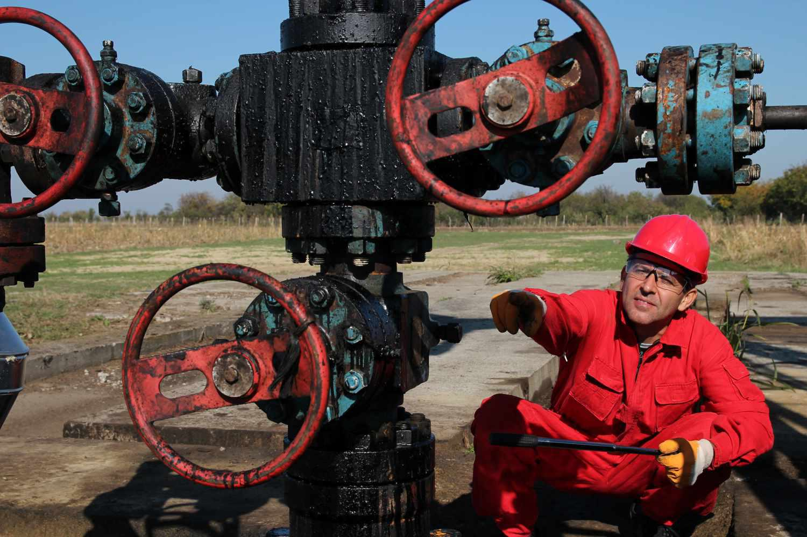

In oil exploration, the incorporation of sophisticated techniques such as wildcat drilling and algorithmic trading has considerably reshaped traditional methodologies. Historically, oil exploration relied heavily on geological surveys and manual trading decisions, limiting both the scope and efficiency of operations. Today, the integration of advanced drilling technologies alongside algorithmic strategies presents new frontiers in exploration and market dynamics.

Wildcat drilling, characterized by its exploration in uncharted territories, represents a significant shift from conventional methods that focused on well-established fields. This high-risk, high-reward strategy allows the discovery of untapped oil reserves, ultimately expanding the global energy landscape. However, the rise of algorithmic trading in the energy markets introduces a layer of precision and rapid decision-making capabilities previously unattainable through human analysis alone.



Algorithmic trading employs computer algorithms to execute trades at speeds and frequencies beyond human capacity. By analyzing real-time data, these systems can predict market trends and respond to fluctuations with increased accuracy, reducing the impact of emotional decision-making in volatile markets. This technological advancement, when applied in conjunction with innovative drilling methods, creates a synergy that aligns exploration activities with financial market strategies.

The interaction between these elements forms the backbone of contemporary oil exploration and trading, driving efficiency and strategic market engagement. As the industry progresses, understanding and leveraging these technologies will be crucial for navigating the challenges and opportunities within the modern energy sector.

## Table of Contents

## Understanding Drilling Techniques in Oil Exploration

Drilling methods serve as the backbone of oil exploration, providing the means to access oil reserves located beneath the Earth’s surface. Among these, rotary drilling stands as a traditional technique. This method employs a rotating drill bit that physically cuts through the earth's layers to reach oil deposits. The process involves a drilling rig that applies downward pressure combined with rotary motion, allowing the bit to penetrate different types of geological formations. The efficiency and reliability of rotary drilling have made it a cornerstone of the oil industry for decades.

Beyond conventional techniques, the introduction of horizontal drilling has marked a significant technological advancement. This method involves initially drilling a vertical well, which gradually changes direction until it becomes horizontal. The primary advantage of horizontal drilling is its ability to reach oil reserves that are spread out laterally and were previously inaccessible with vertical drilling alone. This capability has proven particularly useful in shale formations, where oil deposits can spread horizontally over vast distances.

Another groundbreaking innovation is hydraulic fracturing, commonly known as "fracking." This method involves injecting a pressurized fluid mixture into the rock layers, creating fractures that allow oil and gas to flow more freely into the wellbore. By enhancing the permeability of the rock, hydraulic fracturing facilitates the extraction of oil from tight reservoirs, which were once thought to be uneconomical to exploit. The combination of horizontal drilling with hydraulic fracturing has unlocked substantial new resources, particularly in regions like North America’s shale basins.

These advanced drilling techniques not only improve efficiency but also address environmental concerns associated with oil extraction. For instance, horizontal drilling reduces surface footprint by allowing multiple wells to be drilled from a single location. Furthermore, the accuracy of these techniques in reaching target formations reduces unintended environmental impacts by minimizing the amount of drilling and associated disturbances.

Overall, the evolution of drilling techniques reflects a continual push towards optimizing oil extraction processes while balancing economic and environmental considerations. These innovations have extended the life of mature oil fields and opened up new regions for exploration, underscoring their critical role in the modern energy landscape.

## The Role and Risks of Wildcatting in Oil Exploration

Wildcatting involves exploratory drilling in unproven areas and is characterized by its high-risk, high-reward nature. This practice represents a cornerstone of oil exploration, particularly in the pursuit of new oil reserves, yet it is laden with inherent uncertainties and financial challenges. The process demands significant investment in detailed geological studies to assess the potential of prospective drilling sites. Despite these efforts, the success rates remain unpredictable, often leading to substantial economic risks.

The unpredictable nature of wildcatting arises from the difficulties in accurately determining the presence of oil reserves beneath the earth's surface. Investments into geophysical surveys and drilling operations often require millions of dollars, with no guaranteed return on investment. The [volatility](/wiki/volatility-trading-strategies) of oil prices and market conditions further compounds these financial uncertainties. Despite these challenges, successful wildcatting ventures can result in lucrative oil discoveries that significantly enhance an organization's asset portfolio.

The technology underpinning these geological assessments often includes advanced seismology and computer modeling to simulate subsurface conditions. Nevertheless, even with cutting-edge tools, the probability of hitting a viable oil well remains low. The economic framework for a wildcat operation involves meticulous cost-benefit analysis and risk mitigation strategies to minimize potential losses.

Should a wildcat operation succeed, the economic benefits can be significant. Discovering a substantial oil reserve can transform an unproven area into a productive oil field, leading to potential long-term revenues far exceeding the initial capital outlay. Conversely, failures in wildcatting not only result in the loss of financial resources but can also have broader economic implications, from affecting investor confidence to altering market perceptions.

In conclusion, wildcatting embodies a dual-edged proposition, offering the potential of substantial oil discoveries while carrying significant financial risks. These ventures play a pivotal role in advancing the oil exploration frontier but demand a strategic approach to balance their inherent uncertainties.

## Algo Trading: A Technological Frontier in the Energy Market

Algorithmic trading, often referred to as algo trading, utilizes sophisticated computer algorithms to execute financial transactions with remarkable speed and precision. In the energy sector, this technological advancement serves as a critical tool for optimizing trading strategies by analyzing extensive datasets to forecast market trends. The primary advantage of algo trading in this context is its ability to process and interpret complex data faster than human traders, thereby enabling prompt decision-making and improved market responsiveness.

At its core, algo trading leverages mathematical models and statistical analyses to identify patterns and trends in historical and live market data. By executing trades based on predefined criteria or conditions, these algorithms minimize human intervention, thereby reducing the influence of emotions such as fear and greed, which can often cloud judgment during periods of high market volatility.

To illustrate, consider a simplified example of a moving average crossover strategy, often used in [algorithmic trading](/wiki/algorithmic-trading). A trader might use the following Python code to implement a basic version of this strategy:

```python
import pandas as pd

# Load historical market data
data = pd.read_csv('market_data.csv')

# Calculate short-term and long-term moving averages
data['Short_MA'] = data['Close'].rolling(window=20).mean()
data['Long_MA'] = data['Close'].rolling(window=50).mean()

# Generate trading signals
data['Signal'] = 0
data['Signal'][20:] = np.where(data['Short_MA'][20:] > data['Long_MA'][20:], 1, -1)

# Execute trades based on signals
data['Position'] = data['Signal'].shift()

# Print the first few rows of the resulting data
print(data.head())
```

This code calculates short-term and long-term moving averages and generates trading signals based on their crossover. Such algorithms can be extended and refined with additional metrics and conditions to tailor strategies to specific market environments.

In volatile energy markets, where prices can be influenced by a myriad of factors ranging from geopolitical events to natural disasters, the objectivity and efficiency provided by algo trading become indispensable. The ability to rapidly interpret and respond to fluctuations in supply and demand or unexpected geopolitical developments provides traders with a distinct advantage.

Moreover, algo trading platforms frequently employ [machine learning](/wiki/machine-learning) techniques to continuously adapt to changing market conditions. By training models on vast quantities of historical data, these systems can enhance their predictive accuracy over time, further optimizing trading outcomes.

In summary, algorithmic trading represents a significant technological frontier in the energy market, ensuring that trading operations are not only fast and precise but also objective and adaptable to market dynamics. This makes it a crucial component of modern trading strategies, particularly in sectors characterized by high volatility and complex market structures.

## Synergizing Drilling Techniques with Algo Trading in Oil Exploration

Integrating drilling data with algorithmic models has become a pivotal advancement in modern oil exploration. This process involves utilizing data collected from drilling operations to create dynamic models that inform algorithmic trading strategies. These models are designed to improve decision-making processes by providing insights that align exploration activities with market operations, thus optimizing the overall strategic approach to oil exploration.

Drilling operations generate a vast amount of data, including geological, geophysical, and engineering information. This data is invaluable for creating predictive models that anticipate market trends and inform trading decisions. By processing this data through algorithms, companies can develop more accurate and timely insights into market conditions, leading to informed investment decisions and efficient resource allocation.

Algorithmic trading reduces the influence of human emotion, promoting objectivity and allowing for rapid, data-driven decisions. This is particularly beneficial in the volatile energy markets where quick responses to market changes are essential. Algorithms can be coded in languages such as Python to analyze data streams, identify patterns, and execute trades based on pre-defined criteria.

For instance, Python code can be used to develop a simple algorithmic trading model:

```python
import numpy as np

# Sample drilling data (e.g., production rates, geological features)
drilling_data = np.array([100, 150, 200, 250, 300])

# Define a basic algorithmic strategy
def algo_trading_strategy(data):
    # Simple moving average
    moving_average = np.mean(data)
    # Decision: Buy if current value is above moving average
    if data[-1] > moving_average:
        return "Buy"
    else:
        return "Sell"

# Use the strategy with drilling data
trade_decision = algo_trading_strategy(drilling_data)
print("Trade Decision:", trade_decision)
```

This synergy not only enhances decision-making but also reduces operational costs and mitigates risks associated with exploratory drilling. By aligning exploration data with market activities, companies can optimize their strategies, ultimately maximizing exploration success. Additionally, the integration of drilling techniques with algorithmic trading contributes to more sustainable practices, as operations are better aligned with market demands, reducing unnecessary drilling activities and associated environmental impacts.

The fusion of drilling data with algorithmic trading models represents a significant technological advancement within the energy sector. It underscores the necessity for oil exploration companies to adopt innovative technologies to remain competitive and ensure economic and environmental sustainability.

## Challenges and Future Directions in Oil Exploration

The oil industry operates at the intersection of energy production and environmental stewardship, with significant challenges and evolving future directions. A primary concern is the environmental impact associated with traditional oil extraction and consumption. Greenhouse gas emissions, habitat destruction, and oil spills are critical issues prompting increased regulatory scrutiny and public demand for sustainable practices. Regulatory bodies worldwide are imposing stricter environmental standards and promoting cleaner technologies to mitigate these impacts. Companies are required to comply with regulations such as carbon emissions caps and environmental protection mandates, necessitating investments in cleaner technologies and more sustainable operations.

Market volatility poses additional challenges for the oil industry, often driven by geopolitical factors such as regional conflicts, trade policies, and shifting alliances. For example, disruptions in oil supply chains or changes in production quotas by major oil-producing nations can significantly impact global oil prices. This volatility complicates the planning and operational strategies of oil companies, which must navigate rapidly changing economic and political landscapes.

In response to these challenges, the future of oil exploration is likely to emphasize sustainability, diversification, and integration of renewable energy sources. Technological innovation will play a pivotal role in achieving more sustainable exploration and production practices. Techniques such as enhanced oil recovery (EOR) and carbon capture and storage (CCS) are increasingly being developed to minimize environmental impact and improve efficiency.

Moreover, diversification into renewable energy sources is becoming a strategic priority for many oil companies. Investments in wind, solar, and biofuels provide alternative revenue streams and help companies transition toward a more sustainable energy portfolio. This shift aligns with global efforts to reduce reliance on fossil fuels and move toward a low-carbon energy future.

In parallel, integrating renewable energy into existing oil infrastructures can enhance energy efficiency and reduce carbon footprints. For instance, deploying solar panels at oil fields to power operations or using wind energy to support offshore drilling platforms exemplifies this approach.

Overall, the oil industry's future will likely involve a balanced approach that integrates environmental responsibility with technological innovation and market adaptability. As companies address these challenges, they will contribute to a more sustainable and resilient energy sector.

## Conclusion

The integration of innovative drilling techniques and algorithmic trading is significantly reshaping the landscape of oil exploration. These advancements are pivotal in enhancing operational efficiency and refining strategic market navigation within the energy sector. Modern drilling methods, such as horizontal drilling and hydraulic fracturing, have unlocked access to oil reserves that were once deemed unreachable. By optimizing resource extraction and reducing environmental impact, these techniques have improved the industry's overall operational efficiency. 

Simultaneously, the adoption of algorithmic trading has enabled the energy market to operate with greater precision and speed. By leveraging extensive data analysis, algorithms predict market trends with higher accuracy, minimizing human error and emotional bias. This objective approach to trading is essential in managing the inherent volatility of energy markets. When drilling data is integrated with algorithmic models, it not only enhances decision-making capabilities but also synchronizes exploration activities with market strategies. This fusion can lead to reduced operational costs, mitigated risks, and maximized success rates in exploration endeavors.

As the industry continues to evolve, embracing these innovative methodologies is crucial for driving economic growth. Additionally, ongoing progress in these areas supports the development of sustainable energy solutions, addressing both environmental considerations and the demand for energy diversification. Therefore, the continuous evolution and adoption of advanced drilling technologies and algorithmic trading stand as fundamental components in the quest for a balanced, economically viable, and sustainable energy future.

## References & Further Reading

- Yergin, D. "The Prize: The Epic Quest for Oil, Money, and Power." This book provides an extensive historical account of the global oil industry and its significant impact on the world economy. It is essential for understanding the strategic importance and historical context of oil exploration and market dynamics.

- Lopez de Prado, M. "Advances in Financial Machine Learning." This work explores the application of machine learning techniques to financial markets, offering insights into how algorithmic models can be used to predict market trends. It is highly relevant for understanding the integration of algo trading in the energy sector.

- Tainter, J. A. "The Collapse of Complex Societies." Although not directly related to oil exploration, this book's analysis of societal collapse provides a broader context for considering the sustainability and environmental challenges facing the oil industry. The content underscores the importance of adapting to regulatory pressures and environmental concerns in modern energy exploration.

These references offer foundational knowledge and advanced perspectives critical to understanding the intersection of oil exploration techniques and technological advancements in market operations.

