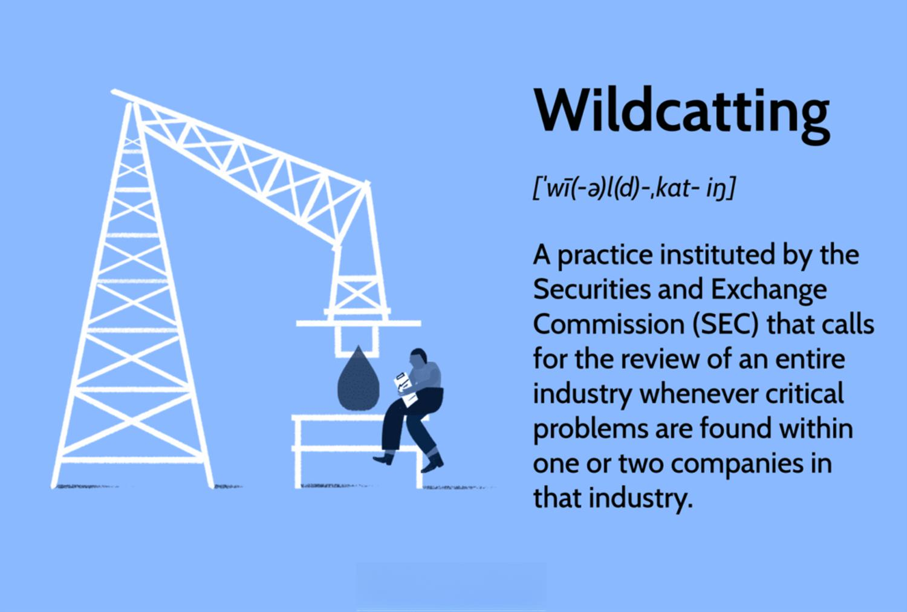

## Table of Contents

## What is wildcatting in the context of oil and gas exploration?

Wildcatting is a term used in the oil and gas industry to describe the process of drilling exploratory wells in areas where no oil or gas has been found before. It's like a gamble because the people doing it, called wildcatters, don't know for sure if they will find oil or gas. They use their knowledge and sometimes new technology to guess where these resources might be hidden underground.

This kind of exploration can be very risky because it costs a lot of money to drill a well, and there's a big chance that they won't find anything. But if they do find oil or gas, it can be very rewarding. Wildcatting has led to the discovery of many important oil fields around the world, which has helped meet the world's energy needs.

## How does wildcatting differ from traditional oil and gas exploration methods?

Wildcatting is different from traditional oil and gas exploration because it involves drilling in places where no one has found oil or gas before. Traditional exploration usually happens in areas where oil or gas has already been discovered. This means that with traditional methods, companies have a better idea of where to drill because they can use information from previous finds to guide them.

In wildcatting, explorers take bigger risks because they are guessing where oil or gas might be. They often use new technology and their own knowledge to make these guesses. If they find oil or gas, it can be a big reward, but if they don't, they lose a lot of money. Traditional exploration is less risky because it's based on known data, but it might not lead to finding new, big oil fields like wildcatting can.

## What are the historical origins of wildcatting?

Wildcatting started in the United States during the late 19th and early 20th centuries. At that time, people were looking for new ways to find oil because the demand for it was growing. They called it "wildcatting" because it was like chasing a wildcat - you never knew where you would find one. People who did this were called wildcatters. They would drill in places where no one had drilled before, hoping to strike it rich.

One famous example of wildcatting was the discovery of oil in Spindletop, Texas, in 1901. A wildcatter named Patillo Higgins believed there was oil under a salt dome, even though many people thought he was crazy. He was right, and the oil that came out of Spindletop changed the oil industry forever. It showed that wildcatting could lead to big discoveries and encouraged more people to try it.

## What are the key risks associated with wildcatting?

Wildcatting is risky because it's like guessing where to find oil or gas. When wildcatters drill in new places, they don't know for sure if they will find anything. This means they could spend a lot of money on drilling and end up with nothing. It's a big gamble, and if they don't find oil or gas, they lose all the money they spent.

Another risk is that wildcatting can be dangerous. Drilling in new areas can lead to accidents because the ground might not be stable or the equipment might fail. These accidents can hurt people and damage the environment. Wildcatters have to be very careful and use the best technology they can to try to avoid these problems, but the risks are always there.

## What types of geological data are used in wildcatting?

In wildcatting, people use different kinds of geological data to guess where oil or gas might be. They look at the rocks and the layers of the earth to see if there are signs that oil or gas could be there. They use things like seismic data, which is like taking a picture of the underground with sound waves. This helps them see the shapes and layers of the rocks. They also look at gravity and magnetic data to understand more about what's under the ground.

Another type of data they use is from old wells that were drilled nearby. Even if those wells didn't find oil or gas, they can give clues about what the rocks are like in the area. Wildcatters also study the history of the earth in that place, like how the land moved and changed over time. All this information helps them make a better guess about where to drill, but it's still a big risk because they're trying to find something new.

## How do wildcatters identify potential drilling sites?

Wildcatters use a lot of different information to find places where they might want to drill for oil or gas. They look at the earth's rocks and layers to see if there are signs that oil or gas could be there. They use seismic data, which is like taking a picture of the underground with sound waves. This helps them see the shapes and layers of the rocks. They also look at gravity and magnetic data to understand more about what's under the ground. By studying all this information, wildcatters can make a better guess about where to drill.

They also look at data from old wells that were drilled nearby. Even if those wells didn't find oil or gas, they can give clues about what the rocks are like in the area. Wildcatters study the history of the earth in that place, like how the land moved and changed over time. All this information helps them make a better guess about where to drill, but it's still a big risk because they're trying to find something new.

## What technologies are commonly used in wildcatting operations?

In wildcatting, people use special tools and technology to find oil or gas in new places. One important technology is seismic surveying. This is like taking a picture of the underground with sound waves. They send sound waves into the ground and listen to the echoes to see the shapes and layers of the rocks. This helps them guess where oil or gas might be hiding. They also use gravity and magnetic surveys to learn more about what's under the ground. These surveys help them understand the earth's structure better.

Another technology they use is called drilling rigs. These are big machines that drill deep into the earth to reach the oil or gas. Wildcatters use advanced drilling techniques to make sure they drill in the right place. They also use tools like mud logging, which helps them see what kinds of rocks they are drilling through. This information can tell them if they are getting closer to oil or gas. All these technologies help wildcatters make better guesses about where to drill, but it's still a big risk because they are trying to find something new.

## What are the financial implications of a successful wildcat well?

When a wildcat well is successful, it can bring a lot of money to the people who drilled it. They find oil or gas in a place where no one thought it was there before. This can make the value of the land go up a lot. The company that owns the well can sell the oil or gas they find, and this can make them a lot of money. It can also make the company more valuable because people see that they are good at finding new oil and gas.

But it's not just the company that makes money. The success of a wildcat well can help the whole area where it's found. It can create new jobs for people to work at the well and in businesses that support it. The money from the oil or gas can also help the local government pay for things like schools and roads. So, a successful wildcat well can be good for everyone in the area, not just the company that drilled it.

## How does wildcatting impact local economies and environments?

When wildcatters find oil or gas in a new place, it can help the local economy a lot. The discovery can create new jobs for people to work at the well and in businesses that support it. This means more people in the area can find work and earn money. The money from selling the oil or gas can also help the local government pay for things like schools, roads, and other services. So, a successful wildcat well can make the whole area richer and better off.

But wildcatting can also hurt the environment. Drilling for oil or gas can cause pollution. If there's an accident, oil or chemicals can spill and harm the land, water, and animals. Even if there's no accident, the drilling can still change the land and make it hard for plants and animals to live there. So, while wildcatting can bring money to an area, it can also cause problems for the environment that people need to be careful about.

## What are the legal and regulatory considerations for wildcatting?

Wildcatting has to follow a lot of rules and laws. Before wildcatters can start drilling, they need to get permission from the government. They have to show that they know what they're doing and that they will be safe. They also need to make sure they have the rights to drill on the land they want to use. This can be complicated because the land might belong to different people or the government. Wildcatters have to follow rules about how they drill, too, to make sure they don't hurt the environment or people nearby.

There are also rules about what wildcatters do with the oil or gas they find. They have to pay taxes on it and follow laws about how they sell it. If they don't follow these rules, they can get in big trouble. Governments make these rules to protect the environment, make sure people are safe, and to get money from the oil and gas. So, wildcatting is not just about finding oil or gas; it's also about following a lot of laws and regulations to do it the right way.

## How has the success rate of wildcatting changed over time?

The success rate of wildcatting has changed a lot over time. In the early days, wildcatting was very risky because people didn't have much information about where to find oil or gas. They used simple tools and guessed a lot. So, the success rate was low. Many wildcatters drilled wells and found nothing, which meant they lost a lot of money. But when they did find oil or gas, it was a big deal because it was so hard to do.

Over time, the success rate of wildcatting has gotten better. This is because people now use better technology and have more information about the earth. They use things like seismic surveys to see what's under the ground before they drill. This helps them make better guesses about where to find oil or gas. Even though wildcatting is still risky, the chances of finding something are higher now than they were in the past.

## What are the future prospects and innovations in wildcatting?

The future of wildcatting looks promising because of new technology and ways of finding oil and gas. Scientists are working on better tools to see what's under the ground before drilling. They use things like 3D and 4D seismic imaging, which give a clearer picture of where oil or gas might be. They also use computers to look at a lot of data and find patterns that can help them guess where to drill. These new tools and ways of thinking can make wildcatting less risky and more successful.

Another big change is that people are looking for oil and gas in places they didn't before, like deep under the ocean or in very hard-to-reach places on land. This is called frontier exploration. It's even riskier than regular wildcatting, but if they find oil or gas, it can be a big reward. There are also new ways to drill, like horizontal drilling and hydraulic fracturing, which can help get more oil and gas out of the ground. All these new ideas and technologies are making wildcatting more exciting and could lead to finding more oil and gas in the future.

## References & Further Reading

[1]: Yergin, D. (1991). ["The Prize: The Epic Quest for Oil, Money, and Power"](https://www.amazon.com/Prize-Epic-Quest-Money-Power/dp/1439110123). Simon & Schuster.

[2]: Lopez de Prado, M. (2018). ["Advances in Financial Machine Learning"](https://books.google.com/books/about/Advances_in_Financial_Machine_Learning.html?id=oU9KDwAAQBAJ). Wiley.

[3]: Aronson, D. (2006). ["Evidence-Based Technical Analysis: Applying the Scientific Method and Statistical Inference to Trading Signals"](https://www.amazon.com/Evidence-Based-Technical-Analysis-Scientific-Statistical/dp/0470008741). Wiley.

[4]: Jansen, S. (2020). ["Machine Learning for Algorithmic Trading"](https://github.com/stefan-jansen/machine-learning-for-trading). Packt Publishing.

[5]: Tainter, J. A. (1988). ["The Collapse of Complex Societies"](https://www.jstor.org/stable/24543829). Cambridge University Press.

[6]: Chan, E. P. (2008). ["Quantitative Trading: How to Build Your Own Algorithmic Trading Business"](https://github.com/ftvision/quant_trading_echan_book). Wiley.

[7]: BP. (2020). ["Statistical Review of World Energy."](https://www.bp.com/content/dam/bp/business-sites/en/global/corporate/pdfs/energy-economics/statistical-review/bp-stats-review-2020-full-report.pdf). BP Global.