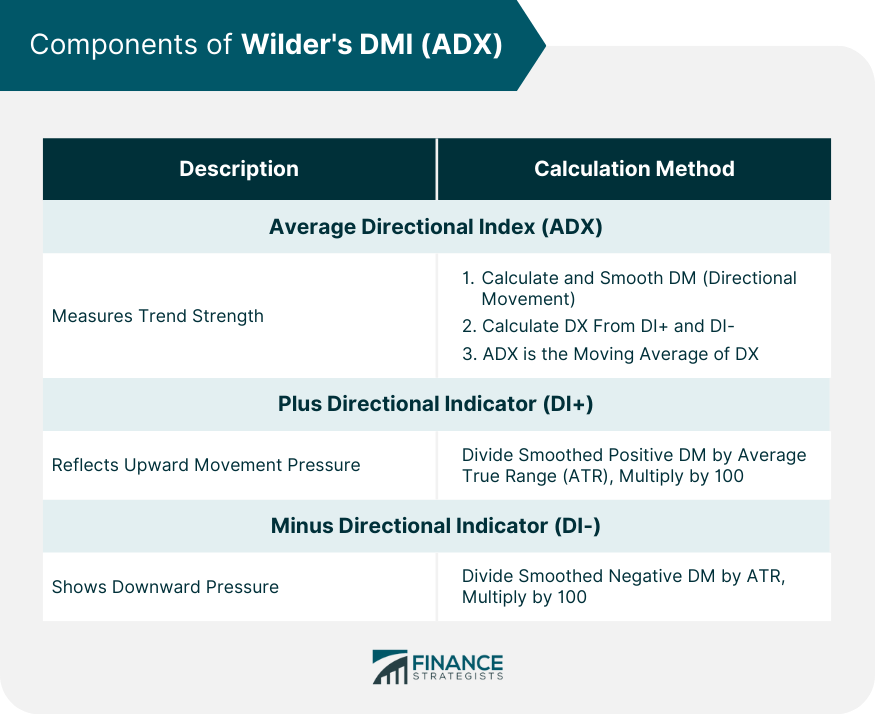

## Table of Contents

## What is the Wilder's ADX and DMI Indicator?

The Wilder's ADX and DMI Indicator is a technical analysis tool used by traders to understand the strength of a trend and the direction of price movements in the market. Developed by J. Welles Wilder, the Average Directional Index (ADX) measures the strength of a trend, regardless of whether it's an uptrend or downtrend. The ADX is part of a broader system that also includes the Directional Movement Index (DMI), which consists of two lines: the Positive Directional Indicator (+DI) and the Negative Directional Indicator (-DI). These lines help traders determine the direction of the trend.

The ADX line itself ranges from 0 to 100, with readings above 25 generally indicating a strong trend, and readings below 20 suggesting a weak trend or a non-trending market. When the ADX is rising, it suggests that the strength of the trend is increasing, which could be useful for traders looking to ride a trend. The +DI and -DI lines help traders see which direction the market is moving. If the +DI is above the -DI, it suggests an uptrend, and if the -DI is above the +DI, it indicates a downtrend. Traders often use crossovers of these lines as signals to buy or sell. By combining the ADX with the DMI, traders can get a clearer picture of both the strength and direction of market trends.

## Who developed the Wilder's ADX and DMI Indicator?

J. Welles Wilder developed the Wilder's ADX and DMI Indicator. He was a mechanical engineer and a successful trader who wanted to create tools that could help people make better decisions in the market. Wilder introduced this indicator in his 1978 book called "New Concepts in Technical Trading Systems." The book became very popular among traders and investors.

The ADX and DMI Indicator is made up of three lines: the ADX line, the Positive Directional Indicator (+DI), and the Negative Directional Indicator (-DI). The ADX line tells you how strong a trend is, no matter if it's going up or down. The +DI and -DI lines help you see which way the market is moving. If the +DI is higher than the -DI, it means the market is going up. If the -DI is higher, it means the market is going down. Traders use these lines to decide when to buy or sell.

## What is the purpose of using the ADX and DMI Indicator in trading?

The main purpose of using the ADX and DMI Indicator in trading is to help traders figure out how strong a trend is and which way the market is moving. The ADX line shows the strength of the trend. If the ADX is above 25, it means the trend is strong. If it's below 20, the trend is weak or there might not be a trend at all. This helps traders decide if it's a good time to follow a trend or if they should look for other trading opportunities.

The DMI part of the indicator has two lines, the +DI and the -DI. These lines help traders see if the market is going up or down. If the +DI line is higher than the -DI line, it means the market is going up, and if the -DI line is higher, it means the market is going down. Traders often use the crossing of these lines as signals to buy or sell. By using both the ADX and DMI together, traders can get a better idea of both the strength and direction of the market, which can help them make smarter trading decisions.

## How is the Directional Movement (DM) calculated?

The Directional Movement (DM) is calculated by looking at the difference between the high and low prices of a trading period. To find the Positive Directional Movement (+DM), you compare today's high with yesterday's high. If today's high is higher than yesterday's high, and it's also higher than the difference between today's low and yesterday's low, then the +DM is the difference between today's high and yesterday's high. If it's not higher, then the +DM is zero. For the Negative Directional Movement (-DM), you compare today's low with yesterday's low. If today's low is lower than yesterday's low, and it's also lower than the difference between today's high and yesterday's high, then the -DM is the difference between yesterday's low and today's low. If it's not lower, then the -DM is zero.

Once you have the +DM and -DM values for each period, you can use them to calculate the Directional Movement Index (DMI). The DMI helps traders see which way the market is moving. If the +DM is bigger than the -DM, it means the market might be going up. If the -DM is bigger, it means the market might be going down. Traders use these values to make decisions about buying or selling. By looking at the +DM and -DM over time, traders can see trends and patterns that help them trade better.

## What is the formula for calculating the +DI and -DI?

To calculate the +DI and -DI, you first need to find the True Range (TR) for each period. The True Range is the biggest of three values: the difference between today's high and low, the difference between today's high and yesterday's close, or the difference between yesterday's close and today's low. Once you have the True Range, you can calculate the +DI and -DI.

For the +DI, you take the +DM (which is the difference between today's high and yesterday's high if it's bigger than the difference between today's low and yesterday's low) and divide it by the True Range. Then, you multiply the result by 100 to get a percentage. For the -DI, you take the -DM (which is the difference between yesterday's low and today's low if it's bigger than the difference between today's high and yesterday's high) and divide it by the True Range. Then, you multiply the result by 100 to get a percentage. These percentages are the +DI and -DI values that traders use to see which way the market is moving.

## How is the Average Directional Index (ADX) calculated?

The Average Directional Index (ADX) is calculated using the +DI and -DI values that we talked about before. First, you find the difference between the +DI and -DI, and then you take the absolute value of that difference. Next, you add the +DI and -DI together. You then divide the absolute difference by the sum of the +DI and -DI, and multiply the result by 100. This gives you the Directional Movement Index (DX) for one period.

To get the ADX, you need to smooth out the DX values over time. You start by calculating a 14-period moving average of the DX values. This is done by adding up the first 14 DX values and dividing by 14. After that, to keep the ADX updated, you use a formula that takes the previous ADX value and adds a small part of the difference between the current DX and the previous ADX. This smoothing helps traders see the trend strength more clearly over time.

## What is the significance of the 14-day period in the ADX and DMI calculations?

The 14-day period used in the ADX and DMI calculations is important because it helps smooth out the data over time. When you calculate the ADX and DMI, you look at the price movements over the last 14 days. This period helps traders see the bigger picture of the market's trend strength and direction, rather than just focusing on short-term changes. By using a 14-day period, the indicator can give a clearer signal about whether a trend is strong or weak, which helps traders make better decisions.

The choice of 14 days is not set in stone, but it's a common choice because it balances between being responsive to changes in the market and providing a smooth, reliable trend indicator. Some traders might use different periods, like 7 days or 21 days, depending on their trading style and the timeframe they are looking at. However, 14 days is a popular choice because it was originally suggested by J. Welles Wilder when he developed the ADX and DMI, and many traders have found it to be effective in their trading strategies.

## How do traders interpret the values of ADX, +DI, and -DI?

Traders use the ADX to understand how strong a trend is. If the ADX is above 25, it means the trend is strong. This could be a good time for traders to follow the trend because it's likely to keep going. If the ADX is below 20, the trend is weak or there might not be a trend at all. In this case, traders might look for other trading opportunities instead of trying to follow a trend that isn't clear.

The +DI and -DI lines help traders see which way the market is moving. If the +DI line is higher than the -DI line, it means the market is going up. This can be a signal for traders to buy. If the -DI line is higher than the +DI line, it means the market is going down. This can be a signal for traders to sell. By looking at both the ADX and the +DI and -DI lines, traders can get a good idea of both the strength and direction of the market, which helps them make better trading choices.

## What are the common threshold levels for ADX and how are they used?

Traders use common threshold levels for the ADX to understand how strong a trend is. If the ADX is above 25, it means the trend is strong. This tells traders that it might be a good time to follow the trend because it's likely to keep going. If the ADX is below 20, the trend is weak or there might not be a trend at all. In this case, traders might look for other trading opportunities instead of trying to follow a trend that isn't clear.

When the ADX is between 20 and 25, it's in a middle ground where the trend might be starting to get stronger or weaker. Traders use this range to watch for signs that the market might be changing. By paying attention to these threshold levels, traders can make better decisions about when to buy or sell, depending on how strong the trend is.

## How can the ADX and DMI be used to identify trend strength and direction?

The ADX and DMI help traders figure out how strong a trend is and which way the market is moving. The ADX line shows the strength of the trend. If the ADX is above 25, it means the trend is strong, and traders might want to follow it because it's likely to keep going. If the ADX is below 20, the trend is weak or there might not be a trend at all. In this case, traders might look for other trading opportunities instead of trying to follow a trend that isn't clear. When the ADX is between 20 and 25, it's in a middle ground where the trend might be starting to get stronger or weaker, and traders use this range to watch for signs that the market might be changing.

The DMI part of the indicator has two lines, the +DI and the -DI, which help traders see if the market is going up or down. If the +DI line is higher than the -DI line, it means the market is going up, and this can be a signal for traders to buy. If the -DI line is higher than the +DI line, it means the market is going down, and this can be a signal for traders to sell. By looking at both the ADX and the +DI and -DI lines, traders can get a good idea of both the strength and direction of the market. This helps them make better trading choices based on clear signals from the market.

## What are some strategies for trading using the ADX and DMI?

One strategy for trading using the ADX and DMI is to look for strong trends and trade in the direction of those trends. When the ADX is above 25, it shows that the trend is strong. If the +DI line is above the -DI line, it means the market is going up, so traders might want to buy. If the -DI line is above the +DI line, it means the market is going down, so traders might want to sell. By following the trend when the ADX is high, traders can try to make money as the market keeps moving in one direction.

Another strategy is to use the ADX and DMI to find when a trend might be starting or ending. When the ADX is between 20 and 25, it's a good time to watch the market closely. If the ADX starts to go above 25 and the +DI line crosses above the -DI line, it could be a sign that an uptrend is starting, and traders might want to buy. If the ADX starts to go above 25 and the -DI line crosses above the +DI line, it could be a sign that a downtrend is starting, and traders might want to sell. By paying attention to these signals, traders can try to get in on a trend early or get out before it ends.

## How can the ADX and DMI be combined with other technical indicators for enhanced analysis?

Traders often combine the ADX and DMI with other technical indicators to get a better understanding of the market. One common way to do this is by using moving averages. A moving average can help traders see the overall direction of the market. If the ADX shows a strong trend and the price is above a moving average, it might be a good time to buy. If the price is below the moving average, it might be a good time to sell. By looking at both the ADX and a moving average, traders can make more informed decisions about when to enter or [exit](/wiki/exit-strategy) trades.

Another useful indicator to use with the ADX and DMI is the Relative Strength Index (RSI). The RSI helps traders see if a market is overbought or oversold. If the ADX shows a strong trend and the RSI is below 30, it might mean the market is oversold and could be a good time to buy. If the RSI is above 70, it might mean the market is overbought and could be a good time to sell. By combining the ADX, DMI, and RSI, traders can get a clearer picture of both the trend's strength and the market's current condition, which can help them make better trading choices.

## What is the Calculation and Formula of ADX?

The calculation of the Average Directional Index (ADX) is a multi-step process that begins with determining the True Range (TR), proceeds through calculating different directional movements (+DM and -DM), and concludes with computing the Directional Index (DX) and smoothing it to derive the ADX. Each component is crucial for assessing trend strength and direction.

### Step 1: True Range (TR)

The True Range is the greatest of the following:
1. The current high minus the current low
2. The absolute value of the current high minus the previous close
3. The absolute value of the current low minus the previous close

Given the values $\text{high}_t$, $\text{low}_t$, and $\text{close}_{t-1}$ for time period $t$:

$$
\text{TR}_t = \max(\text{high}_t - \text{low}_t, |\text{high}_t - \text{close}_{t-1}|, |\text{low}_t - \text{close}_{t-1}|)
$$

### Step 2: Directional Movement (+DM and -DM)

Directional Movement is calculated to assess the changes between the current and previous high/low prices:
- **Positive Directional Movement (+DM):** If $(\text{high}_t - \text{high}_{t-1}) > (\text{low}_{t-1} - \text{low}_t)$, then $(\text{high}_t - \text{high}_{t-1})$ is considered.
- **Negative Directional Movement (-DM):** If $(\text{low}_{t-1} - \text{low}_t) > (\text{high}_t - \text{high}_{t-1})$, then $(\text{low}_{t-1} - \text{low}_t)$ is considered.

If neither condition is met, the directional movements are set to zero for that period.

### Step 3: Directional Indicators (+DI and -DI)

Next, the smoothed averages of +DM and -DM are combined with True Range to calculate +DI and -DI:
- Smoothed +DM and -DM over a given period (usually 14 days for daily data) using an exponential smoothing approach.
- Calculate +DI and -DI by dividing the smoothed +DM and -DM by the smoothed True Range, then multiply by 100 to express as a percentage:

$$
\text{+DI} = \frac{\text{Smoothed +DM}}{\text{Smoothed TR}} \times 100
$$

$$
\text{-DI} = \frac{\text{Smoothed -DM}}{\text{Smoothed TR}} \times 100
$$

### Step 4: Directional Index (DX)

Calculate the Directional Index (DX) using the formula:

$$
\text{DX} = \frac{|\text{+DI} - \text{-DI}|}{|\text{+DI} + \text{-DI}|} \times 100
$$

### Step 5: Calculating and Smoothing ADX

Finally, the Average Directional Index (ADX) is obtained by smoothing the DX values. The formula for smoothing is typically:

- The initial ADX for the first period is the average of that period's DX values.
- Subsequent ADX values are smoothed using the formula:

$$
\text{ADX}_t = \left(\frac{(n-1) \times \text{ADX}_{t-1} + \text{DX}_t}{n}\right)
$$

where $n$ is the number of periods (commonly 14).

### Example Python Code for ADX Calculation

Here is a basic example of how one might write a Python function to calculate ADX, assuming access to the necessary time series data for highs, lows, and closes:

```python
import pandas as pd

def calculate_adx(highs, lows, closes, period=14):
    df = pd.DataFrame({'high': highs, 'low': lows, 'close': closes})

    df['tr'] = df.apply(lambda row: max(row['high'] - row['low'], 
                                        abs(row['high'] - row['close'].shift()), 
                                        abs(row['low'] - row['close'].shift())), axis=1)

    df['+dm'] = df['high'].diff().apply(lambda x: x if x > 0 else 0)
    df['-dm'] = df['low'].diff().apply(lambda x: -x if x > 0 else 0)

    df['+di'] = (df['+dm'].rolling(window=period).sum() / df['tr'].rolling(window=period).sum()) * 100
    df['-di'] = (df['-dm'].rolling(window=period).sum() / df['tr'].rolling(window=period).sum()) * 100

    df['dx'] = ((df['+di'] - df['-di']).abs() / (df['+di'] + df['-di']).abs()) * 100
    df['adx'] = df['dx'].rolling(window=period).mean()

    return df['adx']
```

This function will calculate the ADX based on the input series for highs, lows, and closes and the specified averaging period. The computation aligns with the formulas and smoothing processes discussed, providing a tool to assess market trends and directional strength in trading.

## References & Further Reading

[1]: Wilder, J. Welles. ["New Concepts in Technical Trading Systems"](https://www.amazon.com/New-Concepts-Technical-Trading-Systems/dp/0894590278), Trend Research, 1978.

[2]: Lopez de Prado, Marcos. ["Advances in Financial Machine Learning"](https://www.amazon.com/Advances-Financial-Machine-Learning-Marcos/dp/1119482089), Wiley, 2018.

[3]: Aronson, David. ["Evidence-Based Technical Analysis: Applying the Scientific Method and Statistical Inference to Trading Signals"](https://www.amazon.com/Evidence-Based-Technical-Analysis-Scientific-Statistical/dp/0470008741), Wiley, 2006.

[4]: Jansen, Stefan. ["Machine Learning for Algorithmic Trading"](https://github.com/stefan-jansen/machine-learning-for-trading), Packt, 2020.

[5]: Chan, Ernest P. ["Quantitative Trading: How to Build Your Own Algorithmic Trading Business"](https://github.com/ftvision/quant_trading_echan_book), Wiley, 2008.