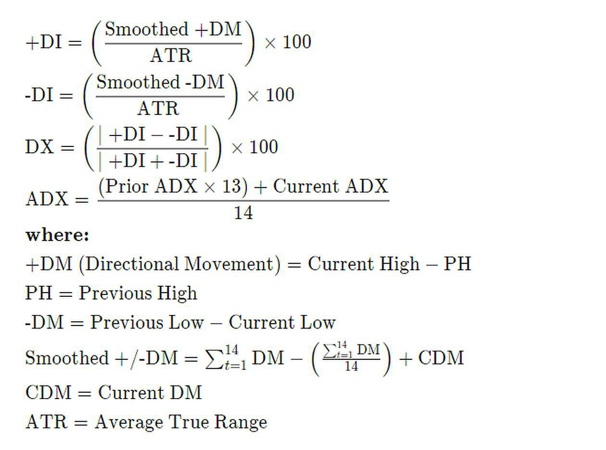

This article explores the fundamentals of Wilder's Average Directional Index (ADX), a pivotal component within the technical analysis domain, particularly within Wilder's Directional Movement Index (DMI) system. Developed by J. Welles Wilder Jr. in the late 1970s, the ADX indicator has become a crucial tool for traders seeking to assess market trends' strength and direction. The DMI system itself comprises three indicators: the ADX, the Positive Directional Indicator (DI+), and the Negative Directional Indicator (DI-). These components work in harmony to provide traders with insights into both trend strength and momentum.

The ADX specifically measures the strength of a price trend without considering its direction. A rising ADX line indicates a strengthening trend, while a falling ADX suggests a weakening trend. Unlike many indicators that focus solely on upward or downward movements, the ADX allows traders to identify strong trends regardless of their direction, making it a versatile tool for various market conditions. The DI+ and DI- components, on the other hand, are primarily employed to ascertain the direction of the trend, with crossovers between the two indicating potential buying or selling signals.



As technology and trading strategies evolve, the integration of ADX into algorithmic trading has garnered significant attention. Algorithmic trading, leveraging predefined criteria and executing trades at high speeds, can efficiently incorporate ADX to make informed trading decisions. By embedding ADX within algorithmic frameworks, traders can automate the recognition of trend strength and direction, allowing for more consistent and objective trading practices. This convergence of technical analysis and automated trading underscores the importance of ADX as a bridge between traditional trading practices and modern technological advancements.

Traders and analysts can harness the power of ADX in various ways, from manual chart analysis to advanced algorithmic strategies, making it an indispensable part of the technical analysis toolkit. With its ability to both quantify trend strength and adapt to algorithmic systems, the ADX remains a relevant and reliable indicator in today's dynamic trading landscape.

## Table of Contents

## Understanding Wilder's DMI (ADX) Indicator

Wilder's Directional Movement Index (DMI) is a widely used technical analysis indicator designed to assess the strength and direction of market trends. Created by J. Welles Wilder Jr., who introduced it in his 1978 book "New Concepts in Technical Trading Systems," the DMI is comprised of three main components: the Average Directional Index (ADX), the Plus Directional Indicator (+DI), and the Minus Directional Indicator (-DI).

The ADX is employed as a gauge for trend strength. Unlike traditional indicators that typically provide information on whether a trend is bullish or bearish, the ADX is non-directional. It quantifies the intensity of the trend, offering values on a scale that ranges from 0 to 100. An ADX value above 25 is often interpreted as a strong trend, whereas a reading below 20 suggests a weak or absent trend. This makes the ADX an essential tool for distinguishing times to employ trend-following strategies versus range-trading strategies.

The +DI and -DI components provide insights into price direction. These indicators calculate the current price movements in relation to previous price movements to determine buying and selling pressure. The crossover of +DI and -DI signals potential buy and sell opportunities. For example, a bullish signal is indicated when +DI crosses above -DI, suggesting upward [momentum](/wiki/momentum). Conversely, a bearish signal occurs when -DI crosses above +DI, indicating downward pressure.

Understanding the significance of different ADX levels enhances traders' ability to interpret market conditions effectively. Values ranging from 0-25 suggest a weak trend presence, values between 25-50 indicate a stronger trend, 50-75 reflect a very strong trend, and 75-100 denote an extremely strong trend. While the ADX itself does not indicate the direction of the trend, combining its information with +DI and -DI provides a comprehensive picture of market behavior.

By analyzing these components in conjunction, traders can gain valuable insight into both the strength and direction of trends, allowing for more informed trading decisions that can enhance profitability and reduce risks.

## Calculation and Formula of ADX

The calculation of the Average Directional Index (ADX) is a multi-step process that begins with determining the True Range (TR), proceeds through calculating different directional movements (+DM and -DM), and concludes with computing the Directional Index (DX) and smoothing it to derive the ADX. Each component is crucial for assessing trend strength and direction.

### Step 1: True Range (TR)

The True Range is the greatest of the following:
1. The current high minus the current low
2. The absolute value of the current high minus the previous close
3. The absolute value of the current low minus the previous close

Given the values $\text{high}_t$, $\text{low}_t$, and $\text{close}_{t-1}$ for time period $t$:

$$
\text{TR}_t = \max(\text{high}_t - \text{low}_t, |\text{high}_t - \text{close}_{t-1}|, |\text{low}_t - \text{close}_{t-1}|)
$$

### Step 2: Directional Movement (+DM and -DM)

Directional Movement is calculated to assess the changes between the current and previous high/low prices:
- **Positive Directional Movement (+DM):** If $(\text{high}_t - \text{high}_{t-1}) > (\text{low}_{t-1} - \text{low}_t)$, then $(\text{high}_t - \text{high}_{t-1})$ is considered.
- **Negative Directional Movement (-DM):** If $(\text{low}_{t-1} - \text{low}_t) > (\text{high}_t - \text{high}_{t-1})$, then $(\text{low}_{t-1} - \text{low}_t)$ is considered.

If neither condition is met, the directional movements are set to zero for that period.

### Step 3: Directional Indicators (+DI and -DI)

Next, the smoothed averages of +DM and -DM are combined with True Range to calculate +DI and -DI:
- Smoothed +DM and -DM over a given period (usually 14 days for daily data) using an exponential smoothing approach.
- Calculate +DI and -DI by dividing the smoothed +DM and -DM by the smoothed True Range, then multiply by 100 to express as a percentage:

$$
\text{+DI} = \frac{\text{Smoothed +DM}}{\text{Smoothed TR}} \times 100
$$

$$
\text{-DI} = \frac{\text{Smoothed -DM}}{\text{Smoothed TR}} \times 100
$$

### Step 4: Directional Index (DX)

Calculate the Directional Index (DX) using the formula:

$$
\text{DX} = \frac{|\text{+DI} - \text{-DI}|}{|\text{+DI} + \text{-DI}|} \times 100
$$

### Step 5: Calculating and Smoothing ADX

Finally, the Average Directional Index (ADX) is obtained by smoothing the DX values. The formula for smoothing is typically:

- The initial ADX for the first period is the average of that period's DX values.
- Subsequent ADX values are smoothed using the formula:

$$
\text{ADX}_t = \left(\frac{(n-1) \times \text{ADX}_{t-1} + \text{DX}_t}{n}\right)
$$

where $n$ is the number of periods (commonly 14).

### Example Python Code for ADX Calculation

Here is a basic example of how one might write a Python function to calculate ADX, assuming access to the necessary time series data for highs, lows, and closes:

```python
import pandas as pd

def calculate_adx(highs, lows, closes, period=14):
    df = pd.DataFrame({'high': highs, 'low': lows, 'close': closes})

    df['tr'] = df.apply(lambda row: max(row['high'] - row['low'], 
                                        abs(row['high'] - row['close'].shift()), 
                                        abs(row['low'] - row['close'].shift())), axis=1)

    df['+dm'] = df['high'].diff().apply(lambda x: x if x > 0 else 0)
    df['-dm'] = df['low'].diff().apply(lambda x: -x if x > 0 else 0)

    df['+di'] = (df['+dm'].rolling(window=period).sum() / df['tr'].rolling(window=period).sum()) * 100
    df['-di'] = (df['-dm'].rolling(window=period).sum() / df['tr'].rolling(window=period).sum()) * 100

    df['dx'] = ((df['+di'] - df['-di']).abs() / (df['+di'] + df['-di']).abs()) * 100
    df['adx'] = df['dx'].rolling(window=period).mean()

    return df['adx']
```

This function will calculate the ADX based on the input series for highs, lows, and closes and the specified averaging period. The computation aligns with the formulas and smoothing processes discussed, providing a tool to assess market trends and directional strength in trading.

## Practical Applications of ADX

Wilder's Average Directional Index (ADX) is a respected tool among traders for its ability to identify the strength of a trend and confirm market momentum. The ADX itself does not indicate the direction of the trend, but it provides insights into whether a trend is gaining or losing steam. When the ADX is rising, it suggests that the trending conditions are strengthening, regardless of whether the trend is bullish or bearish.

Traders often employ ADX for various trading scenarios. For example, an ADX reading above 25 typically signals a strong trend, making it suitable for trend-following strategies. In these cases, traders might look for other indicators to determine the trend direction. Conversely, an ADX below 20 suggests a weak trend or range-bound conditions, which might prompt traders to either avoid the market or employ range-trading strategies.

The momentum confirmation aspect of ADX comes into play with its interaction with the DI+ (Positive Directional Indicator) and DI- (Negative Directional Indicator) components. When DI+ crosses above DI-, it indicates a potential uptrend, and when DI- crosses above DI+, a potential downtrend is suggested. ADX confirming these crossovers by rising strengthens the signal, adding confidence to the trading decision.

Real-world application of ADX can be observed in stock markets, where identifying strong trends is crucial for making informed trading decisions. For instance, consider a stock trading at $50, with the DI+ at 30 and DI- at 20. If the ADX starts rising from 22 and goes above 25, it indicates that the current uptrend is gaining strength. A trader might choose to enter a long position, expecting the upward momentum to continue.

To further illustrate, if an index like the S&P 500 poses rising ADX values during a particular period, it provides traders confidence in the persistent direction of the index movement, supporting strategies such as trend-following or [breakout](/wiki/breakout-trading) trading. On the other hand, if a trader notices a declining ADX coupled with converging DI+ and DI- lines, it might indicate a weakening trend, prompting a reassessment of positions or a move to a sideline strategy.

In sum, the ADX is a versatile component of trend analysis and momentum confirmation strategies across various financial instruments. Its ability to signal the strength of a trend without biases towards direction makes it invaluable, especially when paired with other technical indicators to form robust trading strategies.

## Trading Strategies with DMI (ADX)

Wilder's Average Directional Movement Index (ADX) is widely used by traders for designing robust trading strategies based on trend strength and direction. The DMI system, which includes the ADX, consists of three primary components: ADX, DI+ (Positive Directional Indicator), and DI- (Negative Directional Indicator). These indicators serve as crucial signals for buy and sell decisions in both basic and advanced trading strategies.

### Basic Trading Strategies with DMI (ADX)

The foundational strategy with DMI revolves around the crossover of DI+ and DI-. When DI+ crosses above DI-, it indicates a possible buy signal, suggesting that the market is trending upwards. Conversely, when DI- crosses above DI+, it indicates a sell signal, signaling a potential downward market trend. The ADX value, which measures trend strength, can be used to confirm these signals, with a value above 20 typically indicating a strong trend.

#### Crossover Example

For a more practical approach, consider this Python snippet that detects DI+ and DI- crossovers:

```python
import pandas as pd

# Assume df is a DataFrame containing the calculated DI+ and DI-

df['Buy_Signal'] = (df['DI+'] > df['DI-']) & (df['DI+'].shift(1) <= df['DI-'].shift(1))
df['Sell_Signal'] = (df['DI+'] < df['DI-']) & (df['DI+'].shift(1) >= df['DI-'].shift(1))

# Buy when Buy_Signal is True, Sell when Sell_Signal is True
```

This code identifies potential buy and sell signals based on the crossover condition between DI+ and DI-.

### Advanced Trading Strategies

Advanced strategies often involve combining the ADX indicator with other technical indicators to refine entry and [exit](/wiki/exit-strategy) points. One common technique is integrating moving averages or oscillators like the Relative Strength Index (RSI) with ADX values to filter out false signals.

#### Strategy Combining ADX with Moving Averages

Incorporating moving averages allows traders to identify the context in which the ADX signal occurs. For example, if a short-term moving average is above a long-term moving average, and ADX is rising above a threshold, it strengthens a buy signal generated by DI+ crossing above DI-.

Here is an illustrative code snippet:

```python
# Assume 'close_price' is the closing price series
df['Short_MA'] = df['close_price'].rolling(window=50).mean()
df['Long_MA'] = df['close_price'].rolling(window=200).mean()

df['ADX_Trend_Strength'] = df['ADX'] > 20
df['MA_Trend'] = df['Short_MA'] > df['Long_MA']

# Enhanced buy signal: DI+ crossover with ADX confirmation and MA trend
df['Enhanced_Buy_Signal'] = df['Buy_Signal'] & df['ADX_Trend_Strength'] & df['MA_Trend']
```

### Adaptive Strategies with Dynamic Adjustments

In a shifting market, static thresholds for indicators like ADX might be unsuitable. Thus, an adaptive approach that dynamically adjusts thresholds based on historical [volatility](/wiki/volatility-trading-strategies) or other metrics is beneficial. These strategies can leverage [machine learning](/wiki/machine-learning) algorithms to optimize parameters over time, allowing traders to respond to changing market conditions effectively.

By combining ADX with signals from other technical tools and adjusting strategies in response to market volatility, traders can build comprehensive frameworks to maximize profit opportunities while minimizing false signals. These strategies form the bridge between human intuition and systematic trading, enhancing the robustness of trading decisions.

## Integrating ADX in Algorithmic Trading

Incorporating the Average Directional Index (ADX) into [algorithmic trading](/wiki/algorithmic-trading) involves leveraging its ability to gauge trend strength, providing an edge in automated trading strategies. ADX is not a standalone solution; rather, it enhances strategies by confirming trends and optimizing entries and exits.

### Coding Strategies with ADX

To embed ADX within an algorithmic trading strategy, a trader first needs to code the logic dictating how ADX signals influence trading actions. Typically, this involves programming the conditions under which the ADX value indicates a strong trend (usually above 25 or 30). These conditions then influence the algorithm's buy or sell decisions. Here's a simple Python example using the popular [pandas](https://pandas.pydata.org/) library and [ta](https://github.com/bukosabino/ta) (Technical Analysis library):

```python
import pandas as pd
import ta

# Load data
data = pd.read_csv('market_data.csv')
# Calculate ADX
data['adx'] = ta.trend.adx(data['High'], data['Low'], data['Close'], window=14)

# Define a signal for when to take action
def generate_signal(row):
    if row['adx'] > 30:
        return 'Strong Trend'
    else:
        return 'Weak Trend'

# Apply the signal
data['signal'] = data.apply(generate_signal, axis=1)
```

### Backtesting and Optimization

Before deploying any algorithm, rigorous [backtesting](/wiki/backtesting) is crucial. Backtesting involves simulating the algorithm on historical data to assess its performance. Functions for backtesting can be implemented using various tools like [Backtrader](https://www.[backtrader](/wiki/backtrader).com/), which allows traders to understand how the ADX-based strategy would have performed under past market conditions.

Optimization plays a crucial role in refining parameters such as the ADX threshold levels or the lookback periods, tailoring the strategy for optimal performance. Here's a conceptual snippet illustrating how backtesting can be done with Backtrader:

```python
import backtrader as bt

class ADXStrategy(bt.Strategy):
    params = (('adx_period', 14),)

    def __init__(self):
        self.adx = bt.indicators.AverageDirectionalIndex(self.data, period=self.params.adx_period)

    def next(self):
        if self.adx[0] > 30:
            self.buy()
        elif self.adx[0] < 20:
            self.sell()

# Create a cerebro entity
cerebro = bt.Cerebro()
cerebro.addstrategy(ADXStrategy)
# Load data to cerebro here
cerebro.run()
```

### Enhancing ADX with Machine Learning

Machine learning can further enhance the efficacy of an ADX-based strategy by adapting to dynamic market environments. Machine learning algorithms can optimize parameters in real-time or identify patterns and anomalies that may not be evident through traditional analysis.

For instance, machine learning models such as Random Forests or Neural Networks can be trained to recognize complex patterns by incorporating ADX as one of the input features. This integration helps in crafting more nuanced strategies that account for non-linear market behaviors:

```python
from sklearn.ensemble import RandomForestClassifier
from sklearn.model_selection import train_test_split

# Prepare data
X = data.drop(columns=['signal'])  # Features
y = data['signal']  # Target variable

# Split data into training and testing
X_train, X_test, y_train, y_test = train_test_split(X, y, test_size=0.3, random_state=42)

# Train the model
model = RandomForestClassifier()
model.fit(X_train, y_train)

# Predict
predictions = model.predict(X_test)
```

This combination of ADX and machine learning facilitates the development of strategies that are more robust and capable of adapting to volatile market conditions, thus potentially improving overall trading performance.

## Limitations and Considerations

Wilder's ADX (Average Directional Index) is a significant tool in technical analysis, offering insight into trend strength. However, like any technical indicator, it has its limitations and considerations that traders should be aware of. One of the primary limitations of the ADX is its reliance on historical data, which can make it a lagging indicator. Because it bases its calculations on past price movements, the ADX may provide signals after a trend has already started or reversed, potentially reducing the timely execution of trades. This delay can lead traders to act on information that no longer pertains to the current market context, thus affecting the potential profitability of trades.

Furthermore, the ADX can sometimes produce false signals. This can occur particularly in markets characterized by low volatility or when prices are oscillating within a narrow range, leading the ADX to suggest a trend where there might be none of significant strength. Traders might misinterpret these signals as indications of emerging trends, which can result in unwarranted trades and subsequent losses.

To mitigate risks associated with the ADX, it is advisable to combine it with other technical indicators. For example, using the ADX alongside moving averages can help confirm the direction of the trend. Oscillators like the RSI (Relative Strength Index) or MACD (Moving Average Convergence Divergence) can additionally offer insights into overbought or oversold conditions, adding depth to trend analysis and decision-making processes. 

Additionally, implementing sound risk management practices is crucial. This includes setting appropriate stop-loss orders to cap potential losses and using position sizing strategies that align with one's risk appetite. Advanced traders might also consider algorithmic strategies that integrate ADX signals with other market indicators and use backtesting to refine their approach, ensuring that the system performs well under various market conditions.

Ultimately, while ADX is a valuable component in a trader's toolkit, relying solely on it can lead to inefficiencies. By understanding its limitations and utilizing it alongside complementary tools and approaches, traders can enhance their market analysis and improve their strategic decision-making.

## Conclusion

Wilder's DMI (ADX) serves as a cornerstone in technical analysis, widely utilized for its ability to quantify trend strength in financial markets. Its unique ability to distinguish between trending and non-trending conditions makes it indispensable for traders looking both to capture substantial market movements and to avoid periods of uncertainty. The Average Directional Index (ADX) provides an objective quantification of trend intensity, which aids traders in deciding whether to follow or fade a trend.

One of the hallmarks of ADX's versatility is its adaptability to various trading styles and systems, transcending manual and automated environments. In manual trading, it equips traders with a robust metric to gauge market conditions, allowing them to decide on entering or exiting trades with greater confidence. Automated trading systems integrate ADX into algorithms to enhance their decision-making capability, leveraging its quantifiable signals for backtesting and real-time application. This adaptability is underscored by its integration into algorithmic strategies, providing a foundation for more complex analysis alongside other indicators.

To capitalize on ADX's full potential, traders and quantitative analysts are encouraged to explore tailored adaptations of the indicator to suit their trading goals and risk profiles. By combining ADX with complementary indicators—such as moving averages or oscillators—traders can develop more nuanced strategies that address different market conditions. Continuous research and adaptation are critical, as they allow traders to refine their strategies in line with evolving market dynamics, thus enhancing their decision-making processes.

In conclusion, Wilder's ADX remains a vital tool for analyzing and responding to market trends, offering valuable insights that are vital to both manual and automated trading frameworks. Its reliability and adaptability make it a fundamental component in the toolkit of any trader dedicated to making informed and strategic decisions in the financial markets.

## References & Further Reading

[1]: Wilder, J. Welles. ["New Concepts in Technical Trading Systems"](https://www.amazon.com/New-Concepts-Technical-Trading-Systems/dp/0894590278), Trend Research, 1978.

[2]: Lopez de Prado, Marcos. ["Advances in Financial Machine Learning"](https://www.amazon.com/Advances-Financial-Machine-Learning-Marcos/dp/1119482089), Wiley, 2018.

[3]: Aronson, David. ["Evidence-Based Technical Analysis: Applying the Scientific Method and Statistical Inference to Trading Signals"](https://www.amazon.com/Evidence-Based-Technical-Analysis-Scientific-Statistical/dp/0470008741), Wiley, 2006.

[4]: Jansen, Stefan. ["Machine Learning for Algorithmic Trading"](https://github.com/stefan-jansen/machine-learning-for-trading), Packt, 2020.

[5]: Chan, Ernest P. ["Quantitative Trading: How to Build Your Own Algorithmic Trading Business"](https://github.com/ftvision/quant_trading_echan_book), Wiley, 2008.