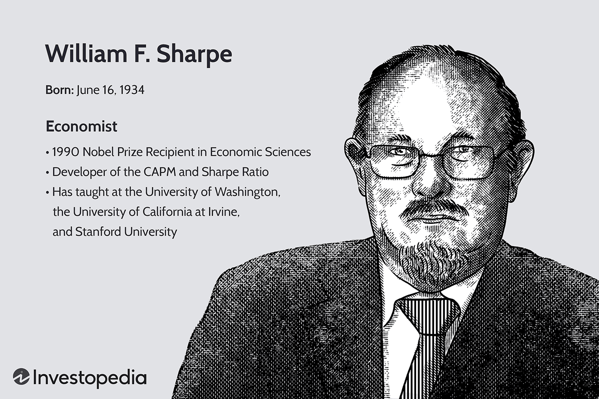

The world of finance and investment is an intricate tapestry of risks and rewards, each aspect deeply connected to the other. Investors constantly seek ways to optimize returns while managing potential risks, a dynamic that has driven the evolution of financial models and metrics. One of the most influential figures in this domain is William F. Sharpe, a Nobel laureate renowned for his profound contributions to financial economics. Sharpe introduced two essential concepts that have become the bedrock of investment analysis: the Capital Asset Pricing Model (CAPM) and the Sharpe Ratio. These tools are pivotal in assessing investment performance and have seen widespread application in various aspects of finance, notably in algorithmic trading.

The CAPM provides a comprehensive framework for determining the expected return of an asset, considering its inherent risk relative to the overall market. The model has been instrumental in shaping modern portfolio theory and guiding investors in diversifying their investments effectively. On the other hand, the Sharpe Ratio offers a more nuanced insight into the risk-adjusted return of an investment. By comparing an investment's excess returns to the risk-free rate, adjusted for its volatility, the Sharpe Ratio helps investors decipher whether the returns are a result of astute investment decisions or merely a byproduct of excessive risk-taking. This ability to measure risk-adjusted returns with precision has made the Sharpe Ratio an indispensable metric, particularly in the field of algorithmic trading, where rapid and data-driven decision-making is paramount.

In this article, we will explore the significance of the Sharpe Ratio, examining its impact on both traditional investment practices and the burgeoning field of algorithmic trading. We will also consider its applications, limitations, and enduring relevance in a constantly evolving financial landscape. Through this exploration, readers will gain a comprehensive understanding of how the Sharpe Ratio continues to shape modern financial strategies, providing valuable insights into risk management and investment analysis.

## Table of Contents

## William F. Sharpe: Contributions to Economics

William F. Sharpe, born in 1934, is a seminal figure in the field of financial economics. His pioneering work, which earned him the Nobel Prize in Economic Sciences in 1990, revolutionized how investors assess the risk and return profile of their investments. Sharpe's most influential contributions include the development of the Capital Asset Pricing Model (CAPM) and the Sharpe Ratio. 

The CAPM introduced a systematic approach to determine the expected return on an asset, accounting for its inherent risk relative to the overall market. This model laid the groundwork for modern portfolio theory, providing investors with a framework for making more informed asset allocation decisions by quantifying the trade-off between risk and expected return.

Equally impactful, the Sharpe Ratio is a tool that measures the risk-adjusted return of an investment. By comparing the excess return of an asset over the risk-free rate, adjusted for volatility, the Sharpe Ratio helps investors discern whether investment returns are due to smart decision-making or merely higher risk levels. The formula is given by:

$$
\text{Sharpe Ratio} = \frac{R_p - R_f}{\sigma_p}
$$

where $R_p$ represents the return of the portfolio, $R_f$ is the risk-free rate, and $\sigma_p$ denotes the standard deviation of the portfolio's excess return.

Sharpe's academic path commenced at the University of California at Los Angeles, where he began building the foundations of his influential theories. Over the years, he served in various esteemed teaching and professional positions that enabled him to disseminate his innovative ideas and solidify his legacy in economic sciences. His work has left an indelible mark on portfolio management and risk assessment, influencing countless financial professionals worldwide.

## Understanding the Sharpe Ratio

The Sharpe Ratio is a crucial financial metric that assesses the risk-adjusted return of an investment portfolio. Developed by Nobel laureate William F. Sharpe, this ratio enables investors to understand whether the returns of an investment are a result of strategic choices or excessive risk-taking. The Sharpe Ratio is particularly significant as it compares the excess returns of an investment to the risk-free rate, adjusting for [volatility](/wiki/volatility-trading-strategies).

Mathematically, the Sharpe Ratio is expressed as:
$$
\text{Sharpe Ratio} = \frac{R_p - R_f}{\sigma_p}
$$
where $R_p$ represents the return of the portfolio, $R_f$ is the risk-free rate, and $\sigma_p$ signifies the standard deviation of the portfolio's excess return. The standard deviation here is essential as it measures the investment's volatility, providing insight into the risk associated with the potential returns.

By considering both return and risk, the Sharpe Ratio aids investors in making informed decisions. For instance, two investments might offer similar returns, but the one with a higher Sharpe Ratio indicates a more favorable risk-return balance. This distinction is crucial in ensuring that investors are compensated for the risks they undertake, rather than simply chasing high returns.

## Applications in Algorithmic Trading

In [algorithmic trading](/wiki/algorithmic-trading), the Sharpe Ratio serves as a crucial tool for evaluating the performance of trading strategies. This risk-adjusted return metric enables traders to assess the efficiency and viability of algorithms by examining how well they perform relative to the inherent risks involved. By standardizing returns in relation to risk, the Sharpe Ratio allows traders to distinguish between effective and underperforming strategies.

The primary utility of the Sharpe Ratio in algorithmic trading lies in its ability to offer insights into strategy evaluation. A higher ratio suggests a more favorable risk-reward balance, indicating that an algorithm generates better returns for the level of risk taken. This evaluation is fundamental for traders seeking to refine their strategies to achieve optimal performance.

Additionally, the Sharpe Ratio significantly influences risk management practices within algorithmic trading. It aids in the identification and mitigation of excessive risk-taking, ensuring that strategies remain aligned with acceptable risk parameters. By continuously monitoring the Sharpe Ratio, traders can dynamically adjust their algorithms to maintain optimal risk exposure and safeguard against large losses during volatile market conditions.

Optimizing trading algorithms to ensure sustainable and stable returns is another critical application of the Sharpe Ratio. Traders often rely on this metric to fine-tune algorithmic parameters, such as entry and [exit](/wiki/exit-strategy) points, position sizing, and risk controls, to improve overall performance. By targeting higher Sharpe Ratios, trading algorithms can be adjusted to maximize returns while controlling for excessive volatility.

In summary, the Sharpe Ratio's role in algorithmic trading is multi-faceted, providing essential insights into strategy evaluation, risk management, and the optimization of trading algorithms. Its widespread adoption underscores its value in developing robust trading strategies that strive for high returns with controlled risks.

## Example: Using the Sharpe Ratio in Investment Decisions

Consider an investor weighing the addition of two stocks to their portfolio. The Sharpe Ratio serves as a pivotal tool in distinguishing which stock provides a superior risk-adjusted return, leading to a more informed investment decision.

To illustrate, let's examine Stock A and Stock B. Suppose Stock A offers a raw return of 12%, while Stock B provides a return of 10%. On the surface, Stock A might appear more attractive due to its higher return. However, evaluating the Sharpe Ratio could reveal a different perspective. Assuming a risk-free rate of 3% and calculating the standard deviation of returns for both stocks, we can determine the Sharpe Ratios as follows:

For Stock A:
$$
\text{Sharpe Ratio}_A = \frac{R_A - R_f}{\sigma_A} = \frac{12\% - 3\%}{15\%} = 0.60
$$

For Stock B:
$$
\text{Sharpe Ratio}_B = \frac{R_B - R_f}{\sigma_B} = \frac{10\% - 3\%}{10\%} = 0.70
$$

Despite Stock A's higher return, Stock B has a superior Sharpe Ratio of 0.70 compared to 0.60 for Stock A. This indicates that Stock B offers a better balance between risk and reward. The higher Sharpe Ratio suggests that Stock B delivers more return per unit of risk compared to Stock A.

Furthermore, in a dynamic investment environment where risk and volatility are critical considerations, the Sharpe Ratio aids investors in making choices that align more closely with their risk tolerance and return expectations. By taking into account both return and risk, investors can make decisions that potentially enhance the efficiency and sustainability of their portfolios.

## Limitations of the Sharpe Ratio

The Sharpe Ratio is a widely used metric in finance for assessing the risk-adjusted return of an investment, offering insights into the trade-off between risk and reward. However, its application is not without limitations that investors and analysts must consider.

One fundamental assumption of the Sharpe Ratio is that returns are normally distributed. This presumption can be misleading in financial markets, which often experience skewness and kurtosis in return distributions. Such deviations from normality are particularly pronounced during extreme market events or periods of tail risk, where rare but significant outcomes drastically impact returns. The Sharpe Ratio does not account for these tail risks, potentially underestimating the inherent investment risk in volatile market conditions.

Additionally, the effectiveness of the Sharpe Ratio can vary significantly depending on the time frame used for analysis. Shorter time frames might show a skewed view of risk-adjusted returns due to temporary price movements, whereas longer time frames might dilute the effect of recent market conditions. Investors must carefully select an appropriate time frame that aligns with their investment horizon to ensure an accurate assessment.

The variable nature of the risk-free rate is another aspect that complicates the use of the Sharpe Ratio. Changes in the risk-free rate can affect the calculation of excess returns, subsequently influencing the ratio. For instance, if the chosen risk-free rate is volatile or subject to frequent adjustments, the calculated Sharpe Ratio may reflect these changes rather than true variations in investment performance. This variability requires careful consideration and potentially frequent recalibrations of the risk-free rate to maintain accurate evaluations.

Overall, while the Sharpe Ratio provides valuable insights into investment performance, it is essential to exercise caution and consider its limitations. By acknowledging the assumptions and potential pitfalls, investors can better interpret the ratio and complement it with additional metrics to form a comprehensive view of risk and return.

## Conclusion

William F. Sharpe's contributions to economic sciences have endowed financial markets with essential tools that enhance both investment analysis and risk management. Central among these tools is the Sharpe Ratio, a measure that remains vital for investors and traders striving to balance the dual objectives of maximizing returns while minimizing risks. By evaluating the risk-adjusted performance of investment portfolios, the Sharpe Ratio empowers decision-makers to differentiate between returns obtained through genuine skill and those resulting from high-risk exposure. 

In the evolving landscape of algorithmic trading and financial technology, Sharpe's models continue to exert a significant influence. Algorithmic trading strategies, which automatically execute trades based on quantitative models, leverage the Sharpe Ratio to assess and optimize performance, ensuring that the returns are commensurate with the risks undertaken. This adaptability speaks to the enduring relevance of Sharpe's work in modern financial strategies and innovations.

As developments in fintech pave the way for more complex trading algorithms and investment applications, Sharpe's principles find new applications that enhance financial decision-making. His legacy persists as a cornerstone of economic theory, facilitating informed investment choices amidst a backdrop of ever-evolving market dynamics.

## References & Further Reading

[1]: Sharpe, W. F. (1964). ["Capital Asset Prices: A Theory of Market Equilibrium Under Conditions of Risk."](https://onlinelibrary.wiley.com/doi/full/10.1111/j.1540-6261.1964.tb02865.x) The Journal of Finance, 19(3), 425-442.

[2]: Sharpe, W. F. (1994). ["The Sharpe Ratio."](https://web.stanford.edu/~wfsharpe/art/sr/SR.htm) The Journal of Portfolio Management, 21(1), 49-58.

[3]: Markowitz, H. (1952). ["Portfolio Selection."](https://onlinelibrary.wiley.com/doi/abs/10.1111/j.1540-6261.1952.tb01525.x) The Journal of Finance, 7(1), 77-91.

[4]: Lo, A. W., & MacKinlay, A. C. (1988). ["Stock Market Prices Do Not Follow Random Walks: Evidence from a Simple Specification Test."](https://academic.oup.com/rfs/article-abstract/1/1/41/1601244) The Review of Financial Studies, 1(1), 41-66.

[5]: Malkiel, B. G. (2015). ["A Random Walk Down Wall Street: The Time-Tested Strategy for Successful Investing"](https://yourknowledgedigest.org/wp-content/uploads/2020/04/a-random-walk-down-wall-street.pdf). W. W. Norton & Company.