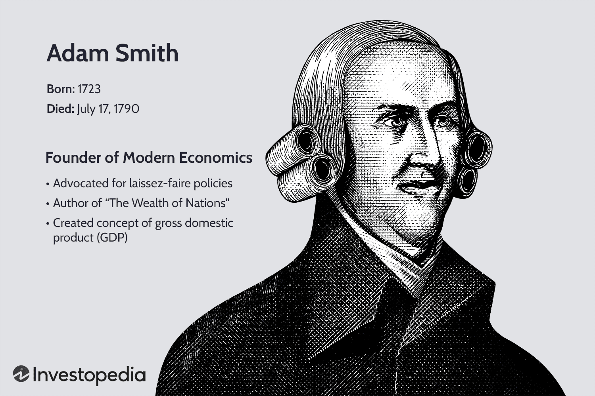

William J. Brodsky is a distinguished and influential figure in the world of finance and options trading. With a career spanning several decades, Brodsky has played crucial roles at two of the most significant financial exchanges: the Chicago Mercantile Exchange (CME) and the Chicago Board Options Exchange (CBOE). His tenure at these institutions has been marked by strategic leadership and innovation, contributing to the evolution and structural transformation of financial markets. 

At the CME, Brodsky's leadership was instrumental during critical periods, notably the introduction of technological advancements that propelled the exchange into the era of electronic trading. He later became a key figure at the CBOE, where his vision paved the way for significant developments such as the demutualization of the exchange, enhancing its operational and strategic capabilities in a competitive global market.

Currently, Brodsky continues to contribute significantly to option-based financial strategies and policy advisory roles. His efforts in these domains underscore his commitment to advancing the integrity, functionality, and transparency of financial markets. This article highlights his extensive contributions to the finance sector, particularly in relation to his impact on the evolution of algorithmic trading. It further examines Brodsky's professional journey, the accolades he has received, and his ongoing influence in shaping the financial industry's future trajectory.

## Table of Contents

## William J. Brodsky's Early Career

William J. Brodsky's financial career began at the young age of 17 when he took a position at the New York Stock Exchange. This early engagement with the world of finance was largely inspired by his father's long-standing and influential career on Wall Street, which instilled in him both the fascination and acumen required for a future in this industry.

Brodsky pursued higher education at Syracuse University, where he earned a law degree. His academic background in law provided him with a robust understanding of the legal aspects that underpin financial transactions and market regulations. Armed with this knowledge, Brodsky initially applied his skills as an attorney at Model, Roland and Co., where he navigated the complex legal landscape of finance.

In 1974, Brodsky transitioned to the American Stock Exchange, a pivotal move that would set the trajectory for his career in options trading. His adeptness in this field led to rapid professional advancement, culminating in his appointment as the head of options trading. Through this role, he honed his skills in strategic market operations and developed a deep expertise that would guide him to further leadership roles.

Brodsky's grasp on options trading, combined with his legal background and early exposure to stock exchange operations, prepared him for subsequent influential positions within major financial institutions. These roles allowed him to leverage his comprehensive knowledge of the market and continue contributing to the evolution of trading strategies and financial instruments.

## Legacy at Chicago Mercantile Exchange

William J. Brodsky's tenure at the Chicago Mercantile Exchange (CME) was marked by transformative leadership and pioneering technological advancements, establishing a legacy of innovation and strategic growth. Joining CME in 1982, Brodsky assumed the role of CEO in 1985, navigating through one of the most volatile periods in financial history.

One of his significant contributions was overseeing the implementation of the CME Globex trading system, the first global electronic trading platform introduced in 1992. This platform transformed the landscape of futures trading by enabling market participants worldwide to execute trades around the clock. The introduction of an electronic trading system was a watershed moment, allowing for increased trading volumes and enhanced market efficiency. By 1997, electronic trading paved the way for [algorithmic trading](/wiki/algorithmic-trading) strategies, setting new standards for speed and reliability in the financial markets.

Brodsky's leadership was pivotal during the 1987 stock market crash, an event characterized by severe market stress and unprecedented [volatility](/wiki/volatility-trading-strategies), often referred to as "Black Monday". His decisive actions during this period, which included promoting enhanced coordination and cooperation among exchanges, were critical in restoring market confidence and stability. The ability to maintain operational continuity and uphold market integrity during such tumultuous times underscored his commitment to resilient and transparent market structures.

Under Brodsky's helm, the CME also witnessed the expansion and globalization of stock index futures. This expansion was crucial for providing international investors with tools for hedging and speculation amid growing market interconnectivity. The globalization efforts included establishing partnerships and strategic alliances with foreign exchanges, thereby enhancing [liquidity](/wiki/liquidity-risk-premium) and diversifying product offerings on a global scale.

Through these accomplishments, Brodsky laid a solid foundation for his subsequent role as CEO at the Chicago Board Options Exchange. His vision and leadership at CME not only influenced the strategic direction of the exchange but also cemented its position as a leader in the financial derivatives market.

## Transformation at Chicago Board Options Exchange

In 1997, William J. Brodsky was appointed as the Chief Executive Officer of the Chicago Board Options Exchange (CBOE), a position through which he would lead the organization into a transformative era. Under his stewardship, CBOE underwent significant organizational and strategic changes, most notably its demutualization, transitioning into a publicly traded entity in 2010. This shift allowed the Exchange to expand its capital base, enhance governance structures, and better align the interests of diverse stakeholders, ultimately resulting in unprecedented revenue growth and substantial returns to investors.

Brodsky's tenure at CBOE was marked by a focus on integrating technology with financial services, an area where he prioritized innovation. He oversaw the development and implementation of new trading platforms, which facilitated the rise of algorithmic trading – a significant leap forward in operational efficiency and market liquidity. This strategic embrace of advanced technology enabled CBOE to offer cutting-edge financial products and services, thereby solidifying its position as a leader in the options trading industry.

The emphasis on technology extended to product innovation as well. Under Brodsky's guidance, CBOE introduced a range of new financial instruments designed to meet the evolving needs of market participants. These products were not only innovative but also aligned with the latest advancements in financial engineering, thereby expanding CBOE’s market share and influence across global financial markets.

Overall, Brodsky’s leadership at CBOE paved the way for long-term growth by fostering an environment where technological advancements and financial innovations converged. This period of transformation significantly enhanced the Exchange's global stature, marking a new chapter in its history and setting a precedent for future leaders to follow. His strategic vision and emphasis on modernizing the Exchange's operations through technology showcased his commitment to advancing the industry, ultimately benefiting shareholders and the broader financial ecosystem.

## Impact on Algorithmic Trading and Finance Policy

William J. Brodsky's influence on algorithmic trading and finance policy has been profound and multifaceted. His contributions have significantly shaped the way algorithmic trading is perceived and regulated across global financial markets. Brodsky's involvement with key organizations, including the World Federation of Exchanges and the International Options Markets Association, allowed him to advocate for policies that enhance the transparency and integrity of trading systems. These roles provided him a platform to influence global trading policies, ensuring that the rapid adoption of algorithmic trading strategies was accompanied by robust regulatory frameworks. 

A strong advocate for fair trading practices, Brodsky played a pivotal role in developing policy frameworks that support these principles. He emphasized the need for transparency within exchanges, contributing to frameworks that protect market participants while fostering technological innovation. His vision was instrumental in promoting an environment where both institutional and retail investors could trust the operations of algorithmic trading systems.

Education was another pillar of Brodsky's impact on algorithmic trading. Recognizing the importance of knowledge in this rapidly advancing field, he promoted education initiatives that explained the benefits and risks of algorithmic strategies. This dual focus on advocacy and education helped build a comprehensive understanding of algorithmic trading, making it more accessible to a diverse range of investors.

Brodsky's influence extends beyond his leadership roles, as he continues to serve in advisory capacities that shape financial markets and options trading strategies. His ongoing contributions ensure that his impact on finance is enduring, helping to navigate the complexities of modern trading environments while advancing the integrity and efficiency of global markets. Through these efforts, Brodsky has left an indelible mark on the evolution of algorithmic trading and finance policy, shaping both current practices and future developments.

## Awards and Professional Affiliations

William J. Brodsky's contributions to the finance sector have earned him several accolades, underlining his influence and leadership in the industry. Among his most significant recognitions is his induction into the Derivatives Hall of Fame, an honor that acknowledges his profound impact on derivatives markets. This accolade highlights his legacy as a transformative figure in enhancing financial instruments and market structures.

Brodsky's leadership in financial innovation has been celebrated through the prestigious William F. Sharpe Indexing Lifetime Achievement Award. This award is given to individuals who have shown exceptional creativity, insight, and influence regarding financial data indexing. It reflects his pivotal role in advancing financial products and strategies, underscoring his strategic mind and forward-thinking approach.

Beyond his professional accomplishments, Brodsky is actively engaged in civic and professional organizations. He serves on various boards, including Cedar Street Asset Management, where he continues to share his vast expertise and industry insights. His participation in these organizations demonstrates his commitment to nurturing financial growth and innovation through governance and strategic guidance.

Brodsky's influence extends beyond the financial sector into broader community engagements. He is known for his dedication to fostering education and ethical trading practices, further enhancing his stature as a leader who prioritizes the integration of financial progress with societal good. This dedication cements his reputation as a figure whose impact resonates across multiple facets of the community.

His legacy embodies innovation, leadership, and a relentless commitment to advancing the financial industry. Through his numerous awards and professional affiliations, William J. Brodsky's career continues to inspire and guide current and future generations in finance, highlighting the vital role of visionary leaders in shaping the dynamics of global markets.

## Conclusion

William J. Brodsky’s contributions to finance and trading have been both profound and transformative. Beginning his journey on Wall Street, Brodsky has demonstrated a consistent trajectory of strategic vision and innovation. His leadership roles at major exchanges, such as the Chicago Mercantile Exchange and the Chicago Board Options Exchange, were pivotal in modernizing trading practices and fostering an era of technological advancement.

Brodsky's influence in advancing algorithmic trading has been particularly significant, fundamentally reshaping the operations of global markets. Through his efforts, trading systems have become more efficient and transparent, enabling both institutional and retail investors to benefit from advanced trading strategies. His work in regulatory guidance and policy-making has not only facilitated the adoption of these strategies but also ensured the integrity and stability of market operations.

Moreover, Brodsky's commitment to advocacy and advisory work has extended his influence beyond his executive positions. His involvement in organizations like the World Federation of Exchanges and the International Options Markets Association has had lasting impacts on global trading policies, promoting best practices and furthering investor education.

As the financial markets continue to evolve, Brodsky's legacy stands as a benchmark for leadership and innovation within the industry. His career exemplifies a profound understanding of market dynamics and a forward-thinking approach that will influence financial strategies and policies for years to come.

## References & Further Reading

[1]: Brodsky, W. J. (2012). ["The Changing Environment for Derivatives and the Impact of Regulation."](https://scholar.google.com/citations?user=__LP-r4AAAAJ&hl=en) CME Group.

[2]: Casey, M. J. (2010). ["CBOE Demutualization Paves the Way for Growth."](https://pubmed.ncbi.nlm.nih.gov/19695759/) The Wall Street Journal.

[3]: ["Electronic Trading in Financial Markets."](https://www.edx.org/learn/economics/new-york-institute-of-finance-electronic-trading-in-financial-markets) by Giuseppe Nuti

[4]: Pirrong, C. (1996). ["Electronic Trading, Price Discovery, and Financial Markets."](https://scholar.google.com/citations?user=tsVlN9QAAAAJ&hl=en) The Journal of Economic Perspectives.

[5]: Franco, C. P. (2017). ["The Development of the Derivatives Markets."](https://www.researchgate.net/profile/Rodrigo-Lanna-Franco-Da-Silveira-2/publication/327117089_DEVELOPMENT_OF_WEATHER_DERIVATIVES_EVIDENCE_FROM_THE_BRAZILIAN_SOYBEAN_MARKET/links/5b7ab47a92851c1e122218e8/DEVELOPMENT-OF-WEATHER-DERIVATIVES-EVIDENCE-FROM-THE-BRAZILIAN-SOYBEAN-MARKET.pdf?origin=publication_detail) Journal of Economic and Financial Studies.