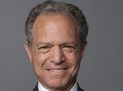

## Table of Contents

## Who is William J. Brodsky?

William J. Brodsky is a well-known person in the world of finance. He used to be the Chairman and CEO of the Chicago Board Options Exchange (CBOE). The CBOE is a big place where people trade options, which are special kinds of investments. Brodsky worked there for a long time and helped make it a successful business.

Before working at the CBOE, Brodsky had other important jobs in finance. He worked at the American Stock Exchange and helped start the Options Clearing Corporation. This corporation makes sure that options trading is safe and fair. Brodsky is respected for his knowledge and leadership in the finance industry.

## What is William J. Brodsky's educational background?

William J. Brodsky went to college at the University of Pennsylvania. He studied there and got a Bachelor of Arts degree. This is a good start for someone who wants to work in finance because it teaches you about different subjects.

After college, Brodsky went to law school at the New York University School of Law. He worked hard and got a Juris Doctor degree. This degree helped him understand the laws about finance and business, which was very useful for his career.

## What are the key positions William J. Brodsky has held in his career?

William J. Brodsky started his career at the American Stock Exchange. He worked there for many years and helped start the Options Clearing Corporation. This corporation makes sure that options trading is safe and fair. His work there was important because it helped build trust in the options market.

Later, Brodsky became the Chairman and CEO of the Chicago Board Options Exchange (CBOE). The CBOE is a big place where people trade options. He worked there for a long time and helped make it a successful business. Under his leadership, the CBOE grew and became very important in the world of finance.

Brodsky also served on the board of directors for several companies. This means he helped make big decisions for those companies. His experience and knowledge made him a valuable leader in the finance industry.

## How did William J. Brodsky contribute to the Chicago Board Options Exchange (CBOE)?

William J. Brodsky was the Chairman and CEO of the Chicago Board Options Exchange (CBOE). He worked there for a long time and helped make it a successful business. When he was in charge, the CBOE grew a lot. It became a very important place for people to trade options. Options are special kinds of investments that people use to make money. Brodsky's leadership helped the CBOE become a leader in the options market.

Brodsky also made sure that the CBOE was a safe and fair place to trade. He worked hard to make sure that the rules were followed and that everyone could trust the CBOE. This was important because it helped more people want to trade there. His work helped the CBOE become a big and respected part of the finance world.

## What significant achievements did William J. Brodsky accomplish as CEO of CBOE?

William J. Brodsky helped the Chicago Board Options Exchange (CBOE) grow a lot when he was the CEO. He worked hard to make the CBOE a big and important place for trading options. Options are special kinds of investments that people use to make money. Under Brodsky's leadership, the CBOE became a leader in the options market. This meant more people wanted to trade there, and the CBOE became more successful.

Brodsky also made sure that the CBOE was a safe and fair place to trade. He worked to make sure that everyone followed the rules and that people could trust the CBOE. This was important because it helped more people feel comfortable trading there. His work helped the CBOE become a respected part of the finance world.

## What role did William J. Brodsky play in the development of financial derivatives?

William J. Brodsky played a big role in the development of financial derivatives, especially options. He helped start the Options Clearing Corporation when he worked at the American Stock Exchange. This corporation makes sure that options trading is safe and fair. It was a very important step because it helped build trust in the options market. People felt more comfortable trading options because they knew there was a system to make sure everything was done right.

Later, as the Chairman and CEO of the Chicago Board Options Exchange (CBOE), Brodsky helped the CBOE grow into a leader in the options market. He worked hard to make sure the CBOE was a safe and fair place to trade. Under his leadership, more people started trading options at the CBOE. This helped the options market become bigger and more important in the world of finance. Brodsky's work helped make options a popular and trusted way for people to invest their money.

## How has William J. Brodsky influenced the regulation of financial markets?

William J. Brodsky has had a big impact on how financial markets are regulated. When he helped start the Options Clearing Corporation, he made sure that options trading was safe and fair. This was important because it helped people trust the options market. The Options Clearing Corporation made sure that everyone followed the rules, which helped keep the market stable and trustworthy.

As the Chairman and CEO of the Chicago Board Options Exchange (CBOE), Brodsky continued to influence regulation. He worked hard to make sure the CBOE followed all the rules and was a safe place to trade. This helped the CBOE grow and become a leader in the options market. Brodsky's focus on good regulation helped make the financial markets more reliable and helped more people feel comfortable investing in options.

## What are some of the awards and recognitions William J. Brodsky has received?

William J. Brodsky has received many awards and recognitions for his work in the finance world. One important award he got is the Joseph W. Sullivan Award. This award is given by the Options Industry Council to people who have done a lot to help the options industry. Brodsky got this award because he helped make the options market bigger and more trusted.

Brodsky has also been recognized by different groups for his leadership and contributions. He was named one of the "100 Most Influential People in Finance" by Treasury & Risk Management magazine. This shows how important his work was in making the financial markets better and safer. People in the finance world respect him a lot for what he has done.

## What is William J. Brodsky's approach to leadership and management?

William J. Brodsky's approach to leadership and management is all about making sure things are done right and that people can trust the work being done. He believes in following the rules and making sure everyone else does too. This is why he worked hard to make the Options Clearing Corporation and the Chicago Board Options Exchange (CBOE) safe and fair places to trade. He knew that if people trusted the markets, more of them would want to trade there. This helped the options market grow and become more important.

Brodsky also focused on growing the business while keeping it stable. He helped the CBOE become a leader in the options market by making it bigger and more successful. He did this by always thinking about how to make things better and safer for everyone involved. His leadership style is about being responsible and making smart decisions that help the business and the people who use it.

## How has William J. Brodsky contributed to financial education and philanthropy?

William J. Brodsky has helped a lot with financial education. He worked to make sure people understand how options work and how to use them safely. He did this by supporting programs that teach people about finance. For example, he helped the Options Industry Council, which teaches people about options and how to trade them. Brodsky believes that if more people know about finance, they can make better choices with their money.

Brodsky has also been involved in philanthropy. He has given money and time to help different causes. He supports groups that work on education and health. By doing this, he wants to make a positive difference in people's lives. His work in philanthropy shows that he cares about helping others and making the world a better place.

## What are William J. Brodsky's views on the future of financial markets?

William J. Brodsky believes that the future of financial markets will be shaped by technology. He thinks that new tools and systems will make trading faster and easier. This means more people will be able to trade and invest. Brodsky also believes that technology will help make markets safer and more fair. He thinks that with better technology, it will be easier to follow the rules and make sure everyone is treated the same.

Brodsky also sees a big role for education in the future of financial markets. He believes that if more people understand how markets work, they will be more likely to invest. This could make the markets grow even more. He thinks that teaching people about finance, especially about options, will help them make better choices with their money. Brodsky wants to see a future where everyone has the chance to learn about and benefit from financial markets.

## What legacy has William J. Brodsky left in the financial industry?

William J. Brodsky has left a big mark on the financial industry. He helped make the options market bigger and more trusted. When he worked at the American Stock Exchange, he helped start the Options Clearing Corporation. This group made sure that options trading was safe and fair. Later, as the Chairman and CEO of the Chicago Board Options Exchange (CBOE), Brodsky helped the CBOE grow into a leader in the options market. He worked hard to make sure the CBOE followed all the rules and was a safe place to trade. His focus on good regulation helped make the financial markets more reliable and helped more people feel comfortable investing in options.

Brodsky also cared a lot about teaching people about finance. He supported programs that help people understand how options work and how to use them safely. He believed that if more people knew about finance, they could make better choices with their money. Besides finance, Brodsky has been involved in philanthropy. He has given money and time to help different causes, especially in education and health. His work in philanthropy shows that he cares about helping others and making the world a better place.

## References & Further Reading

[1]: Brodsky, W. J. (2012). ["The Changing Environment for Derivatives and the Impact of Regulation."](https://scholar.google.com/citations?user=__LP-r4AAAAJ&hl=en) CME Group.

[2]: Casey, M. J. (2010). ["CBOE Demutualization Paves the Way for Growth."](https://pubmed.ncbi.nlm.nih.gov/19695759/) The Wall Street Journal.

[3]: ["Electronic Trading in Financial Markets."](https://www.edx.org/learn/economics/new-york-institute-of-finance-electronic-trading-in-financial-markets) by Giuseppe Nuti

[4]: Pirrong, C. (1996). ["Electronic Trading, Price Discovery, and Financial Markets."](https://scholar.google.com/citations?user=tsVlN9QAAAAJ&hl=en) The Journal of Economic Perspectives.

[5]: Franco, C. P. (2017). ["The Development of the Derivatives Markets."](https://www.researchgate.net/profile/Rodrigo-Lanna-Franco-Da-Silveira-2/publication/327117089_DEVELOPMENT_OF_WEATHER_DERIVATIVES_EVIDENCE_FROM_THE_BRAZILIAN_SOYBEAN_MARKET/links/5b7ab47a92851c1e122218e8/DEVELOPMENT-OF-WEATHER-DERIVATIVES-EVIDENCE-FROM-THE-BRAZILIAN-SOYBEAN-MARKET.pdf?origin=publication_detail) Journal of Economic and Financial Studies.