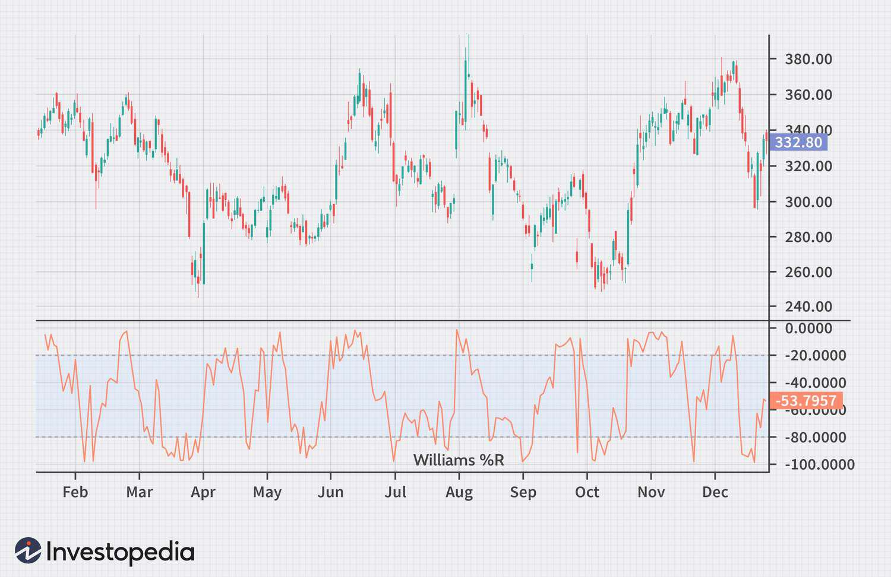

The Williams %R indicator, developed by Larry Williams, is a widely recognized tool in technical analysis for stock trading. As a momentum oscillator, it aids traders in identifying potential market reversals by indicating overbought and oversold conditions. The indicator measures the current price in relation to the high-low range over a set period, typically 14 days, and scales the readings between 0 and -100. Readings closer to 0 suggest overbought market conditions, while those near -100 indicate oversold conditions. This scaling provides traders with valuable insights, allowing them to make informed decisions based on market momentum.

The purpose of this article is to explore the intricacies of the Williams %R indicator and its application within algorithmic trading strategies. By examining its formula and interpretation, we aim to demonstrate how traders can integrate this indicator into trading algorithms to enhance decision-making processes. Through this exploration, readers will gain a deeper understanding of how the Williams %R can serve as a critical component in developing more effective trading strategies, ultimately improving the accuracy of market predictions and trade executions.



## Table of Contents

## Understanding Williams %R

Williams %R is a technical indicator in stock trading that measures the current price relative to the highest and lowest prices over a predetermined period, usually set to 14 days. This indicator provides insights into the momentum of an asset, offering traders useful signals for potential market reversals. Fundamentally, Williams %R functions as an oscillator with its values scaled between 0 and -100. A reading close to 0 signifies an overbought condition, suggesting that the asset may have reached the peak of its recent price range and could be due for a downward correction. Conversely, a reading near -100 indicates an oversold condition, implying that the asset might be undervalued within its recent price range and may experience an upward correction.

The calculation of Williams %R can be expressed mathematically as follows:

$$
\text{Williams \%R} = \frac{\text{Highest High} - \text{Close}}{\text{Highest High} - \text{Lowest Low}} \times -100
$$

Given this formula, the Williams %R contextualizes the closing price with respect to the highest and lowest prices over the specified period, thus providing a snapshot of price momentum which traders can interpret to forecast market movements. As an oscillator, it is particularly valuable in identifying short-term trading opportunities and gauging whether market conditions are conducive to potential price reversals.

## Williams %R Formula and Calculation

The Williams %R indicator is calculated using a straightforward formula that measures the current closing price relative to the highest high and the lowest low over a specified look-back period, typically 14 days. This approach captures the [momentum](/wiki/momentum) of the asset by evaluating its position within a defined price range. The formula is given by:

$$
\text{Williams \%R} = \left(\frac{\text{Highest High} - \text{Close}}{\text{Highest High} - \text{Lowest Low}}\right) \times -100
$$

To understand the calculation, consider the following steps:

1. **Identify the Highest High (HH)**: Look for the highest price the asset has reached during the look-back period.

2. **Identify the Lowest Low (LL)**: Determine the lowest price within the same period.

3. **Take the Current Closing Price (C)**: This is the most recent market price at the end of the trading day.

By using these values, the indicator effectively positions the current price between the recent extremes, scaled between 0 and -100. A reading close to 0% indicates that the current price is near the highest high, suggesting overbought conditions. Conversely, a reading approaching -100% means the price is near the lowest low, indicating oversold conditions.

**Example in Python:**

To assist traders in implementing this calculation programmatically, here is a basic example of how to calculate Williams %R using Python:

```python
def williams_r(highs, lows, close, lookback_period=14):
    highest_high = max(highs[-lookback_period:])
    lowest_low = min(lows[-lookback_period:])

    if highest_high != lowest_low:  # Ensure denominator is not zero
        percent_r = ((highest_high - close) / (highest_high - lowest_low)) * -100
    else:
        percent_r = 0  # or handle it differently, based on strategy

    return percent_r

# Example usage
highs = [128, 130, 132, 135, 133, 136, 137, 139, 140, 138, 137, 136, 135, 134, 132, 131]
lows = [120, 121, 122, 123, 124, 125, 125, 126, 127, 126, 125, 124, 123, 122, 121, 120]
close = 133

williams_r_value = williams_r(highs, lows, close)
print(f"Williams %R value: {williams_r_value}")
```

This Python code calculates Williams %R for a given set of high, low, and close prices, using a default look-back period of 14 days. By incorporating such logic into trading algorithms, traders can automate the detection of potential overbought or oversold market conditions.

## Interpreting Williams %R

The Williams %R indicator is primarily interpreted through its ability to identify overbought and oversold levels, which are crucial signals for potential price reversals in the market. This momentum oscillator achieves this by assessing the current closing price against the highest high and lowest low over a specific period, usually 14 days. Its values are scaled from 0 to -100, where readings closer to 0 suggest overbought conditions, and those nearer to -100 indicate oversold conditions.

Overbought levels occur when the Williams %R registers a value above -20, suggesting that the asset has experienced a significant upward movement and may be due for a downward correction. Conversely, oversold levels are identified when the indicator falls below -80, indicating potential for an upward price reversal after a downward trend. These levels act as thresholds, providing traders with insights into possible market turning points.

A critical aspect of interpreting the Williams %R is the identification of divergences between its movement and the asset's price action. A divergence occurs when the price of an asset is moving in a direction opposite to the indicator. For instance, if the asset's price is making new highs while the Williams %R is failing to surpass its previous highs, it could be an indication of a weakening bullish trend, suggesting a potential bearish reversal. Similarly, a bullish divergence would occur if the price makes new lows while the Williams %R does not reach new lows, hinting at a weakening bearish trend and a possible bullish reversal.

These divergences are significant because they can provide early warnings of trend reversals, enabling traders to make more informed decisions. However, it is vital to consider these signals within the context of additional analysis and complementary indicators to enhance accuracy. By combining Williams %R with other technical tools such as Relative Strength Index (RSI) or Moving Average Convergence Divergence (MACD), traders can refine their strategies to better anticipate market movements and optimize their trading performance.

## Williams %R in Algorithmic Trading

Algorithmic traders can deploy the Williams %R indicator by programming specific conditions for trade execution based on its readings. This momentum oscillator helps in identifying potential market reversals by signaling overbought or oversold conditions. In [algorithmic trading](/wiki/algorithmic-trading), Williams %R is often integrated into trading algorithms to enhance decision-making and automate the trade process. 

One common strategy involves setting thresholds—such as -20 for overbought and -80 for oversold—at which the algorithm will execute a buy or sell order. For instance, when Williams %R crosses above the -80 level from below, it may signal a buy opportunity, indicating that the asset is transitioning from an oversold condition. Conversely, a cross below the -20 level could trigger a sell order, suggesting a trend reversal from an overbought state.

To create more robust trading strategies, Williams %R is frequently employed alongside other technical indicators like the Relative Strength Index (RSI) or the Moving Average Convergence Divergence (MACD). These combinations can improve trade accuracy by filtering out false signals typical in highly volatile markets. For example, an algorithm might initiate a trade only when both Williams %R and RSI indicate oversold conditions, thereby increasing the confidence in the trading signal.

Below is a simplified example of how Williams %R could be integrated into an algorithmic trading strategy using Python:

```python
import pandas as pd

def calculate_williams_r(high, low, close, lookback=14):
    highest_high = high.rolling(window=lookback).max()
    lowest_low = low.rolling(window=lookback).min()
    williams_r = ((highest_high - close) / (highest_high - lowest_low)) * -100
    return williams_r

def trading_strategy(data):
    data['Williams %R'] = calculate_williams_r(data['High'], data['Low'], data['Close'])
    data['Buy_Signal'] = (data['Williams %R'] < -80)
    data['Sell_Signal'] = (data['Williams %R'] > -20)

    trades = []
    for _, row in data.iterrows():
        if row['Buy_Signal']:
            trades.append('Buy')
        elif row['Sell_Signal']:
            trades.append('Sell')
        else:
            trades.append('Hold')

    return trades

# Sample usage with a Pandas DataFrame containing the historical data
# dataframe = pd.DataFrame({'High': ..., 'Low': ..., 'Close': ...})
# signals = trading_strategy(dataframe)
```

This code calculates the Williams %R for a given dataset and employs simple conditional logic to generate buy or sell signals based on the specified thresholds. This simplistic example can be expanded with additional indicators and logic for a more sophisticated and nuanced trading strategy.

## Williams %R vs. Fast Stochastic Oscillator

Both Williams %R and the Fast Stochastic Oscillator are pivotal tools in technical analysis, designed to identify overbought and oversold conditions in trading. While they share this common purpose, they differ significantly in their calculation scales and sensitivity, providing unique advantages and challenges to traders.

Williams %R measures the level of the close relative to the highest high for a user-defined period, typically 14 days, on a scale from 0 to -100. The indicator is designed to highlight the momentum of a stock and signal potential reversal points when it crosses specific thresholds near its limits. A reading close to 0 suggests an overbought condition, whereas a reading near -100 indicates an oversold status.

In contrast, the Fast Stochastic Oscillator employs a different scale, typically ranging from 0 to 100. It is composed of two lines: %K and %D. The %K line is similar in nature to Williams %R but is plotted on a different scale, while the %D line represents a moving average of %K, smoothing out short-term fluctuations and providing a clearer trend signal.

The calculation for the Stochastic Oscillator's %K is as follows:

$$
\%K = \frac{\text{(Current Close - Lowest Low)}}{\text{(Highest High - Lowest Low)}} \times 100
$$

where "Lowest Low" and "Highest High" are calculated over a specified look-back period.

Sensitivity is another differing [factor](/wiki/factor-investing). Due to the dual-line composition of Fast Stochastic, this indicator is known for its sensitivity to market movements, which can lead to frequent crossover signals. These signals are beneficial in volatile markets but might result in false positives during relatively stable conditions.

Williams %R, with its single-line output, offers a simplified and often more intuitive interpretation in fast-paced markets, where decision speed is crucial. This simplicity can be advantageous, as it reduces the cognitive load on traders, enabling quicker decision-making.

Despite their differences, both indicators can complement each other when used in tandem. The combined use could offer a broader view, where Williams %R quickly signals potential reversals, and the Stochastic Oscillator provides confirmation through its crossover dynamics, enhancing the robustness of trading strategies.

## Limitations and Enhancements

The Williams %R indicator is a popular tool among traders for identifying overbought and oversold market conditions. However, it is not without its limitations. One of the primary challenges associated with the Williams %R is its propensity to generate false signals, particularly in volatile markets. During periods of heightened [volatility](/wiki/volatility-trading-strategies), price levels can frequently reach extreme values on the scale of 0 to -100 without experiencing the consequent price reversals that would typically validate these signals. This can lead traders to make premature or incorrect trading decisions based solely on the indicator's readings.

To mitigate false signals, traders often employ enhancements to the Williams %R by integrating it with other technical indicators. Backtesting trading strategies using historical data is fundamental to understanding the performance and reliability of the Williams %R under various market conditions. This process allows traders to identify patterns and refine their strategies accordingly.

A popular complementary indicator used with the Williams %R is the Bollinger Bands. This combination can help confirm potential trade signals by taking into account both momentum and price volatility. Bollinger Bands are plotted at standard deviations away from a simple moving average, providing a dynamic range within which the price is expected to fluctuate. By evaluating where the Williams %R indicates overbought or oversold conditions in relation to the position of price within the Bollinger Bands, traders can better judge the likelihood of a true reversal.

For example, a signal may be more credible if the Williams %R suggests an overbought condition and the price simultaneously reaches or breaches the upper Bollinger Band, implying excessive bullish momentum. Conversely, an oversold signal supported by the price touching or falling below the lower Bollinger Band can hint at potential buying opportunities.

The implementation of such enhancements typically involves algorithmic strategies to automate the decision-making process. Below is a simple Python example showcasing how traders might approach integrating these indicators:

```python
import pandas as pd
import talib as ta

# Example data
data = pd.DataFrame({'close': [pull_your_price_data_here]})

# Calculate Williams %R
williams_r = ta.WILLR(data['high'], data['low'], data['close'], timeperiod=14)

# Calculate Bollinger Bands
upperband, middleband, lowerband = ta.BBANDS(data['close'], timeperiod=20)

# Simple trade condition example
signals = (williams_r < -80) & (data['close'] < lowerband)  # Potential buy signal

# Convert the signals to a DataFrame
trade_signal_df = pd.DataFrame(signals, columns=['Buy_Signal'])
```

In conclusion, while the Williams %R is a valuable tool, employing it with additional indicators and performing rigorous [backtesting](/wiki/backtesting) can significantly enhance its effectiveness and accuracy in trading strategies.

## Practical Tips for Using Williams %R

Williams %R, a momentum oscillator, is particularly useful for short-term trading strategies by helping traders identify key support and resistance levels. These levels can serve as potential entry and [exit](/wiki/exit-strategy) points for trades. By pinpointing these critical price levels, traders can capitalize on market fluctuations with improved precision.

To utilize Williams %R effectively, traders should complement it with broader market analysis. Incorporating additional technical indicators and tools into one's analysis can offer more comprehensive insights. For instance, pairing Williams %R with trend-following indicators like Moving Averages or momentum oscillators such as the Relative Strength Index (RSI) can enhance the accuracy of trade signals.

Implementing risk management strategies is crucial when using any technical indicator, including Williams %R. This involves setting stop-loss orders to limit potential losses if a trade does not move as expected. Traders should be particularly cautious in highly volatile markets, where price levels may frequently hit extremes without actual reversals. Consistent review and adaptation of strategies based on market conditions and backtesting outcomes are also recommended.

Below is a simple Python script to calculate Williams %R using historical price data. This script requires the pandas library for data manipulation:

```python
import pandas as pd

def calculate_williams_r(data, lookback_period=14):
    # Ensure the data has the correct columns
    if not {'High', 'Low', 'Close'}.issubset(data.columns):
        raise ValueError("Data must contain 'High', 'Low', and 'Close' columns")

    high_roll = data['High'].rolling(window=lookback_period).max()
    low_roll = data['Low'].rolling(window=lookback_period).min()

    williams_r = ((high_roll - data['Close']) / (high_roll - low_roll)) * -100
    return williams_r

# Sample usage
# data = pd.read_csv('historical_prices.csv')
# data['Williams %R'] = calculate_williams_r(data)
```

By leveraging Williams %R with these best practices, traders can improve their timing in short-term trading and enhance overall trading performance. However, ongoing market education and adaptability remain pivotal to effectively navigating the complexities of the financial markets.

## Conclusion

The Williams %R is a versatile momentum oscillator that plays a crucial role in pinpointing potential market reversals. When applied effectively, it empowers traders to craft strategies that are timely and responsive to market dynamics. One of the key strengths of Williams %R is its applicability in algorithmic trading. By integrating Williams %R into algorithmic systems, traders can automate decision-making processes, allowing for rapid response to market conditions. However, it is essential to acknowledge that no single indicator provides a complete picture. To achieve higher precision in trading decisions, Williams %R should be used in conjunction with other technical indicators, such as the Relative Strength Index (RSI) or Moving Average Convergence Divergence (MACD). This multi-indicator approach aids in reducing false signals and enhancing the reliability of trading strategies. In conclusion, while Williams %R serves as a valuable component in identifying potential reversals, its true efficacy is realized when combined with comprehensive market analysis and risk management practices.

## References & Further Reading

[1]: ["How I Made One Million Dollars Last Year Trading Commodities"](https://www.amazon.com/Made-Million-Dollars-Trading-Commodities/dp/0930233107) by Larry Williams

[2]: ["Technical Analysis of the Financial Markets: A Comprehensive Guide to Trading Methods and Applications"](https://archive.org/details/technicalanalysi0000murp) by John J. Murphy

[3]: Wilder, J. W. (1978). ["New Concepts in Technical Trading Systems."](https://archive.org/details/newconceptsintec00wild) Trend Research

[4]: Pring, M. J. (2002). ["Technical Analysis Explained, Fifth Edition: The Successful Investor's Guide to Spotting Investment Trends and Turning Points"](https://www.amazon.com/Technical-Analysis-Explained-Fifth-Successful/dp/0071825177)

[5]: "Williams %R: An Introduction" available at [Investopedia](https://www.investopedia.com/boost-your-earnings-as-high-as-5-50-with-one-of-the-best-high-yield-savings-accounts-8734344)