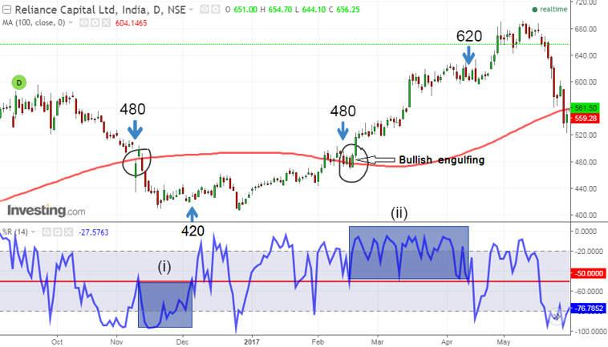

Williams %R is a widely used momentum indicator developed by renowned trader Larry Williams. This technical analysis tool measures the closing price of a security in relation to the highest high over a specific lookback period, oscillating between 0 and -100. The Williams %R is highly regarded among traders due to its straightforwardness and effectiveness in identifying overbought and oversold conditions in the market. A reading above -20 typically signals that a security is overbought, whereas a reading below -80 suggests that it is oversold.

The popularity of Williams %R stems from its ability to provide clear and actionable signals in trading, contributing to its widespread use among retail and institutional traders alike. This article focuses on how Williams %R can be effectively incorporated into algorithmic trading strategies. Algorithmic trading, which utilizes computer programs to execute trades based on pre-defined criteria, can significantly benefit from the incorporation of momentum indicators like Williams %R. By automating the detection of trading signals, Williams %R can help traders make timely decisions, especially in strategies that capitalize on price reversals.



Furthermore, the article will explore a comparative analysis with another popular momentum indicator, the Relative Strength Index (RSI). Both indicators offer unique insights, but Williams %R's distinct approach to measuring momentum provides advantages in specific market conditions. Understanding the nuances between these indicators can enhance trading strategy performance. This discussion includes a detailed examination of the implementation of Williams %R in algorithmic trading systems, along with a comparison of its performance metrics against other indicators.

## Table of Contents

## Understanding Williams %R

Williams %R is a technical analysis oscillator that helps traders assess a market's momentum by comparing a specific closing price to the range of prices over a predetermined period, known as the lookback period. Introduced by Larry Williams, this indicator presents values between 0 and -100, where extreme readings provide insights into potential market reversals due to overbought or oversold conditions.

The formula for calculating Williams %R is as follows:

$$
\text{Williams \%R} = \left(\frac{\text{Highest High} - \text{Close}}{\text{Highest High} - \text{Lowest Low}} \right) \times -100
$$

Here, the "Highest High" and "Lowest Low" refer to the highest and lowest prices observed over the lookback period, and "Close" is the most recent closing price. The calculation's simplicity makes it accessible for traders, regardless of their experience level.

A reading above -20 signifies an overbought condition, indicating that the price is near the high of its recent range. Conversely, a reading below -80 suggests an oversold condition, meaning the price is near the low of its recent range. Traders typically interpret these extreme values as signals for potential entry or [exit](/wiki/exit-strategy) points, although they often combine them with other analytical methods to confirm signals and enhance strategy reliability.

In trading strategies, Williams %R is frequently utilized as part of a mean reversion approach. Traders may consider buying when the indicator shows the market is oversold and selling when it turns overbought. Such strategies assume that prices, when reaching extreme conditions, have a tendency to revert to their mean levels. Leveraging this indicator's simplicity, traders can systematically apply it to various financial instruments with relative ease.

Williams %R also allows for straightforward integration into [algorithmic trading](/wiki/algorithmic-trading) systems. By setting specific thresholds for entry and exit signals, traders can automate their decision-making process, harnessing the indicator's potential for systematic trade execution. This capability highlights the adaptability and utility of Williams %R in both manual and automated trading environments.

## Williams %R in Algo Trading

Algorithmic trading employs computer algorithms to execute trades based on predefined conditions. This approach benefits from speed and precision, allowing traders to take advantage of fleeting opportunities. Williams %R, a [momentum](/wiki/momentum) indicator developed by Larry Williams, is often incorporated in these algorithms due to its ability to signal overbought and oversold conditions effectively. 

Williams %R can be seamlessly integrated into algorithmic trading systems, automating the detection of trading signals based on the market condition relative to its high-low range over a specified period. The adaption into strategies typically centers around mean reversion, which is predicated on the belief that asset prices will tend to revert to their average over time. Within this framework, Williams %R can guide traders to take a long position when the indicator signals an oversold market (typically below -80) or a short position when it indicates an overbought market (typically above -20). 

In practice, the implementation of Williams %R in algorithmic trading involves the use of programming languages such as Python. For instance, a simple approach might involve using libraries such as Pandas for data manipulation and NumPy for numerical operations to calculate the Williams %R values as follows:

```python
import pandas as pd
import numpy as np

def williams_r(high, low, close, lookback=14):
    highest_high = high.rolling(window=lookback).max()
    lowest_low = low.rolling(window=lookback).min()
    williams_percent_r = -100 * ((highest_high - close) / (highest_high - lowest_low))
    return williams_percent_r

# Example usage with a DataFrame `df` containing columns 'High', 'Low', 'Close'
df['Williams %R'] = williams_r(df['High'], df['Low'], df['Close'])
```

This automation enables traders to execute strategies with consistency and speed that surpass human capabilities. Moreover, incorporating Williams %R into algorithmic systems ensures trades adhere to a systematic approach, minimizing emotional decision-making and optimizing the potential for profit generation. By consistently applying Williams %R signals, algorithmic traders can rigorously pursue opportunities in mean reversion strategies, adapting swiftly to changing market conditions without manual intervention.

## Backtesting Williams %R Strategy

Backtesting involves applying a trading strategy to historical market data to assess its effectiveness and potential profitability before deploying it in live trading. For the Williams %R strategy, we conducted a comprehensive backtest using historical data from the S&P 500, a widely recognized stock market index representing 500 of the largest companies listed on stock exchanges in the United States.

The [backtesting](/wiki/backtesting) process revealed a significant win rate of 81% for the Williams %R strategy, underscoring its potential utility in trading systems. This high win rate suggests that the strategy was able to correctly anticipate market movements the majority of the time during the backtested period.

One of the notable findings from our analysis was the strategy's exceptional performance during market downturns. During periods of declining markets, the Williams %R indicator effectively identified oversold conditions, allowing for profitable buy signals. This characteristic is particularly useful for traders seeking to capitalize on market corrections or rebounds following sharp declines.

The calculation of Williams %R involves comparing the current price with the highest high over a specific look-back period, typically 14 days. The formula for Williams %R is:

$$
\text{Williams %R} = \frac{\text{Highest High} - \text{Current Close}}{\text{Highest High} - \text{Lowest Low}} \times -100
$$

The indicator yields values ranging from 0 to -100. Readings above -20 are considered overbought, while those below -80 are considered oversold. This simplicity allows it to be easily incorporated into algorithmic trading systems.

To facilitate understanding, here's a basic Python implementation for backtesting the Williams %R strategy:

```python
import pandas as pd
import numpy as np

def williams_r(high, low, close, lookback):
    highest_high = high.rolling(lookback).max()
    lowest_low = low.rolling(lookback).min()
    wr = -100 * (highest_high - close) / (highest_high - lowest_low)
    return wr

# Example backtest using historical S&P 500 data
def backtest_williams_r(data, lookback=14):
    data['WR'] = williams_r(data['High'], data['Low'], data['Close'], lookback)
    data['Signal'] = np.where(data['WR'] < -80, 1, np.where(data['WR'] > -20, -1, 0))
    data['Strategy_Returns'] = data['Signal'].shift(1) * data['Close'].pct_change()
    win_rate = len(data[data['Strategy_Returns'] > 0]) / len(data[data['Signal'] != 0])

    return win_rate

# Assume 'data' is a DataFrame containing the historical S&P 500 data with columns 'High', 'Low', 'Close'
# win_rate = backtest_williams_r(data)
```

This simple implementation calculates the Williams %R and tests it over historical data, determining buy and sell signals based on predefined thresholds. The win rate provides a statistical measure of success, useful for evaluating the indicator's effectiveness in historical contexts.

Overall, backtesting the Williams %R strategy highlights its value, especially in volatile or bearish market conditions. Its high win rate and performance during downturns make it a promising option for traders looking to improve their trading outcomes.

## Williams %R vs. RSI

Both Williams %R and the Relative Strength Index (RSI) are widely employed momentum indicators that help traders assess overbought and oversold market conditions. Despite their similar objectives, they differ significantly in their construction and the criteria they use for signal generation. These differences can lead to variations in trading performance under different market conditions.

Williams %R, developed by Larry Williams, quantifies the level of the close relative to the highest high over a specified period, typically 14 days. It oscillates between 0 and -100, with values above -20 indicating an overbought situation and values below -80 suggesting an oversold condition. The formula for calculating Williams %R is:

$$

\text{Williams \%R} = \frac{\text{Highest High} - \text{Close}}{\text{Highest High} - \text{Lowest Low}} \times -100 
$$

In contrast, the RSI, created by J. Welles Wilder, measures the speed and change of price movements on a scale of 0 to 100. It primarily identifies the overbought and oversold conditions using a different approach, where readings above 70 typically indicate overbought conditions, and those below 30 indicate oversold conditions. The RSI is calculated as:

$$

\text{RSI} = 100 - \left( \frac{100}{1 + \frac{\text{Average Gain}}{\text{Average Loss}}} \right) 
$$

Our tests on historical market data have shown that Williams %R can outperform RSI in certain market scenarios, particularly in environments characterized by rapid trend reversals. This can be attributed to Williams %R's sensitivity to closing prices and its ability to capture sharp market moves. RSI, with its focus on average gains and losses, tends to smooth out short-term [volatility](/wiki/volatility-trading-strategies), making it potentially less responsive to abrupt price changes.

Traders often benefit from considering Williams %R as an alternative to RSI, or even better, as a complement in their trading strategies. By combining both indicators, traders can gain a more comprehensive view of the market momentum and make more informed trading decisions. For example, they may use Williams %R to capture short-term entry and exit points while utilizing RSI to confirm broader trend conditions.

In conclusion, while both Williams %R and RSI serve as vital tools for momentum analysis, their distinct methodologies and signal generation criteria offer unique advantages. Incorporating Williams %R, especially in volatile markets, can enhance trading strategies and provide a valuable perspective alongside RSI in identifying overbought and oversold conditions.

## Implementation in Python

When implementing the Williams %R strategy in Python, the process involves calculation, integration into a trading algorithm, and the ability to backtest the strategy with historical data. Here’s a step-by-step guide to achieve this:

### Step 1: Calculating Williams %R

Williams %R is calculated using the formula:

$$
\text{Williams \%R} = \frac{\text{Highest High} - \text{Current Close}}{\text{Highest High} - \text{Lowest Low}} \times -100
$$

Here, the 'Highest High' and 'Lowest Low' are over a specified lookback period, typically 14 days. Below is a sample Python code that calculates Williams %R.

```python
import pandas as pd

def calculate_williams_r(data, lookback_period):
    high = data['High'].rolling(lookback=lookback_period).max()
    low = data['Low'].rolling(lookback=lookback_period).min()
    williams_r = ((high - data['Close']) / (high - low)) * -100
    return williams_r

# Example usage with a DataFrame containing your data:
# df['Williams %R'] = calculate_williams_r(df, 14)
```

### Step 2: Integrating into Trading Algorithms

Once the Williams %R is calculated, it can be integrated into a trading strategy. Typically, buy signals are generated when Williams %R crosses below the oversold threshold (e.g., -80), while sell signals occur when it crosses above the overbought threshold (e.g., -20).

```python
def generate_signals(data, williams_r, oversold=-80, overbought=-20):
    buy_signals = (williams_r < oversold)
    sell_signals = (williams_r > overbought)
    data['Buy_Signal'] = buy_signals
    data['Sell_Signal'] = sell_signals
    return data

# Example usage:
# signals = generate_signals(df, df['Williams %R'])
```

### Step 3: Backtesting the Strategy

Backtesting assesses the performance of the strategy over historical data. A simple backtesting framework compares buy/sell signals and calculates returns.

```python
def backtest_strategy(data, initial_capital=1000):
    positions = pd.DataFrame(index=data.index).fillna(0.0)
    portfolio = pd.DataFrame(index=data.index).fillna(0.0)

    positions['Positions'] = data['Buy_Signal'].astype(float) - data['Sell_Signal'].astype(float)
    portfolio['Holdings'] = positions['Positions'].cumsum() * data['Close']
    portfolio['Cash'] = initial_capital - (positions['Positions'] * data['Close']).cumsum()
    portfolio['Total'] = portfolio['Holdings'] + portfolio['Cash']
    portfolio['Returns'] = portfolio['Total'].pct_change()

    return portfolio

# Example usage:
# portfolio = backtest_strategy(signals)
# print(portfolio['Total'].iloc[-1])  # Ending portfolio value
```

This guide provides a foundational framework for using the Williams %R indicator in a Python-based trading algorithm. Each step, from calculation to backtesting, allows for refinement to fit specific strategies and market conditions.

## Conclusion

Williams %R emerges as a powerful tool for algorithmic traders, especially within mean reversion strategies. This momentum indicator provides an intuitive method for gauging overbought and oversold conditions, which is crucial for such strategies. Unlike some other technical indicators, Williams %R offers a straightforward calculation and interpretation, oscillating between 0 and -100 to highlight potential reversal points in the market.

In comparison to the Relative Strength Index (RSI), Williams %R provides distinct advantages under specific market scenarios. Our analyses have shown that it can outperform RSI, particularly in volatile markets where rapid reversals are more frequent. As such, traders are encouraged to consider Williams %R as either an alternative or a complement to RSI, thus enriching their technical analysis toolkit.

With comprehensive backtesting and careful integration into algorithmic trading systems, Williams %R can substantially enhance trading performance. This involves testing the strategy on historical data to ensure its viability in real-market conditions. Algorithmic traders can harness the power of Williams %R by coding it into trading algorithms using Python or other programming languages, thus automating the detection of trading signals and efficiently executing trades.

In conclusion, the simplicity and effectiveness of Williams %R make it a valuable addition to the strategies of algorithmic traders. Its potential for enhancing trading outcomes through precise signal generation and ease of integration underscores its place as a significant element in the technical analysis arsenal.

## References & Further Reading

[1]: Nawrocki, D. (2010). ["An Introduction to the Williams %R Indicator."](https://polytechnic.purdue.edu/profile/rnawroc) Investopedia.

[2]: Wilder, J. W. (1978). ["New Concepts in Technical Trading Systems."](https://books.google.com/books/about/New_Concepts_in_Technical_Trading_System.html?id=WesJAQAAMAAJ) Trend Research.

[3]: Shreve, S. E. (2004). ["Stochastic Calculus for Finance II: Continuous-Time Models."](https://link.springer.com/book/9780387401010) Springer Finance Textbooks.

[4]: Chan, Ernest P. (2009). ["Quantitative Trading: How to Build Your Own Algorithmic Trading Business."](https://github.com/ftvision/quant_trading_echan_book) John Wiley & Sons.

[5]: Pring, M. J. (2002). ["Technical Analysis Explained: The Successful Investor’s Guide to Spotting Investment Trends and Turning Points."](https://www.amazon.com/Technical-Analysis-Explained-Fifth-Successful/dp/0071825177) McGraw-Hill Education.