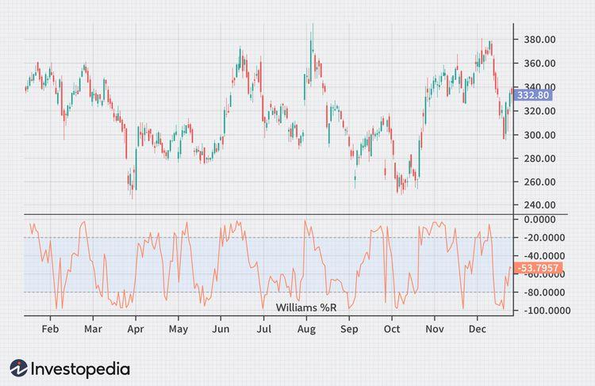

## Table of Contents

## What is the Williams %R indicator?

The Williams %R indicator is a tool used in trading to help figure out if a stock or other financial item is overbought or oversold. It was created by Larry Williams and works by comparing the closing price of a stock to its high and low prices over a certain period, usually 14 days. The result is shown as a number between 0 and -100. If the Williams %R is close to 0, it means the stock might be overbought, and if it's close to -100, it might be oversold.

Traders use the Williams %R to help them decide when to buy or sell. When the indicator shows a stock is oversold (near -100), it might be a good time to buy because the price could go up soon. On the other hand, if the stock is overbought (near 0), it might be a good time to sell because the price could drop. However, it's important to use this indicator along with other tools and not rely on it alone, as it can give false signals sometimes.

## Who developed the Williams %R indicator and when?

The Williams %R indicator was developed by Larry Williams. Larry Williams is a well-known trader and author who has written many books about trading and investing. He created the Williams %R indicator to help traders understand if a stock or other financial item is overbought or oversold.

Larry Williams introduced the Williams %R indicator in the 1970s. Since then, it has become a popular tool among traders. The indicator is easy to use and can be a helpful part of a trader's toolkit, but it's best used along with other indicators and analysis methods.

## How is the Williams %R calculated?

The Williams %R indicator is calculated by looking at the highest high and the lowest low over a certain number of days, usually 14 days, and comparing them to the current closing price. To find the Williams %R, you first find the difference between the highest high and the current closing price. Then, you divide that difference by the difference between the highest high and the lowest low. After that, you multiply the result by -100 to get a number between 0 and -100.

For example, if the highest high over the last 14 days was $50, the lowest low was $40, and the current closing price is $45, you would calculate the Williams %R like this: First, find the difference between the highest high and the current closing price, which is $50 - $45 = $5. Then, find the difference between the highest high and the lowest low, which is $50 - $40 = $10. Next, divide $5 by $10 to get 0.5. Finally, multiply 0.5 by -100 to get a Williams %R of -50. This tells you that the stock is in the middle of its 14-day range, neither overbought nor oversold.

## What does the Williams %R measure in the context of trading?

The Williams %R indicator helps traders figure out if a stock or other financial item is overbought or oversold. It does this by comparing the current closing price of the stock to its highest and lowest prices over a certain period, usually 14 days. The result is shown as a number between 0 and -100. If the number is close to 0, it means the stock might be overbought, which could mean the price is high and might go down soon. If the number is close to -100, it means the stock might be oversold, which could mean the price is low and might go up soon.

Traders use the Williams %R to help them decide when to buy or sell a stock. When the indicator shows a stock is oversold (near -100), it might be a good time to buy because the price could go up soon. On the other hand, if the stock is overbought (near 0), it might be a good time to sell because the price could drop. However, the Williams %R should not be used alone. It's best to use it with other tools and indicators to get a better picture of what might happen to the stock price.

## How can beginners interpret the Williams %R values?

For beginners, understanding the Williams %R is pretty straightforward. This indicator shows a number between 0 and -100. If the number is close to 0, it means the stock might be overbought. This means the price is high and might go down soon. If the number is close to -100, it means the stock might be oversold. This means the price is low and might go up soon. So, if you see a Williams %R close to 0, it might be a good time to sell, and if it's close to -100, it might be a good time to buy.

However, beginners should remember that the Williams %R is just one tool and should not be used alone. It's a good idea to use it with other indicators and do more research before making any trading decisions. For example, you might also look at the stock's price trends, news about the company, and other technical indicators. By using the Williams %R along with other tools, you can make better guesses about what might happen to the stock price next.

## What are the common settings for the Williams %R?

The most common setting for the Williams %R is a period of 14 days. This means the indicator looks at the highest high and the lowest low over the past 14 days to figure out if the stock is overbought or oversold. Using 14 days is popular because it gives a good balance between showing recent price movements and not being too sensitive to small changes.

Some traders might change the period to something different, like 7 days or 21 days, depending on what they are trying to do. A shorter period, like 7 days, will make the indicator more sensitive to recent price changes, which can be good for short-term trading. A longer period, like 21 days, will make the indicator less sensitive and might be better for longer-term trading. But no matter what period you use, the main idea is the same: the Williams %R helps you see if a stock is overbought or oversold.

## How does the Williams %R differ from other momentum indicators like the RSI?

The Williams %R and the Relative Strength Index (RSI) are both momentum indicators that help traders see if a stock is overbought or oversold. But they work a bit differently. The Williams %R looks at the highest high and the lowest low over a certain number of days, usually 14, and compares them to the current closing price. It gives a number between 0 and -100. If the number is close to 0, the stock might be overbought, and if it's close to -100, the stock might be oversold. On the other hand, the RSI looks at the average gains and losses over a period, also usually 14 days, and gives a number between 0 and 100. If the RSI is above 70, the stock might be overbought, and if it's below 30, the stock might be oversold.

One big difference between the Williams %R and the RSI is how they show overbought and oversold conditions. The Williams %R focuses on the closing price compared to the high and low prices, which can make it more sensitive to recent price changes. The RSI, on the other hand, looks at the average gains and losses, which can give a smoother picture of the stock's momentum. Both indicators can be useful, but they might give different signals at times. Traders often use both the Williams %R and the RSI together to get a better understanding of the stock's momentum and make more informed trading decisions.

## What are the basic trading signals generated by the Williams %R?

The Williams %R gives two main signals to traders: buy and sell signals. A buy signal happens when the Williams %R goes below -80 or -90 and then starts to go back up. This means the stock might be oversold and the price could go up soon. So, it might be a good time to buy the stock. On the other hand, a sell signal happens when the Williams %R goes above -20 or -10 and then starts to go back down. This means the stock might be overbought and the price could go down soon. So, it might be a good time to sell the stock.

Traders should not just use the Williams %R alone to make decisions. It's a good idea to use it with other tools and indicators to get a better picture of what might happen to the stock price. For example, you might also look at the stock's price trends, news about the company, and other technical indicators like the RSI. By using the Williams %R along with other tools, you can make better guesses about when to buy or sell a stock.

## How can the Williams %R be used to identify overbought and oversold conditions?

The Williams %R helps traders figure out if a stock is overbought or oversold. It does this by comparing the current closing price of the stock to its highest and lowest prices over a certain period, usually 14 days. If the Williams %R number is close to 0, it means the stock might be overbought. This means the price is high and might go down soon. If the number is close to -100, it means the stock might be oversold. This means the price is low and might go up soon.

To use the Williams %R, traders look for the indicator to move into certain ranges. If the Williams %R goes below -80 or -90, it's a sign that the stock might be oversold. When it starts to go back up from these low levels, it could be a good time to buy the stock because the price might go up. On the other hand, if the Williams %R goes above -20 or -10, it's a sign that the stock might be overbought. When it starts to go back down from these high levels, it could be a good time to sell the stock because the price might go down. But remember, the Williams %R should be used with other tools to make the best trading decisions.

## What are some advanced strategies for using the Williams %R in trading?

One advanced strategy for using the Williams %R is to combine it with other indicators to confirm trading signals. For example, a trader might use the Williams %R along with the Relative Strength Index (RSI) or moving averages. If the Williams %R shows a stock is oversold (below -80 or -90) and the RSI also shows it's oversold (below 30), it can give a stronger buy signal. Similarly, if both indicators show the stock is overbought, it can give a stronger sell signal. Using multiple indicators helps traders avoid false signals and make more confident trading decisions.

Another strategy is to look for divergences between the Williams %R and the stock price. A divergence happens when the stock price makes a new high or low, but the Williams %R does not follow. For example, if the stock price makes a new high but the Williams %R does not go as high as before, it might be a sign that the stock's upward momentum is weakening. This could be a signal to sell. On the other hand, if the stock price makes a new low but the Williams %R does not go as low as before, it might be a sign that the stock's downward momentum is weakening. This could be a signal to buy. Watching for these divergences can help traders spot potential turning points in the stock price.

## How can traders combine the Williams %R with other technical indicators for better results?

Traders can get better results by combining the Williams %R with other technical indicators like the Relative Strength Index (RSI) and moving averages. For example, if the Williams %R shows a stock is oversold (below -80 or -90) and the RSI also shows it's oversold (below 30), it can give a stronger buy signal. This means the stock's price might go up soon, so it could be a good time to buy. Similarly, if both indicators show the stock is overbought, it can give a stronger sell signal. Using more than one indicator helps traders make better guesses about what might happen to the stock price next and avoid making decisions based on just one tool.

Another way to use the Williams %R with other indicators is to look for divergences between the Williams %R and the stock price. A divergence happens when the stock price makes a new high or low, but the Williams %R does not follow. For example, if the stock price goes up to a new high but the Williams %R does not go as high as before, it might mean the stock's upward momentum is getting weaker. This could be a sign to sell the stock. On the other hand, if the stock price goes down to a new low but the Williams %R does not go as low as before, it might mean the stock's downward momentum is getting weaker. This could be a sign to buy the stock. Watching for these divergences can help traders spot when the stock price might start to change direction.

## What are the limitations and potential pitfalls of using the Williams %R in trading strategies?

One big problem with using the Williams %R is that it can give false signals. This means the indicator might say a stock is overbought or oversold, but the stock price doesn't change the way the indicator suggests. This can happen because the Williams %R is based on a short period, usually 14 days, and doesn't take into account longer-term trends or other factors that can affect the stock price. So, traders need to be careful and use other tools and do more research before making any trading decisions based on the Williams %R alone.

Another issue is that the Williams %R can be too sensitive to small price changes. This means it might show a stock as overbought or oversold too often, which can lead to buying or selling too early or too often. This can result in traders losing money if they act on every signal the Williams %R gives. To avoid this, traders should use the Williams %R along with other indicators like the RSI or moving averages to get a better overall picture of the stock's momentum and make more informed decisions.

## What is Understanding Williams %R?

Williams %R is a technical analysis oscillator that helps traders assess a market's momentum by comparing a specific closing price to the range of prices over a predetermined period, known as the lookback period. Introduced by Larry Williams, this indicator presents values between 0 and -100, where extreme readings provide insights into potential market reversals due to overbought or oversold conditions.

The formula for calculating Williams %R is as follows:

$$
\text{Williams \%R} = \left(\frac{\text{Highest High} - \text{Close}}{\text{Highest High} - \text{Lowest Low}} \right) \times -100
$$

Here, the "Highest High" and "Lowest Low" refer to the highest and lowest prices observed over the lookback period, and "Close" is the most recent closing price. The calculation's simplicity makes it accessible for traders, regardless of their experience level.

A reading above -20 signifies an overbought condition, indicating that the price is near the high of its recent range. Conversely, a reading below -80 suggests an oversold condition, meaning the price is near the low of its recent range. Traders typically interpret these extreme values as signals for potential entry or [exit](/wiki/exit-strategy) points, although they often combine them with other analytical methods to confirm signals and enhance strategy reliability.

In trading strategies, Williams %R is frequently utilized as part of a mean reversion approach. Traders may consider buying when the indicator shows the market is oversold and selling when it turns overbought. Such strategies assume that prices, when reaching extreme conditions, have a tendency to revert to their mean levels. Leveraging this indicator's simplicity, traders can systematically apply it to various financial instruments with relative ease.

Williams %R also allows for straightforward integration into [algorithmic trading](/wiki/algorithmic-trading) systems. By setting specific thresholds for entry and exit signals, traders can automate their decision-making process, harnessing the indicator's potential for systematic trade execution. This capability highlights the adaptability and utility of Williams %R in both manual and automated trading environments.

## What is the process for backtesting a Williams %R strategy?

Backtesting involves applying a trading strategy to historical market data to assess its effectiveness and potential profitability before deploying it in live trading. For the Williams %R strategy, we conducted a comprehensive backtest using historical data from the S&P 500, a widely recognized stock market index representing 500 of the largest companies listed on stock exchanges in the United States.

The [backtesting](/wiki/backtesting) process revealed a significant win rate of 81% for the Williams %R strategy, underscoring its potential utility in trading systems. This high win rate suggests that the strategy was able to correctly anticipate market movements the majority of the time during the backtested period.

One of the notable findings from our analysis was the strategy's exceptional performance during market downturns. During periods of declining markets, the Williams %R indicator effectively identified oversold conditions, allowing for profitable buy signals. This characteristic is particularly useful for traders seeking to capitalize on market corrections or rebounds following sharp declines.

The calculation of Williams %R involves comparing the current price with the highest high over a specific look-back period, typically 14 days. The formula for Williams %R is:

$$
\text{Williams %R} = \frac{\text{Highest High} - \text{Current Close}}{\text{Highest High} - \text{Lowest Low}} \times -100
$$

The indicator yields values ranging from 0 to -100. Readings above -20 are considered overbought, while those below -80 are considered oversold. This simplicity allows it to be easily incorporated into algorithmic trading systems.

To facilitate understanding, here's a basic Python implementation for backtesting the Williams %R strategy:

```python
import pandas as pd
import numpy as np

def williams_r(high, low, close, lookback):
    highest_high = high.rolling(lookback).max()
    lowest_low = low.rolling(lookback).min()
    wr = -100 * (highest_high - close) / (highest_high - lowest_low)
    return wr

# Example backtest using historical S&P 500 data
def backtest_williams_r(data, lookback=14):
    data['WR'] = williams_r(data['High'], data['Low'], data['Close'], lookback)
    data['Signal'] = np.where(data['WR'] < -80, 1, np.where(data['WR'] > -20, -1, 0))
    data['Strategy_Returns'] = data['Signal'].shift(1) * data['Close'].pct_change()
    win_rate = len(data[data['Strategy_Returns'] > 0]) / len(data[data['Signal'] != 0])

    return win_rate

# Assume 'data' is a DataFrame containing the historical S&P 500 data with columns 'High', 'Low', 'Close'
# win_rate = backtest_williams_r(data)
```

This simple implementation calculates the Williams %R and tests it over historical data, determining buy and sell signals based on predefined thresholds. The win rate provides a statistical measure of success, useful for evaluating the indicator's effectiveness in historical contexts.

Overall, backtesting the Williams %R strategy highlights its value, especially in volatile or bearish market conditions. Its high win rate and performance during downturns make it a promising option for traders looking to improve their trading outcomes.

## What are the differences between Williams %R and RSI?

Both Williams %R and the Relative Strength Index (RSI) are widely employed momentum indicators that help traders assess overbought and oversold market conditions. Despite their similar objectives, they differ significantly in their construction and the criteria they use for signal generation. These differences can lead to variations in trading performance under different market conditions.

Williams %R, developed by Larry Williams, quantifies the level of the close relative to the highest high over a specified period, typically 14 days. It oscillates between 0 and -100, with values above -20 indicating an overbought situation and values below -80 suggesting an oversold condition. The formula for calculating Williams %R is:

$$

\text{Williams \%R} = \frac{\text{Highest High} - \text{Close}}{\text{Highest High} - \text{Lowest Low}} \times -100 
$$

In contrast, the RSI, created by J. Welles Wilder, measures the speed and change of price movements on a scale of 0 to 100. It primarily identifies the overbought and oversold conditions using a different approach, where readings above 70 typically indicate overbought conditions, and those below 30 indicate oversold conditions. The RSI is calculated as:

$$

\text{RSI} = 100 - \left( \frac{100}{1 + \frac{\text{Average Gain}}{\text{Average Loss}}} \right) 
$$

Our tests on historical market data have shown that Williams %R can outperform RSI in certain market scenarios, particularly in environments characterized by rapid trend reversals. This can be attributed to Williams %R's sensitivity to closing prices and its ability to capture sharp market moves. RSI, with its focus on average gains and losses, tends to smooth out short-term [volatility](/wiki/volatility-trading-strategies), making it potentially less responsive to abrupt price changes.

Traders often benefit from considering Williams %R as an alternative to RSI, or even better, as a complement in their trading strategies. By combining both indicators, traders can gain a more comprehensive view of the market momentum and make more informed trading decisions. For example, they may use Williams %R to capture short-term entry and exit points while utilizing RSI to confirm broader trend conditions.

In conclusion, while both Williams %R and RSI serve as vital tools for momentum analysis, their distinct methodologies and signal generation criteria offer unique advantages. Incorporating Williams %R, especially in volatile markets, can enhance trading strategies and provide a valuable perspective alongside RSI in identifying overbought and oversold conditions.

## How do you implement something in Python?

When implementing the Williams %R strategy in Python, the process involves calculation, integration into a trading algorithm, and the ability to backtest the strategy with historical data. Here’s a step-by-step guide to achieve this:

### Step 1: Calculating Williams %R

Williams %R is calculated using the formula:

$$
\text{Williams \%R} = \frac{\text{Highest High} - \text{Current Close}}{\text{Highest High} - \text{Lowest Low}} \times -100
$$

Here, the 'Highest High' and 'Lowest Low' are over a specified lookback period, typically 14 days. Below is a sample Python code that calculates Williams %R.

```python
import pandas as pd

def calculate_williams_r(data, lookback_period):
    high = data['High'].rolling(lookback=lookback_period).max()
    low = data['Low'].rolling(lookback=lookback_period).min()
    williams_r = ((high - data['Close']) / (high - low)) * -100
    return williams_r

# Example usage with a DataFrame containing your data:
# df['Williams %R'] = calculate_williams_r(df, 14)
```

### Step 2: Integrating into Trading Algorithms

Once the Williams %R is calculated, it can be integrated into a trading strategy. Typically, buy signals are generated when Williams %R crosses below the oversold threshold (e.g., -80), while sell signals occur when it crosses above the overbought threshold (e.g., -20).

```python
def generate_signals(data, williams_r, oversold=-80, overbought=-20):
    buy_signals = (williams_r < oversold)
    sell_signals = (williams_r > overbought)
    data['Buy_Signal'] = buy_signals
    data['Sell_Signal'] = sell_signals
    return data

# Example usage:
# signals = generate_signals(df, df['Williams %R'])
```

### Step 3: Backtesting the Strategy

Backtesting assesses the performance of the strategy over historical data. A simple backtesting framework compares buy/sell signals and calculates returns.

```python
def backtest_strategy(data, initial_capital=1000):
    positions = pd.DataFrame(index=data.index).fillna(0.0)
    portfolio = pd.DataFrame(index=data.index).fillna(0.0)

    positions['Positions'] = data['Buy_Signal'].astype(float) - data['Sell_Signal'].astype(float)
    portfolio['Holdings'] = positions['Positions'].cumsum() * data['Close']
    portfolio['Cash'] = initial_capital - (positions['Positions'] * data['Close']).cumsum()
    portfolio['Total'] = portfolio['Holdings'] + portfolio['Cash']
    portfolio['Returns'] = portfolio['Total'].pct_change()

    return portfolio

# Example usage:
# portfolio = backtest_strategy(signals)
# print(portfolio['Total'].iloc[-1])  # Ending portfolio value
```

This guide provides a foundational framework for using the Williams %R indicator in a Python-based trading algorithm. Each step, from calculation to backtesting, allows for refinement to fit specific strategies and market conditions.

## References & Further Reading

[1]: Nawrocki, D. (2010). ["An Introduction to the Williams %R Indicator."](https://polytechnic.purdue.edu/profile/rnawroc) Investopedia.

[2]: Wilder, J. W. (1978). ["New Concepts in Technical Trading Systems."](https://books.google.com/books/about/New_Concepts_in_Technical_Trading_System.html?id=WesJAQAAMAAJ) Trend Research.

[3]: Shreve, S. E. (2004). ["Stochastic Calculus for Finance II: Continuous-Time Models."](https://link.springer.com/book/9780387401010) Springer Finance Textbooks.

[4]: Chan, Ernest P. (2009). ["Quantitative Trading: How to Build Your Own Algorithmic Trading Business."](https://github.com/ftvision/quant_trading_echan_book) John Wiley & Sons.

[5]: Pring, M. J. (2002). ["Technical Analysis Explained: The Successful Investor’s Guide to Spotting Investment Trends and Turning Points."](https://www.amazon.com/Technical-Analysis-Explained-Fifth-Successful/dp/0071825177) McGraw-Hill Education.