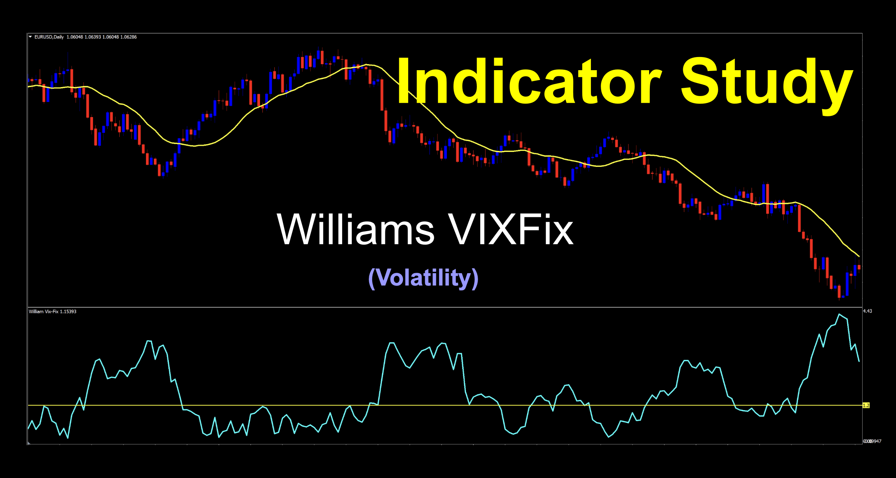

## Table of Contents

## What is the Williams VIX Fix Indicator?

The Williams VIX Fix Indicator is a tool used in trading to measure the volatility of a market. It was created by Larry Williams, a well-known trader. The indicator helps traders see how much prices are changing over a certain time. It's like a special thermometer for the market's ups and downs. When the VIX Fix shows high numbers, it means the market is very volatile, and when it shows low numbers, the market is more stable.

Traders use the Williams VIX Fix to make decisions about buying or selling. If the indicator shows high volatility, a trader might think it's a good time to sell because the market could be risky. On the other hand, if the indicator shows low volatility, a trader might see it as a good time to buy because the market seems calm. The VIX Fix helps traders understand the market's mood and plan their moves accordingly.

## Who developed the Williams VIX Fix Indicator?

The Williams VIX Fix Indicator was developed by Larry Williams. He is a famous trader who has been working in the markets for a long time. Larry wanted to create a tool that could help other traders understand how much the market was moving around. He called it the VIX Fix because it's like fixing or figuring out the market's volatility, which is what the VIX (Volatility Index) measures.

The VIX Fix Indicator is useful because it shows traders when the market is very jumpy or very calm. This helps them decide when to buy or sell. If the market is very jumpy, traders might want to be careful and maybe sell. If the market is calm, they might feel more confident to buy. Larry Williams made this indicator to give traders a clearer picture of what's happening in the market.

## How does the Williams VIX Fix Indicator work?

The Williams VIX Fix Indicator works by measuring how much the price of something is moving up and down over time. It uses a special math formula to figure this out. The indicator looks at the highest and lowest prices over a certain number of days, usually 14 days. It then calculates how big the swings in price are. If the swings are big, the indicator shows a high number, which means the market is very volatile. If the swings are small, the indicator shows a low number, which means the market is calm.

Traders use the Williams VIX Fix to help them make decisions about buying or selling. When the indicator shows high numbers, it tells traders that the market is moving a lot, and it might be a good time to sell because things could get risky. On the other hand, when the indicator shows low numbers, it tells traders that the market is not moving much, and it might be a good time to buy because things seem more stable. By watching the VIX Fix, traders can get a better sense of when to act in the market.

## What is the formula used to calculate the Williams VIX Fix?

The Williams VIX Fix uses a special math formula to measure how much prices are moving up and down. It starts by looking at the highest and lowest prices over a certain number of days, usually 14 days. The formula then calculates the difference between these highs and lows and turns it into a number that shows how big the price swings are. This number is called the True Range. The formula then takes the highest True Range over the last 14 days and multiplies it by a number to make the final VIX Fix value. This helps traders see if the market is moving a lot or just a little.

The exact formula for the Williams VIX Fix involves a few steps. First, you find the True Range for each day, which is the biggest difference between the day's high and low prices. Then, you find the highest True Range over the last 14 days. After that, you multiply this highest True Range by 1.06, and then by 100 to get the VIX Fix value. So, if the highest True Range over the last 14 days is 2, the VIX Fix would be 2 * 1.06 * 100 = 212. This number tells traders how much the market is moving, helping them decide when to buy or sell.

## What are the key components of the Williams VIX Fix Indicator?

The Williams VIX Fix Indicator has a few important parts that help it work. The first part is the True Range, which is the biggest difference between the high and low prices of a day. The indicator looks at the True Range over a certain number of days, usually 14 days, to see how much the prices are moving. It finds the highest True Range during this time and uses it to figure out how volatile the market is.

The second part of the Williams VIX Fix is the calculation that turns the highest True Range into a number that traders can use. The formula multiplies the highest True Range by 1.06 and then by 100 to get the final VIX Fix value. This number shows how much the market is moving, with higher numbers meaning the market is more volatile and lower numbers meaning it's more stable. Traders use this number to decide when to buy or sell, depending on how much risk they want to take.

## How can the Williams VIX Fix Indicator be used in trading?

The Williams VIX Fix Indicator can be a helpful tool for traders who want to understand how much the market is moving. By looking at the VIX Fix, traders can see if the market is very volatile or if it's calm. When the VIX Fix shows a high number, it means the market is moving a lot, and this might be a good time to sell because things could get risky. On the other hand, when the VIX Fix shows a low number, it means the market is not moving much, and this might be a good time to buy because things seem more stable. Traders use this information to make smarter decisions about when to buy or sell.

Traders also use the Williams VIX Fix to spot good times to trade. For example, if the VIX Fix goes from a low number to a high number quickly, it might mean that the market is about to change a lot. This can be a signal for traders to get ready to make a move. By watching the VIX Fix over time, traders can learn the market's patterns and use this knowledge to plan their trades better. It's like having a special tool that helps them see the market's ups and downs more clearly.

## What are the typical settings for the Williams VIX Fix Indicator?

The typical settings for the Williams VIX Fix Indicator use a time frame of 14 days to calculate the True Range. This means the indicator looks at the highest and lowest prices over the last 14 days to figure out how much the market is moving. Traders can change this setting if they want to look at a shorter or longer time frame, but 14 days is the most common.

Another setting is the multiplier used in the formula. The standard multiplier is 1.06, which is multiplied by the highest True Range and then by 100 to get the VIX Fix value. This multiplier helps make the numbers easier to read and understand. Some traders might tweak this number, but 1.06 works well for most people.

## How does the Williams VIX Fix Indicator differ from the traditional VIX?

The Williams VIX Fix Indicator and the traditional VIX, or Volatility Index, both measure how much the market is moving, but they do it in different ways. The traditional VIX is calculated using the prices of options on the S&P 500 index. It shows how much people expect the market to move in the next 30 days. The Williams VIX Fix, on the other hand, looks at the highest and lowest prices over a certain number of days, usually 14 days, to see how much the market has moved recently. This means the Williams VIX Fix can be used for any market or stock, not just the S&P 500.

Another big difference is how often the two indicators are updated. The traditional VIX is updated every 15 seconds during trading hours, so it's very up-to-date. The Williams VIX Fix is usually updated at the end of each trading day, so it gives a summary of the day's volatility. Traders use the Williams VIX Fix to see if the market is very jumpy or calm, and they might use it to decide when to buy or sell. The traditional VIX is often used to understand how nervous or calm investors are about the future of the market.

## What are the common strategies involving the Williams VIX Fix Indicator?

One common strategy using the Williams VIX Fix Indicator is to buy when the market is calm and sell when it gets jumpy. Traders watch the VIX Fix numbers. When the numbers are low, it means the market isn't moving much, so it might be a good time to buy. When the numbers go up and show the market is moving a lot, it might be a good time to sell because things could get risky. This strategy helps traders catch the market when it's calm and get out when it starts to get wild.

Another strategy is to look for big changes in the VIX Fix numbers. If the VIX Fix goes from a low number to a high number quickly, it might mean the market is about to change a lot. Traders use this as a signal to get ready to make a move. They might buy or sell depending on what they think will happen next. By watching these big changes, traders can try to guess when the market will move and plan their trades around these guesses.

Some traders also use the Williams VIX Fix to help them set stop-loss orders. A stop-loss order is like a safety net that tells the computer to sell a stock if it drops to a certain price. By looking at the VIX Fix, traders can see how much the market is moving and set their stop-loss orders at the right level. If the VIX Fix shows the market is very jumpy, they might set the stop-loss closer to the current price to protect their money. If the VIX Fix shows the market is calm, they might set it further away because the market is less likely to drop suddenly.

## How can the Williams VIX Fix Indicator be combined with other technical indicators?

Traders often use the Williams VIX Fix Indicator together with other tools to make better decisions. One popular way is to combine it with the Moving Average Convergence Divergence (MACD) indicator. The VIX Fix shows how much the market is moving, and the MACD helps traders see the direction of the market's trend. When the VIX Fix is low and the MACD shows a strong upward trend, it might be a good time to buy because the market is calm and moving up. If the VIX Fix is high and the MACD shows a downward trend, it might be a good time to sell because the market is jumpy and moving down. By using both indicators together, traders can get a fuller picture of what's happening in the market.

Another common combination is using the Williams VIX Fix with the Relative Strength Index (RSI). The RSI helps traders see if a stock is overbought or oversold. When the VIX Fix is high and the RSI is over 70, it might mean the market is very volatile and overbought, which could be a good time to sell. On the other hand, if the VIX Fix is low and the RSI is below 30, it might mean the market is calm and oversold, which could be a good time to buy. By looking at both the VIX Fix and the RSI, traders can find the best times to enter or exit the market based on both volatility and price strength.

## What are the limitations and potential pitfalls of using the Williams VIX Fix Indicator?

The Williams VIX Fix Indicator can be a helpful tool, but it has some limitations. One big problem is that it looks at the past, not the future. It tells you how much the market has moved over the last 14 days, but it can't predict what will happen next. This means you might see the market is calm now, but it could get wild very quickly. Also, the VIX Fix might give you false signals. Sometimes, it might show the market is very jumpy when it's not, or it might say the market is calm when it's about to get crazy. This can trick you into making the wrong trading decisions.

Another potential pitfall is that the Williams VIX Fix Indicator works best when used with other tools. If you only use the VIX Fix, you might miss important information about the market's direction or strength. For example, the market might be very volatile, but if it's moving in a good direction, you might not want to sell. Also, the VIX Fix can be affected by big news or events that make the market move a lot. If there's a big surprise, the VIX Fix might not be able to keep up with the sudden changes. So, it's important to use the VIX Fix along with other indicators and to always keep an eye on what's happening in the world.

## How can one optimize the use of the Williams VIX Fix Indicator for different market conditions?

To optimize the use of the Williams VIX Fix Indicator for different market conditions, traders should first understand that the indicator measures how much the market has moved recently. In calm markets, where the VIX Fix shows low numbers, traders can use it as a signal to buy, but they should also look at other indicators like the MACD to see if the market is moving up. If the market is very jumpy and the VIX Fix shows high numbers, it might be a good time to sell. However, traders should also check the RSI to see if the market is overbought, which could mean it's a good time to sell even if the VIX Fix isn't very high.

Traders can also adjust the settings of the Williams VIX Fix to fit different market conditions. For example, in a fast-moving market, using a shorter time frame like 7 days instead of 14 days can help catch quick changes in volatility. In a slower market, sticking with the usual 14 days or even using a longer period like 21 days might be better to see bigger trends. It's also important to keep an eye on big news or events that can make the market move a lot. By combining the VIX Fix with other tools and adjusting its settings, traders can make better decisions no matter what the market is doing.

## What is the VIX and how can it be understood?

The VIX, known colloquially as the "fear index," is a crucial metric for assessing market volatility and investor sentiment. It is derived from the implied volatility of options on the S&P 500 index, serving as a proxy for the expected volatility in the market over the next 30 days. Introduced by the Chicago Board Options Exchange (CBOE) in 1993, the VIX has become an integral part of financial analysis and trading strategies.

Implied volatility is a forward-looking measure that reflects the market's expectations of future volatility. It is calculated using the prices of options; because option prices are influenced by supply and demand dynamics, they inherently incorporate the consensus view of future market fluctuations. High option prices generally indicate expectations of increased volatility and vice versa.

The VIX itself is computed using a wide range of S&P 500 options, spanning different strike prices and expiration dates. These options are used to generate a weighted average of implied volatilities, primarily focusing on at-the-money options, which are options with strike prices close to the current index level. The calculation uses the forward price variance of the S&P 500 to determine the expected 30-day volatility. Mathematically, the VIX is expressed as:

$$
\text{VIX} = 100 \times \sqrt{\frac{2}{T} \sum_{i} \frac{\Delta K_i}{K_i^2} e^{RT} Q(K_i)}
$$

where $T$ is the time to expiration, $\Delta K_i$ is the interval between strike prices, $K_i$ are the strike prices, $R$ is the risk-free interest rate, and $Q(K_i)$ represents the mid-quote of the bid-ask prices of the options.

Typically, a high VIX reading suggests heightened uncertainty or fear among investors, often associated with turbulent market conditions or anticipated events that could disrupt the market. Conversely, a low VIX value implies a sense of complacency or stability within the market. Traders and analysts monitor the VIX closely, using it as a barometer for risk and to inform their trading decisions.

Because it provides a quantifiable measure of market expectations, the VIX is often used in hedging strategies, [volatility](/wiki/volatility-trading-strategies) forecasting, and as an input for various [algorithmic trading](/wiki/algorithmic-trading) models. Its influence extends beyond the S&P 500 itself, as it represents a model that can be adapted to other indices and asset classes, where analogous measures of implied volatility can be beneficial for gauging sentiment and potential market movements.

## What is the Williams Vix Fix?

Larry Williams developed the Williams Vix Fix (WVF) in 2007 as a synthetic alternative to the CBOE Volatility Index (VIX). This innovative indicator serves as a tool for evaluating market volatility, offering traders a means to assess potential market movements in areas beyond major indices like the S&P 500.

The primary objective of the Williams Vix Fix is to mirror the insights provided by the traditional VIX, capturing the essence of market volatility over a specified period. Unlike the VIX, which derives its values from the implied volatility of options, the WVF is constructed by analyzing historical price data directly from the asset itself. This characteristic enables its application across a broader range of markets and securities.

To calculate the Williams Vix Fix, the indicator focuses on the closing prices of the asset over a defined duration, typically a 22-day period. The formula begins by identifying the highest and lowest closing prices within this timeframe. The computation can be represented as:

$$
\text{WVF} = \frac{\text{High of the Highest Close over } n - \text{Current Close}}{\text{High of the Highest Close over } n} \times 100
$$

Where $n$ is often set to 22 days. This calculation results in a percentage, reflecting how much the current close is from the highest close over the given period.

By capturing the relative distance of current stock prices from their recent highs, the Williams Vix Fix acts as a proxy for volatility, demonstrating potential shifts in market trends. This makes it a versatile tool for traders attempting to navigate markets that do not have a dedicated VIX metric.

## References & Further Reading

[1]: Williams, L. R. (2007). ["Long-Term Secrets to Short-Term Trading."](https://www.amazon.com/Long-Term-Secrets-Short-Term-Trading-Williams/dp/0470915730) Wiley.

[2]: CBOE (n.d.). ["VIX White Paper."](https://cdn.cboe.com/api/global/us_indices/governance/Volatility_Index_Methodology_Cboe_Volatility_Index.pdf)

[3]: Bollinger, J. (2002). ["Bollinger on Bollinger Bands."](https://www.amazon.com/Bollinger-Bands-John/dp/0071373683) McGraw-Hill.

[4]: Hull, J. C. (2018). ["Options, Futures, and Other Derivatives."](https://www.pearson.com/nl/en_NL/higher-education/subject-catalogue/finance/Options-Futures-and-Other-Derivatives-Hull.html) Pearson.

[5]: Chan, E. P. (2008). ["Quantitative Trading: How to Build Your Own Algorithmic Trading Business."](https://github.com/ftvision/quant_trading_echan_book) Wiley.