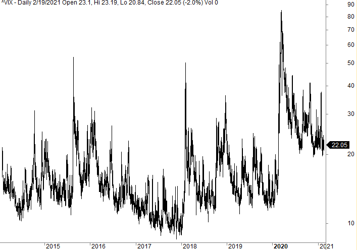

Algorithmic trading has increasingly become a prominent aspect of financial markets, driven by advances in computing technology and the development of sophisticated tools and indicators. Among these tools, the Williams Vix Fix stands out as a popular choice for traders looking to assess market volatility across various asset classes. Created as a synthetic counterpart to the Chicago Board Options Exchange's Volatility Index (VIX), the Williams Vix Fix provides insights that can be applied beyond major indices like the S&P 500.

Larry Williams developed the Williams Vix Fix in 2007 to address the need for a volatility measure applicable to instruments without a dedicated VIX metric. By emulating the functionality of the VIX, the Williams Vix Fix enables traders to estimate volatility over a specific time frame, thereby assisting in the formulation of trading strategies that respond to market dynamics.



Understanding its role in algorithmic trading necessitates a discussion of its underlying mechanics, its comparative analysis with the actual VIX, and its practical applications. This investigation will reveal how the Williams Vix Fix can serve as a vital tool in developing trading algorithms, help in determining entry and exit points based on volatility signals, and complement other technical indicators for optimal strategy formulation.

## Table of Contents

## Understanding the VIX

The VIX, known colloquially as the "fear index," is a crucial metric for assessing market volatility and investor sentiment. It is derived from the implied volatility of options on the S&P 500 index, serving as a proxy for the expected volatility in the market over the next 30 days. Introduced by the Chicago Board Options Exchange (CBOE) in 1993, the VIX has become an integral part of financial analysis and trading strategies.

Implied volatility is a forward-looking measure that reflects the market's expectations of future volatility. It is calculated using the prices of options; because option prices are influenced by supply and demand dynamics, they inherently incorporate the consensus view of future market fluctuations. High option prices generally indicate expectations of increased volatility and vice versa.

The VIX itself is computed using a wide range of S&P 500 options, spanning different strike prices and expiration dates. These options are used to generate a weighted average of implied volatilities, primarily focusing on at-the-money options, which are options with strike prices close to the current index level. The calculation uses the forward price variance of the S&P 500 to determine the expected 30-day volatility. Mathematically, the VIX is expressed as:

$$
\text{VIX} = 100 \times \sqrt{\frac{2}{T} \sum_{i} \frac{\Delta K_i}{K_i^2} e^{RT} Q(K_i)}
$$

where $T$ is the time to expiration, $\Delta K_i$ is the interval between strike prices, $K_i$ are the strike prices, $R$ is the risk-free interest rate, and $Q(K_i)$ represents the mid-quote of the bid-ask prices of the options.

Typically, a high VIX reading suggests heightened uncertainty or fear among investors, often associated with turbulent market conditions or anticipated events that could disrupt the market. Conversely, a low VIX value implies a sense of complacency or stability within the market. Traders and analysts monitor the VIX closely, using it as a barometer for risk and to inform their trading decisions.

Because it provides a quantifiable measure of market expectations, the VIX is often used in hedging strategies, [volatility](/wiki/volatility-trading-strategies) forecasting, and as an input for various [algorithmic trading](/wiki/algorithmic-trading) models. Its influence extends beyond the S&P 500 itself, as it represents a model that can be adapted to other indices and asset classes, where analogous measures of implied volatility can be beneficial for gauging sentiment and potential market movements.

## What is the Williams Vix Fix?

Larry Williams developed the Williams Vix Fix (WVF) in 2007 as a synthetic alternative to the CBOE Volatility Index (VIX). This innovative indicator serves as a tool for evaluating market volatility, offering traders a means to assess potential market movements in areas beyond major indices like the S&P 500.

The primary objective of the Williams Vix Fix is to mirror the insights provided by the traditional VIX, capturing the essence of market volatility over a specified period. Unlike the VIX, which derives its values from the implied volatility of options, the WVF is constructed by analyzing historical price data directly from the asset itself. This characteristic enables its application across a broader range of markets and securities.

To calculate the Williams Vix Fix, the indicator focuses on the closing prices of the asset over a defined duration, typically a 22-day period. The formula begins by identifying the highest and lowest closing prices within this timeframe. The computation can be represented as:

$$
\text{WVF} = \frac{\text{High of the Highest Close over } n - \text{Current Close}}{\text{High of the Highest Close over } n} \times 100
$$

Where $n$ is often set to 22 days. This calculation results in a percentage, reflecting how much the current close is from the highest close over the given period.

By capturing the relative distance of current stock prices from their recent highs, the Williams Vix Fix acts as a proxy for volatility, demonstrating potential shifts in market trends. This makes it a versatile tool for traders attempting to navigate markets that do not have a dedicated VIX metric.

## Comparing Williams Vix Fix with Real VIX

The Williams Vix Fix operates as a synthetic substitute to the real VIX, yet its derivation distinguishes it significantly. Unlike the VIX, which is calculated using the implied volatilities from S&P 500 index options, the Williams Vix Fix is based on price movements and can be applied to a broader spectrum of securities, not limited to major indices. The real VIX is engineered from the implied volatility of a wide array of options, serving as a predictive measure of market volatility. Conversely, the Williams Vix Fix employs the highest close within a specific period as an indicator of market tops and volatility. 

One of the advantages of the Williams Vix Fix is its applicability in diverse markets where traditional VIX measures might not be available. For instance, traders looking to analyze volatility in a commodity market or international securities can utilize the Williams Vix Fix to gain a semblance of potential volatility movements. This adaptability makes it a versatile tool in the arsenal of traders focusing on markets other than the indices for which the VIX is typically calculated.

Empirical observations often reveal that the Williams Vix Fix can demonstrate patterns akin to those of the VIX, both in terms of volatility spikes and timing. The correlation between the indicators can be visualized through chart comparisons, which frequently show concurrent movement in their trajectories. This parallel suggests that while the Williams Vix Fix might not entirely replicate the VIX, it does provide a meaningful approximation of volatility. Therefore, in markets that do not have their own dedicated volatility indices, the Williams Vix Fix can serve as a surrogate measure.

Such similarities in pattern and magnitude between the Williams Vix Fix and the actual VIX indicate that the synthetic index can offer substantial insights into market volatility. Consequently, traders can leverage the Williams Vix Fix to facilitate informed decision-making in environments where traditional VIX measures may not apply or are insufficiently comprehensive. This makes the Williams Vix Fix a practical choice for assessing volatility across diverse asset classes and evolving markets.

## Applying Williams Vix Fix in Algorithmic Trading

The Williams Vix Fix (WVF) is a versatile tool for algorithmic trading, providing valuable insights for identifying market entry and [exit](/wiki/exit-strategy) points by interpreting volatility levels. By incorporating the WVF into trading algorithms, traders can better gauge shifts in market behavior and hence make more informed decisions.

One popular strategy is the integration of the WVF with Bollinger Bands, a method that has demonstrated effectiveness in trading indices such as the S&P 500. Bollinger Bands consist of a middle band (a simple moving average) and two outer bands, which are typically set two standard deviations away from the middle band. When combined with the WVF, traders can set conditions where a trade is triggered when the WVF signals a potential bounce from a recent volatility low and the price simultaneously touches or breaches the lower Bollinger Band. This setup can suggest a potential rebound, providing a timely opportunity for entry.

Another innovative approach involves using the PercentRank function alongside the WVF. PercentRank assists in quantifying the position of a particular value within a historical data set. By applying this method, traders can define overbought and oversold conditions more precisely. The WVF is calculated over a historical period, and PercentRank assigns a percentile score to current volatility levels. If the WVF value exceeds a particular percentile threshold, it may signal an overbought condition, while falling below another threshold could indicate an oversold condition. This approach ensures that entry points are not only based on a single volatility perspective but are contextualized within historical trends.

Here is a basic Python code snippet to illustrate how WVF might be used with Bollinger Bands and PercentRank:

```python
import pandas as pd
import numpy as np

def williams_vix_fix(close_prices):
    highest_high = close_prices.rolling(window=22).max()
    lowest_close = close_prices.rolling(window=22).min()
    wvf = (highest_high - close_prices) / (highest_high - lowest_close) * 100
    return wvf

def bollinger_bands(close_prices, window=20, num_std_dev=2):
    rolling_mean = close_prices.rolling(window).mean()
    rolling_std = close_prices.rolling(window).std()
    upper_band = rolling_mean + (rolling_std * num_std_dev)
    lower_band = rolling_mean - (rolling_std * num_std_dev)
    return rolling_mean, upper_band, lower_band

def percent_rank(series, window):
    percent_rank_series = series.rolling(window).apply(lambda x: pd.Series(x).rank(pct=True).iloc[-1])
    return percent_rank_series

# Example usage
close_prices = pd.Series([/* closing prices data */])

wvf = williams_vix_fix(close_prices)
rolling_mean, upper_band, lower_band = bollinger_bands(close_prices)
prank_wvf = percent_rank(wvf, window=100)

# Conditions for trading logic
buy_signal = (wvf < 20) & (close_prices < lower_band)
sell_signal = (prank_wvf > 80)  # Overbought condition based on historical percentile rank
```

Incorporating the Williams Vix Fix with these strategies facilitates a multi-layered analysis, balancing market sentiment with statistical thresholds. Traders employing these methods within algorithmic frameworks stand to enhance the precision of their market timing and overall trading efficacy.

## Strategy Examples

A Bollinger Bands strategy using the Williams Vix Fix focuses on exploiting market volatility for profitable trading. Bollinger Bands, a technical indicator developed by John Bollinger, consists of a middle band (a simple moving average) accompanied by an upper and a lower band, each calculated at a specified number of standard deviations from the middle band. In this strategy, conditions for entering trades are set based on these bands.

To implement this strategy, traders look for scenarios where the Williams Vix Fix indicates low volatility, suggesting a potential reversal or significant price movement. When the price approaches or crosses the lower Bollinger Band and the Williams Vix Fix signals an impending increase in volatility, it can indicate a potential buying opportunity. The logic is that volatility tends to revert to a mean, often resulting in price rebounds from lower bands.

Here's a basic Python code snippet to execute this strategy using historical price data:

```python
import pandas as pd
import numpy as np

def calculate_bollinger_bands(data, window=20, std_dev=2):
    data['SMA'] = data['Close'].rolling(window=window).mean()
    data['Upper Band'] = data['SMA'] + (data['Close'].rolling(window=window).std() * std_dev)
    data['Lower Band'] = data['SMA'] - (data['Close'].rolling(window=window).std() * std_dev)
    return data

def williams_vix_fix(data, period=22):
    data['Highest'] = data['Close'].rolling(window=period).max()
    data['Williams Vix Fix'] = (data['Highest'] - data['Low']) / data['Highest']
    return data

# Load your data here
data = pd.DataFrame({
    # Example with random data
    'Close': np.random.random(100),
    'Low': np.random.random(100)
})

# Calculate indicators
data = calculate_bollinger_bands(data)
data = williams_vix_fix(data)

# Example of applying the strategy
data['Buy Signal'] = np.where(
    (data['Close'] < data['Lower Band']) & (data['Williams Vix Fix'] < 0.2),
    1, 0
)
```

Another approach involves leveraging the PercentRank function alongside the Williams Vix Fix to filter volatility spikes and make informed trading decisions. The PercentRank calculates the relative standing of a value within a dataset, aligning with the concept of overbought and oversold conditions. Traders can open positions when the Williams Vix Fix reaches an upper percentile threshold, indicating unusual volatility levels that may soon revert.

Through these strategies, traders can align their trades with volatility signals, potentially enhancing the profitability and timing of their entries and exits in various markets. Both strategies require thorough [backtesting](/wiki/backtesting) to ensure effectiveness under specific market conditions.

## Conclusion: Effectiveness and Limitations

The Williams Vix Fix is a versatile indicator that serves as a valuable tool for traders, particularly in markets where traditional VIX metrics are absent. Its utility in these non-standard markets stems from its design as a synthetic measure of market volatility. By employing the Williams Vix Fix, traders gain a nuanced perspective on market dynamics, even when traditional VIX measures are not applicable. 

Though it is a synthetic measure, the Williams Vix Fix provides substantial insights into market behavior, especially due to its mean-reverting characteristics. This characteristic is beneficial because it implies that extreme values are likely to return to a mean, potentially offering traders opportunities to anticipate reversals in market trends. This mean-reversion can be detected through the indicator's tendency to spike during periods of high volatility and then gradually decline as conditions stabilize. 

For traders considering the Williams Vix Fix as a component of their strategy, it is crucial to underscore the importance of backtesting. Backtesting involves running a trading strategy on historical data to evaluate its potential performance. This process helps in identifying the strategy's strengths and weaknesses, ultimately assisting in optimizing the approach. For the Williams Vix Fix, backtesting is instrumental in understanding how well the indicator predicts volatility in various market conditions and in different asset classes.

Here's a simple Python code snippet to illustrate how one might backtest a strategy incorporating the Williams Vix Fix:

```python
import pandas as pd
import numpy as np

# Sample function to calculate Williams Vix Fix
def calculate_williams_vix_fix(prices):
    highest_close = prices.rolling(window=22).max()
    williams_vix_fix = (highest_close - prices) / highest_close
    return williams_vix_fix

# Sample backtest function
def backtest_vix_fix_strategy(prices, signal_threshold):
    vix_fix = calculate_williams_vix_fix(prices)
    signals = (vix_fix > signal_threshold).astype(int)

    # Calculate returns
    returns = prices.pct_change().shift(-1) * signals
    cumulative_returns = (1 + returns).cumprod() - 1
    return cumulative_returns

# Simulated price data
prices = pd.Series(np.random.normal(loc=100, scale=1, size=100))

# Running the backtest
signal_threshold = 0.2
backtest_results = backtest_vix_fix_strategy(prices, signal_threshold)
print(backtest_results)
```

In conclusion, while the Williams Vix Fix is a powerful tool, traders must adopt a cautious approach by thoroughly testing their strategies using historical data to manage the inherent risks in market trading. This ensures that any strategies utilizing the Williams Vix Fix are not only effective but also robust to market changes over time.

## FAQ

**How does the Williams Vix Fix differ from the real VIX in terms of calculation?**

The Williams Vix Fix is calculated using historical price data, while the real VIX is derived from the implied volatility of S&P 500 options. Specifically, the Williams Vix Fix involves comparing the current close price to the highest close price over a specified period, typically 22 days, to detect volatility spikes. The VIX, conversely, represents the market's expectations of 30-day forward-looking volatility based on option prices. This fundamental difference allows the Williams Vix Fix to be applied to any asset class with available price history but does not capture market sentiment like the VIX.

**Is the Williams Vix Fix only suitable for certain types of markets or asset classes?**

The Williams Vix Fix is versatile and can be applied to a wide range of markets and asset classes beyond just major indices like the S&P 500. Since it relies solely on price data, it is suitable for use in equities, commodities, [forex](/wiki/forex-system), and even cryptocurrencies. However, its effectiveness can vary depending on the market's characteristics and volatility patterns, as it is not tied to the implied volatility reflected in options data.

**Can it effectively replace the VIX in all trading scenarios?**

While the Williams Vix Fix offers a synthetic approach to measuring volatility, it does not serve as a direct replacement for the VIX in scenarios where implied volatility insights are critical. The VIX provides a measure of trader sentiment and expectations, which are not captured by the Williams Vix Fix. Therefore, in trading scenarios where market sentiment plays a significant role, the VIX would still be preferable. However, in markets lacking a dedicated volatility index, the Williams Vix Fix is a practical alternative.

**Which algorithmic strategies complement the use of the Williams Vix Fix for optimal results?**

The Williams Vix Fix can be integrated into various algorithmic trading strategies to enhance volatility detection and decision-making. A popular method is to combine it with Bollinger Bands to identify potential buy or sell signals when the fix suggests significant volatility increases. Implementing a PercentRank strategy can also be effective, where the Williams Vix Fix helps filter for historical volatility spikes. Both strategies can be coded in Python, using libraries like `pandas` to perform calculations and `matplotlib` for visualization, improving the precision and timing of market entries and exits.

## References & Further Reading

[1]: Williams, L. R. (2007). ["Long-Term Secrets to Short-Term Trading."](https://www.amazon.com/Long-Term-Secrets-Short-Term-Trading-Williams/dp/0470915730) Wiley.

[2]: CBOE (n.d.). ["VIX White Paper."](https://cdn.cboe.com/api/global/us_indices/governance/Volatility_Index_Methodology_Cboe_Volatility_Index.pdf)

[3]: Bollinger, J. (2002). ["Bollinger on Bollinger Bands."](https://www.amazon.com/Bollinger-Bands-John/dp/0071373683) McGraw-Hill.

[4]: Hull, J. C. (2018). ["Options, Futures, and Other Derivatives."](https://www.pearson.com/nl/en_NL/higher-education/subject-catalogue/finance/Options-Futures-and-Other-Derivatives-Hull.html) Pearson.

[5]: Chan, E. P. (2008). ["Quantitative Trading: How to Build Your Own Algorithmic Trading Business."](https://github.com/ftvision/quant_trading_echan_book) Wiley.