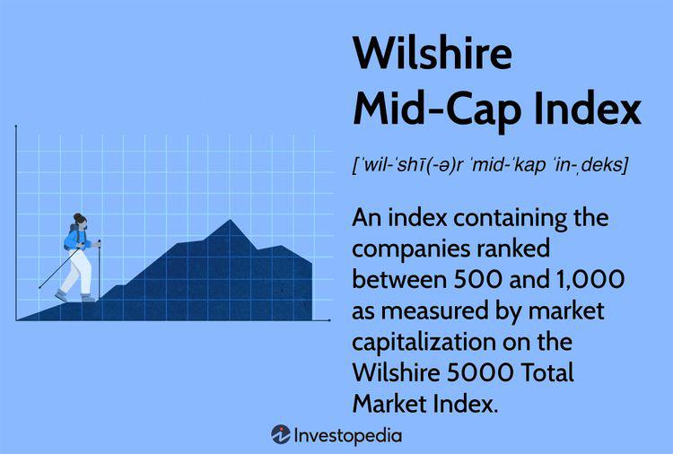

## Table of Contents

## What is the Wilshire Mid-Cap Index?

The Wilshire Mid-Cap Index is a stock market index that tracks the performance of mid-sized companies in the United States. It is made up of companies that are not as big as the ones in the large-cap index but are bigger than those in the small-cap index. This index helps investors see how mid-sized companies are doing overall.

The index is part of the Wilshire 5000 Total Market Index, which includes almost all publicly traded companies in the U.S. The Wilshire Mid-Cap Index is important because it gives investors a way to focus on mid-sized companies without getting mixed up with the performance of very large or very small companies. This can be useful for people who want to invest in companies that have a good balance of growth potential and stability.

## Who created the Wilshire Mid-Cap Index?

The Wilshire Mid-Cap Index was created by Wilshire Associates, a company that started in 1972. Wilshire Associates is known for making different kinds of stock market indexes. They made the Wilshire Mid-Cap Index to help people track how mid-sized companies in the U.S. are doing.

The index is part of a bigger group called the Wilshire 5000 Total Market Index. This bigger group includes almost all the companies that people can buy stocks from in the U.S. By making the Mid-Cap Index, Wilshire Associates gave investors a way to focus just on mid-sized companies, which can be a good choice for people looking for a balance between growth and stability in their investments.

## What types of companies are included in the Wilshire Mid-Cap Index?

The Wilshire Mid-Cap Index includes companies that are considered mid-sized. These are businesses that are bigger than small companies but not as big as the really large ones. The index looks at how these mid-sized companies are doing in the stock market. It helps investors see if these companies are growing or not.

To be in the Wilshire Mid-Cap Index, a company needs to be part of the Wilshire 5000 Total Market Index first. The Wilshire 5000 includes almost all the companies you can buy stocks from in the U.S. From this big group, the mid-cap index picks out the companies that fit in the middle size range. This way, the index gives a clear picture of how mid-sized companies are doing without mixing them up with very big or very small companies.

## How is the performance of the Wilshire Mid-Cap Index measured?

The performance of the Wilshire Mid-Cap Index is measured by looking at how the stocks of the mid-sized companies in the index are doing. Each company's stock price is tracked over time, and the index calculates an average of these changes to see if the group of mid-sized companies is going up or down in value. This average is called the index's value, and it goes up when most of the companies' stock prices go up, and it goes down when most of them go down.

The index is updated every day to show the latest changes in the stock prices of the companies it includes. This daily update helps investors see how mid-sized companies are performing right now. By comparing the index's value over time, investors can tell if mid-sized companies are doing better or worse than before. This information is useful for people who want to invest in these companies and need to know how they are doing overall.

## What is the significance of the Wilshire Mid-Cap Index in the financial market?

The Wilshire Mid-Cap Index is important in the financial market because it helps investors understand how mid-sized companies in the U.S. are doing. These companies are not as big as the giants but are bigger than small businesses. By focusing on this middle group, the index gives a clear picture of their performance without mixing it up with the very big or very small companies. This can be useful for investors who want to put their money into companies that have a good balance of growth potential and stability.

The index is also part of the bigger Wilshire 5000 Total Market Index, which includes almost all publicly traded companies in the U.S. By being a part of this larger group, the Wilshire Mid-Cap Index helps investors see how mid-sized companies fit into the overall market. This can be helpful for people making investment decisions, as it allows them to compare the performance of mid-sized companies against the entire market or other size groups. Overall, the Wilshire Mid-Cap Index plays a key role in helping investors make informed choices about where to invest their money.

## How does the Wilshire Mid-Cap Index compare to other mid-cap indices?

The Wilshire Mid-Cap Index is one of several mid-cap indices that investors use to track the performance of mid-sized companies. Another well-known mid-cap index is the S&P MidCap 400, which includes 400 mid-sized companies based on market capitalization. While the Wilshire Mid-Cap Index is part of the broader Wilshire 5000 Total Market Index, the S&P MidCap 400 is part of the S&P family of indices. Both indices aim to represent the performance of mid-sized companies, but they might include different companies and use different methods to measure performance.

Another mid-cap index is the Russell Midcap Index, which includes around 800 mid-sized companies. Like the Wilshire Mid-Cap Index, the Russell Midcap Index is part of a larger family of indices, the Russell Indexes. The main difference is in the number of companies included and how they are selected. The Wilshire Mid-Cap Index focuses on a specific range of mid-sized companies within the Wilshire 5000, while the Russell Midcap Index uses a different set of criteria to define mid-sized companies. Each index provides a different view of the mid-cap market, and investors might choose one over the others based on their investment goals and the specific companies they want to track.

## What are the criteria for a company to be included in the Wilshire Mid-Cap Index?

To be included in the Wilshire Mid-Cap Index, a company first needs to be part of the Wilshire 5000 Total Market Index. The Wilshire 5000 includes almost all the companies that people can buy stocks from in the U.S. Once a company is in the Wilshire 5000, it can be considered for the Mid-Cap Index if it fits into the mid-sized range. This means the company is not as big as the ones in the large-cap index but bigger than the ones in the small-cap index.

The Wilshire Mid-Cap Index uses market capitalization to decide which companies are mid-sized. Market capitalization is just the total value of all the company's stocks. Companies that fall into the middle range of market capitalization get included in the Mid-Cap Index. This way, the index gives a clear picture of how mid-sized companies are doing without mixing them up with very big or very small companies.

## How often is the Wilshire Mid-Cap Index rebalanced?

The Wilshire Mid-Cap Index is rebalanced every quarter. This means that every three months, the companies in the index are checked to see if they still fit in the mid-sized range. If a company has grown too big or become too small, it might be moved to a different index or taken out completely. This rebalancing helps keep the index focused on mid-sized companies.

Rebalancing is important because it makes sure the index stays true to what it's supposed to represent. By updating the list of companies every quarter, the Wilshire Mid-Cap Index gives investors a reliable way to track how mid-sized companies are doing over time. This regular check helps keep the index useful for people making investment decisions.

## Can you explain the methodology behind the construction of the Wilshire Mid-Cap Index?

The Wilshire Mid-Cap Index is built by starting with the Wilshire 5000 Total Market Index, which includes almost all the companies you can buy stocks from in the U.S. From this big group, the Mid-Cap Index picks out the companies that are mid-sized. This means they are not as big as the ones in the large-cap index but bigger than the ones in the small-cap index. The index uses something called market capitalization to decide which companies are mid-sized. Market capitalization is just the total value of all the company's stocks. By focusing on this middle range, the index gives a clear picture of how these companies are doing.

The index is rebalanced every three months to make sure it stays focused on mid-sized companies. This means that every quarter, the companies in the index are checked to see if they still fit in the mid-sized range. If a company has grown too big or become too small, it might be moved to a different index or taken out completely. This regular check helps keep the index useful for people making investment decisions. By updating the list of companies, the Wilshire Mid-Cap Index gives investors a reliable way to track how mid-sized companies are doing over time.

## What are the historical performance trends of the Wilshire Mid-Cap Index?

The Wilshire Mid-Cap Index has shown a lot of ups and downs over the years, but overall, it has grown. If you look at a long time, like 10 or 20 years, the index usually goes up. This means that mid-sized companies in the U.S. have done well over time. But, there have been some big drops too, especially during times like the financial crisis in 2008 or the start of the COVID-19 pandemic in 2020. These drops show that mid-sized companies can be risky because they can go down a lot when the economy is not doing well.

In the shorter term, the Wilshire Mid-Cap Index can be more unpredictable. It might go up a lot one year and then go down the next. This is because mid-sized companies can grow quickly, but they can also be hit hard by problems in the economy. For example, the index did really well in the late 1990s during the tech boom, but then it fell a lot when the tech bubble burst in the early 2000s. So, while the index has grown over the long term, it can be a roller coaster ride in the short term.

## How can investors use the Wilshire Mid-Cap Index to guide their investment strategies?

Investors can use the Wilshire Mid-Cap Index to see how mid-sized companies in the U.S. are doing. By looking at the index, they can decide if they want to put their money into these companies. If the index is going up, it might be a good time to invest in mid-sized companies because they are doing well. If the index is going down, investors might want to wait or look at other types of investments. The index helps investors see the bigger picture of how these companies are doing without getting mixed up with very big or very small companies.

The Wilshire Mid-Cap Index can also be used to compare different types of investments. For example, an investor might look at how the mid-cap index is doing compared to the large-cap or small-cap indices. This can help them decide if mid-sized companies are a better choice than big or small companies right now. By keeping an eye on the index over time, investors can make smarter choices about when to buy or sell stocks in mid-sized companies. This way, they can try to get the best returns on their investments while understanding the risks involved.

## What are the potential risks and benefits of investing in funds that track the Wilshire Mid-Cap Index?

Investing in funds that track the Wilshire Mid-Cap Index can offer several benefits. One big benefit is that these funds give you a way to invest in a lot of mid-sized companies at once. This can help spread out your risk because you're not putting all your money into just one or two companies. Mid-sized companies can also grow a lot faster than big companies, so there's a chance for higher returns. Plus, these funds are easy to buy and sell, and they can be a good way to balance your investments between growth and stability.

However, there are also risks to consider. Mid-sized companies can be more affected by problems in the economy, so if things go bad, these funds might lose a lot of value. The Wilshire Mid-Cap Index can go up and down a lot, which means your investment could be a bit of a roller coaster. Also, because these funds are trying to match the performance of the index, you won't beat the market, you'll just go along with it. So, if the mid-cap part of the market does badly, your fund will too.

## What is the Wilshire Mid-Cap Index?

The Wilshire Mid-Cap Index is a financial benchmark that tracks the performance of mid-cap companies within the broader U.S. equity market. It is a part of the Wilshire Index family, which includes various indices designed to reflect different segments of the stock market. The Wilshire Mid-Cap Index is constructed by selecting a subset of companies from the Wilshire 5000 Total Market Index, an index that encompasses all publicly traded companies in the United States with readily available price data.

The Wilshire Mid-Cap Index is specifically designed to represent mid-cap stocks, which generally include companies with market capitalizations ranging from approximately $2 billion to $10 billion. These companies are considered to be in a transitional phase between small-cap, which emphasize growth potential, and large-cap companies known for stability. 

The construction of the Wilshire Mid-Cap Index involves several key features. It is a float-adjusted, market capitalization-weighted index. Float adjustment means that only the shares available to the public are considered when calculating the company's market capitalization. This adjustment is essential because it more accurately reflects the stock's [liquidity](/wiki/liquidity-risk-premium) and investability. Market capitalization weighting implies that a company’s influence on the index's performance is proportional to its market value. Thus, larger companies within the mid-cap range will have a more significant impact on the index's movements.

Mathematically, the index value $I$ at any given time can be represented as:

$$
I = \frac{\sum_{i=1}^{N} (P_i \times S_i \times F_i)}{D}
$$

where:
- $P_i$ is the price of stock $i$,
- $S_i$ is the number of shares for stock $i$,
- $F_i$ is the float adjustment factor for stock $i$,
- $D$ is the divisor, a figure ensured to maintain continuity of the index's value over time.

The Wilshire Mid-Cap Index serves as a critical benchmark for investors focusing on mid-cap companies, providing a gauge for the performance of such stocks relative to the broader market. Its performance is often compared to other indices like the S&P 400 MidCap Index, offering a complementary measure of mid-cap company performance. By serving as a representative sample of mid-cap stocks, the Wilshire Mid-Cap Index allows investors to diversify their portfolios and manage risk associated with investing in mid-sized companies.

## References & Further Reading

1. **Wilshire Associates** - To gain a foundational understanding of the Wilshire Mid-Cap Index and its role within the broader Wilshire 5000 Total Market Index, consider exploring the official resources provided by Wilshire Associates. Their website offers insights into index construction and methodology. Visit [Wilshire Associates](https://www.wilshire.com/indexes).

2. **Investopedia** - For a comprehensive explanation of mid-cap companies, market capitalization, and the differences between small-cap, mid-cap, and large-cap stocks, the Investopedia platform is invaluable. It offers clear, concise definitions and articles. See [Investopedia's Mid-Cap Definition](https://www.investopedia.com/terms/m/midcapstock.asp).

3. **"Algorithmic Trading and DMA: An Introduction to Direct Access Trading Strategies" by Barry Johnson** - This book provides an in-depth look at algorithmic trading techniques, including strategies like mean reversion and momentum. It's a must-read for those looking to understand the technical components of algorithmic trading.

4. **Bloomberg Businessweek** - To get insights on the latest trends and real-world applications of algorithmic trading in mid-cap investments, Bloomberg Businessweek publishes articles featuring case studies and market analyses. Access Bloomberg's article database for sector insights.

5. **Journal of Portfolio Management** - Academic papers and research studies published in the Journal of Portfolio Management can provide empirical data and case studies on the performance of mid-cap indices versus their small-cap and large-cap counterparts. Check university libraries or online databases for access.

6. **"The Little Book of Common Sense Investing" by John C. Bogle** - While not specific to mid-caps or algorithmic trading, this book provides a foundational perspective on index investing, which can be valuable when considering investments in mid-cap index funds or ETFs.

7. **Securities and Exchange Commission (SEC) - Investor Publications** - The SEC offers publications and resources that discuss market regulations affecting mid-cap stocks and cautionary advice for investors. These can be accessed via the [SEC's official website](https://www.sec.gov).

8. **Yahoo Finance** - For those interested in real-time data, historical performance metrics, and financial news regarding mid-cap stocks and ETFs, Yahoo Finance is a reliable resource. It allows investors to track various indices, including mid-cap focused ones. Visit [Yahoo Finance](https://finance.yahoo.com).

9. **Khan Academy** - For a more basic introduction or refresher on investment terminology and general market dynamics, consider Khan Academy's finance and capital markets section. It provides educational content that's accessible and easy to understand. Access their [finance courses](https://www.khanacademy.org/economics-finance-domain/core-finance).

These resources offer various perspectives and depths of information, catering to both novice and experienced investors interested in mid-cap investments and algorithmic trading.

