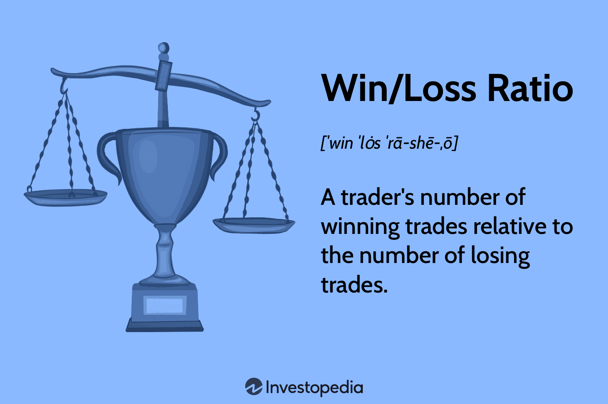

## Table of Contents

## What is a win/loss ratio in trading?

A win/loss ratio in trading is a simple way to see how well someone is doing in their trades. It's just the number of trades that make money divided by the number of trades that lose money. If someone wins 5 trades and loses 3, their win/loss ratio is 5/3 or about 1.67. This number helps traders understand if they are making more good trades than bad ones.

But, the win/loss ratio doesn't tell the whole story. It's important to also look at how much money is made or lost in each trade. A trader might have a high win/loss ratio but still lose money overall if their winning trades don't make enough to cover the losses from the losing trades. So, while the win/loss ratio is a useful tool, it should be used along with other measures to get a full picture of trading performance.

## How is the win/loss ratio calculated?

The win/loss ratio is calculated by dividing the number of winning trades by the number of losing trades. If you made 10 trades and 6 of them were winners and 4 were losers, you would divide 6 by 4. This gives you a win/loss ratio of 1.5. It's a simple way to see how often you are winning compared to losing.

This ratio is helpful because it gives you a quick look at your trading success. But remember, it doesn't tell you everything. You also need to think about how much money you made or lost in each trade. A high win/loss ratio is good, but if your winning trades don't make enough money to cover your losses, you might still end up losing money overall. So, it's important to use the win/loss ratio along with other measures to understand your trading performance better.

## Why is the win/loss ratio important for traders?

The win/loss ratio is important for traders because it helps them see how often they are winning compared to losing. If a trader has a high win/loss ratio, it means they are winning more often than they are losing. This can give them confidence in their trading strategy and help them decide if they should keep doing what they are doing or make changes.

But, the win/loss ratio is not the only thing traders should look at. It does not tell them how much money they are making or losing in each trade. A trader could have a high win/loss ratio but still lose money if their winning trades do not make enough to cover the losses from the losing trades. So, while the win/loss ratio is a useful tool, traders need to use it along with other measures to get a full picture of their trading performance.

## What is considered a good win/loss ratio in trading?

A good win/loss ratio in trading is often considered to be around 2:1 or higher. This means that for every trade that loses money, a trader has two trades that make money. Having a win/loss ratio of 2:1 or more shows that a trader is winning more often than losing, which can be a sign of a successful trading strategy.

But, the win/loss ratio is not the only thing that matters. Even with a good win/loss ratio, a trader can still lose money if the amount they make from winning trades is not enough to cover the losses from the losing trades. So, while a win/loss ratio of 2:1 or better is generally seen as good, traders need to look at other things like the size of their wins and losses to really understand if they are doing well.

## How does the win/loss ratio affect trading strategies?

The win/loss ratio can help traders decide if their trading strategy is working well. If a trader sees that their win/loss ratio is good, like 2:1 or better, it might mean their strategy is making them win more often than lose. This can give them confidence to keep using the same strategy. But if the win/loss ratio is low, it might be a sign that they need to change their strategy to win more trades.

However, the win/loss ratio is just one part of the story. A trader could have a good win/loss ratio but still lose money if their winning trades don't make enough to cover the losses. So, while a good win/loss ratio can make a trader feel good about their strategy, they also need to look at how much money they are making or losing in each trade. This helps them make sure their strategy is not just winning often, but also making them money overall.

## Can a high win/loss ratio guarantee profitability?

A high win/loss ratio does not guarantee profitability. This ratio just tells you how often you win compared to how often you lose. If you win more trades than you lose, your win/loss ratio will be high. But, this does not mean you are making money. You could win a lot of small trades but lose a few big ones, and end up losing money overall.

So, while a high win/loss ratio is good, it is not the only thing you should look at. You also need to think about how much money you make or lose in each trade. If your winning trades do not make enough to cover your losing trades, you could still lose money even with a high win/loss ratio. That's why it's important to look at all parts of your trading, not just the win/loss ratio, to see if you are really making money.

## How can traders improve their win/loss ratio?

Traders can improve their win/loss ratio by working on their trading strategy. This means they need to look at what they are doing and see if they can make better choices about when to buy and sell. They can use things like charts and other tools to help them make smarter decisions. If they find that they are losing more often in certain situations, they can try to avoid those situations or change how they handle them. By making small changes and learning from their mistakes, traders can start to win more often and improve their win/loss ratio.

Another way to improve the win/loss ratio is by managing risk better. This means not putting too much money into one trade and setting rules for when to get out of a trade if it starts to lose money. By doing this, traders can make sure that their losing trades do not hurt them too much. They can also try to make their winning trades bigger by letting them run longer when things are going well. By balancing the size of their wins and losses, traders can improve their overall win/loss ratio and do better in their trading.

## What are common mistakes that negatively impact the win/loss ratio?

One common mistake that can hurt a trader's win/loss ratio is not having a clear plan. Traders sometimes jump into trades without thinking about why they are doing it or what they hope to gain. They might follow the crowd or act on a hunch without doing their homework. This can lead to a lot of losing trades because they are not making smart choices based on facts and analysis. A good plan helps traders know when to buy and sell, and it can help them win more often.

Another mistake is not managing risk well. Traders might put too much money into one trade, hoping to make a big win, but this can lead to big losses if the trade goes the wrong way. They might also hold onto losing trades for too long, hoping the market will turn around, but this can make their losses even bigger. By not setting clear rules for when to get out of a losing trade, traders can end up losing more often and hurting their win/loss ratio. Good risk management means knowing when to cut losses and not risking too much on any one trade.

## How does the win/loss ratio relate to risk management?

The win/loss ratio is closely tied to risk management because it shows how often a trader wins compared to how often they lose. Good risk management can help improve this ratio by making sure that losses do not happen too often. Traders can use stop-loss orders, which automatically sell a trade if it starts to lose too much money. This helps keep losing trades small and stops them from getting worse. By managing risk well, traders can avoid big losses and have more chances to win, which can make their win/loss ratio better.

But, risk management is not just about avoiding losses. It also means making the most of winning trades. Traders can let their winners run longer to make more money, but they still need to be careful not to lose it all if the market turns around. By balancing the size of their wins and losses, traders can improve their overall win/loss ratio. So, good risk management helps traders win more often and make more money, which is important for having a good win/loss ratio and being successful in trading.

## What are the differences between win/loss ratio and risk/reward ratio?

The win/loss ratio and the risk/reward ratio are two different ways to look at how well a trader is doing. The win/loss ratio is just about how many trades a trader wins compared to how many they lose. If a trader wins 6 out of 10 trades, their win/loss ratio is 6/4 or 1.5. This number helps traders see if they are winning more often than losing, but it does not tell them anything about how much money they are making or losing.

The risk/reward ratio, on the other hand, looks at how much money a trader could lose compared to how much they could make on each trade. For example, if a trader is willing to risk $1 to make $2, their risk/reward ratio is 1:2. This ratio helps traders understand if the possible reward is worth the risk they are taking. While the win/loss ratio focuses on how often a trader wins, the risk/reward ratio focuses on how much money they could win or lose on each trade. Both ratios are important for traders to use together to get a full picture of their trading performance.

## How does the win/loss ratio vary across different trading markets?

The win/loss ratio can be different depending on which market a trader is working in. For example, in the stock market, traders might have a harder time getting a high win/loss ratio because the market can be very unpredictable and affected by many things like news and company reports. On the other hand, in the [forex](/wiki/forex-system) market, where people trade currencies, traders might find it easier to get a good win/loss ratio because the market is open 24 hours a day and there are lots of chances to trade. But even in forex, the win/loss ratio can change a lot depending on which currency pairs a trader is trading and how they are managing their trades.

In other markets like commodities or cryptocurrencies, the win/loss ratio can also be different. Commodities like gold or oil can be affected by things like weather or political events, which can make it hard to predict prices and keep a good win/loss ratio. Cryptocurrencies are known for being very volatile, meaning their prices can change a lot in a short time, which can make it hard to win more often than lose. But some traders who are good at understanding these markets might still be able to keep a high win/loss ratio by using smart strategies and managing their risks well.

## What advanced statistical methods can be used to analyze the win/loss ratio?

To get a better look at the win/loss ratio, traders can use advanced statistical methods like regression analysis. This method helps them see how different things affect their trading results. For example, they can use regression to find out if certain market conditions or trading strategies make them win or lose more often. By understanding these patterns, traders can make better choices and try to improve their win/loss ratio. Regression analysis is a bit complicated, but it can give traders a lot of useful information about what is working and what is not.

Another useful method is Monte Carlo simulation. This method uses random numbers to run many different versions of a trading strategy and see how it might work in the future. Traders can use Monte Carlo simulation to test how changes in their strategy might affect their win/loss ratio. This helps them understand the risks and rewards of different choices and make smarter decisions. While Monte Carlo simulation takes some time and effort to set up, it can give traders a good idea of how their win/loss ratio might change over time.

## What is the Win/Loss Ratio and How Can We Understand It?

The win/loss ratio is an integral metric in trading, representing the total number of winning trades compared to the total number of losing trades. Often referred to as the success ratio, this metric enables traders to evaluate the effectiveness of their trading strategy without factoring in the monetary outcomes of each trade. The win/loss ratio is defined by a straightforward formula:

$$
\text{Win/Loss Ratio} = \frac{\text{Number of Winning Trades}}{\text{Number of Losing Trades}}
$$

This ratio provides a clear, numerical representation of a trading strategy's effectiveness in terms of trade outcomes. A win/loss ratio greater than 1 implies that a trader has achieved more winning trades than losing ones, whereas a ratio less than 1 indicates that losing trades outnumber winning trades.

For example, if a trader executes 40 trades in total, out of which 25 are winning trades and 15 are losing trades, the win/loss ratio would be calculated as follows:

$$
\text{Win/Loss Ratio} = \frac{25}{15} \approx 1.67
$$

In this case, a ratio of approximately 1.67 suggests that the trader wins 1.67 times for every loss, indicating that the strategy may be effective in generating winning trades.

Understanding and calculating the win/loss ratio helps traders gain insights into their trading strategy's performance, independent of monetary profits or losses associated with each trade. It allows traders to focus on the consistency of their trading outcomes rather than the absolute financial results. However, while a higher win/loss ratio might suggest success, it should be assessed alongside other performance metrics to ensure comprehensive strategy evaluation.

## What is the meaning of the Win/Loss Ratio?

A win/loss ratio greater than 1.0 suggests that there are more winning trades than losing ones, which could indicate a successful trading strategy when it is considered alongside other financial indicators. However, a high win/loss ratio does not inherently imply profitability. It is crucial to integrate this metric with profitability analyses because the financial impact of each trade can vary significantly. For example, even if a strategy boasts a win/loss ratio above 1.0, it may not be profitable if each winning trade gains little compared to the losses incurred on losing trades.

To demonstrate, consider a trading strategy with a win/loss ratio of 1.5. Suppose the average winning trade nets $100, whereas the average losing trade incurs a $200 loss. Despite the seemingly favorable win/loss ratio, this strategy would result in net losses over the long term. Therefore, assessing the profitability of a trading strategy requires an examination of not just the number of wins versus losses, but also the financial magnitude of those wins and losses.

Furthermore, traders should consider the risk/reward ratio in their evaluations. The risk/reward ratio provides insight into the potential return of a trade relative to its risk, calculated as:

$$
\text{Risk/Reward Ratio} = \frac{\text{Potential Loss}}{\text{Potential Gain}}
$$

A comprehensive analysis of a trading strategy should balance the win/loss ratio with both profitability metrics and the risk/reward ratio. This ensures that the strategy is not only successful in terms of frequency of wins but is also financially viable and aligned with sound risk management principles. By integrating these considerations, traders can optimize their strategies to enhance overall profitability and sustainability in trading operations.

## References & Further Reading

[1]: Bergstra, J., Bardenet, R., Bengio, Y., & Kégl, B. (2011). ["Algorithms for Hyper-Parameter Optimization."](https://dl.acm.org/doi/10.5555/2986459.2986743) Advances in Neural Information Processing Systems 24.

[2]: ["Advances in Financial Machine Learning"](https://www.amazon.com/Advances-Financial-Machine-Learning-Marcos/dp/1119482089) by Marcos Lopez de Prado

[3]: ["Evidence-Based Technical Analysis: Applying the Scientific Method and Statistical Inference to Trading Signals"](https://www.amazon.com/Evidence-Based-Technical-Analysis-Scientific-Statistical/dp/0470008741) by David Aronson

[4]: ["Machine Learning for Algorithmic Trading"](https://github.com/stefan-jansen/machine-learning-for-trading) by Stefan Jansen

[5]: ["Quantitative Trading: How to Build Your Own Algorithmic Trading Business"](https://www.amazon.com/Quantitative-Trading-Build-Algorithmic-Business/dp/1119800064) by Ernest P. Chan