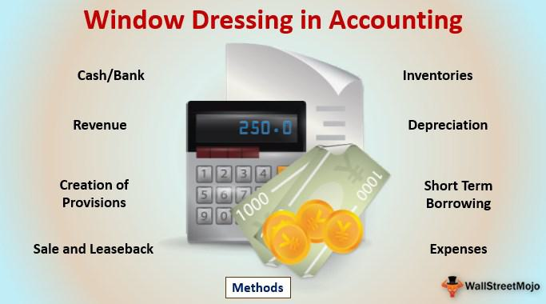

In the ever-evolving world of finance and investment, strategies to optimize returns and manage portfolios are crucial. Investors and portfolio managers continuously seek methods to enhance performance and align with their financial objectives. One noteworthy concept prevalent in this domain is window dressing, a practice often employed by portfolio managers. This involves adjusting the composition of a portfolio, typically near the end of a reporting period, to make it appear more attractive to shareholders or potential investors. 

Window dressing, while not inherently illegal, straddles a fine line between strategic management and ethical ambiguity. This technique can temporarily bolster the perceived success of a fund, potentially leading to increased investor interest. However, such superficial enhancements may not necessarily reflect the genuine prowess of the portfolio's underlying assets, hence raising ethical and transparency concerns within financial reporting and fund management.



In this article, we will explore various investment strategies that investors utilize, examine the intricate phenomenon of window dressing, and analyze its implications for portfolio management. We will also assess how algorithmic trading, with its ability to rapidly execute trades and adjust portfolios using complex algorithms, plays a pivotal role in modern investment practices. Additionally, we will address the ethical and legal concerns surrounding window dressing and consider whether this approach could be a viable component of a responsible investment strategy. Our aim is to provide a comprehensive understanding of how these elements coexist in the investment landscape and to offer insights into developing transparent and robust financial strategies that promote sustainable growth.

## Table of Contents

## Understanding Investment Strategies

Investment strategies are systematically developed plans or methods designed to manage financial assets and achieve specific financial objectives. These strategies are tailored to align with an investor's individual goals and risk tolerance, which can vary substantially based on personal circumstances, market conditions, and investment timelines. An effective investment strategy requires ongoing assessment and adjustment, enabling investors to navigate the complexities of financial markets and maximize returns while managing risk. 

Several common investment strategies include growth investing, value investing, and automated investing, each characterized by unique methodologies concerning asset selection and timing.

**Growth Investing**

Growth investing focuses on capital appreciation by targeting stocks or assets that are expected to grow at an above-average rate compared to their industry peers or the overall market. Investors employing this strategy prioritize companies with strong potential for revenue and earnings expansion, often paying a premium for these opportunities. This approach is inherently riskier as it often involves investing in smaller, newer companies or industries that are not yet fully established. However, the potential rewards can be significant if the predicted growth materializes.

**Value Investing**

In contrast, value investing seeks to identify and purchase undervalued securities that are trading below their intrinsic value. This strategy, popularized by investors such as Warren Buffett and Benjamin Graham, involves a thorough analysis of financial statements and market conditions to uncover discrepancies between a company's market price and its actual worth. The objective is to realize gains when the market eventually recognizes the true value of these undervalued assets, causing their prices to rise. Value investing typically appeals to those with a more conservative risk profile.

**Automated Investing**

Automated investing leverages technology and algorithms to manage portfolios with minimal human intervention. This strategy can encompass a range of approaches, from [algorithmic trading](/wiki/algorithmic-trading) to robo-advisors, which use algorithms to determine optimal asset allocation based on an individual's risk tolerance and investment goals. The automation facilitates efficient, real-time reactions to market changes and can lower costs by reducing the need for active management. However, reliance on automated processes can pose challenges, as these systems require careful design and monitoring to ensure they align with the investor’s objectives.

Regardless of the chosen strategy, the dynamic nature of financial markets necessitates a continuous evaluation and adaption of investment plans. Investors must remain vigilant, regularly reviewing their strategies in light of evolving market conditions and personal financial goals. This proactive approach can help mitigate risks and maximize the potential for achieving desired financial outcomes over time.

## What is Window Dressing in Finance?

Window dressing in finance refers to the practice where portfolio managers make strategic adjustments to financial statements or investment portfolios to enhance their apparent performance before presenting them to shareholders or clients. This tactic is typically employed at the end of a reporting period when managers sell off underperforming securities and acquire those that have exhibited strong performance. The goal is to create an impression of a robust investment strategy that may not accurately reflect the fund's actual long-term performance.

For example, consider a portfolio containing several underperforming stocks whose unrealized losses could negatively impact the fund's quarterly or annual report. By selling these stocks and purchasing better-performing equities shortly before the report is finalized, the managers aim to present a more favorable performance to investors. This could potentially attract more investors based on the seemingly sound track record of the fund.

While window dressing isn't illegal, it often raises ethical concerns. The practice can mislead current or potential investors, as the end-of-period portfolio snapshot may not truly reflect the fund manager's typical investment approach or the stock selection criteria followed throughout the reporting period. This short-term manipulation can lead to a distorted perception of the fund's actual investment performance and risk profile. Investors may not be aware that such adjustments primarily aim to boost the fund’s short-term appeal, which can lead to misguided investment decisions based on incomplete or misleading information.

Due diligence, involving a thorough examination of the fund's historical holdings and transaction activities around reporting periods, can help investors identify possible window dressing practices. Understanding this practice enables investors to make more informed decisions, reducing the risk of being swayed by artificially enhanced financial presentations.

## Impact of Window Dressing on Investment Portfolios

Window dressing can have a significant effect on investment portfolios, primarily by temporarily enhancing the perceived performance of a fund. This influence often results in a deceptive representation of the fund's actual performance metrics, which can attract more investors under false pretenses. Investment managers may engage in window dressing by selling underperforming assets and acquiring better-performing ones near the end of a reporting period. This strategic repositioning is conducted to create a more favorable representation of the portfolio's holdings and gain competitive advantage in the market perception.

The act of window dressing can, however, mislead investors, leading to suboptimal decision-making. When investors analyze a fund's performance based purely on the latest holdings, they may not account for the artificial boosts that accompany window dressing. This can result in an inflated confidence in the fund's management ability, causing individuals to invest based on skewed data. Consequently, investors might face unexpected [volatility](/wiki/volatility-trading-strategies) or losses once the effects of window dressing dissipate and true performance levels are revealed.

To mitigate the risks associated with window dressing, investors should be diligent in examining fund holdings, especially around reporting cut-off times. By monitoring changes in asset compositions and performance spikes, investors can identify when window dressing might have occurred. A comparative analysis of the fund's periodic reports can help in recognizing patterns indicative of such practices. Furthermore, scrutinizing a fund's historical performance consistency over multiple periods can provide a clearer picture of its actual steadiness and efficacy.

Ultimately, while window dressing can provide a short-term appeal, it presents potential pitfalls for long-term investors. Recognizing this practice and understanding its implications constitute essential steps for an informed investment strategy.

## Ethical and Legal Considerations of Window Dressing

Window dressing, although not explicitly illegal, occupies a contentious position within financial ethics. It involves strategic adjustments to portfolios or financial statements to present a more favorable picture to investors at reporting times. This practice, while common, can misrepresent the reality of a fund's performance, potentially misleading stakeholders.

Regulatory bodies like the U.S. Securities and Exchange Commission (SEC) closely monitor such practices to uphold transparency in financial markets. The SEC's mandate includes protecting investors from deceptive practices that can distort financial perceptions. While window dressing itself may not breach legal regulations, it skirts ethical boundaries by contributing to misinformative financial reporting.

The ethical concerns arise primarily from the potential disparity between a portfolio's reported and actual performance. This can lead to investors making decisions based on inaccurate data, resulting in financial detriment. Ethical investment principles advocate for complete transparency to ensure investors can make informed choices based on accurate assessments of fund performance.

Legal frameworks are in place to prevent outright fraudulent manipulation of financial statements. Companies found guilty of more severe misrepresentation, characterized by deceitful activities beyond mere window dressing, can face substantial penalties, including fines and reputation damage. Thus, while window dressing may not always invite legal action, it demands scrutiny and ethical deliberation.

In summary, the ethical and legal considerations surrounding window dressing highlight the necessity for transparency and integrity in financial reporting. As regulators continue to enhance oversight, the emphasis remains on protecting investor interests and preserving market integrity.

## Algorithmic Trading and its Role

Algorithmic trading, a sophisticated method utilized in financial markets, employs advanced algorithms to automate the execution of trading strategies at high frequencies. These algorithms analyze various market parameters and make trading decisions at speeds far exceeding human capabilities, thus enabling traders to capitalize on even the slightest market fluctuations. The ability of algorithmic trading systems to execute orders instantly and react to market changes faster than human traders positions them as valuable tools in modern finance.

The potential for algorithmic trading to engage in practices like window dressing is a notable concern. Window dressing involves the artificial adjustment of a portfolio's appearance, typically by purchasing high-performing stocks and selling underperforming ones just before the reporting period ends. Algorithmic trading can be programmed to execute such trades rapidly and in large volumes, thereby enhancing the temporary appeal of a portfolio. 

The ethical implications of using algorithmic trading in this context cannot be understated. The primary concern is the manipulative nature of transactions that may not reflect the true long-term performance or health of an investment portfolio. This raises questions on the transparency and honesty of financial reporting, wherein stakeholders might be misled by deceptive portfolio presentations.

Stringent oversight is essential to curb potential abuses arising from algorithmic trading. Financial regulators like the U.S. Securities and Exchange Commission (SEC) and similar bodies worldwide actively monitor trading activities to ensure compliance with rules designed to protect investors from misleading practices. Regulatory frameworks must evolve continuously to keep pace with technological advancements in trading, necessitating sophisticated monitoring tools and mechanisms to detect irregularities in trading patterns suggestive of window dressing.

In practice, the integration of algorithmic trading necessitates strategies that emphasize ethical investment practices. Traders and firms that deploy these algorithms must adhere to guidelines that align with ethical standards and legal requirements, striking a balance between exploiting technological prowess and maintaining market integrity. The development and use of algorithms must incorporate safeguards to prevent manipulative conduct and foster trust amongst market participants.

In summary, while algorithmic trading offers immense benefits in terms of speed and efficiency, its potential misuse for unethical practices like window dressing highlights the need for regulatory scrutiny and ethical clarity in automated trading systems.

## Developing a Responsible Investment Strategy

To create a successful investment strategy, investors should prioritize long-term goals rather than focusing on short-term gains. This approach emphasizes steady, sustainable growth over time, which is less susceptible to the volatility and unpredictability of short-term market fluctuations. By concentrating on long-term objectives, investors can better withstand market downturns and remain committed to their strategic vision.

Integrating ethical considerations into investment decisions is vital for building trust with clients. Ethical investment practices not only foster positive relationships with stakeholders but also contribute to the sustainable growth of investment portfolios. Investors who consider environmental, social, and governance ([ESG](/wiki/esg-investing)) factors are more likely to identify businesses that are committed to sustainable practices. This alignment with ethical standards can enhance a portfolio's resilience and offer a competitive edge in attracting investors interested in ethical dimensions of investing.

Technological advancements, especially in the field of big data analytics, play a crucial role in informing investment decisions. By leveraging big data, investors can examine vast amounts of information to uncover trends, identify potential manipulative practices, and make well-informed decisions. For instance, [machine learning](/wiki/machine-learning) algorithms can analyze historical data to predict future market trends or detect anomalies that might indicate unethical manipulation or window dressing by fund managers.

Here, a simple Python code snippet illustrates how regression analysis can be used to predict future stock prices using historical data, a fundamental aspect of utilizing big data for investment purposes:

```python
import pandas as pd
from sklearn.model_selection import train_test_split
from sklearn.linear_model import LinearRegression
from sklearn.metrics import mean_squared_error

# Sample historical stock data
data = {'Date': ['2023-01-01', '2023-02-01', '2023-03-01', '2023-04-01'],
        'Price': [100, 110, 105, 115]}
df = pd.DataFrame(data)

# Feature and target variable
X = df.index.values.reshape(-1, 1)  # Days (or any time feature)
y = df['Price']

# Splitting the dataset into training and test sets
X_train, X_test, y_train, y_test = train_test_split(X, y, test_size=0.2, random_state=42)

# Linear regression model
model = LinearRegression()
model.fit(X_train, y_train)

# Prediction
y_pred = model.predict(X_test)

# Evaluating the model
mse = mean_squared_error(y_test, y_pred)
print(f'Mean Squared Error: {mse}')

```

This code demonstrates a simple predictive model: using historical stock data, it splits the data into training and testing subsets, builds a linear regression model, and evaluates its performance using mean squared error. Although simplistic, it exemplifies how big data and analytics can inform investment strategies.

In summary, a responsible investment strategy should be rooted in long-term planning, integrate ethical considerations to enhance trust and sustainability, and capitalize on technological advancements like big data analytics to continually refine decision-making processes. By doing so, investors can achieve robust, ethical, and sustainable financial outcomes.

## Conclusion

Window dressing may offer short-term benefits by artificially boosting a portfolio's attractiveness, yet it poses significant risks for long-term investors. This practice can lead to misinformed investment decisions because it distorts the true performance metrics of a portfolio. Investors should conduct thorough analysis and maintain an ethical approach to avoid being misled by such practices. By carefully examining portfolio holdings and changes, especially near reporting periods, investors can identify potential window dressing and make more informed decisions.

Emphasizing transparency and adopting robust investment strategies can mitigate the adverse effects of window dressing. Algorithmic trading, with its capacity for high-frequency transactions and rapid response to market changes, can be pivotal in enhancing trading efficiency and accuracy. When aligned with ethical guidelines, algorithmic trading can serve as a powerful tool in sustaining financial goals by ensuring that investment decisions are based on genuine market trends rather than manipulated data.

Long-term investment success relies on strategies that prioritize sustainable growth and trust. By integrating technological advancements like big data analytics, investors can better understand market movements and identify potential manipulative practices. In this way, strategies designed with integrity and transparency not only safeguard against the pitfalls of window dressing but also contribute to stable and enduring financial achievements.

## References & Further Reading

[1]: Lakonishok, J., Shleifer, A., & Vishny, R. W. (1994). ["Window Dressing by Pension Fund Managers."](https://www.jstor.org/stable/2006859) The American Economic Review, 84(2), 289-294.

[2]: Carhart, M. M. (1997). ["On Persistence in Mutual Fund Performance."](https://onlinelibrary.wiley.com/doi/full/10.1111/j.1540-6261.1997.tb03808.x) The Journal of Finance, 52(1), 57-82.

[3]: Barber, B. M., & Odean, T. (2000). ["Trading is Hazardous to Your Wealth: The Common Stock Investment Performance of Individual Investors."](https://faculty.haas.berkeley.edu/odean/Papers%20current%20versions/Individual_Investor_Performance_Final.pdf) The Journal of Finance, 55(2), 773-806.

[4]: Lopez de Prado, M. (2018). ["Advances in Financial Machine Learning."](https://www.amazon.com/Advances-Financial-Machine-Learning-Marcos/dp/1119482089) Wiley Finance.

[5]: Chan, E. P. (2009). ["Quantitative Trading: How to Build Your Own Algorithmic Trading Business."](https://github.com/ftvision/quant_trading_echan_book) Wiley Trading.

[6]: Jansen, S. (2020). ["Machine Learning for Algorithmic Trading."](https://github.com/stefan-jansen/machine-learning-for-trading) Packt Publishing.